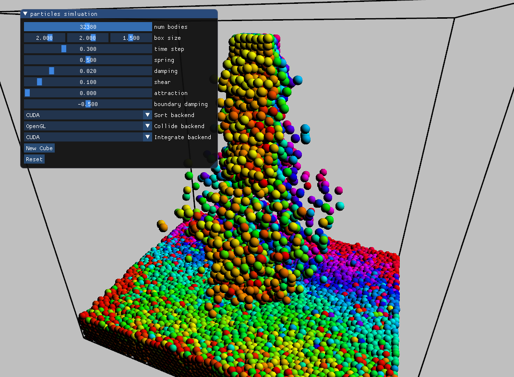
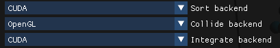

# CUDA on Circle

Circle's [CUDA](https://docs.nvidia.com/cuda/cuda-c-programming-guide/index.html) support is a work in progress. The compiler is being modified to track changes to the thrust, CUB and CUDA Toolkit libraries as they appear.

Circle is a single-pass heterogeneous compiler. It already targets [single-source shaders](https://github.com/seanbaxter/shaders/blob/master/README.md) using the SPIR-V and DXIL intermediate representations with a single translation pass. CUDA support adds a new PTX and SASS target.

While the `__host__` and `__device__` tags are still supported, you aren't required to tag functions to call them from kernels. This makes Standard Library code available for execution on the GPU.

## Table of contents

* [Usage](#usage)
* [Circle as a heterogeneous compiler](#circle-as-a-heterogeneous-compiler)
* [Improved C and C++ library support for CUDA](#improved-c-and-c-library-support-for-cuda)
  * [`ctype.h`](#ctypeh)
    * [Narrow and wide character traits](#narrow-and-wide-character-traits)
    * [Conversions](#conversions)
  * [`string.h`](#stringh)
  * [`stdlib.h`](#stdlibh)
    * [Convert stings to numbers](#convert-strings-to-numbers)
    * [Dynamic memory](#dynamic-memory)
    * [Algorithms](#algorithms)
* [Programming using the Standard Library](#programming-using-the-standard-library)
  * [Unique values](#unique-values)
  * [Library callbacks](#library-callbacks)
  * [RTTI and `dynamic_cast`](#rtti-and-dynamic-cast)
  * [RTTI, `std::any` and pattern matching](#rtti-stdany-and-pattern-matching)
  * [`[[storage_only]]` attribute](#storage_only-attribute)
* [Reflection and _if-target_](#reflection-and-if-target)
  * [Reflection on nvvm_arch_t](#reflection-on-nvvm_arch_t)
  * [PTX launch chevrons](#ptx-launch-chevrons)
  * [User attributes for tuning](#user-attributes-for-tuning)
  * [Powering _if-target_ kernels with user attributes](#powering-if-target-kernels-with-user-attributes)

## Usage

To compile for CUDA, use these command-line options:
* `--cuda-path=<path-to-toolkit>` - You must point the compiler at a recent installation of the CUDA Toolkit. A `.cu` file extension is not required. The presence of `--cuda-path` enables CUDA compilation.
* `-sm_XX` - One or more PTX target architectures are required. No default architecture is assumed. Circle is bulit with LLVM  Supported values are 35, 37, 50, 52, 53, 60, 61, 62, 70, 72, 75 and 80.
* `-gpu` - An optional argument to indicate that a .ll or .bc output (LLVM IR and bitcode) should relate to the GPU code and not the host code. For binary outputs, where fatbinary is implicitly included into the executable, this flag may not be used.
* `-G` - Enable debug information on device targets.
* `-OG0`, `-OG1`, `-OG2`, `-OG3` - Set optimization level for device code.

[**hello.cu**](hello.cu)
```cpp
#include <cuda_runtime.h>
#include <cstdio>

__global__ void my_kernel() {
  int tid = threadIdx.x;
  printf("Hello CUDA %d.\n", tid);
}

int main() {
  my_kernel<<<1, 8>>>();
  cudaDeviceSynchronize();
}
```
```
$ circle --cuda-path=/opt/nvidia/hpc_sdk/Linux_x86_64/21.3/cuda/11.2/ -sm_52 -sm_75 hello.cu -o hello
$ ./hello
Hello CUDA 0.
Hello CUDA 1.
Hello CUDA 2.
Hello CUDA 3.
Hello CUDA 4.
Hello CUDA 5.
Hello CUDA 6.
Hello CUDA 7.
```

All CUDA executables and shared objects must be linked with `libcudart.so`. If you do not specify `-lcudart`, the Circle compiler will implicitly link it for you.

As with the `nvcc` compiler, Circle locates the compiled kernel modules in the `.nv_fatbin` data section. This allows CUDA tooling like `cuobjdump` to locate and print the kernels:

```
$ cuobjdump -lptx -lelf hello
ELF file    1: hello.1.sm_52.cubin
PTX file    1: hello.1.sm_52.ptx
ELF file    2: hello.2.sm_75.cubin
PTX file    2: hello.2.sm_75.ptx
```

## Circle as a heterogeneous compiler

Circle is a C++ frontend that targets NVIDIA PTX, [SPIR-V shaders for OpenGL and Vulkan, and DXIL shaders for D3D12](https://github.com/seanbaxter/shaders#readme). 

Like CUDA's `nvcc`, but unlike `glslc` and `dxc` shader compilers, Circle is a single-source compiler, meaning you can mix device and host code in the same translation unit. Unlike `nvcc`, but like the newer `nvc++` CUDA compiler, Circle is a _single-pass_ compiler. The frontend processes the source code and constructs an abstract syntax tree (AST) just once. The AST is then lowered to LLVM or SPIR-V IR for each target. The single-pass model greatly improves compile times, and allows more seamless sharing of common source code between targets. Tags like `__device__` and `__host__` are not needed, and macros like `__CUDA_ARCH__` cannot be used.



CUDA support was added to this Circle [particles demo](https://github.com/seanbaxter/shaders#the-particles-demo), itself a port for single-source modern OpenGL from an early CUDA toolkit sample.

The single source model allows us to define the dynamics for this particle simulation just once, in a way that'll run on OpenGL compute and on CUDA, and execute it with both compute libraries in the same application.

[**particles-cuda.cxx**](https://github.com/seanbaxter/shaders/blob/master/particles-cuda/particles-cuda.cxx)
```cpp
template<bool use_cuda, typename func_t>
void transform(const func_t& func, int count) {
  if constexpr(use_cuda) {
    const int nt = 128;
    int num_blocks = (count + nt - 1) / nt;
    kernel<<<num_blocks, nt>>>(func, count);
  } else{
    gl_transform(func, count);   
  }
}
```

The application defines the function template `transform` which launches a C++ lambda (or other callable object) from either an OpenGL compute shader (using `gl_transform)` or from CUDA (using the chevron syntax `<<< >>>`). 

```cpp
  transform<use_cuda>([=, params=params](int index) {
    vec3 f { };
    float r = params.particleRadius;

    // Read particle data.
    vec3 pos = pos_in[index].xyz;
    vec3 vel = vel_in[index].xyz;

    // Hash to the grid.
    ivec3 gridPos = calcGridPos(pos, params);

    // Examine neighbouring cells.
    for(int z = -1; z <= 1; ++z) {
      for(int y = -1; y <= 1; ++y) {
        for(int x = -1; x <= 1; ++x) {
          int hash = hashGridPos(gridPos + ivec3(x, y, z), params);

          // Get the range of particles for this cell.
          ivec2 range = cell_ranges_in[hash];

          // Visit each particle in the cell.
          for(int i = range.x; i < range.y; ++i) {
            
            // Don't collide with one's self.
            if(i != index) {
              vec3 pos2 = pos_in[i].xyz;
              vec3 vel2 = vel_in[i].xyz; 
              
              // Compute the force on the left particle.
              f += collide_spheres(pos, pos2, vel, vel2, r, r, params);
            }
          }
        }
      }
    }
    
    // Integrate the velocity by the new acceleration and write out.
    vel += f; 
    vel_out[index] = vec4(vel, 0);

  }, params.numBodies);
```

Circle provides a heterogeneous and tagless environment for GPU compute and graphics development. Write your code in a target-agnostic way, then run it on a target from launching it on that API's specific entry point. The particle collision code above is a good example. We define the logic of accumulating the forces on a particle from it's local support inside a lambda function, in a call to the generic `transform` launcher.

The `calcGridPos`, `hashGridPos` and `collide_spheres` library functions are normal code, and can be run on the host target just as wlel. The input data, which is captured through the lambda closure, holds a shader stage storage buffer (SSBO) when lowering to SPIR-V/shader, and a raw device memory pointer when lowering to CUDA. Ordinary C++ template mechanisms help paper over different API requirements.



At runtime, without even restarting the simulation, you can switch between CUDA and OpenGL backends, on a task-specific basis. The collision and integration subsystems are completely generic, and consist of embarrassingly parallel kernel or compute shader launhces.

The sort task reorders particles based on their hash ID, which creates memory locality for neighbors in each particle's support domain. Parallel sorting is a complicated operation. Here we use CUDA- and OpenGL-specific sort libraries.

For OpenGL, the [ModernGPU for Shaders](
https://github.com/seanbaxter/mgpu-shaders) library provides a high-performance parallel mergesort. Since it's written in Circle, the implementation is pure C++, rather than GLSL, so it's just as generic and tunable as the CUDA implementation that preceeded it.

For CUDA, the [CUB](https://github.com/NVIDIA/cub/) radix sort is used. This is generally the fastest radix sort available for NVIDIA devices.

To compile CUB and [thrust](https://github.com/NVIDIA/thrust/) for Circle, we need to use a special branch. The _if\_target_ branches of [https://github.com/allisonvacanti/cub/tree/if_target](cub) and [thrust](https://github.com/allisonvacanti/thrust/tree/if_target) represent the leading edge CUDA libraries. They're intended for compilation with the newer `nvc++` compiler rather than the aging `nvcc`. 

Since the `__CUDA_ARCH__` macro is not allowed in Circle and `nvc++`, a different mechanism is needed for targeting specific PTX architectures, one that's compatible with these compilers' single-pass translation model. That different mechanism is [_if-target_](#reflection-and-if-target), a new form of control flow and twist on _if-constexpr_, where the condition is evaluated as constant during code generation rather than during template substitution.

By including the _if\_target_ branches, Circle is able to use the familiar NVIDIA CUDA libraries, but without paying the long compilation times of the old multipass `nvcc` compiler.

## Improved C and C++ library support for CUDA

Circle uses the embedded libc implementation [newlib](https://sourceware.org/git/gitweb.cgi?p=newlib-cygwin.git) to provide a big chunk of the C standard library, and common POSIX functions. The C++ Standard Library is built over libc, so having those functions available means more of your C++ code will just work on the GPU.

You don't have to do anything to use these functions. Use your normal system headers. The compiler handles all linking for you.

What features does Circle for CUDA support?
* A bunch of libc functions.
* Operators `new`/`delete`.
* Virtual functions.
* Runtime Type Information (RTTI): `dynamic_cast`, `typeid` and virtual inheritance.

Things under development:
* Support for C++ iostreams. This requires a refactor of C++ locales, which are currently defined in a parallel-antagonistic way.
* Variadic arguments. This is not supported in the LLVM NVPTX target, but can be worked around by the Circle compiler. 
* `__int128`. The LLVM NVPTX target doesn't correctly lower `__int128` variables yet. Enabling this is just a bug fix. `__int128` is important for compiling [fmtlib](https://github.com/fmtlib/fmt), which uses this large integer in formatting floats.
* `long double` fp80. 80-bit extended floating-point math isn't implemented on the GPU, but support can be provided by emulation. This is important for supporting more of the C++ Standard Library. Containers like `std::unordered_map` currently use `long double` internally.
* `FILE*` support. Writing to C-style file streams from the device can be supported by emulation.

Things requiring new PTX features:
* Exception handling.

### `ctype.h`

#### Narrow and wide character traits
* [isalnum](https://man7.org/linux/man-pages/man3/isalnum.3.html) [iswalnum](https://man7.org/linux/man-pages/man3/iswalnum.3.html)
* [isalpha](https://man7.org/linux/man-pages/man3/isalpha.3.html) [iswalpha](https://man7.org/linux/man-pages/man3/iswalpha.3.html)
* [isascii](https://man7.org/linux/man-pages/man3/isascii.3.html) [iswascii](https://man7.org/linux/man-pages/man3/iswascii.3.html)
* [isblank](https://man7.org/linux/man-pages/man3/isblank.3.html) [iswblank](https://man7.org/linux/man-pages/man3/iswblank.3.html)
* [iscntrl](https://man7.org/linux/man-pages/man3/iscntrl.3.html) [iswcntrl](https://man7.org/linux/man-pages/man3/iswcntrl.3.html)
* [isdigit](https://man7.org/linux/man-pages/man3/isdigit.3.html) [iswdigit](https://man7.org/linux/man-pages/man3/iswdigit.3.html)
* [isgraph](https://man7.org/linux/man-pages/man3/isgraph.3.html) [iswgraph](https://man7.org/linux/man-pages/man3/iswgraph.3.html)
* [islower](https://man7.org/linux/man-pages/man3/islower.3.html) [iswlower](https://man7.org/linux/man-pages/man3/iswlower.3.html)
* [isprint](https://man7.org/linux/man-pages/man3/isprint.3.html) [iswprint](https://man7.org/linux/man-pages/man3/iswprint.3.html)
* [ispunct](https://man7.org/linux/man-pages/man3/ispunct.3.html) [iswpunct](https://man7.org/linux/man-pages/man3/iswpunct.3.html)
* [isspace](https://man7.org/linux/man-pages/man3/isspace.3.html) [iswspace](https://man7.org/linux/man-pages/man3/iswspace.3.html)
* [isupper](https://man7.org/linux/man-pages/man3/isupper.3.html) [iswupper](https://man7.org/linux/man-pages/man3/iswupper.3.html)
* [isxdigit](https://man7.org/linux/man-pages/man3/isxdigit.3.html) [iswxdigit](https://man7.org/linux/man-pages/man3/iswxdigit.3.html)
* [tolower](https://man7.org/linux/man-pages/man3/tolower.3.html) [towlower](https://man7.org/linux/man-pages/man3/towlower.3.html)
* [toupper](https://man7.org/linux/man-pages/man3/toupper.3.html) [towupper](https://man7.org/linux/man-pages/man3/towupper.3.html)

#### Conversions
* [btowc](https://man7.org/linux/man-pages/man3/btowc.3.html)
* [toascii](https://man7.org/linux/man-pages/man3/toascii.3.html)
* [towctrans](https://man7.org/linux/man-pages/man3/towctrans.3.html)
* [wctrans](https://man7.org/linux/man-pages/man3/wctrans.3.html)
* [wctype](https://man7.org/linux/man-pages/man3/wctype.3.html)

### `string.h`

* [bcmp](https://man7.org/linux/man-pages/man3/bcmp.3.html)
* [bcopy](https://man7.org/linux/man-pages/man3/bcopy.3.html)
* [bzero](https://man7.org/linux/man-pages/man3/bzero.3.html)
* [index rindex](https://man7.org/linux/man-pages/man3/index.3.html)
* [memccpy](https://man7.org/linux/man-pages/man3/memccpy.3.html)
* [memchr memrchr rawmemchr](https://man7.org/linux/man-pages/man3/memchr.3.html) [wmemchr](https://man7.org/linux/man-pages/man3/wmemchr.3.html)
* [memcmp](https://man7.org/linux/man-pages/man3/memcmp.3.html) [wmemcmp](https://man7.org/linux/man-pages/man3/wmemcmp.3.html)
* [memcpy](https://man7.org/linux/man-pages/man3/memcpy.3.html) [wmemcpy](https://man7.org/linux/man-pages/man3/wmemcpy.3.html)
* [memmem](https://man7.org/linux/man-pages/man3/memmem.3.html)
* [memmove](https://man7.org/linux/man-pages/man3/memmove.3.html) [wmemmove](https://man7.org/linux/man-pages/man3/wmemmove.3.html)
* [mempcpy](https://man7.org/linux/man-pages/man3/mempcpy.3.html) [wmempcpy](https://man7.org/linux/man-pages/man3/wmempcpy.3.html)
* [memset](https://man7.org/linux/man-pages/man3/memset.3.html)
* [stpcpy](https://man7.org/linux/man-pages/man3/stpcpy.3.html) [stpncpy](https://man7.org/linux/man-pages/man3/stpncpy.3.html) [wcpcpy](https://man7.org/linux/man-pages/man3/wcpcpy.3.html) [wcpncpy](https://man7.org/linux/man-pages/man3/wcpncpy.3.html)
* [strcasecmp strncasecmp](https://man7.org/linux/man-pages/man3/strcasecmp.3.html) [wcscasecmp](https://man7.org/linux/man-pages/man3/wcscasecmp.3.html) [wcsncasecmp](https://man7.org/linux/man-pages/man3/wcsncasecmp.3.html)
* [strcasestr strstr](https://man7.org/linux/man-pages/man3/strcasestr.3.html)  [wcsstr](https://man7.org/linux/man-pages/man3/wcsstr.3.html)
* [strcat strncat](https://man7.org/linux/man-pages/man3/strcat.3.html) [wcscat](https://man7.org/linux/man-pages/man3/wcscat.3.html) [wcsncat](https://man7.org/linux/man-pages/man3/wcsncat.3.html)
* [strchr strrchr strchrnul](https://man7.org/linux/man-pages/man3/strchr.3.html) [wcschr](https://man7.org/linux/man-pages/man3/wcschr.3.html) [wcsrchr](https://man7.org/linux/man-pages/man3/wcsrchr.3.html )
* [strcmp strncmp](https://man7.org/linux/man-pages/man3/strcmp.3.html) [wcscmp](https://man7.org/linux/man-pages/man3/wcscmp.3.html) [wcsncmp](https://man7.org/linux/man-pages/man3/wcsncmp.3.html)
* [strcoll](https://man7.org/linux/man-pages/man3/strcoll.3.html) [wcscoll](https://man7.org/linux/man-pages/man3/wcscoll.3p.html)
* [strcpy strncpy](https://man7.org/linux/man-pages/man3/strcpy.3.html) [wcscpy](https://man7.org/linux/man-pages/man3/wcscpy.3.html) [wcsncpy](https://man7.org/linux/man-pages/man3/wcsncpy.3.html)
* [strspn strcspn](https://man7.org/linux/man-pages/man3/strcspn.3.html) [wcscspn](https://man7.org/linux/man-pages/man3/wcscspn.3.html) [wcsspn](https://man7.org/linux/man-pages/man3/wcscspn.3.html)
* [strdup strndup](https://man7.org/linux/man-pages/man3/strdup.3.html) [wcsdup](https://man7.org/linux/man-pages/man3/wcsdup.3.html)
* [strerror](https://man7.org/linux/man-pages/man3/strerror.3.html)
* [strlcat](https://linux.die.net/man/3/strlcat) [wcslcat](https://man.openbsd.org/wcslcat.3)
* [strlcpy](https://linux.die.net/man/3/strlcpy) [wcslcpy](https://man.openbsd.org/wcslcpy.3)
* [strlen](https://man7.org/linux/man-pages/man3/strlen.3.html) [strnlen](https://man7.org/linux/man-pages/man3/strnlen.3.html) [wcslen](https://man7.org/linux/man-pages/man3/wcslen.3.html) [wcsnlen](https://man7.org/linux/man-pages/man3/wcsnlen.3.html)
* [strnstr](https://www.freebsd.org/cgi/man.cgi?query=strnstr&sektion=3)
* [strpbrk](https://man7.org/linux/man-pages/man3/strpbrk.3.html) [wcspbrk](https://man7.org/linux/man-pages/man3/wcspbrk.3.html)
* [strsep](https://man7.org/linux/man-pages/man3/strsep.3.html)
* [strverscmp](https://man7.org/linux/man-pages/man3/strverscmp.3.html)
* [strxfrm](https://man7.org/linux/man-pages/man3/strxfrm.3.html)
* [swab](https://man7.org/linux/man-pages/man3/swab.3.html)
* [wcswidth](https://man7.org/linux/man-pages/man3/wcswidth.3.html)
* [wcsxfrm](https://linux.die.net/man/3/wcsxfrm)
* [wcwidth](https://man7.org/linux/man-pages/man3/wcwidth.3.html)

### `stdlib.h`
* [abs labs llabs](https://man7.org/linux/man-pages/man3/abs.3.html) [imaxabs](https://man7.org/linux/man-pages/man3/imaxabs.3p.html)
* [div ldiv lldiv](https://man7.org/linux/man-pages/man3/div.3.html) [imaxdiv](https://man7.org/linux/man-pages/man3/imaxdiv.3p.html)
* [abort](https://man7.org/linux/man-pages/man3/abort.3p.html)
* [clock](https://man7.org/linux/man-pages/man3/clock.3.html)
* [exit](https://man7.org/linux/man-pages/man3/exit.3.html)
* [rand](https://man7.org/linux/man-pages/man3/srand.3.html)

#### Convert strings to numbers
* [atoi atol atoll](https://man7.org/linux/man-pages/man3/atoi.3.html)
* [atof](https://man7.org/linux/man-pages/man3/atof.3.html)
* [itoa utoa](https://www.cplusplus.com/reference/cstdlib/itoa/)
* [strtod](https://man7.org/linux/man-pages/man3/strtod.3p.html)
* [strtoimax strtoumax](https://man7.org/linux/man-pages/man3/strtoimax.3p.html)
* [strtol strtoll](https://man7.org/linux/man-pages/man3/strtol.3p.html) [strtoul strtoull](https://man7.org/linux/man-pages/man3/strtoul.3p.html)

#### Dynamic memory
* [calloc](https://man7.org/linux/man-pages/man3/calloc.3p.html)
* [malloc](https://man7.org/linux/man-pages/man3/malloc.3p.html)
* [memalign](https://man7.org/linux/man-pages/man3/memalign.3.html) [aligned_alloc](https://man7.org/linux/man-pages/man3/aligned_alloc.3.html)
* [free](https://man7.org/linux/man-pages/man3/free.3p.html)
* [realloc](https://man7.org/linux/man-pages/man3/realloc.3p.html)

#### Algorithms
* [bsearch](https://man7.org/linux/man-pages/man3/bsearch.3.html)
* [qsort](https://man7.org/linux/man-pages/man3/qsort.3.html)

## Programming using the Standard Library

[**roman.cxx**](roman.cxx)
```cpp
#include <algorithm>
#include <utility>
#include <string>
#include <vector>
#include <cstdlib>
#include <cuda_runtime.h>

// Convert ints to roman numerals.
// http://rosettacode.org/wiki/Roman_numerals/Encode#C.2B.2B
inline std::string to_roman(int value) {
  struct romandata_t { int value; char const* numeral; };
  static romandata_t const romandata[] =
     { 1000, "M",
        900, "CM",
        500, "D",
        400, "CD",
        100, "C",
         90, "XC",
         50, "L",
         40, "XL",
         10, "X",
          9, "IX",
          5, "V",
          4, "IV",
          1, "I",
          0, NULL }; // end marker
 
  std::string result;
  for (romandata_t const* current = romandata; current->value > 0; ++current)
  {
    while (value >= current->value)
    {
      result += current->numeral;
      value  -= current->value;
    }
  }
  return result;
}
 
__global__ void test_vector(int count) {
  // Generate count random integers.
  std::vector<std::pair<std::string, int> > romans(count);
  for(int i : count) {
    // Don't know how to count higher than 4000.
    int x = rand() % 4000;
    romans[i] = std::make_pair(to_roman(x), x);
  }

  // Now sort them according to lexicographical order of their
  // roman numerals. 
  std::sort(romans.begin(), romans.end());

  // Print the sorted roman numerals.
  printf("%4d - %s\n", romans[:].second, romans[:].first.c_str())...;
}

int main() {
  test_vector<<<1, 1>>>(20);
  cudaDeviceSynchronize();
}
```
```
$ circle --cuda-path=/opt/nvidia/hpc_sdk/Linux_x86_64/21.3/cuda/11.2/ -sm_52 roman.cxx 
ptxas warning : Stack size for entry function '_Z11test_vectori' cannot be statically determined
$ ./roman
 727 - DCCXXVII
 611 - DCXI
 558 - DLVIII
 591 - DXCI
  89 - LXXXIX
1208 - MCCVIII
1462 - MCDLXII
1170 - MCLXX
1902 - MCMII
2352 - MMCCCLII
2370 - MMCCCLXX
2634 - MMDCXXXIV
3471 - MMMCDLXXI
3945 - MMMCMXLV
3839 - MMMDCCCXXXIX
3751 - MMMDCCLI
3664 - MMMDCLXIV
3065 - MMMLXV
1091 - MXCI
1025 - MXXV
```

These new compiler features make it possible to take code straight from the internet and build and run it on the device. I copied a Roman numeral code from [Rosetta Code](http://rosettacode.org/wiki/Roman_numerals/Encode#C.2B.2B), pasted it into my CUDA project, and made the function `inline`. This prevents it from lowering to x86 code, unless ODR-used by other code with external linkage.

The `std::string` used in the kernel is the same one that ships with your distribution. I'm using `libstdc++-10-dev`, which is the default for recent Debian releases. This type is implemented using `libc` functions, which are now available for CUDA when compiled with Circle.

We launch a kernel with just a single block and thread. An `std::vector` is constructed to hold pairs of strings and integers. We call `rand` on the device to generate random numbers. This is implemented for CUDA by hashing together the GPU's instruction counter, `clock`, with the block and thread IDs. [Squares RNG](https://arxiv.org/pdf/2004.06278.pdf) is a low latency random number hash, which is used to implement `rand`.

The kernel calls `to_roman` to convert each random integer to an `std::string` holding its Roman numeral text. `std::sort` sorts the values lexicographically. We then print out using a dynamic slice expansion. The `printf` in the kernel is provided by PTX itself, and is one of only four PTX system calls:
* `printf`
* `malloc`
* `free`
* `__assert_fail`

### Unique values

```cpp
#include <cuda_runtime.h>
#include <set>
#include <cstdio>

__global__ void kernel(int count, int range) {
  // Generate count number of random numbers on the device.
  // Feed them through std::set. This means just one of each number
  // is kept, and duplicates are removed.
  std::set<int> set;
  for(int i : count)
    set.insert(rand() % range);

  // Print the unique, sorted elements to the terminal.
  printf("%d unique values generated:\n", set.size());
  int index = 0;
  for(int x : set)
    printf("%2d: %3d\n", index++, x);
}

int main() {
  kernel<<<1, 1>>>(10, 10);
  cudaDeviceSynchronize();
}
```
```
$ circle --cuda-path=/opt/nvidia/hpc_sdk/Linux_x86_64/21.3/cuda/11.2/ -sm_52 unique.cxx -o unique && ./unique
ptxas warning : Stack size for entry function '_Z6kernelii' cannot be statically determined
7 unique values generated:
 0:   1
 1:   2
 2:   5
 3:   6
 4:   7
 5:   8
 6:   9
```

`std::set` is a complex type that builds a balanced tree to maintain a sorted set of non-duplicate keys. You can now use this migthy class, like most of the C++ STL, inside GPU device code.

### Library callbacks

[**qsort.cxx**](qsort.cxx)
```cpp
#include <cuda_runtime.h>
#include <cstdlib>
#include <cstdio>
#include <vector>

__global__ void kernel(int count) {
  std::vector<int> data(count);

  // Generate random numbers between 0 and 9.
  for(int i : count)
    data[i] = rand() % 10;

  // Sort with qsort.
  auto cmp = [](const void* a, const void* b) {
    int x = *(const int*)a;
    int y = *(const int*)b;

    // Return a 3-way comparison. 
    return x < y ? -1 : x > y ? +1 : 0;
  };
  qsort(data.data(), data.size(), sizeof(int), cmp);

  printf("%2d: %2d\n", @range(), data[:])...;

  // Binary search for the first occurrence of 4 in the sorted array.
  int key = 4;
  if(void* p = bsearch(&key, data.data(), count, sizeof(int), cmp)) {
    int index = (int*)p - data.data();
    printf("The first occurrence of %d is index %d\n", key, index);

  } else {
    printf("No occurrence of %d\n", key);
  }
}

int main() {
  kernel<<<1,1>>>(20);
  cudaDeviceSynchronize();
}
```
```
$ circle --cuda-path=/opt/nvidia/hpc_sdk/Linux_x86_64/21.3/cuda/11.2/ -sm_52 qsort.cxx -o qsort
ptxas warning : Stack size for entry function '_Z6kerneli' cannot be statically determined
sean@sean-red:~/projects/circle/cuda$ ./qsort
 0:  0
 1:  0
 2:  0
 3:  1
 4:  2
 5:  3
 6:  3
 7:  3
 8:  4
 9:  4
10:  5
11:  5
12:  6
13:  6
14:  6
15:  6
16:  6
17:  7
18:  7
19:  9
The first occurrence of 4 is index 8
```

CUDA allows indirect function calls. This even works through compiled `libc` code. This example demonstrates sorting random integers with the `libc` function `qsort`, and binary searching the result with `bsearch`. We define a lambda that loads integers out of the pointers and returns a three-way comparison. The lambda has no capture clause, so will implicitly decay to a pointer to an ordinary function, which is compatible with the interface of [`qsort`](https://man7.org/linux/man-pages/man3/qsort.3.html) and [`bsearch`](https://man7.org/linux/man-pages/man3/bsearch.3.html).

### RTTI and `dynamic_cast`

Circle now generates [RTTI typeinfo tables](https://itanium-cxx-abi.github.io/cxx-abi/abi.html#rtti-layout) when targeting CUDA.  This enables `dynamic_cast`, `typeid` and virtual inheritance.

[**virtual.cxx**](virtual.cxx)
```cpp
#include <cuda_runtime.h>
#include <cstdio>
#include <typeinfo>

struct base_t {
  base_t(int x) : x(x) { }
  virtual ~base_t() { }
  virtual void func() = 0;

  int x;
};

struct derived1_t : base_t {
  derived1_t(int x) : base_t(x) { }
  void func() override {
    printf("Hello\n");
  }
};

struct derived2_t : base_t {
  derived2_t(int x) : base_t(x) { }
  void func() override {
    printf("Goodbye\n");
  }
};

struct derived3_t : derived1_t, derived2_t {
  derived3_t(int x1, int x2) : derived1_t(x1), derived2_t(x2) { }
  void func() override {
    printf("Hello and Goodbye\n");
  }
};

__global__ void kernels() {
  base_t* b = new derived1_t(1);
  b->func();

  // Get the typeid of the dynamic type using RTTI.
  printf("%s\n", typeid(*b).name());

  // dynamic_cast up to derived1_t.
  auto* d1 = dynamic_cast<derived1_t*>(b);
  auto* d2 = dynamic_cast<derived2_t*>(b);
  printf("b=%p  d1=%p d2=%p\n", b, d1, d2);

  // Invoke the deleting destructor. This calls a hidden second destructor
  // on base_t, which is overridden by the dynamic type derived1_t.
  delete b;

  // Support dynamic-cast across derived types.
  d1 = new derived3_t(3, 4);
  d2 = dynamic_cast<derived2_t*>(d1);
  printf("%s: d1=%p d2=%p\n", typeid(*d1).name(), d1, d2);
  printf("d1.x = %d, d2.x = %d\n", d1->x, d2->x);
  delete d1;
}

int main() {
  kernels<<<1,1>>>();
  cudaDeviceSynchronize();
}
```
```
$ circle --cuda-path=/opt/nvidia/hpc_sdk/Linux_x86_64/21.3/cuda/11.2/ -sm_52 virtual.cxx -o virtual
ptxas warning : Stack size for entry function '_Z7kernelsv' cannot be statically determined
$ ./virtual
Hello
10derived1_t
b=0x7f0128dff920  d1=0x7f0128dff920 d2=(nil)
10derived3_t: d1=0x7f0128dff920 d2=0x7f0128dff930
d1.x = 3, d2.x = 4
```

The `base_t` type is a _dynamic type_. Its virtual functions case its definition to hold contain virtual pointer before its data members. The virtual pointer points to a _virtual table_. At the address indicated by the virtual pointer, you'll find three _virtual function addresses_: the non-deleting (for subobjects) and deleting (for complete objects) versions of the destructor and `func`'s override location.

However, stored before the first virtual function, starting at vtable index [-1] and growing more negative, you will find RTTI data: a mangled name uniquely identifying the type, and pointers to tables describing the class's layout relative to other classes in its inheritance graph.

The [`dynamic_cast`](https://en.cppreference.com/w/cpp/language/dynamic_cast) and [`typeid`](https://en.cppreference.com/w/cpp/language/typeid) implementations crawl this typeinfo data provide runtime type information. 

### RTTI, `std::any` and pattern matching

[Circle implements](https://github.com/seanbaxter/circle/tree/master/pattern#readme) the latest C++ pattern matching proposal, [P2392R1 - "Patterning matching using is and as"](http://www.open-std.org/jtc1/sc22/wg21/docs/papers/2021/p2392r1.pdf). This proposal introduces extension points in the form of user-defined operators `is` and `as`, allowing the new _inspect-statement_ to support `std::variant` and `std::any`. 

This latter type requires RTTI to function. `std::any` is a container for _any_ type at all. By specializing a _dynamic type_ template (i.e, a class template with at least one virtual function or virtual base class), a virtual pointer is built into the type definition which points at typeinfo tables for the dynamic type. The non-member function `std::any_cast<>` calls `typeid` on both the template parameter type and the contained type, and compares their `type_info` result objects. This comparison examines the addresses of the typeinfo tables of the dynamic types, or may even compare the unique mangled names of those types, to ascertain, at runtime, if the types actually match.

Circle's implementation of RTTI lets us use `std::any` on the GPU. And Circle's implementation of P2392R1 lets us do it with pattern matching.

[**any.cxx**](any.cxx)
```cpp
#include <type_traits>
#include <any>
#include <variant>
#include <string>
#include <cuda_runtime.h>
#include <cstdio>

// std::variant operator-is support.
template<typename T, typename... Ts>
requires((... || T is Ts))
constexpr bool operator is(const std::variant<Ts...>& x) {
  return holds_alternative<T>(x);
}

template<typename T, typename... Ts>
requires((... || T is Ts))
constexpr T& operator as(std::variant<Ts...>& x) { 
  return get<T>(x);
}

template<typename T, typename... Ts>
requires((... || T is Ts))
constexpr const T& operator as(const std::variant<Ts...>& x) { 
  return get<T>(x);
}

// std::any operator-is support.
template<typename T>
constexpr bool operator is(const std::any& x) { 
  return typeid(T) == x.type(); 
}

template<typename T> requires (!T.is_reference)
constexpr T operator as(const std::any& x) {
  return any_cast<T>(x);
}

template<typename T> requires (T.is_reference)
constexpr T& operator as(std::any& x) {
  if(auto p = any_cast<T.remove_reference*>(&x))
    return *p;
  throw std::bad_any_cast();
}

enum class shapes_t {
  circle, square, trapezoid, rhombus
};

template<typename enum_t>
const char* enum_to_string(enum_t e) {
  return e == enum_t.enum_values ...? 
    enum_t.enum_names : "unknown " + enum_t.string;
}

template<typename type_t>
void match(const type_t& x) {
  inspect(x) {
    s as shapes_t    => printf("  shapes_t: %s\n", enum_to_string(s));
    i as int         => printf("  int: %d\n", i);
    f as float       => printf("  float: %f\n", f);
    d as double      => printf("  double: %f\n", d);
    s as const char* => printf("  const char*: '%s'\n", s);
    s as std::string => printf("  std::string: '%s'\n", s.c_str());
      is _           => printf("  unknown contents\n");
  }
}

__global__ void kernel() {
  // Pattern match on std::any.
  printf("Pattern matching on std::any:\n");
  match(std::any(5));                 
  match(std::any("An any C string")); 
  match(std::any(3.14));              

  // Pattern match on std::variant.
  printf("\nPattern matching on std::variant:\n");
  typedef std::variant<float, shapes_t, const char*, std::string> var;
  
  match(var(std::string("A variant std::string")));
  match(var(1.618f));
  match(var(shapes_t::trapezoid));
}

int main() {
  kernel<<<1, 1>>>();
  cudaDeviceSynchronize();
}
```
```
$ circle --cuda-path=/opt/nvidia/hpc_sdk/Linux_x86_64/21.3/cuda/11.2/ -sm_52 any.cxx -o any
./ptxas warning : Stack size for entry function '_Z6kernelv' cannot be statically determined
$ ./any
Pattern matching on std::any:
  int: 5
  const char*: 'An any C string'
  double: 3.140000

Pattern matching on std::variant:
  std::string: 'A variant std::string'
  float: 1.618000
  shapes_t: trapezoid
```

### `[[storage_only]]` attribute

Sometimes you'd like to declare an object without running its constructor or destructor. The C++ Standard Library uses some incredible hacks to put off the initialization of certain global objects. For example, the `cout` and `cin` objects, which are externally declared in STL headers with types `std::ostream` and `std::istream`, are actually defined in `libstdc++.so` with character array type:

[**global_io.cc**](https://github.com/gcc-mirror/gcc/blob/16e2427f50c208dfe07d07f18009969502c25dc8/libstdc%2B%2B-v3/src/c%2B%2B98/globals_io.cc#L50)
```cpp
  // Standard stream objects.
  // NB: Iff <iostream> is included, these definitions become wonky.
  typedef char fake_istream[sizeof(istream)]
  __attribute__ ((aligned(__alignof__(istream))));
  typedef char fake_ostream[sizeof(ostream)]
  __attribute__ ((aligned(__alignof__(ostream))));
  fake_istream cin;
  fake_ostream cout;
  fake_ostream cerr;
  fake_ostream clog;
```

These contents of these objects are initialized elsewhere by placement new. This kind of deferred initialization works because the `extern` declarations and the character array definitions are kept separate, so that the compiler doesn't reject the source as ill-formed due to type mismatch. The C++ ABI doesn't incorporate the type of an object into its mangled name (like it does the parameters of functions), so the `ostream` and `fake_ostream` declarations of `cout` can link up.

Sometimes, in a CUDA program, we'd like to declare objects but defer their initialization. CUDA doesn't support dynamic initialization of device objects, so you generally need to manually initialize `__device__` globals with a preliminary kernel launch. Likewise, `__shared__` objects can't have non-trivial constructors, and need to be initialized manually.

You can wrap objects inside unions to defer initialization, but then they have a different type than what you really want. This problem occurs so often that a new Circle feature was added to address this head on: the `[[storage_only]]` object attribute.

[**storage_only.cxx**](storage_only.cxx)
```cpp
#include <iostream>

struct foo_t {
  // A deleted default ctor!
  foo_t() = delete;

  // A defined one-parameter ctor.
  foo_t(int x) : x(x) { 
    std::cout<< "Constructor called\n";
  }

  ~foo_t() {
    std::cout<< "Destructor called\n";
  }

  int x;
};

// Define foo without calling its ctor or dtor. Init/destruction is
// up to the user.
[[storage_only]] foo_t foo;

int main() {
  std::cout<< "Entered main\n";

  // Initialize the object.
  new (&foo) foo_t(100);

  std::cout<< foo.x<< "\n";

  // Destruct the object.
  foo.~foo_t();

  std::cout<< "Exiting main\n";
}
```
```
$ circle storage_only.cxx && ./storage_only
Entered main
Constructor called
100
Destructor called
Exiting main
```

As you can see, by marking the object `[[storage_only]]` and performing manual initializion, the effective lifetime of the object is contained within the `main` function. This is different from an `extern` declaration, because it actually provides the storage for an object, and is therefore a definition. But it treats it as having a trivial default constructor and destructor.

[**vec.cxx**](vec.cxx)
```cpp
#include <vector>
#include <cstdio>
#include <cuda_runtime.h>

// Declare the storage of an object. Don't execute its ctor or dtor!
[[storage_only]] __device__ std::vector<int> global_vec;

__global__ void global_ctors() {
  // Launch a single-thread dynamic initializer kernel.
  // Use placement new to construct global_vec.
  new (&global_vec) std::vector<int>();
}

__global__ void global_dtors() {
  // Call the pseudo-destructor to destruct global_vec.
  global_vec.~vector();
}

__global__ void load() {
  // Push 10 items 
  for(int i : 10)
    global_vec.push_back(i * i);
}

__global__ void print() {
  // Each thread prints one vector item.
  int tid = threadIdx.x;
  if(tid < global_vec.size())
    printf("%3d: %3d\n", tid, global_vec[tid]);
}

int main() {
  // Inititialize.
  global_ctors<<<1,1>>>();

  // Do the work.
  load<<<1, 1>>>();
  print<<<1, 128>>>();
  cudaDeviceSynchronize();

  // Cleanup.
  global_dtors<<<1,1>>>();
}
```
```
$ circle --cuda-path=/opt/nvidia/hpc_sdk/Linux_x86_64/21.3/cuda/11.2/ -sm_52 vec.cxx -o vec
$ ./vec
  0:   0
  1:   1
  2:   4
  3:   9
  4:  16
  5:  25
  6:  36
  7:  49
  8:  64
  9:  81
```

This CUDA example declares a `[[storage_only]] __device__` object of type `std::vector<int>`. This has a non-trivial constructor (it zeroes out several pointers, initializers an allocator object, and so on). Since CUDA doesn't provide dynamic initializers, omitting the attribute produces a build error. But with it, we successfully get storage for the object.

An initialization kernel `global_ctors` takes the place of the dynamic initializer, and constructs all globals for a device. `global_dtors` is run at the end, and cleans them up.

Now, with the object in an initialized state, we can use it in a parallel setting.

All STL types can be used on the GPU, either within a thread, or in `__shared__` or `__device__` memory with the `[[storage_only]]` attribute and manual initialization. This extends the value of existing code, allowing more to be compiled on the device.

## Reflection and _if-target_

All Circle translation units have access to five _codegen-time_ definitions:

* `bool __is_host_target` - true when the code is lowered to the primary module that runs on CPU.
* `bool __is_spirv_target` - true when the code is lowered to SPIR-V for Vulkan/OpenGL.
* `bool __is_dxil_target` - true when the code is lowered to DXIL for Direct3D 12.
* `int __nvvm_current_device_sm` - the 2-digit PTX code of the current NVVM lowering. Eg, 35, 37, 50, 52, etc.
* `unsigned long long __nvvm_arch_mask` - a bitfield with one bit set for the current PTX device. This bitfield matches the sm_XX_bit values in the CUDA Toolkit's `/include/nv/target` file. When the code is not lowered to a PTX target, the value of this mask is set to 1.
```cpp
    enum nvvm_bits_t : unsigned long long {
      sm_35_bit = 1 << 1,
      sm_37_bit = 1 << 2,
      sm_50_bit = 1 << 3,
      sm_52_bit = 1 << 4,
      sm_53_bit = 1 << 5,
      sm_60_bit = 1 << 6,
      sm_61_bit = 1 << 7,
      sm_62_bit = 1 << 8,
      sm_70_bit = 1 << 9,
      sm_72_bit = 1 << 10,
      sm_75_bit = 1 << 11,
      sm_80_bit = 1 << 12,
      sm_86_bit = 1 << 13,
    };
```

As of build 141, Circle also supports the C++23 feature [_if-consteval_](http://www.open-std.org/jtc1/sc22/wg21/docs/papers/2021/p1938r3.html). _if-consteval_ and _if-target_ are very similar mechanisms: they are control flow statements that are evaluated not during definition or template instantiation, but during _lowering_, when the compiler's internal data structure is traversed to generate IR (LLVM or SPIR-V), or during _constant evaluation_, when the constexpr interpreter executes AST to initialize some other constant. At this point in translation, the compiler knows the backend being targeted, and can share that information with the program text.

```cpp
if consteval {
  // constexpr stuff here
} else if target(__is_host_target) {
  // x86-64 code here
} else if target(__nvvm_current_device_sm) {
  // PTXAS
} else if target(__is_spirv_target) {
   // Vulkan and OpenGL
} else if target(__is_dxil_target) {
  // Direct3D 12
}
```

To write fully generic code, use _if-consteval_ at the top of an if-cascade to handle the _constant-evaluated_ environment. When the code is entered during a constexpr call at definition or template instantiation, _if-consteval_ evaluates true, and its true branch is taken, and the others discarded. You may also use the syntax `if not consteval { }` to only specify a branch when the code is _not_ being constant evaluated.

If the code isn't being constant evaluated, the compiler must be targeting the host module, or a special target like shaders or CUDA. In that case, use _if-target_ on one of Circle's codegen variables. `if target(__is_host_target)` guarantees that the function has access to x86-64 capabilities. `if target(__nvvm_current_device_sm)` guarantees that the function has access to PTX capabilities, and you can further test the value of `__nvvm_current_device_sm` to determine which architecture version is being targeted.

### Reflection on nvvm_arch_t

Additionally, Circle implicitly defines an enumeration `nvvm_arch_t` populated with the PTX architectures specified on the command line.

[**targets.cxx**](targets.cxx)
```cpp
#include <iostream>

int main() {
  // Print all PTX targets.
  std::cout<< nvvm_arch_t.enum_names<< " = "
    << (int)nvvm_arch_t.enum_values<< "\n" ...;
}
```
```
circle --cuda-path=/opt/nvidia/hpc_sdk/Linux_x86_64/21.3/cuda/11.2/ -sm_35 -sm_52 -sm_61 -sm_75 targets.cxx && ./targets
sm_35 = 35
sm_52 = 52
sm_61 = 61
sm_75 = 75
```

Each enumerator is named `sm_XX`, where XX is the PTX version, which is also its integral value. Since Circle supports [static reflection](https://github.com/seanbaxter/circle/blob/master/reflection/README.md), you can programmatically interact with the definition of this enumeration.

[**if_target.cxx**](if_target.cxx)
```cpp
#include <cuda_runtime.h>
#include <cstdio>

__global__ void kernel() {
  @meta for enum(nvvm_arch_t arch : nvvm_arch_t) {
    if target(arch == __nvvm_arch)
      printf("Compiling kernel for %s\n", arch.string);
  }
}

int main() {
  kernel<<<1, 1>>>();
  cudaDeviceSynchronize();
}
```
```
$ circle --cuda-path=/opt/nvidia/hpc_sdk/Linux_x86_64/21.3/cuda/11.2/ -sm_35 -sm_52 -sm_61 -sm_75 if_target.cxx && ./if_target 
Compiling kernel for sm_75
```

Circle implicitly declares a _codegen_ object of type `nvvm_arch_t` called `__nvvm_arch`. The value of this object is available during code generation. Circle makes a single frontend translation pass and builds a single AST that describes the entire program. It makes a code-generation pass for each target, be it generic/host, SPIR-V, DXIL, or any of the PTX targets. The predicate expressions inside _if-target_ statements are evaluated during code generation. The true branch is emitted to the binary, and all false branches are discarded. This is similar to _if-constexpr_, but deferred until code generation.

Use reflection on `nvvm_arch_t` to visit each PTX target and conditionally emit definitions specific to each target. The compilation of `if_target.cxx` lowers `kernel` to four PTX targets. The definition of `kernel` includes a single architecture-specific `printf` statement. The branch is executed during code generation, not during runtime.

### PTX launch chevrons

CUDA compilers support a chevron for launching kernels. This has four arguments, and the latter two have zero defaults:
* grid size.
* block size.
* dynamically-provisioned device shared memory in bytes.
* `cudaStream_t` object to execute on a stream.

As an alternative to the _if-target_ method of dispatch, Circle has extended the launch chevrons by adding an optional fifth argument:
* PTX target to ODR-use. This must be a constant integral expression with the value of the one of PTX targets specified at the command line.

During code generation, launching a kernel or taking its address ODR-uses that kernel from each of the PTX targets. This is desired, except when specializing a kernel function template with an architecture-specific tuning. If we specialize `kernel<sm_52>`, we obviously intend to only call that from the PTX 52 architecture, and not from any others. However, the PTX and SASS for that function specialization would be generated for all PTX targets, resulting in long build times and an executable that ships with a lot of unreachable code.

[**launch.cxx**](launch.cxx)
```cpp
#include <cuda_runtime.h>
#include <cstdio>
#include <algorithm>     // for std::upper_bound

template<nvvm_arch_t arch>
__global__ void kernel() {
  printf("Launched kernel<%s>().\n", arch.string);
}

int main() {
  // Get the PTX arch of the installed device.
  cudaDeviceProp prop { };
  cudaGetDeviceProperties(&prop, 0);
  int sm = 10 * prop.major + prop.minor;

  // Query the PTX of all targets being generated.
  const int targets[] { 
    (int)nvvm_arch_t.enum_values ...
  };

  // Use upper_bound - 1 to find the largest PTX target not greater
  // than sm. This is what we'll be targeting.
  auto it = std::upper_bound(targets, targets + targets.length, sm);
  if(it == targets) {
    printf("No valid target for sm_%d.\n", sm);
    exit(1);
  }

  nvvm_arch_t target = (nvvm_arch_t)it[-1];
  printf("Selecting PTX target sm_%d.\n", target);

  @meta for enum(nvvm_arch_t arch : nvvm_arch_t) {
    if(arch == target) {
      // Conditionally launch a kernel template specialization over the
      // target architecture. Specify the PTX of the target to emit as the
      // 5th template parameter.
      kernel<arch><<<1, 1, 0, 0, (int)arch>>>();
    }
  }

  cudaDeviceSynchronize();
} 
```
```
$ circle --cuda-path=/opt/nvidia/hpc_sdk/Linux_x86_64/21.3/cuda/11.2/ -sm_35 -sm_52 -sm_61 -sm_75 launch.cxx  && ./launch
Selecting PTX target sm_75.
Launched kernel<sm_75>().
```

This sample uses a different mechanism, the PTX launch argument, to achieve the same effect as _if-target_-driven function definitions. The first task, which needs only be executed once at the start of the program, is to map the _binaryVersion_ of the device (i.e. the architecture version that the GPU itself implements) to the PTX version candidate it will draw its kernel definitions from.

```cpp
  // Query the PTX of all targets being generated.
  const int targets[] { 
    (int)nvvm_arch_t.enum_values ...
  };

  // Use upper_bound - 1 to find the largest PTX target not greater
  // than sm. This is what we'll be targeting.
  auto it = std::upper_bound(targets, targets + targets.length, sm);
  if(it == targets) {
    printf("No valid target for sm_%d.\n", sm);
    exit(1);
  }

  nvvm_arch_t target = (nvvm_arch_t)it[-1];
  printf("Selecting PTX target sm_%d.\n", target);
```

It is easiest to use the pack-yielding type introspection member `.enum_values` to expand the candidate architectures into an integer array, and then to use `std::upper_bound` to search for the `binaryVersion` within the sorted array of `ptxVersion`s. If result points to the start of the array, execution fails, because the earliest PTX version comes after the device's architecture. Otherwise, the `ptxVersion` to use is one before the upper bound.

```cpp
  @meta for enum(nvvm_arch_t arch : nvvm_arch_t) {
    if(arch == target) {
      // Conditionally launch a kernel template specialization over the
      // target architecture. Specify the PTX of the target to emit as the
      // 5th template parameter.
      kernel<arch><<<1, 1, 0, 0, (int)arch>>>();
    }
  }
```

Static reflection visits each PTX target candidate. An ordinary _if-statement_ tests if this is the `ptxVersion` selected for the current device. If it is, the kernel is launched, with the designated PTX version provided as the 5th chevron argument. This suppresses generation of device code for this kernel for all architectures except the one specified. This conditional code generation allows us to specialize the kernel function template on a PTX-dependent tuning directly, and even mark up the kernel's declaration with `__launch_bounds__`. This is not possible with a 4-argument launch chevron without emitting a quadratic number of unreachable kernel definitions.

```cpp
#include <cuda_runtime.h>

__global__ void kernel() { 
  printf("Hello kernel, sm_%d.\n", __nvvm_arch);
}

int main() {
  // Launch only for sm_75.
  kernel<<<1, 1, 0, 0, 75>>>();
  cudaDeviceSynchronize();

  // Launch only for sm_35.
  kernel<<<1, 1, 0, 0, 35>>>();
  cudaDeviceSynchronize();
} 
```
```
$ circle --cuda-path=/opt/nvidia/hpc_sdk/Linux_x86_64/21.3/cuda/11.2/ -sm_35 -sm_52 -sm_61 -sm_75 bad_launch.cxx -g && ./bad_launch
Hello kernel, sm_75.
bad_launch: /home/sean/projects/circle/cuda/bad_launch.cxx:13: int main(): Assertion `contract violation launching CUDA kernel: PTX version 35 does not match device architecture.' failed.
Aborted (core dumped)
```

It's up to the caller to only perform a 5-argument chevron launch where the PTX argument matches what the CUDA runtime would select for the current device. Blindly attempting to launch the kernel may or may not result in the kernel's execution, depending on if the kernel was ODR-used by another architecture at some point during code generation. To protect against these mistakes, compile your program with the `-g` command line option which enables asserts. When `NDEBUG` is not defined (meaning we are compiling with asserts), the Circle backend calls `cudaFuncGetAttributes` and compares the `cudaFuncAttributes::ptxVersion` member against the fifth chevron argument. If `cudaFuncGetAttributes` fails, or if the two PTX versions don't match, an assert is raised to indicate a contract violation.

### User attributes for tuning

[**tuning1.cxx**](tuning1.cxx)
```cpp
#include <cstdio>

template<auto x, typename type_t>
constexpr bool is_value_in_enum = (... || (type_t.enum_values == (type_t)x));

// Set of device architectures. Will be part of CUDA Toolkit.
enum class sm_selector : unsigned long long {
  sm_35 = 35, sm_37 = 37,
  sm_50 = 50, sm_52 = 52, sm_53 = 53,
  sm_60 = 60, sm_61 = 61, sm_62 = 62,
  sm_70 = 70, sm_72 = 72, sm_75 = 75,
  sm_80 = 80, sm_86 = 86,
};

// tuning params
using nt  [[attribute   ]] = int;
using vt  [[attribute(1)]] = int;
using occ [[attribute(0)]] = int;

// flags
using strided    [[attribute]] = void;
using persistent [[attribute]] = void;

// Tunings for a specific operation.
enum class tuning_t {
  kepler  [[ .nt=128, .vt=5               ]] = 35,
  maxwell [[ .nt=256, .vt=7,  .persistent ]] = 52,
  pascal  [[ .nt=64,  .vt=11, .strided    ]] = 61,
  turing  [[ .nt=256, .vt=15, .occ=3      ]] = 75,
  ampere  [[ .nt=256, .vt=19, .strided    ]] = 86,
};

// Test that each tuning corresponds to an actual device architecture.
static_assert(
  is_value_in_enum<tuning_t.enum_values, sm_selector>,
  tuning_t.enum_names + " (" + ((int)tuning_t.enum_values).string + ") is invalid)"
)...;

int main() { 
  // Print the tunings using a loop.
  printf("With a loop:\n");
  @meta for enum(tuning_t tuning : tuning_t) {
    printf("%-10s: %3dx%2d\n", tuning.string, 
      @enum_attribute(tuning, nt), @enum_attribute(tuning, vt));
  }

  // Print the tunings using pack expansion.
  printf("\nWith a pack expansion:\n");
  printf("%-10s: %3dx%2d\n", tuning_t.enum_names,
    @enum_attributes(tuning_t, nt), @enum_attributes(tuning_t, vt)) ...;
}
```
```
$ circle tuning1.cxx && ./tuning1
With a loop:
kepler    : 128x 5
maxwell   : 256x 7
pascal    :  64x11
turing    : 256x15
ampere    : 256x19

With a pack expansion:
kepler    : 128x 5
maxwell   : 256x 7
pascal    :  64x11
turing    : 256x15
ampere    : 256x19
```

Circle supports [user-defined attributes](https://github.com/seanbaxter/circle/blob/master/reflection/README.md#user-attributes), which can be queried with the compiler's static reflection keywords. User attributes may be the most convenient way to specify the tuning parameters that govern kernel generation. The `tuning_t` enumeration pins user attributes on each enum. The `@enum_attribute` extension retrieves the compile-time attribute off each enumerator. The `@enum_has_attribute` extension tests the presence of an attribute, which is useful for flag attributes, like `strided` and `persistent`.

### Powering _if-target_ kernels with user attributes

[**launch2.cxx**](launch2.cxx)
```cpp
template<typename key_t>
void radix_sort(key_t* data, size_t count) {
  enum tuning_t {
    kepler  [[ .nt=128, .vt=5               ]] = 35,
    maxwell [[ .nt=256, .vt=7,  .persistent ]] = 52,
    pascal  [[ .nt=64,  .vt=11, .strided    ]] = 61,
    turing  [[ .nt=256, .vt=15, .occ=3      ]] = 75,
    ampere  [[ .nt=256, .vt=19, .strided    ]] = 86,
  };

  launch_tuning<tuning_t>([=]<tuning_t tuning>(int cta, int tid) {
    // This lambda is on the GPU.

    // Unpack the attributes.
    constexpr int nt = @attribute(tuning, ::nt);
    constexpr int vt = @attribute(tuning, ::vt);

    if(!cta && !tid) {
      // Let thread 0 print its tuning.
      printf("%s: sm_%d has %3dx%2d", tuning.string,
        __builtin_current_device_sm(), nt, vt);
      if constexpr(@has_attribute(tuning, occ))
        printf(" occ=%d", @attribute(tuning, occ));
      if constexpr(@has_attribute(tuning, persistent))
        printf(" persistent");
      if constexpr(@has_attribute(tuning, strided))
        printf(" strided");
      printf("\n");

      printf("data = %p, count = %u\n", data, count);
    }

    // Allocate smem.
    __shared__ key_t shared[nt * vt];

    // Write each thread's ID down its smem lane with a compile-time loop.
    @meta for(int i : vt)
      shared[tid + i * nt] = tid;
    __syncthreads();

    // Or do the same thing with pack expansion.
    shared[tid + int...(vt) * nt] = tid ...;
    __syncthreads();

    // Pack expansion supports extended slices. Emit every other item in 
    // reverse order.
    shared[tid + int...(vt:0:-2) * nt] = tid ...;
    __syncthreads();

  }, count);
}
```

This sample demonstrates _if-target_ based kernel generation driven by tuning attributes. `launch_tuning` is a function template that accepts a tuning _enumeration_ (meaning, a collection of enumerators, each representing one PTX version) as a template argument, maps each PTX target (those specified at the command line) with a tuning, launches a generic CUDA kernel with the best tuning, and calls back into the caller-provided lambda, which becomes the body of the kernel definition.

Inside the body of the lambda, the user can access tuning attributes with the `@attribute` and `@has_attribute` Circle extensions on the explicit template argument `tuning`.  

```cpp
template<typename tuning_t, typename func_t>
void launch_tuning(const func_t& func, size_t count) {

  // Verify every tuning is supported in sm_selector.
  static_assert(
    is_value_in_enum<tuning_t.enum_values, sm_selector>,
    tuning_t.enum_names + " (" + ((int)tuning_t.enum_values).string + ") is invalid"
  )...;

  // Retrieve the kernel's arch version.
  cudaFuncAttributes attr;
  cudaFuncGetAttributes(&attr, (const void*)&launch_tuning_k<tuning_t, func_t>);

  printf("Launching with PTX = sm_%d\n", attr.ptxVersion);

  // Get the best tuning for this arch.
  int index = attr.ptxVersion < (int)tuning_t.enum_values ...?
    int... - 1 : tuning_t.enum_count - 1;

  // Num values per block.
  int nt = 0, vt = 0;
  switch(index) {
    @meta for(int i : tuning_t.enum_count) {
      case i: // Use this tuning.
        nt = @enum_attribute(tuning_t, i, ::nt);
        vt = @enum_attribute(tuning_t, i, ::vt);
        break;
    } 
  }

  int nv = nt * vt;
  size_t num_blocks = (count + nv - 1) / nv;
  if(num_blocks)
    launch_tuning_k<tuning_t><<<num_blocks, nt>>>(func);
}
```

`launch_tuning` has two parts: the host function, listed above, and the kernel entry point, listed below. On the host side, we perform a sanity check, confirming that each tuning in the collection corresponds to an actual device architecture listed in the Toolkit-provided `sm_selector` enum. If the user provides a tuning for, say, sm_63, that is a compile-time error, because sm_63 does not exist.

Next, query `cudaFuncGetAttributes` for the PTX version of the templated entry point specialized over the collection of tuning parameters, `tuning_t`. Taking the address of a kernel ODR-uses it from all PTX targets, so this query operation should always succeed for the current device. The challenge now is to find the tuning that best corresponds to the PTX target of the current device.

We use the same _upper-bound - 1_ technique to find the best tuning for a PTX target. The [Circle multi-conditional operator ...?](https://github.com/seanbaxter/circle/blob/master/conditional/README.md#multi-conditional---) lets us express this as a one-liner. The upper bound is the index of the first element in a sorted collection that is greater than a key. It's the first index in the pack expansion for which `attr.ptxVersion < tuning_t.enum_values` is true. `int...` is an expression that yields the current pack index.

Now that we know the index of the tuning, use reflection to visit each tuning enumerator. We enter a switch statement with the tuning index as the predicate expression. A _meta-for_ generates the switch cases for each tuning. When the runtime tuning index `index` matches the compile-time tuning index `i`, the `nt` and `vt` user-defined attributes are extracted from the `i`th tuning enumerator. These signify the block size ("num threads") and grain size ("values per thread") respectively. Their product is the number of data items retired by each CUDA CTA. The host part of the CUDA dispatch finishes by launching enough blocks to cover the input count. Note that the `launch_tuning_k` kernel entry point is specialized over the enumeration `tuning_t`, which holds all tunings, and not a particular tuning. We don't want anything PTX-version specific to be represented in the kernel declaration, because that would generate unreachable kernel definitions that slow your build and bloat the binary.

```cpp
template<int x, int... y>
constexpr int upper_bound = x < y ...?? int... : sizeof...y;

template<typename tuning_t, typename func_t>
__global__ void launch_tuning_k(func_t func) {

  // Loop over all architectures specified at the compiler command line.
  @meta for enum(nvvm_arch_t arch : nvvm_arch_t) {

    // Enter the architecture being lowered to PTX.
    if target(arch == __nvvm_arch) {
      
      // Search for the best tuning for this architecture.
      constexpr int ub = upper_bound<(int)arch, tuning_t.enum_values...>;

      // There must be a viable tuning.
      static_assert(ub, "No viable tuning for " + arch.string);

      // Pluck out the best one.
      constexpr tuning_t tuning = @enum_value(tuning_t, ub - 1);

      // Report what we've chosen.
      @meta printf("Selecting tuning \"%s\" for arch %s\n", tuning.string, 
        arch.string);

      // Set the __launch_bounds__.
      __nvvm_maxntidx(@enum_attribute(tuning, nt));
      __nvvm_minctasm(@enum_attribute(tuning, occ));

      // Call the user function.
      func.template operator()<tuning>(threadIdx.x, blockIdx.x);
    }
  }
}
```

The kernel entry point implements an _if-target_ switch to generate target-specific kernel definitions from a single template specialization. We start by looping over all PTX targets specified on the command line. This is different from the use of reflection on the host side, which loops over all tunings in the tuning collection. The two collections overlap, but are not coincident.

The _if-target_ predicate `arch == __nvvm_arch` is true when the Circle backend lowers the AST for the kernel to NVVM IR for the `arch` PTX version. We perform the compile-time upper-bound search to get the user-provided tuning out of the `tuning_t` collection that best fits the current PTX target. Unlike in the host, where the PTX version was a runtime variable retrieved with `cudaFuncGetAttributes`, inside the kernel it's a compile-time constant, `arch`, retrieved using reflection on the target enumeration `nvvm_arch_t`. 

```cpp
template<int x, int... y>
constexpr int upper_bound = x < y ...?? int... : sizeof...y;
```

The `upper_bound` variable template is a one-liner that exploits the [constexpr multi-conditional operator ...??](https://github.com/seanbaxter/circle/blob/master/conditional/README.md#constexpr-multi-conditional---), which is unique to Circle. It computes the upper bound given a compile-time key (`arch`) and a sorted list of compile-time values (`tuning_t.enum_values`).

After selecting the best tuning given the backend's `__nvvm_arch` value, we call the `__nvvm_maxntidx` and `__nvvm_minctasm` compiler intrinsics to set the kernel's launch bounds. The `__launch_bounds__` CUDA is not compatible with _if-target_ based kernel generation, because it marks the kernel's declaration, which would require the user to specialize the kernel template over a particular tuning and result in a quadratic generation of PTX code, with many unreachable instances in the fatbin. By exposing the launch bounds functionality with intrinsics invoked inside the definition, we can guard the launch bounds inside the _if-target_ switch.

Finally, the user's function object is invoked (on the device side) and the callback function is specialized over the backend's PTX target tuning.
