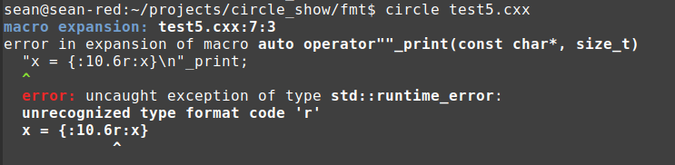
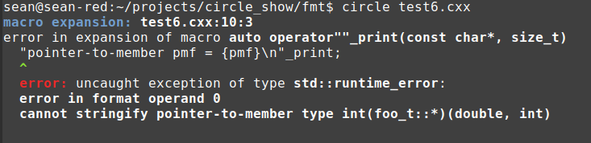

# The Circle format library

The [printf format specifier](https://en.cppreference.com/w/cpp/io/c/fprintf) is universally-beloved. But printf has technical drawbacks, so C++ has long offered an alternative in iostreams. Iostreams is, however, universally-despised. [Boost.Format](https://www.boost.org/doc/libs/1_71_0/libs/format/doc/format.html) is a mature library that combines the familiar format specifiers with type-safe and memory-safe implementation. However, it was slow, like iostreams. More recently, [fmtlib](https://github.com/fmtlib/fmt) provides a more concise syntax and relieves the user from having to link against Boost. This served as the basis for the [C++20 format library](https://en.cppreference.com/w/cpp/utility/format).

As a way to understand Circle's metaprogramming features I threw together my own version of the format utility. This uses the same format-spec syntax as fmtlib, but embeds the arguments themselves into the format specifier string! It's like [Python f-strings](http://www.blog.pythonlibrary.org/2018/03/13/python-3-an-intro-to-f-strings/), but for C++.

In this library, format specifier parsing is performed at compile time, and syntax errors are reported as easy-to-understand compiler errors. If the argument is incompatible with the format specifier, or it can't be stringified at all, you also get a nice compile-time error. Additionally, Circle's type introspection is used to automatically break apart class objects into their constituent members and retrieve enumerator names from enum values, without necessitating any runtime type information.

User-defined literals `_print` and `_format` send the formatted string to `stdout` and return it as an `std::string`, respectively. A pack expansion syntax has been incorporated with the format specifier to pack expand the embedded expression and treat those elements as members of a collection.

The implementation of the library is [here](format.hxx). 

### Format specifiers and embedded expressions

[**test1.cxx**](test1.cxx)
```cpp
#include "format.hxx"

int main() {
  int x = 50;
  double y = 100 * M_PI;
  const char* z = "Hello";

  // Basic printing.
  "x = {x}, y = {y}, z = {z}\n"_print;

  // Print as hex.
  "hex x = {:x:x}, y = {:a:y}\n"_print;

  // Use width and precision specifiers. Put the format specifier between
  // : and :.
  "y = {:10.5f:y} or y = {:.10e:y}\n"_print;

  // Center-align the values and fill unused space with ~.
  "x = {:~^15:x}, y = {:~^15:y}, z = {:~^15:z} \n"_print;

  // Provide dynamic width and precision specifiers. These are their own
  // expressions that are evaluated and must yield integral values.
  int width = 15;
  int prec = 7;
  "y with dynamic width/prec = {:{width}.{prec}:y}\n"_print;

  return 0;
}
```
```
$ circle test1.cxx
$ ./test1
x = 50, y = 314.15926, z = Hello
hex x = 32, y = 0x1.a28c5p+2
y =  314.15926 or y = 3.4159265358e+2
x = ~~~~~~50~~~~~~~, y = ~~~314.15926~~~, z = ~~~~~Hello~~~~~ 
y with dynamic width/prec =     314.1592653
```

Circle's format specifiers almost completely follows the syntax defined [here](https://fmt.dev/latest/syntax.html#format-specification-mini-language). But whereas fmtlib requires you to pass expressions as function arguments and coordinate them with the format specifier either by ordinal or by argument name, in this library you simply write the expression in place.

This in-place definition even extends to width and precision specifiers. You can either write them directly as integers, or encode one or both in braces and the library will execute those expressions and convert the result objects to integers.

### Formatting array-like containers 

[**test2.cxx**](test2.cxx)
```cpp
#include "format.hxx"

int main() {
  // Circle format can print from arrays, std::arrays, std::vectors and 
  // std::lists.
  // The inner parts are opened up recursively until we hit something that's
  // not array-like, and the format specifiers apply to these elements.
  std::vector<float> x { 
    5 * M_PI, 
    M_PI, 
    M_PI / 5 
  };

  // Print the array with default settings.
  "Default settings = {x}\n"_print;

  // Print the array in hexadecimal scientific notation.
  "Hexadecimal array = {:a:x}\n"_print;

  // Print the array with width.precision specifiers. Center-justify the
  // numbers and fill the 11-character width with '*' characters.
  "Fill and width/prec = {:*^11.2:x}\n"_print;

  // Print the array with dynamic width.precision specifiers.
  int y = 9;
  int z = 12;
  "Dynamic width/prec = {:{y + 5}.{z / 4}:x}\n"_print;

  // Initialize a linked list from the vector.
  std::list<double> w {
    x.begin(), x.end()
  };

  // Circle format prints linked lists like other array-like containrs.
  "An std::list<double> = {w}\n"_print;

  return 0;
}

```
```
$ circle test2.cxx && ./test2
Default settings = [ 15.70796, 3.14159, 0.62831 ]
Hexadecimal array = [ 0xf.53d10p+0, 0x3.43f6cp+0, 0xa.d97c0p-1 ]
Fill and width/prec = [ ***15.70***, ***3.14****, ***0.62**** ]
Dynamic width/prec = [         15.707,          3.141,          0.628 ]
An std::list<double> = [ 15.70796, 3.14159, 0.62831 ]
```

`fmtlib` issues a 373 line compiler error if you try to print an `std::vector` with `fmt::print`. But Circle format opens many standard types and prints their contents inside brackets.

Special format types:
* arrays
* `std::array`
* `std::vector`
* `std::list`
* `std::set`
* `std::multiset`
* `std::optional` - prints the value or `(null)`
* `std::map` - prints all key/value pairs

### Formatting enums

[**test3.cxx**](test3.cxx)
```cpp
#include "format.hxx"

enum class shape_t {
  circle,
  square,
  octagon, 
  triangle,
};

int main() {
  shape_t shapes[] {
    shape_t::square, 
    shape_t::octagon,
    shape_t::triangle,
    (shape_t)27
  };

  // Print the enums in the array with default settings. The enumerator names
  // are printed when available.
  "shapes = {shapes}\n"_print;

  // Center the enum names and use '~' to fill.
  "shapes = {:~^15:shapes}\n"_print;
 
  // Use reflection to print all enum names in a loop.
  "Your enum names are:\n"_print;
  int counter = 0;
  @meta for enum(shape_t e : shape_t)
    "{counter++}: {@enum_name(e)}\n"_print;

  // Print all enum names using format pack expansion. This puts them
  // all in a collection.
  "enum names = {...@enum_names(shape_t)}\n"_print;

  // Use 12-character width and center. This applies to
  // each element in the pack expansion.
  "enum names = {:^12:...@enum_names(shape_t)}\n"_print;

  return 0;
}
```
```
$ circle test3.cxx && ./test3
shapes = [ square, octagon, triangle, 27 ]
shapes = [ ~~~~square~~~~~, ~~~~octagon~~~~, ~~~triangle~~~~, ~~~~~~27~~~~~~~ ]
Your enum names are:
0: circle
1: square
2: octagon
3: triangle
enum names = [ circle, square, octagon, triangle ]
enum names = [    circle   ,    square   ,   octagon   ,   triangle   ]
```

Circle's introspection supports querying all enumerator names of an enum at compile time. Unless an integer type specifier is provided, the format library automatically prints enums using their string names.

We can even embed introspection keywords like `@enum_name` (returns the name of a particular enum) and `@enum_names` (returns the name of all enumerators as a pack) right inside the braces of a format specifier. The third example loops through each enumerator, incrementing a counter at each step and printing the enum name.

One limitation of encoding expressions into strings is that unexpanded parameter packs are not recognized just by looking at the string--the fourth example includes an `@enum_names` expression, which yields a pack, but the overall user-defined-literal invocation is not a pack expression. To expand this pack I've added a pack expansion syntax right there inside the format specifier. The `...` symbol that immediately precedes the argument expression will expand the pack expression and print each element as part of a collection, comma-separating and printing them inside brackets.

`"enum names = {:^12:...@enum_names(shape_t)}\n"_print;` demonstrates how the format specifier `^12` (meaning center-align and print with a width of 12 columns) applies to each individual element of the expanded pack. Elements of the pack don't have to be the same type, or even convertible to some common type (such as the mutual convertibility of character arrays to `const char*` through pointer decay). The format library iteratively steps over each pack element and recursively uses the argument-printing code to find the best viable stringification.

### Formatting classes

[**test4.cxx**](test4.cxx)
```cpp
#include "format.hxx"

struct vec3_t {
  float x, y, z;

  friend vec3_t operator*(float a, vec3_t v) {
    return { a * v.x, a * v.y, a * v.z };
  }
};

template<typename type_t>
type_t sq(type_t x) {
  return x * x;
}

int main() {
  float a = 1.5;
  vec3_t v { 2, 3, 1 };
  vec3_t z = a * v;

  // Automatically print a class object by member.
  "a = {a}\n"_print;
  "v = {v}\n"_print;

  // Allow any expression in the format specifier. Reflection still works.
  "a * v = {a * v}\n"_print;

  // Allow pack expressions inside the format specifier. Here a unary fold
  // operator takes the L2 norm of the vector.
  "|v| = {sqrt((sq(@member_values(v)) + ...))}\n"_print;

  // Use a pack format to print just the member names as a collection.
  "v has member names {...@member_names(vec3_t)}\n"_print;

  // Or do it on the member values.
  "v has member values {...@member_values(v)}\n"_print;

  // Circle recognizes STL types and handles them differently from generic
  // class objects.
  std::optional<vec3_t> val1, val2;
  val2 = v;

  "val1 = {val1}, val2 = {val2}\n"_print;

  return 0;
}
```
```
$ circle test4.cxx && ./test4
a = 1.50000
v = { x : 2.00000, y : 3.00000, z : 1.00000 }
a * v = { x : 3.00000, y : 4.50000, z : 1.50000 }
|v| = 3.74165
v has member names [ x, y, z ]
v has member values [ 2.00000, 3.00000, 1.00000 ]
val1 = (null), val2 = { x : 2.00000, y : 3.00000, z : 1.00000 }
```

Circle's introspection supports breaking class objects into their constituent data members. This is used whenever the format tool is provided a class object that's not one of the specially-recognized types.

### Syntax errors in the format specifier

```cpp
#define FMT_HEADER_ONLY
#include <fmt/format.h>

int main() {
  double x = M_PI / 2;
  fmt::print("{:10.6r}\n", x);

  return 0;
}
```
```
$ circle -I ~/projects/fmt/include/ fmt.cxx
$ ./fmt
terminate called after throwing an instance of 'fmt::v6::format_error'
  what():  invalid type specifier
Aborted (core dumped)
```

`fmtlib` parses the format specifier not at compile time, but at runtime. Syntax errors within the format specifier and incompatibilty errors between arguments and their correspond formats are reported by an exception thrown at runtime. This exception includes no information as to which format operation was ill-formed, or where that operation was attempted. 

The reason for this is obvious: Standard C++ requires a heroic effort to do non-trivial text processing at compile time. User-defined template literals will present a string literal as a character parameter pack, letting the programmer have access to the string data. But parsing the string in accordance with the restrictive constexpr rules is really difficult. Most libraries have no choice but to process string parameters at runtime, even when there are huge benefits from processing them at compile time.

[**test5.cxx**](test5.cxx)
```cpp
#include "format.hxx"

int main() {
  double x = M_PI / 2;

  // Create a syntax error in a format specifier.
  "x = {:10.6r:x}\n"_print;

  return 0;
}
```


Circle's syntax errors are printed at compile time and give exact placement as to the specific offending character in the specifier (indicated by the caret) as well as the line and column at which the operation was invoked (test5.cxx:7:3). The format implementation throws an `std::runtime_error` with a _throw-expression_, which contains the text of the format specifier and the indented caret. The compiler catches this exception as it falls through the translation unit and prints it as a compiler error.

### Argument incompatibility errors

```cpp
#include "format.hxx"

struct foo_t;

int main() {
  // Try to print a pointer-to-member function. It's not supported!
  int(foo_t::*pmf)(double, int) = nullptr;

  // Get a nice error here.
  "pointer-to-member pmf = {pmf}\n"_print;

  return 0;
}
```


When an argument has a type that cannot be stringified, or a type incompatible with its format specifier (for example, a pointer to a floating-point specifier), the library throws a compile-time exception specifying the ordinal of the argument, the type of the argument and the reason for failure.

## Format driving Circle development

The format utility was a useful exercise in identifying weaknesses in the Circle design. I got all the effects I wanted, but that's because I wrote the compiler itself and know all the tricks. Parts of the library were kludgey, and parts were clever, which is even worse. Changes in the next month will simplify format's implementation and make it more intentful.

### Exceptions aren't great errors

To report errors, the format library throws an exception at compile time. As the exception unrolls through the stack, the compiler keeps catching it and appending backtrace information, so that when it is trapped as an uncaught exception, the user gets a detailed error message as to the path the exception made through the translation unit.

The complicating factor is that the exception is thrown during template instantiation, which is not necessarily when the containing function is textually called. C++ compilers defer instantiation until it is determined that the function is actually ODR-used, at which point the calling function's definition has likely already been injected into AST. The result is that a thrown exception won't unwind through the compiler's internal try clauses that insert backtrace information, and they won't unwind through any of the user's meta try clauses (either explicitly meta or normal try clauses entered into by the interpreter), leading to a loss of context during error reporting.

To force instantiation of these function templates when they are textually called, I give them placeholder return types, even though the return types are usually just `std::string` or `void`.

```cpp
template<typename type_t>
auto make_array_string(const fmt_t& fmt, const type_t& obj);
```

`make_array_string` just returns a string, but is marked `auto`. When called during the instantiation of surrounding template code, a function specialization is made, substituting the type that was deduced during overload resolution in for `type_t`. If this function returned `std::string`, its instantiation would be deferred until code generation, and any exception it threw would not be as context-rich as we'd like.

By marking the return type `auto`, I force instantiation of the function at the point of call in a process called "return type deduction." This usage improves the library, but it's really an exploit that only a compiler writer would likely be aware of.

Note that this problem has nothing to do with C++ exceptions, per se. It afflicts `static_assert` the same way: most  `static_assert`s are starved for context, because the functions they are part of are instantiated after their textual calls.

A planned improvement is to implicitly mark functions that contain `static_assert`s and compile-time _throw-expressions_ as potentially compile-time throwing, and instantiate these functions at the point of call. Additionally, the compiler can greedily instantiate functions called directly or indirectly from inside meta try blocks.

In effect the behavior is the same as specifying `auto` return types, but it won't obscure the intent of the code.

But throwing exceptions through rich context has a draw back: it produces long error messages due to the accretion of backtrace information. Format's error messages might be thrown from ten levels deep in functions and Circle macros. This is useful for the library developer, but an annoyance to the user. We can throw out this distracting backtrace context by compile-time catching the exception close to the point of call, which has the side effect of clearning the compiler's backtrace buffer.

```cpp
@macro auto operator""_print(const char* __fmt, size_t) {
  @meta try {
    return ::cirfmt::write(__fmt);

  } catch(...) {
    @meta throw;
  }
}
```

This user-defined literal operator is the entry-point for the `_print` routine used in these examples. It has a catch-all and rethrow operation. When the compile-time exception is caught, the compiler clears the backtrace because it knows it no longer is tracking an _uncaught_ exception (since it's just been caught). The library rethrows the exception, and that restarts the backtrace generation, which begins at the calling statement-exactly the line of code the user is most interested in.

This manipulation can be addressed with a special declaration or attribute on a function, marking it as a library "entry-point" or "interface." Backtrace from behind the interface gets cleared as the exception passes through this function, yielding compiler errors that are most readable to the user.

This backtrace elimination would apply to all compiler errors, not merely those resulting from exceptions or `static_assert`s. Long error messages are a blight on C++ development, and simple attributes can help library developers shape errors so that they're helpful to users.

### Name lookup in macros needs to change

Circle macros present like functions. They undergo ordinary name lookup and overload resolution. They can be templated. They can exist in different namespaces. But unlike functions, they get injected into the calling scope. Circle macros provide the entry point for the format utility. 

```cpp
@macro auto eval_arg(const format_arg_t& __arg) {
  @meta if(__arg.pack) {
    return cirfmt::make_pack<__arg.type, __arg.index>( 
      __arg.fmt,
      ::cirfmt::eval_integer(__arg.fmt.width, __arg.width_expr),
      ::cirfmt::eval_integer(__arg.fmt.precision, __arg.precision_expr),
      @expression(__arg.expr) ...
    ); 

  } else {
    return cirfmt::make_arg<__arg.type, __arg.index>( 
      __arg.fmt,
      ::cirfmt::eval_integer(__arg.fmt.width, __arg.width_expr),
      ::cirfmt::eval_integer(__arg.fmt.precision, __arg.precision_expr),
      @expression(__arg.expr)
    ); 
  }
}

@macro auto format(const char* __fmt) {
  @meta try {
    @meta ::cirfmt::fmt_builder_t __builder { __fmt };
    @meta __builder.parse();

    return ::cirfmt::format_text<__builder.format2.size()>(
      @string(__builder.format2),
      ::cirfmt::eval_arg(@pack_nontype(__builder.args))...
    );

  } catch(...) {
    // Catch and rethrow. This clears out the backtrace, leaving a cleaner
    // error message.
    @meta throw;
  }
}
```

The `fmt_builder_t` class parses the format specifier string at compile time, snipping out arguments in braces. These arguments are evaluated with calls to `@expression`. We even have two code paths: one where the argument text is prefixed by `...` indicating a pack expansion, and one when it isn't. Macros are crucial here, because the calling scope is still available for name lookup. The macros create meta scopes that are stacked on top of the calling scope. The meta scopes can contain any number of meta objects, which we need to hold intermediate data structures. Name lookup inside macros is otherwise very ordinary--it begins from the inner-most declarative region, checks the declarations, and continues its way out of the macro and into the scope of the macro expansion.

The danger is that one of our intermediate data structures is given a name that conflicts with a name in the stringified expression string. To avoid this, Circle macros prefix their declarations with `__`, or some other mangling to reduce the chance of collision. The code above uses qualified name lookup to access declarations even in the namespace of the macro, because that macro's parent scope is no longer its namespace--its the calling scope.

These issues have been tolerable, because macros are always very short, even for a tool as sophisticated as format. But tolerable is not the same as good.

The next version of macros will have _dual scopes_. By default, the declarative region of a macro will be given a floor, just like namespace, class, enum and block scopes in C++. A name lookup operation, instead of falling through the macro and into the scope of the macro expansion, will simply fall out of the macro and into the parent scope.

To perform name lookup that access the parent scope, you'll use new name-lookup operators. `@@(name)` is the macro dynamic name operator--it begins name lookup not at the current scope, but at the point of macro expansion. `@@expression` will inject code from a string, but perform name lookup at the point of macro expansion. In fact, every Circle extension involving name lookup will have a special `@@` variant added, that is only valid inside macro definitions.

By giving future macros dual scopes, the versality of the macro is tremendously improved. Member-function macros are currently impossible, because the parent scope of the macro is defined as the calling scope rather than the enclosing class-specifier. No more with future macros. Member macros would take an implicit object parameter as compile-time state. This even lets us achieve lambda-macro technology. Define a macro-as-lambda at the point of its own expansion, and capture meta objects as closure state.

Finally, macros may even solve the issue in the previous section about forcing instatiation using placeholder return types. Macros are always expanded at the point of call. It's conceivable to evolve them into super functions, where the implicit object is always known at compile time, and both compile-time and runtime parameters are supported. The chief difference is instantiation at the point of call and support for the `@@` extensions, which perform macro name lookup.

The future macros might not need to be inject-by-token, and might be implemented with ordinary substitution. Access through the implicit object parameter or to compile-tiem parameters would result in value-dependent expressions (since these are compile-time expressions). By requiring macro name lookup through `@@`-prefixed extensions, the result objects and types of those expressions would be dependent at definition, in effect delivering deferred name lookup, which was the original goal of Circle macro design.


