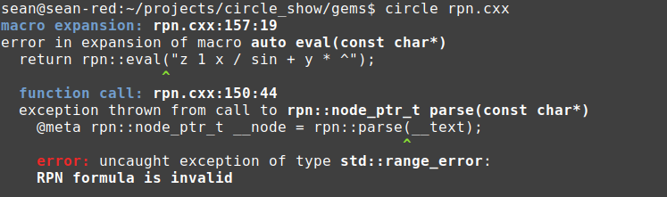

# RPN as an embedded Circle compiler

**Download the code:** [rpn.cxx](rpn.cxx)

[Reverse Polish Notation](https://en.wikipedia.org/wiki/Reverse_Polish_notation), or RPN, is a postfix expression syntax. Unlike the usual infix notation, it doesn't require parentheses to specify operator precedences. Instead, it introduces the notion of a virtual stack. Numbers are pushed to the stack, and operators pop its operatands from the stack, combine them, and push the result back onto the stack.

It was the convention for data entry on [HP scientific calculators](https://en.wikipedia.org/wiki/HP_calculators#Characteristics) and in the programming language [Forth](https://en.wikipedia.org/wiki/Forth_(programming_language).

RPN was popular in the early days of computing, when hardware was limited. It makes things easy for the computer while making things difficult for the user. Modern language design, by contrast, makes things difficult for both the computer and the user.

Circle is a user-extensible C++ compiler. We can extend the compiler to support _other languages_, such as RPN. This is not the same as building an RPN interpreter: the input RPN code gets lowered to LLVM IR through the Circle frontend. The resulting binary is indistinguishable from one written in straight C++.

Like the Apex autodiff compiler, the RPN compiler breaks the problem into two steps:
1. **Parse the input RPN code and transform it to an AST.**  
    This is generic code that could be called at compile time or runtime. It's basically the same code you'd write to implement either an interpreter or compiler: traversing the AST and evaluating results in an interpreter; traversing the AST and generating code results in a compiler.  
    Because Circle allows unrestricted execution at compile time, we'll run it on compile-time strings to transform input RPN to AST that can be lowered to code.
1. **Use Circle macros to lower the RPN AST to an expression.**
    Circle expression macros help integrate the embedded language (RPN) with the host language (Circle/C++). Expanding a Circle expression macro executes a macro and expands the returned subexpression into the point of the call.  
    These macros are both recursive and data-driven. The parameter of the macro is an AST node, with a value known at compile time. The macro considers the type of node, and emits code for implementing the operation. For operators and function calls, this involves recursive macro expansion on the children of the AST node. The final result of the macro expansion is a single expression, one that transforms the input RPN to infix C++.

## Parsing the RPN expression

**[rpn.cxx](rpn.cxx)**  
```cpp
enum class kind_t {
  var,       // A variable or number
  op,        // + - * /
  f1,        // unary function
  f2,        // binary function
};

struct token_t {
  kind_t kind;
  std::string text;
};

struct token_name_t {
  kind_t kind;
  const char* string;
};

const token_name_t token_names[] {
  // Supported with @op
  { kind_t::op,    "+"     },
  { kind_t::op,    "-"     },
  { kind_t::op,    "*"     },
  { kind_t::op,    "/"     },

  // Unary functions
  { kind_t::f1,    "abs"   },
  { kind_t::f1,    "exp"   },
  { kind_t::f1,    "log"   },
  { kind_t::f1,    "sqrt"  },
  { kind_t::f1,    "sin"   },
  { kind_t::f1,    "cos"   },
  { kind_t::f1,    "tan"   },
  { kind_t::f1,    "asin"  },
  { kind_t::f1,    "acos"  },
  { kind_t::f1,    "atan"  },

  // Binary functions
  { kind_t::f2,    "atan2" },
  { kind_t::f2,    "pow"   },
};

inline kind_t find_token_kind(const char* text) {
  for(token_name_t name : token_names) {
    if(!strcmp(text, name.string))
      return name.kind;
  }
  return kind_t::var;
}

struct node_t;
typedef std::unique_ptr<node_t> node_ptr_t;

struct node_t {
  kind_t kind;
  std::string text;
  node_ptr_t a, b;
};

inline node_ptr_t parse(const char* text) {
  std::istringstream iss(text);
  std::string token;

  std::stack<node_ptr_t> stack;
  while(iss>> token) {
    // Make operator ^ call pow.
    if("^" == token)
      token = "pow";

    // Match against any of the known functions.
    kind_t kind = find_token_kind(token.c_str());

    node_ptr_t node = std::make_unique<node_t>();
    node->kind = kind;
    node->text = token;
    
    switch(kind) {
      case kind_t::var:
        // Do nothing before pushing the node.
        break;      

      case kind_t::f1:
        if(stack.size() < 1)
          throw std::range_error("RPN formula is invalid");

        node->a = std::move(stack.top()); stack.pop();
        break;

      case kind_t::op:
      case kind_t::f2:
        // Binary operators and functions pop two items from the stack,
        // combine them, and push the result.
        if(stack.size() < 2)
          throw std::range_error("RPN formula is invalid");

        node->b = std::move(stack.top()); stack.pop();
        node->a = std::move(stack.top()); stack.pop();
        break;
    }

    stack.push(std::move(node));
  }

  if(1 != stack.size())
    throw std::range_error("RPN formula is invalid");

  return std::move(stack.top());
}
```

This is one of the simplest possible postfix expression parsers. `std::istringstream` is used to separate the input text into tokens. We then match the token against a list of reserved operators and functions. We support the `^` token as a power operator, so replace its spelling with `pow`, which will match the function in the `<cmath>` header.

RPN is designed to be evaluated as its parsed. But instead of evaluating it numerically, we'll follow the same stack-oriented procedure and generate an AST that models the operations expressed. We create a `node_t` object for each token. If the token matches a one-parameter function, we'll pop one item from the stack and fix it as a child of the current node. If the token matches a binary operator or two-parameter function, we'll pop two items and fix them as children. Finally, we push the current node (representing the result of the operation) back onto the stack.

## Lower the RPN AST

**[rpn.cxx](rpn.cxx)**  
```cpp
@macro auto eval_node(const node_t* __node) {
  @meta+ if(rpn::kind_t::var == __node->kind) {
    @emit return @expression(__node->text);

  } else if(rpn::kind_t::op == __node->kind) {
    @emit return @op(
      __node->text, 
      rpn::eval_node(__node->a.get()),
      rpn::eval_node(__node->b.get())
    );

  } else if(rpn::kind_t::f1 == __node->kind) {
    // Call a unary function.
    @emit return @(__node->text)(
      rpn::eval_node(__node->a.get())
    );

  } else if(rpn::kind_t::f2 == __node->kind) {
    // Call a binary function.
    @emit return @(__node->text)(
      rpn::eval_node(__node->a.get()),
      rpn::eval_node(__node->b.get())
    );
  }
}

// Define an expression macro for evaluating the RPN expression. This
// expands into the expression context from which it is called. It can have
// any number of meta statements, but only one real return statement, and no
// real declarations (because such declarations are prohibited inside
// expressions).
@macro auto eval(const char* __text) {
  @meta rpn::node_ptr_t __node = rpn::parse(__text);
  return rpn::eval_node(__node.get());
}
```

The expression macros are Circle-specific. The outer macro, `eval` is passed an RPN text that must be known at compile time, though it needn't be a string literal. This is parsed at compile time into the RPN's AST. We then traverse the AST with the `eval_node` expression. 
* Operators are generated with the `@op` Circle extension, which turns a string naming a C++ operator into a subexpression that uses that operator.
* Function calls are generated using the dynamic name operator `@()` to turn the function name into an identifier; name lookup should then yield a function lvalue, and the call syntax generates a function call.
* Everything else is classified as a variable, and passed to `@expression` for direct evaluation in the scope of expression that expands the `eval` macro. Name lookup for Variable names x, y and z will succeed if those variables are visible from the code that expands `eval`. This gets to why we use __ before local identifiers--we don't want to accidentally cause a name collision and have name lookup find a declaration created by the macro rather than an object or function specified by the user.

## Using RPN as an embedded compiled language

**[rpn.cxx](rpn.cxx)**
```cpp
double my_function(double x, double y, double z) {
  return rpn::eval("z 1 x / sin y * ^");
}

int main() {
  double result = my_function(.3, .6, .9);
  printf("%f\n", result);
  return 0;
}
```
```
$ circle rpn.cxx
$ ./rpn 
1.012120
```

We can evaluate an RPN expression by calling `rpn::eval` (which is a macro) like a function. Although the RPN is passed in as a string, this is a real compiled language. It performs compile-time syntax and type checking. The parsing and code generation occurs once (at compile time) and the resulting function definition may be called any number of times during runtime execution.

Macro expansion generates code identical to this:
```cpp
double my_function(double x, double y, double z) {
  return pow(z, sin(1.000000 / x) * y);
}
```

However, unlike other macro systems, it does this with no textual or token-level substitution. The macro returns Circle subexpressions which get substituted into the calling scope. This is why we don't need parentheses to set the desired operator precedences (which was one of the motivating factors behind the adoption of RPN in the first place).

What if the user makes a syntax error in the embedded RPN? Note the inserted `+`. We no longer have enough operands to feed all the RPN operators. (This kind of syntax error is clear with infix notation; postfix notation moves this burden to the user.)

```cpp
double my_function(double x, double y, double z) {
  return rpn::eval("z 1 x / sin + y * ^");
}
```


If there's a syntax error, the parser throws an `std::range_error` exception. Since this is thrown from the interpreter during source translation, the exception unwinds its way through the translation unit, until the compiler catches the exception and prints its diagnostic in the form of a compiler error.

## Why embedded languages

The point for embedded/domain-specific languages is to incorporate _intelligence_ into your software. C++, like all other general purpose languages, will simply do what you tell it. What if we want some additional intelligence under the hood? Maybe something for resource allocation, parallel scheduling, mathematical transformations or pattern matching? It's possible the compiler will implement something directly, and we've seen this with extensions for parallel execution like OpenMP. But usually you're on your own, and with non-extensible compilers, that means you're out of luck.

Circle makes it easy to extend the compiler with embedded languages. As we've seen with the [TACO example](taco.md), you can even repurpose tools originally written with other deployment mechanisms in mind. 

The bulk of the code is parsing, semantic analysis, and whatever domain-specific brains you're adding to the language. This code is portable and requires no skill with metaprogramming. If you want to debug it, build it into its own executable and use gdb. To deploy this part, save it in a header or, better yet, build it into a shared object library as in the [Apex example](https://github.com/seanbaxter/apex/blob/master/examples/autodiff.md).

The embedded language's IR is then lowered to code using some Circle extensions, like `@expression`, `@op` and expression and statement macros. Introspection is also available in this layer. A DSL can use `decltype` on the result of an `@expression` to yield the type of a subexpression from its own language, and then employ Circle's introspection keywords like `@member_name` to learn the internal structure of the object. It can then communicate this meaning back to the semantic layer. This provides tight, almost seamless integration between the DSL and the Circle host.
