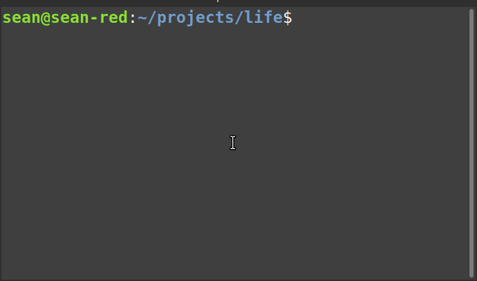

# Circle Imperative Arguments (CIA)

## Intro

[**intro.cxx**](intro.cxx) [(Compiler Explorer)](https://godbolt.org/z/6T1so3e7Y)
```cpp
#include <tuple>

// Declare a tuple specialization.
using T = std::tuple<char, int, void*, const char*, float, int[5]>;

// Create a new specialization of the same template, but with the
// arguments sorted in lexicographical order.
using T2 = T.template<T.type_args.sort(_0.string < _1.string)...>;

// Confirm the new arguments are sorted!
static_assert(T2 == std::tuple<char, const char*, float, int, int[5], void*>);
```

Circle Imperative Arguments is a set of C++ compiler extensions that makes compile-time programming much more expressive. 

The intro example uses a bunch of these new features in one line:
```cpp
using T2 = T.template<T.type_args.sort(_0.string < _1.string)...>;
```

* `T.template` yields the class template of the specialization `T`. If the type isn't a class specialization, requesting its template is a substitution error.
* `T.type_args` yields a pack with all the template arguments of the specialization `T`. In this case, it yields a pack with types `<char, int, void*, const char*, float, int[5]>`.
* `.sort(_0.string < _1.string)` sorts the elements in the pack. The sort logic is implemented by the compiler frontend. The user submits a boolean predicate expression to compare two elements, `_0` and `_1`, which are parsed as dependent types.
* `_0.string` yields a string literal (technically a constant character array) with the spelling of the type on the left. The type `char` is spelled "char", `const char*` is "const char\*" and so on. Circle has a bunch of type introspection features, and this is one of them. Be aware that you can also use `.string` to get the spelling of an enum constant.
* `_0.string < _1.string` Circle implements lexicographical comparison for string literals of any character width, using the six standard comparison operators.
. When employed as a `.sort` predicate, this usage compares the spelling of the left-hand side type with the spelling of the right-hand side type. It's like `strcmp`, but operates at compile time and only on string literals. You can concatenate literals with `+` too.
* `T2 == std::tuple<char, const char*, float, int, int[5]>` CIA allows direct comparison of types and templates with `==` and `!=`. You don't have to use `std::is_same_v`. Compare types and templates as you would variables.

Javascript and Python are popular _productivity languages_. The CIA extensions aim to bring the expressiveness and concision of those languages to the kinds of problems currently treated with C++ template metaprogramming.

## Contents

* [A note before starting](#a-note-before-starting)
* [The imperative model](#the-imperative-model)
* [Type traits](#type-traits)
  * [print](#print)
  * [rebind](#rebind)
  * [rotate](#rotate)
  * [is_specialization](#is-specialization)
* [CIA control flow](#cia-control-flow)
  * [_argument-if_](#argument-if)
  * [_argument-for_](#argument-for)
  * [Power set](#power-set)
  * [Cartesian product](#cartesian-product)
  * [_argument-group_](#argument-group)
  * [_argument-let_](#argument-let)
  * [Conway's Game of Life](#conways-game-of-life)
  * [Sorting with CIA](#sorting-with-cia)
  * [Sort and filter](#sort-and-filter)
  * [_multi-conditional_](#multi-conditional)
  * [search](#search)
  * [variant](#variant)
* [Trait metafunctions](#trait-metafunctions)
  * [`.sort` metafunction](#sort-metafunction)
  * [`.filter` metafunction](#filter-metafunction)
  * [`.unique` metafunction](#unique-metafunction)

## A note before starting

Compile-time programming can be hard. Compiler errors are opaque and diagnostics don't really exist. However, Circle allows access to the C and C++ standard libraries _at compile time_! Use compile-time `cout`, `printf` and `puts` liberally to understand your program.

[**info.cxx**](info.cxx) [(Compiler Explorer)](https://godbolt.org/z/ejMY6PMdc)
```cpp
#include <iostream>
#include <tuple>

template<typename T>
using ReplicateArgs = T.template<
  .{ T.type_args }(int... + 1) ...
>;

using T1 = std::tuple<int, char*, double, short>;
using T2 = ReplicateArgs<T1>;

@meta std::cout<< T2.string<< "\n";
```
```
$ circle -c info.cxx
std::tuple<int, char*, char*, double, double, double, short, short, short, short>
```

If you aren't sure what this does at first glance, the wise coarse of action is to print it and find out. Use `@meta std::cout` along with `.string` reflection to print types at compile time. This works even if the translation unit doesn't otherwise compile; just put the print statement before where the error occurs. This is a big help when trying to deciper arcane stuff.

CIA leverages [pack subscripts and slices](https://github.com/seanbaxter/circle/blob/master/universal/README.md#pack-subscripts-and-slices) and [pack indices](
https://github.com/seanbaxter/circle/blob/master/universal/README.md#pack-indices), powerful features already documented [here](https://github.com/seanbaxter/circle/blob/master/universal/README.md). [Constexpr conditional](https://github.com/seanbaxter/circle/tree/master/conditional#constexpr-conditional--) and [constexpr multi-conditional](https://github.com/seanbaxter/circle/tree/master/conditional#constexpr-multi-conditional---) are documented [here](https://github.com/seanbaxter/circle/tree/master/conditional#readme).

## The imperative model

Template metaprogramming (TMP) is bad. However, templates are central to almost everything in C++, and I don't want to get rid of them. What do I mean by template metaprogramming? I have in mind the use of argument deduction, especially partial template argument deduction, for the purpose of computing values and types.

To get a feel of what we _don't_ want, consider a TMP approach to get the I'th argument of a template specialization.

[**get_args.cxx**](get_args.cxx) [(Compiler Explorer)](https://godbolt.org/z/MdcKMvqa4)
```cpp
#include <tuple>
#include <type_traits>

// Define a class template to get the index'th type pack element.
template<size_t index, typename T, typename... Ts> 
struct get_pack_arg {
  using type = typename get_pack_arg<index - 1, Ts...>::type;
};

template<typename T, typename... Ts> 
struct get_pack_arg<0, T, Ts...> {
  using type = T;
};

// Define a class template to expose a specialization's template arguments
// using argument deduction.
template<size_t index, typename T> 
struct get_arg;

template<size_t index, template<typename...> class Temp, typename... Ts>
struct get_arg<index, Temp<Ts...> > {
  using type = typename get_pack_arg<index, Ts...>::type;
};

// Define an alias template for ergonomics.
template<size_t index, typename T>
using get_arg_t = typename get_arg<index, T>::type;

// Test on a couple cases.
using T1 = std::pair<float, double>;
using T2 = std::tuple<char, short, int, long>;

static_assert(std::is_same_v<double, get_arg_t<1, T1> >);
static_assert(!std::is_same_v<char, get_arg_t<0, T1> >);

static_assert(std::is_same_v<int, get_arg_t<2, T2> >);
static_assert(!std::is_same_v<double, get_arg_t<1, T2> >);
```

The alias template `get_arg_t` provides the type of a specialization's argument by index. To do this we define two class templates and two partials:
* `get_pack_arg` is a class template that peels away pack elements by recursively specializing itself on a shifted view of the parameter pack. The first type argument `T` is discarded and the index is decremented. A partial template matches `index=0` to end the recursion and typedefs `T`.
* `get_arg` is a class template that provides access to a specialization's template arguments. All the work is done by the partial template, which deduces the template and all the template arguments as `Temp` and `Ts`. Now that it has a pack of the arguments, it sends them to `get_pack_arg` to find the `index`th type.

This is a lot of work just to access a template argument by index. We must use recursion to implement _direct subscript_ on packs. C++ has a reputation as an arcane, unlearnable language, and I think the reputation is merited. There has got to be a better way.

[**get_args_cia.cxx**](get_args_cia.cxx) [(Compiler Explorer)](https://godbolt.org/z/WxefGherG)
```cpp
#include <tuple>

// Test on a couple cases.
using T1 = std::pair<float, double>;
using T2 = std::tuple<char, short, int, long>;

static_assert(double == T1.type_args...[1]);
static_assert(char   != T1.type_args...[0]);

static_assert(int    == T2.type_args...[2]);
static_assert(double != T2.type_args...[1]);
```

This is the same program written using Circle Imperative Arguments. All the template machinery is gone. Circle provides _imperative access_ to the template and template arguments of specializations.

* `T.type_args` is a parameter packs of all the template arguments of the class specialization `T`, treated as types for the purpose of parsing (as opposed to non-type, template or universal arguments). If `T` is not a class specialization (or reference to one), `T.type_args` is a substitution failure.
* `...[i]` subscripts the parameter pack at index `i`. If `i` is out-of-range, the operation is a substitution failure.
* `T1 == T2` and `T1 != T2` are type comparisons. Existing practice uses the C++ 17 variable template `std::is_same_v`. This is ugly and slow. Beyond generating a variable template specialization, it also requires partial template argument deduction. With CIA, directly check for type or template equivalence.

The _expression_ grammar doesn't allow full _type-ids_, only _simple-type-specifiers_, so you can't compare types like `const char*`. However,  you can effectively escape the _expression_ grammar by putting your full _type-id_ in parenthesis, where it will match _cast-expression_, which does parse _(type-id)_, and your program will compile.

```cpp
template<typename T>
void func() {
  bool b1 = const char* == T;     // BAD. Syntax error.
  bool b2 = (const char*) == T;   // GOOD. Put type-ids in ( ).
}
```

## Type traits

Circle already exploits a type's member namespace to support dozens of numeric_traits and type_traits [member traits](https://github.com/seanbaxter/circle/blob/master/member-traits/README.md). CIA adds more traits, ones that aren't just quality of life improvements, but deliver new language capabilities.

* `T.template` yields the class template of the class specialization `T`. 
* `T.type_args` yields the template arguments of the class specialization `T`, treated as types for the purpose of parsing.
* `T.nontype_args` yields the template arguments of the specialization `T`, treated as non-types.
* `T.template_args` yields the template arguments of the specialization `T`, treated as templates.
* `T.universal_args` yields the template arguments of the specialization `T`, treated as universal arguments. These are the argument equivalents of [Universal Template Parameters P1985R1](http://www.open-std.org/jtc1/sc22/wg21/docs/papers/2020/p1985r1.pdf).
* `T.string` yields a narrow character string literal with the name of the type `T`.
* `Temp.string` yields a narrow character string literal with the name of the template `Temp`.

### print

[**print.cxx**](print.cxx) [(Compiler Explorer)](https://godbolt.org/z/7v1s4Wj3G)
```cpp
#include <tuple>
#include <iostream>

template<typename T>
void print_type() {
  std::cout<< T.string<< "\n";
  std::cout<< T.template.string<< "\n";
  std::cout<< int...<< ": "<< T.type_args.string<< "\n" ...;
}

int main() {
  print_type<std::tuple<char*, double, int, void*>>();
}
```
```
$ circle print.cxx && ./print
std::tuple<char*, double, int, void*>
std::tuple
0: char*
1: double
2: int
3: void*
```

This example imperatively accesses the string name of a type, of a type's template, and of all the template arguments of its specialization. No deduction is needed; you access the template and arguments as if they were _members_ of the type.

### rebind

[**rebind.cxx**](rebind.cxx) [(Compiler Explorer)](https://godbolt.org/z/eWc9ffeMe)
```cpp
#include <tuple>
#include <variant>

template<typename T1, typename T2>
using Rebind = T1.template<T2.universal_args...>;

using T1 = std::tuple<>;
using T2 = std::variant<int, double, char, float>;
using T3 = std::tuple<int, double, char, float>;

// Use the alias template.
static_assert(T3 == Rebind<T1, T2>);

// Do it in situ.
static_assert(T3 == T1.template<T2.universal_args...>);
```

The alias template `Rebind` specializes the template of the specialization `T1` with the arguments of the specialization `T2`. The test _rebinds_ the arguments of a `variant` into the template of a `tuple`. By using the `.universal_args` type trait, we support type, non-type and template-template parameters.

### rotate

[**rotate.cxx**](rotate.cxx) [(Compiler Explorer)](https://godbolt.org/z/az8Y9Pnoc)
```cpp
#include <tuple>

template<size_t N, typename T>
using Rotate = T.template<
  T.universal_args...[N:]..., T.universal_args...[:N]...
>;

using T1 = std::tuple<char, short, int, long, long long>;

static_assert(std::tuple<int, long, long long, char, short> == Rotate<2, T1>);
```

Circle makes argument transformations trivial. To rotate the arguments within a class specialization, expand two [pack slices](https://github.com/seanbaxter/circle/blob/master/universal/README.md#pack-subscripts-and-slices) into the new argument list. The first, `...[N:]` starts at the rotation location `N` and extends to the end of the pack. The second, `...[:N]`, runs from the start of the pack and extends to `N`. 

[**rotate2.cxx**](rotate.cxx) [(Compiler Explorer)](https://godbolt.org/z/d5o3osd8d)
```cpp
#include <tuple>

template<size_t N, typename T>
using Rotate = T.template<
  auto Count : sizeof...T.universal_args =>
    for i : Count =>
      T.universal_args...[(i + N) % Count]
>;

using T1 = std::tuple<char, short, int, long, long long>;

static_assert(std::tuple<int, long, long long, char, short> == Rotate<2, T1>);
```

An innovation of CIA is that you rarely have to use parameter pack metaprogramming. The [_argument-for_](#argument-for) construct let's you write a loop right there in the _template-argument-list_. Use modulo arithmetic to rotate the index in your pack subscript.

### is_specialization

[**is_specialization.cxx**](is_specialization.cxx) [(Compiler Explorer)](https://godbolt.org/z/Txa95KoTb)
```cpp
#include <tuple>

using T1 = std::tuple<int, char>;
using T2 = std::pair<int, char>;

// P1985R1 Universal Template Parameters
template<typename T, template<template auto...> class Temp>
constexpr bool is_specialization_v = false;

template<template auto... Params, template<template auto...> class Temp>
constexpr bool is_specialization_v<Temp<Params...>, Temp> = true;

static_assert(is_specialization_v<T1, std::tuple>);
static_assert(!is_specialization_v<T2, std::tuple>);
```

[Universal Template Parameters P1985R1](http://www.open-std.org/jtc1/sc22/wg21/docs/papers/2020/p1985r1.pdf) proposes a solution to the difficult problem of determining if a type is a specialization of a specified class template, where that template is allowed any parameterization. `is_specialization_v` is their answer. Like all TMP codes, it defines a partial template (of a variable template, in this case) to deduce the template and template arguments of the parameter type.

Resorting to argument deduction to solve a problem means C++ failed to provide an imperative mechanism for solving the problem directly.

[**is_specialization2.cxx**](is_specialization2.cxx) [(Compiler Explorer)](https://godbolt.org/z/o6KaKsnKv)
```cpp
#include <tuple>

using T1 = std::tuple<int, char>;
using T2 = std::pair<int, char>;

static_assert(T1.template == std::tuple);
static_assert(T2.template != std::tuple);
```

Circle Imperative Arguments gets right to the point. `T1.template` yields the template of the class specialization `T1`. Use `==` and `!=` to directly compare it with another template. Substitution failures in either operand of the comparison are caught and return a false comparison for `==` or a true comparison for `!=`. In other words, in a dependent context, you can request the `.template` trait of any type, specialization or not, and it won't fail when part of a comparison.

## CIA control flow

TMP's control flow support is its biggest failure. Any kind of control flow ultimately comes down to argument deduction choosing between two or more partial templates. A trivial example is [std::conditional_t](url-here), which yields one of two type arguments given a boolean argument. The technology becomes very challenging when you want to _amplify_ or _filter_ arguments in a template argument list. Standard C++ doesn't have constructs that directly yield parameter packs, so to insert a variable number of elements to an argument list requires top-tier argument deduction skills.

[**forward.cxx**](forward.cxx) [(Compiler Explorer)](https://godbolt.org/z/v11voGxvE)
```cpp
#include <type_traits>
#include <utility>
#include <iostream>

template<typename... Ts>
void func(Ts&&... x) {
  std::cout<< int...<< ": "<< x<< "\n" ...;
}

template<typename... Ts>
void forward_ints(Ts&&... x) {
  // Use .remove_reference to account for lvalue and rvalue references.
  func(if Ts.remove_reference.is_integral => std::forward<Ts>(x) ...);
}

int main() {
  int a = 1;
  forward_ints(a, 'b', 3.3, "Four", nullptr, 6ull);
}
```
```
$ circle call.cxx && ./call
0: 1
1: b
2: 6
```

Suppose we want to pass only function arguments of integral type to another function. This is a _filter_, and requires performing a test and then admitting or rejecting arguments. Circle introduces _argument-if_ for this task.

### _argument-if_

_argument-if_ is a _generic-argument_ construct. It may be written in one of five contexts:
1. _template-argument-list_
2. _initializer-list_
3. function argument list
4. _fold-expression_
5. The value of another _generic-argument_

These contexts are all involved with list building, and _argument-if_, as a filter, is a list-building construct.

* `if` _pred_ `=>` _generic-argument_
* `if` _pred_ `=>` _generic-argument_ `else` _generic_argument_

```cpp
template<typename... Ts>
void forward_ints(Ts&&... x) {
  // Use .remove_reference to account for lvalue and rvalue references.
  func(if Ts.remove_reference.is_integral => std::forward<Ts>(x) ...);
}
```

`Ts.remove_reference.is_integral` is our predicate. It is a compile-time constant. `std::forward<Ts>(x)` is the _argument-if_'s value, and is emitted to the argument list when the predicate evaluates true.

This function argument is a pack expression, because `Ts` in the predicate is a template parameter pack. We have to expand the pack somewhere. By putting the expansion token `...` inside the argument list, we form a single call to `func`, which receives all arguments `x` with integral type.

### _argument-for_

_argument-for_ is a _generic-argument_ construct. It loops over types, non-types, templates, a counter or a multi-dimensional set of counters, from inside an argument list. Circle hasn't yet added syntax for nested pack expansion; it's possible, but complicated. _argument-for_ is the tool for effecting this same thing:

[**pairs.cxx**](pairs.cxx) [(Compiler Explorer)](https://godbolt.org/z/jd1ETffzq)
```cpp
#include <map>
#include <array>
#include <cstdio>

// Use nested argument-for to emit all pairs of template arguments.
template<typename T1, typename T2> 
using all_pairs = T1.template<
  for universal A1 : T1.universal_args =>
    for universal A2 : T2.universal_args =>
      T1.template<A1, A2>
>;

// Use an argument-for to iterate over the outer argument list.
// Use a pack expansion to generate arguments over the inner list.
template<typename T1, typename T2> 
using all_pairs2 = T1.template<
  for universal A1 : T1.universal_args =>
    T1.template<A1, T2.universal_args>...
>;

template<template auto...> struct list;

// Fill with a type, a non-type and a template argument.
using T1 = list<int, 5, std::map>;
using T2 = list<double, 'a', std::array>;

// The outer product of T1 and T2.
using R = list<
  list<int, double>, list<int, 'a'>, list<int, std::array>, 
  list<5, double>, list<5, 'a'>, list<5, std::array>,
  list<std::map, double>, list<std::map, 'a'>, list<std::map, std::array>
>;

static_assert(all_pairs<T1, T2> == R);
static_assert(all_pairs2<T1, T2> == R);
```

ISO C++ doesn't define a mechanism for expanding nested packs, nor a way to yield pack declarations. This makes computing the outer product of argument lists a challenging TMP puzzle. However, CIA _argument-for_ removes the difficulty. Loop over the arguments of all but the inner-most packs. For the inner-most pack, you can perform pack expansion (as in `all_pairs2`) or simply write another loop (as in `all_pairs`).

* `for` _[step-decl ,]_  `typename`_decl_ `:` _type-pack_ `=>` _generic-argument_
* `for` _[step-decl ,]_  `typename`_decl_ `:` _braced-type-list_ `=>` _generic-argument_
* `for` _decl_ `:` _integer-count_ `=>` _generic-argument_
* `for` _decl_ `:` _non-type-pack_ `=>` _generic-argument_
* `for` _decl_ `:` _braced-non-type-list_ `=>` _generic-argument_
* `for` _[step-decl ,]_ `template` _decl_ `:` _template-pack_ `=>` _generic-argument_
* `for` _[step-decl ,]_ `template`  _decl_ `:` _braced-template-list_ `=>` _generic-argument_
* `for` _[step-decl ,]_ `universal` _decl_ `:` _universal-pack_ `=>` _generic-argument_
* `for` _[step-decl ,]_ `universal` _decl_ `:` _braced-universal-list_ `=>` _generic-argument_
* `for` _[step-decl ,]_ `...` _decl_ `:` _braced-counter-list_ `=>` _generic-argument_
* `for` _[step-decl ,]_ `...` _decl_ `:` _counter-pack_ `=>` _generic-argument_

The _integer-count_ form of _argument-for_ declares a step variable _decl_ with type `int`. Loop sizes between 0 and 65,536 steps are supported. The _step-decl_ declaration is also type `int`.

[**step.cxx**](step.cxx) [(Compiler Explorer)](https://godbolt.org/z/YTYYbhYPr)
```cpp
#include <map>
#include <cstdio>

template<typename T>
using index_and_arg = T.template<
  for i, universal U : T.universal_args =>
    T.template<i, U>
>;

template<template auto...> struct list;

using L = list<int, 100, std::map>;

static_assert(index_and_arg<L> == list<
  list<0, int>, list<1, 100>, list<2, std::map>
>);
```

_argument-for_ is the most developed CIA feature, with nine forms of syntax. Each form takes an optional _step-decl_, the name of an `int` declaration that holds the index of the current loop step. Even though we're dealing with a pack, `T.universal_args`, there is no pack expansion logic: _argument-for_ manages iteration in a simpler way.

[**step2.cxx**](step2.cxx) [(Compiler Explorer)](https://godbolt.org/z/qM4h5584W)
```cpp
#include <map>

template<typename T>
using index_and_arg = T.template<
  T.template<int..., T.universal_args>...
>;

template<template auto...> struct list;

using L = list<int, 100, std::map>;

static_assert(index_and_arg<L> == list<
  list<0, int>, list<1, 100>, list<2, std::map>
>);
```

In this case, we don't _need_ the _argument-for_. Circle's pack index [`int...`](https://github.com/seanbaxter/circle/blob/master/universal/README.md#pack-indices) is more concise. But this formulation, while a bit shorter, is the kind of expert approach that has made TMP intimidating for newcomers, or even veteran C++ programmers who haven't systematically studied the language post-2011. C++'s great strength is that it is a multi-paradigm language, and the CIA extensions are a new user-friendly paradigm. 

### Power set

[**power.cxx**](power.cxx) [(Compiler Explorer)](https://godbolt.org/z/fcEf1rbKM)
```cpp
#include <cstdio>

template<typename... Ts>
struct list;

template<template auto... Xs>
using power_set = list<
  auto N : sizeof...(Xs) => 
    for i : (1<< N) => list<
      if i & (1<< int...(N)) => Xs ...
    >
>;

using L = power_set<char, int, float, long>;

static_assert(L == list<
  list<>, list<char>, list<int>, list<char, int>,
  list<float>, list<char, float>, list<int, float>, list<char, int, float>,
  list<long>, list<char, long>, list<int, long>, list<char, int, long>,
  list<float, long>, list<char, float, long>, list<int, float, long>,
  list<char, int, float, long>
>);
```

The [power set](https://en.wikipedia.org/wiki/Power_set) is the set of all 2^N subsets of an N-element set. It is difficult to generate the power set with TMP. Boost mp11 implements a [mp_power_set](
https://www.boost.org/doc/libs/develop/libs/mp11/doc/html/mp11.html#mp_power_setl) template that relies on very expert metaprogramming. 

The CIA implementation is about as easy as one can imagine. Since there are 2^N sets, we use _argument-for_ to loop over 2^N output subsets. [_argument-let_](#argument-let) declares a non-type value `N` which holds the parameter pack size; this doesn't change computation, it simply improves readability. For each output subset `i`, we loop over all _bits_ in the counter `i`. If a bit is set, the corresponding input element in the pack `Xs` is emitted to the subset.

[**power2.cxx**](power2.cxx) [(Compiler Explorer)](https://godbolt.org/z/16eMfrTxW)
```cpp
template<template auto... Xs>
using power_set = list<
  auto N : sizeof...(Xs) => 
    for i : (1<< N) => list<
      for bit, universal X : Xs => 
        if i & (1<< bit) => X
    >
>;
```

If you aren't comfortable using the pack index operator `int...`, that's fine, you don't have to use it. Write another _argument-for_ to loop over the bits in `i` and conditionally emit elements from the pack `Xs`. The CIA mechanisms increase the productivity of experts while also allowing non-experts to express exactly what they want.

### Cartesian product

[**product.cxx**](product.cxx) [(Compiler Explorer)](https://godbolt.org/z/K1q3xa4P4)
```cpp
template<typename... Ts>
struct list;

template<typename... Ts>
using product = list<
  for ...indices : { for typename T : Ts => sizeof...(T.type_args) } =>
    list<for i, typename T : Ts => T.type_args...[indices...[i]]>
>;

using L1 = list<char8_t, char16_t, char32_t>;
using L2 = list<float, double>;
using L3 = list<int, long>;
using L4 = list<bool, void>;

using L = product<L1, L2, L3, L4>;

static_assert(L == list<
  list<char8_t,  float,  int,  bool>,
  list<char8_t,  float,  int,  void>,    // the RHS is most rapidly varying.
  list<char8_t,  float,  long, bool>, 
  list<char8_t,  float,  long, void>, 
  list<char8_t,  double, int,  bool>, 
  list<char8_t,  double, int,  void>, 
  list<char8_t,  double, long, bool>, 
  list<char8_t,  double, long, void>, 
  list<char16_t, float,  int,  bool>, 
  list<char16_t, float,  int,  void>, 
  list<char16_t, float,  long, bool>,
  list<char16_t, float,  long, void>, 
  list<char16_t, double, int,  bool>, 
  list<char16_t, double, int,  void>, 
  list<char16_t, double, long, bool>, 
  list<char16_t, double, long, void>, 
  list<char32_t, float,  int,  bool>, 
  list<char32_t, float,  int,  void>, 
  list<char32_t, float,  long, bool>, 
  list<char32_t, float,  long, void>, 
  list<char32_t, double, int,  bool>, 
  list<char32_t, double, int,  void>, 
  list<char32_t, double, long, bool>, 
  list<char32_t, double, long, void>
>);
```

Any known number of nested packs can be expanded by nesting _argument-for_ constructs. But expanding an *unknown* number of nested packs requires a different mechanism. The Boost MP11 template [product](https://www.boost.org/doc/libs/develop/libs/mp11/doc/html/mp11.html#mp_productf_l) forms the [Cartesian Product](https://en.wikipedia.org/wiki/Cartesian_product) of all the template arguments' arguments. The trick is that the number of top-level arguments isn't known at definition. It's a parameter pack, and the depth of the nested loops needs to be one per pack element.

_argument-multi-for_ is the CIA mechanism for generating a multi-dimensional loop from a count pack or braced list of counts.

```cpp
  for ... indices : { M, N, R, S } => value
```

evaluates the _generic-argument_ value for all instances of the pack declaration `indices`, where its pack elements range from _{ 0...M, 0...N, 0...R, 0...S }_.

Let's break the _argument-multi-for_ example into two phases: 
1. Compute the extent of each dimension. Inside the _braced-count-list_, use _argument-for-typename_ to loop over each top-level argument and query its argument count.

    `{ for typename T : Ts => sizeof... T.type_args }` 
    We can't write `sizeof... Ts.type_args` to produce a _count-pack_ directly, because `Ts` is a pack, so `Ts.type_args` would be a nested pack, which is not yet supported by Circle. Pack-yielding operators like the `.type_args` member trait aren't allowed to source pack operands.

    The CIA idiom is to loop over all but the inner-most pack in a nested pack. In this case, the outer pack is `Ts`, so we bind `T` to each element and loop. The value is `sizeof... T.type_args`.

2. The value for each _argument-multi-for_ step should be a `list` specialized over one argument from each of the top-level specializations. This is gather operation. For each argument _i_ of the inner `list` argument, gather `Ts...[i].type_args...[indices...[i]]`. In this four-dimensional case, we want these four arguments:
    1. `Ts...[0].type_args...[indices...[0]]`
    1. `Ts...[1].type_args...[indices...[1]]`
    1. `Ts...[2].type_args...[indices...[2]]`
    1. `Ts...[3].type_args...[indices...[3]]`

    The varying index of `indices...[i]` is effected with an _argument-for_. We can also eliminate the subscript `Ts...[i]` by using _argument-for-typename_ to bind directly to each of the types in the pack `Ts`. 
    `1. Ts...[0].type_args...[indices...[0]]`

### _argument-group_

* `.{` _generic-argument-list_ `}` - group the _generic-arguments_
* `.{` _generic-argument-list_ `}` `(` _count_ `)` - group and repeat the _generic-arguments_ _count_ times.

Just as normal C++ has _compound-statement_ to group statements within a control-flow block, CIA has _argument-group_ to group arguments within a control-flow argument. There's an optional count to repeat the _argument-group_ without needing to write a separate loop.

Note the dot `.` before the brace `{`. We have to distinguish an _argument-group_ from a _braced-init-list_. While `{ }` is not allowed in a _template-argument_, it is a valid argument in an _initializer-list_ or function argument list. 

[**group.cxx**](group.cxx) [(Compiler Explorer)](https://godbolt.org/z/a9hW65WYG)
```cpp
#include <type_traits>

template<template auto... Ts> struct list;

// Emit integral and pointer-to-integral types using if-expression.
template<typename... Ts>
using integral_pointers = list<if Ts.is_integral => .{ Ts, Ts* } ...>;

using L1 = integral_pointers<float, int, char, void>;
static_assert(L1 == list<int, int*, char, char*>);

// Use grouping to emit a triangle shape of arguments.
// At each step, emit a non-type integer argument, i + 1, and i + 1
// types.
template<int N>
using Arrays = list<
  for i : N => .{ i + 1, for j : i + 1 => char[i + 1] }
>;

using L2 = Arrays<3>;
static_assert(L2 == list<
  1, char[1], 
  2, char[2], char[2], 
  3, char[3], char[3], char[3]
>);
```

This sample shows how _argument-group_ is like a _compound-statement_ for argument lists.

`if Ts.is_integral => .{ Ts, Ts* } ...` is an argument expression with three levels of precedence. The lowest precedence operation is the pack expansion `...`. The next operation is the _argument-if_. The highest-predence operation is the _argument-group_. Argument expansion walks through the four elements of the `Ts` pack (`float`, `int`, `char` and `void`). Each is tested by evaluating the member trait `is_integral`. If the trait is true, an argument group consisting of the type and a pointer to the type is emitted to the argument list.

`for i : N => .{ i + 1, for j : i + 1 => char[i + 1] }` uses _argument-group_ in a different way. Here, the group contains a non-type argument `i + 1` and an _argument-for_ construct as elements. This lets us emit arguments in a similar way to executing expression statements using _for-statement_ with _compound-statement_.

[**repeat.cxx**](repeat.cxx) [(Compiler Explorer)](https://godbolt.org/z/MdPjThTxf)
```cpp
template<template auto... Ts> struct list;

// Duplicate a universal parameter N times.
template<int N, template auto T>
using dup = list<.{T}(N)>;

using L1 = dup<5, int>;
static_assert(L1 == list<int, int, int, int, int>);

// Interleave the parameter with the type void.
template<int N, template auto T>
using alternate_void = list<T, .{void, T}(N - 1)>;

using L2 = alternate_void<3, char>;
static_assert(L2 == list<char, void, char, void, char>);

// Repeat a pack of arguments N times. Vary the Ts first. Note ... placement.
template<int N, template auto... Ts>
using repeat_inner = list<.{Ts...}(N)>;

using L3 = repeat_inner<2, char, float, long>;
static_assert(L3 == list<char, float, long, char, float, long>);

// Repeat of pack of arguments N times. Vary the Ns first. Note ... placement.
template<int N, template auto... Ts>
using repeat_outer = list<.{Ts}(N)...>;

using L4 = repeat_outer<2, char, float, long>;
static_assert(L4 == list<char, char, float, float, long, long>);
```

The repeater form of _argument-group_ gives us expressive power without the need to write loops. Just put the repeat count in parenthesis after the group.

If the group contains an unexpanded parameter pack, expanding argument after the  group will substitute the group once for each pack element, including replication. C++'s configurable pack expansion locus gives a concise (if confusing to new users) mechanism for choosing the more quickly-varying index of an expansion.

### _argument-let_

* `typename` _decl_ : _type-id_ `=>` _generic-argument_
* `typename...` _decl_ : _braced-type-list_ `=>` _generic-argument_
* `auto` _decl_ : _assignment-expression_ `=>` _generic-argument_
* `auto...` _decl_ : _braced-init-list_ `=>` _generic-argument_
* `template` _decl_ : _template-id_ `=>` _generic-argument_
* `template...` _decl_ : _braced-template-list_ `=>` _generic-argument_

_argument-let_ injects a new type, non-type or template declaration into the scope and expands its value _generic-argument_ with that declaration visible. It's like an _argument-for_, but acts for a single iteration. It is useful for computing a value or pack of values, then reusing that value multiple times later in the argument list.

### Conway's Game of Life

[**life.cxx**](life.cxx) [(Compiler Explorer)](https://godbolt.org/z/nGEW9dEPe)
```cpp
#include <cstdio>

// A board is uniquely determined by its height, width and cell data.
// The timestep is not part of the board.
template<int height, int width, int... cells>
struct board_t {
  // Convert the cell data to a string constant.
  static const char string[] {
    for row : height =>
      .{ cells...[row * width : (row+1) * width] ? '*' : ' ' ..., '\n' },
    '\0'
  };
};

template<int height, int width, int... cells>
using advance_life = board_t<height, width, 
  // Make a for loop over the neighbor counts.
  for row : height =>
    for col : width =>
      auto count : 
        // For each cell, run a fold expression over its 3x3 support.
        (... + for i : 3 => for j : 3 =>
          (1 != i || 1 != j) &&
          cells...[
            (col + i + width - 1) % width +
            (row + j + height - 1) % height * width
          ]
        ) =>
        // New cell set if count is 2, or count is 3 and cell was already set.
        3 == count || (2 == count && cells...[row * width + col])
>;

const int Height = 10;
const int Width = 24;
using Start = board_t<Height, Width, 
  0, 1, 1, 0, 0, 0, 0, 0, 0, 0, 0, 0, 0, 0, 0, 0, 0, 0, 0, 0, 0, 0, 0, 0,
  1, 1, 0, 0, 0, 0, 0, 0, 0, 0, 0, 0, 0, 0, 0, 0, 0, 0, 0, 0, 0, 0, 0, 0, 
  0, 1, 0, 0, 0, 0, 0, 0, 0, 0, 0, 0, 0, 0, 0, 0, 0, 0, 0, 0, 0, 0, 0, 0, 
  0, 0, 0, 0, 0, 0, 0, 0, 0, 0, 1, 0, 0, 0, 0, 0, 0, 0, 0, 0, 0, 0, 0, 0, 
  0, 0, 0, 0, 1, 1, 0, 0, 0, 0, 0, 0, 0, 0, 0, 0, 0, 0, 0, 0, 0, 0, 0, 0, 
  0, 0, 0, 0, 0, 1, 0, 0, 0, 1, 1, 1, 0, 0, 0, 0, 0, 0, 0, 0, 0, 0, 0, 0, 
  0, 0, 0, 0, 0, 0, 0, 0, 0, 0, 0, 0, 0, 0, 0, 0, 0, 0, 0, 0, 0, 0, 0, 0, 
  0, 0, 0, 0, 0, 0, 0, 0, 0, 0, 0, 0, 0, 0, 0, 0, 0, 0, 0, 0, 0, 0, 0, 0,
  0, 0, 0, 0, 0, 0, 0, 0, 0, 0, 0, 0, 0, 0, 0, 0, 0, 0, 0, 0, 0, 0, 0, 0, 
  0, 0, 0, 0, 0, 0, 0, 0, 0, 0, 0, 0, 0, 0, 0, 0, 0, 0, 0, 0, 0, 0, 0, 0
>;

template<int timestep>
struct life_t {
  // Extract the cells from the previous timestep and advance them.
  using prev = typename life_t<timestep - 1>::board;
  using board = advance_life<
    Height, 
    Width, 
    prev.nontype_args...[2:]...
  >;
};

// Seed timestep 0 with the starting point to avoid infinite
// template recursion.
template<> struct life_t<0> { using board = Start; };

@meta+ for(int timestep : 100) {
  usleep(200000);     // Sleep for 200ms, to target 5fps.
  printf("%3d:\n%s\n", timestep, life_t<timestep>::board::string);
}
```

This sample implements [Conway's Game of Life](https://en.wikipedia.org/wiki/Conway%27s_Game_of_Life) at compile time. The entire logic for integrating a single frame is expressed in the argument list of the alias template `advance_life`. 

The rules are simple. Each cell on the grid is either populated or populated. For the next frame, a cell is populated if:
* It has exactly three populated neighbors this frame, or
* It is populated and has exactly two populated neighbors this frame.

```cpp
template<int height, int width, int... cells>
using advance_life = board_t<height, width, 
  // Make a for loop over the neighbor counts.
  for row : height =>
    for col : width =>
      auto count : 
        // For each cell, run a fold expression over its 3x3 support.
        (... + for i : 3 => for j : 3 =>
          (1 != i || 1 != j) &&
          cells...[
            (col + i + width - 1) % width +
            (row + j + height - 1) % height * width
          ]
        ) =>
        // New cell set if count is 2, or count is 3 and cell was already set.
        3 == count || (2 == count && cells...[row * width + col])
>;
```

The cell values are passed in through the `cells` template parameter pack. We need to compute the cell states for the entire grid, so loop over all rows in `height` and all columns in `width` with two _argument-for-non-type_ constructs.

Now we want to compute the neighbor popluation for each cell. C++17 _fold-expressions_ are the best way to perform reductions like. CIA control flow is allowed in the right-hand side of left-fold expressions, where they take the place of a parameter pack. Let the fold expression consist of a loop `i` from 0 to 3 and a loop `j` from 0 to 3. We don't want to include the cell in the middle of the stencil, so check that either `i` or `j` differs from 1. Then use the Circle pack subscript `...[]` to access the cell status at location (`i`, `j`). Modulo arithmetic wraps us over the edge to create periodic boundary conditions.

This complicated _fold-expression_ is the source for the _argument-let_ declaration `count`. We cache the value in `count` because we need it twice: once to compare it to 3, and once to compare it to 2 if the stencil's center is also set. Caching the _fold-expression_ relieves us from having write it twice; this helps with legibility and performance.

```cpp
template<int height, int width, int... cells>
struct board_t {
  // Convert the cell data to a string constant.
  static const char string[] {
    for row : height =>
      .{ cells...[row * width : (row+1) * width] ? '*' : ' ' ..., '\n' },
    '\0'
  };
};
```

The class template `board_t` holds the cell status in a template parameter pack. The struct definition defines a non-static string member which serves as a visualization of the simulation frame. A string literal generates a constant character array with a null terminator. We'll define a constant character array and use its _braced-init-list_ to programmatically create a string representation of the board. Braced initializers are a CIA context, so we can use these advanced features within the argument list, whereas we couldn't within the quotes of a string literal.

First, loop over all rows in `height`. Emit a group, where the first element is an expansion over the slice expression `cells...[row * width : (row+1) * width]`. Remember that a static slice expression has the syntax `...[begin:end:step]`. Ours is a slice over all columns in row `row`. If the cell is populated, emit a `*` character. Otherwise emit a space. Pack-expand the pack expression to emit an entire row of text. Finally, emit a newline character. Because these productions are part of an _argument-group_, they'll be emitted for every row in the board. When we have visited all rows, emit the null terminator character `'\0'`. 

```cpp
template<> struct life_t<0> { using board = Start; };

@meta+ for(int timestep : 100) {
  usleep(200000);     // Sleep for 200ms, to target 5fps.
  printf("%3d:\n%s\n", timestep, life_t<timestep>::board::string);
}
```

After initializing the board with starting cell values designed to produce an interesting simulation, we start integrating, during compile time, inside of a meta-for loop. We'll call [`usleep`](https://man7.org/linux/man-pages/man3/usleep.3.html) to wait 200ms, then integrate a frame and print its compile-time string, to simulate a 5 frames per second animation.



### Sorting with CIA

[**sort.cxx**](sort.cxx) [(Compiler Explorer)](https://godbolt.org/z/48nxGb331)
```cpp
#include <cstdio>

template<template auto...>
struct list;

// Two steps for sorting.
// 1. For each element i, count how many elements j precede element i.
// 2. Search for the element with insertion index i and emit it.
template<int... x>
using sort_ints = list<
  auto ...insertions : { 
    for i : sizeof... x => (... + (x < x...[i] || x == x...[i] && int... < i))
  } => for i : sizeof... x =>
    if insertions == i => x ...
>;

// Compare the slice starting at 0 with the slice starting at 1.
template<int... x>
constexpr bool is_sorted = (... && (x...[0:-2] <= x...[1:]));

using Unsorted = list<
  59, 22, 61, 28, 62, 74, 42, 98, 45, 75, 
  18, 59, 25, 75, 20, 72, 48, 46, 11, 11, 
  22, 70, 30,  9, 85, 39, 78, 24, 91, 95,
  12, 37, 27, 84, 77, 73, 51, 39, 54, 45,
  56, 88, 37, 24, 58, 90, 37, 36, 11, 86,
   6, 82, 47, 90, 89, 79, 38, 88,  2, 39,
  87, 80, 32, 55, 42, 31, 64, 29, 31, 55, 
  35, 11, 34, 28,  3, 74, 63, 11, 60,  6,
  85, 19, 48, 33, 52, 94, 17, 64, 72, 21,
  99, 58, 96, 54, 10, 24, 31, 78, 76, 37
>;

using Sorted = list<
   2,  3,  6,  6,  9, 10, 11, 11, 11, 11, 
  11, 12, 17, 18, 19, 20, 21, 22, 22, 24, 
  24, 24, 25, 27, 28, 28, 29, 30, 31, 31, 
  31, 32, 33, 34, 35, 36, 37, 37, 37, 37, 
  38, 39, 39, 39, 42, 42, 45, 45, 46, 47, 
  48, 48, 51, 52, 54, 54, 55, 55, 56, 58, 
  58, 59, 59, 60, 61, 62, 63, 64, 64, 70, 
  72, 72, 73, 74, 74, 75, 75, 76, 77, 78, 
  78, 79, 80, 82, 84, 85, 85, 86, 87, 88, 
  88, 89, 90, 90, 91, 94, 95, 96, 98, 99
>;

static_assert(is_sorted<Sorted.nontype_args...>);
static_assert(Sorted == sort_ints<Unsorted.nontype_args...>);
```
```
$ circle -c sort.cxx 
list<2, 3, 6, 6, 9, 10, 11, 11, 11, 11, 11, 12, 17, 18, 19, 20, 21, 22, 22, 24, 24, 24, 25, 27, 28, 28, 29, 30, 31, 31, 31, 32, 33, 34, 35, 36, 37, 37, 37, 37, 38, 39, 39, 39, 42, 42, 45, 45, 46, 47, 48, 48, 51, 52, 54, 54, 55, 55, 56, 58, 58, 59, 59, 60, 61, 62, 63, 64, 64, 70, 72, 72, 73, 74, 74, 75, 75, 76, 77, 78, 78, 79, 80, 82, 84, 85, 85, 86, 87, 88, 88, 89, 90, 90, 91, 94, 95, 96, 98, 99>
```

Compile-time sorting is the domain of TMP geniuses. But CIA makes it really quite easy. This example sorts 100 integers in a parameter pack without using recursion or creating any intermediate types. It's a simple O(n^2) parallel insertion sort. An _argument-let_ introduces a non-type pack declaration `insertions` and for each element of the input computes the number of elements that will come before it in the sorted output. An element _x_ comes before _y_ in the sorted output if _x_ < _y_ or if _x_'s original location is before _y_'s original position. This property is called [_stability_](https://en.wikipedia.org/wiki/Sorting_algorithm#Stability).

If we could scatter values, we'd be done. But CIA doesn't (yet) have an _argument-scatter_ feature. We'll gather values instead. 

`for i : sizeof... x => if insertions == i => x ...` loops over all inputs, and tests the `insertion` indices against the input ordinal `i`. When it finds a match, it emits that input element. This is another O(n^2) operation. The asymptotics are not good, but with such a simple inner loop, the code is going to be very fast when the input packs are small.

_argument-let_ serves a crucial role. In the [life.cxx](life.cxx) sample, the neighbor count was cached, so it could be used twice without recomputation. In the [sort.cxx](sort.cxx) sample, we cache each insertion index so it can be visited _N_ times to emulate the scatter. Not having _argument-let_ capability would render this sort O(N^3) complexity, which would be too slow to use even for small inputs.

## Sort and filter

[**sort2.cxx**](sort2.cxx) [(Compiler Explorer)](https://godbolt.org/z/j5xvM6sKh)
```cpp
#include <type_traits>
#include <cstdio>

template<template auto...> struct list;

template<typename T>
using sort_and_filter = list<
  typename... Ts : { if !T.type_args.is_empty => T.type_args ...} =>
  auto ...insertions : {
    for i, typename T : Ts => (... +
      sizeof(Ts) > sizeof(T) ||
      sizeof(Ts) == sizeof(T) && int... < i
    )
  } => for i : sizeof...(Ts) =>
    if insertions == i => Ts ...
>;

template<typename... Ts>
constexpr bool is_reverse_sorted = 
  (... && (sizeof(Ts...[:-2]) >= sizeof(Ts...[1:])));

template<int size>
struct dummy_t {
  char x[size];
};

struct empty_t { };

// Start with a mix of empties and unsorted types.
using Unsorted = list<
  dummy_t<59>, empty_t,     dummy_t<22>, dummy_t<61>, dummy_t<28>,
  empty_t,     dummy_t<18>, dummy_t<59>, dummy_t<25>, dummy_t<75>,
  dummy_t<22>, dummy_t<70>, empty_t,     dummy_t<30>, empty_t,
  dummy_t<12>, dummy_t<37>, dummy_t<27>, empty_t,     dummy_t<84>
>;

// Discard the empties and sort the remaining types by decreasing size.
using Sorted = list<
  dummy_t<84>, dummy_t<75>, dummy_t<70>, dummy_t<61>, dummy_t<59>, 
  dummy_t<59>, dummy_t<37>, dummy_t<30>, dummy_t<28>, dummy_t<27>, 
  dummy_t<25>, dummy_t<22>, dummy_t<22>, dummy_t<18>, dummy_t<12>
>;

static_assert(Sorted == sort_and_filter<Unsorted>);
```

Arthur O'Dwyer posted a [TMP comparison](https://quuxplusone.github.io/blog/2019/12/28/metaprogramming-n-ways/) on his blog. The challenge was to filter out empty types (by using `std::is_empty_v`) and sort the remaining types by decreasing size. CIA allows this without a TMP library, and the entire operation can be performed in a _template-argument-list_. 

The _argument-let_ at the top is really useful: it lets us filter the pack `T.type_args` into a new pack `Ts`, by throwing away empty elements. `Ts` is a declaration that's in scope for all the constructs that follow its `=>` token. By filtering before sorting, we reduce the compute requirements of the operation. This sort is O(N^2), and if you were to filter out half the elements, the cost of the sort is reduced by 75%.

As compact as this treatment of the TMP#1 challenge is, by utilizing the [.sort](#sort-metafunction) and [.filter](#filter-metafunction) trait metafunctions, we can accomplish this operation in just one line:

```cpp
template<typename T>
using sort_and_filter = list<
  T.type_args.filter(!_0.is_empty).sort(sizeof(_0) > sizeof(_1))...
>;
```

### _multi-conditional_

[Constexpr multi-conditional](https://github.com/seanbaxter/circle/tree/master/conditional#constexpr-multi-conditional---) `a ...?? b : c` is one of the most powerful metaprogramming operators in Circle. If _argument-multi-for_ chains together multiple for loops, _constexpr-multi-conditional_ chains together multiple _constexpr-conditional_ operators, `a ?? b : c`. This solves the problem of finding the first element of a set that matches a condition. For the first predicate element `a` that evaluates true, its corresponding pack element `b` is yielded. If no element `a` is true, then the non-pack expression `c` is yielded. This operator composes with _generic-argument_, so it can be used as the value of an _argument-for_ or _argument-if_, and an _argument-for_ or _argument-if_ can be used in the `b` or `c` positions of the _constexpr-multi-conditional_.

### search

[**search.cxx**](search.cxx) [(Compiler Explorer)](https://godbolt.org/z/7b9E3YKM5)
```cpp
#include <array>

// Find the index of the first argument that matches the key.
template<template auto Key, typename L>
constexpr size_t FindFirst = Key == L.universal_args ...?? 
  int... : sizeof... L.universal_args;

template<template auto... Xs> struct list;

using L1 = list<int, 1, char*, std::array, 'x'>;

// Match types with ==.
static_assert(FindFirst<char*, L1> == 2);

// Match templates with ==.
static_assert(FindFirst<std::array, L1> == 3);

// Match non-types with ==.
static_assert(FindFirst<'x', L1> == 4);
```

The `FindFirst` variable templates yield the index of the first template argument that matches the key. This can be a type, non-type or template argument. If no argument matches, the total number of arguments is yielded, which follows the convention of STL's `.end()` functions.

We can do more than test for equivalence. We can test for member traits just as easily.

[**search_traits.cxx**](search_traits.cxx) [(Compiler Explorer)](https://godbolt.org/z/YvqTGsox1)
```cpp
#include <type_traits>

template<template auto... Xs> struct list;

// Search for the left-most integral argument.
template<typename T>
constexpr int FirstIntegral = T.type_args.is_integral ...?? 
  int... : sizeof...(T.type_args);

using L1 = list<double, void, short, float>;
static_assert(2 == FirstIntegral<L1>);

// Search for the right-most rvalue reference argument.
// Use the static slice ...[::-1]to reverse the order of T.type_args.
template<typename T>
constexpr int LastRValue = sizeof...(T.type_args) - 
  (T.type_args...[::-1].is_rvalue_reference ...?? 1 + int... : 0);

using L2 = list<void, char&&, float&, int&&, double*, int>;
static_assert(3 == LastRValue<L2>);
```

We can apply [member traits](https://github.com/seanbaxter/circle/blob/master/member-traits/README.md) like `is_integral` or `is_rvalue_reference` and search the input packs in forward or reverse order. To get reverse order, use a reverse static slice `...[::-1]`.

### variant

[**variant.cxx**](variant.cxx) [(Compiler Explorer)](https://godbolt.org/z/EMe46KhMM)
```cpp
#include <variant>
#include <iostream>

// Use argument deduction to access the variant alternatives.
template<typename... Ts>
const char* variant_type_string(const std::variant<Ts...>& v) {
  return int... == v.index() ...? Ts.string : "valueless-by-exception";
}

int main() {
  std::variant<int, float, double, const char*> v;

  v = "Hello";
  std::cout<< variant_type_string(v)<< "\n";

  v = 3.14f;
  std::cout<< variant_type_string(v)<< "\n";

  // Use type traits to access the template arguments with having to
  // use argument deduction.
  v = 100;
  std::cout<< (int... == v.index() ...? 
    decltype(v).type_args.string : "valueless-by-exception")<< "\n";
}
```

Not all multi-conditional predicates need to be evaluated during compile time. We can print the string name of the active variant member by using the _multi-conditional_ operator (note the single `?` in `...?:` for the non-constexpr version) to compare the runtime `v.index()` against each variant alternative. When a match is found, the true branch returns a pointer to the type's `.string` literal trait. Because idiomatic Circle encourages creating packs in non-dependent contexts (which is prohibited in Standard C++), you can even write the expression in situ, rather than factoring it out into its own function.

## Trait metafunctions

Productivity languages like Javascript have special [array member functions](https://developer.mozilla.org/en-US/docs/Web/JavaScript/Reference/Global_Objects/Array) that makes programs more readable. C++ parameter packs are collections that similarly benefit from these kinds of member functions.

_Trait metafunctions_ are compiler-implemented operations directly on parameter packs. While the _generic-argument_ constructs are often enough to implement these operations, having them provided by the compiler results in faster compilation times and cleaner, more idiomatic looking source code.

There is a wide-open namespace for metafunctions. In the first CIA release, Circle provides three: [`.sort`](#sort-metafunction), [`.filter`](#filter-metafunction) and [`.unique`](#unique-metafunction).

### `.sort` metafunction

[**sort3.cxx**](sort3.cxx) [(Compiler Explorer)](https://godbolt.org/z/GrfvaPv9a)
```cpp
#include <cstdio>
#include <memory>
#include <utility>

template<typename...> struct list;

// .sort is a trait metafunction. Feed it a predicate. _0 and _1 are 
// dependent type declarations of the left and right types in a comparison.
// The sort is implemented in the compiler frontend, so it's fast.

// Fill a list with a bunch of types.
using L = list<int, double, char*, float[5], float, void(*)(void), void*, 
  wchar_t, int, std::unique_ptr<int>, char(*)(float), std::pair<int, double>,
  short, char8_t, int*, double[5]>;

// This alias template sorts argument types lexicographically.
template<typename T>
using sort_lex = T.template<T.type_args.sort(_0.string < _1.string)...>;

// This alias template sorts by size, with biggest first.
template<typename T>
using sort_size = T.template<T.type_args.sort(sizeof(_0) > sizeof(_1))...>;

// Sort and print in one expression.
@meta printf("Types sorted by string:\n");
@meta printf("%2d: %s\n", int..., sort_lex<L>.type_args.string)...;

@meta printf("\nTypes sorted by decreasing size:\n");
@meta printf("%2d: %s\n", int..., sort_size<L>.type_args.string)...;
```
```
$ circle -c sort3.cxx
Types sorted by string:
 0: char(*)(float)
 1: char*
 2: char8_t
 3: double
 4: double[5]
 5: float
 6: float[5]
 7: int
 8: int
 9: int*
10: short
11: std::pair<int, double>
12: std::unique_ptr<int, std::default_delete<int>>
13: void(*)()
14: void*
15: wchar_t

Types sorted by decreasing size:
 0: double[5]
 1: float[5]
 2: std::pair<int, double>
 3: double
 4: char*
 5: void(*)()
 6: void*
 7: std::unique_ptr<int, std::default_delete<int>>
 8: char(*)(float)
 9: int*
10: int
11: float
12: wchar_t
13: int
14: short
15: char8_t
```

Sorting routines typically require comparator callsbacks. libc's [`qsort`](https://en.cppreference.com/w/c/algorithm/qsort) has a function callback. C++'s [`std::stable_sort`](https://en.cppreference.com/w/cpp/algorithm/stable_sort) takes a callable parameter that can be passed a lambda object. We want the same level of customization, but we're dealing with types, not just values. We don't want to specialize a class template for each comparison and end up creating O(N^2) (or, in the best case, O(N log N)) useless temporary class specializations.

The CIA approach is a new metafunction predicate mechanism. `.sort` takes one argument, which must be an expression convertible to `bool`. Before this argument is parsed, the compiler injects symbols `_0` and `_1` into the scope of the argument. These are dependent types. When the sort is actually executed by the frontend, non-dependent types are set for these declarations, and the value-dependent predicate expression undergoes template substitution.

Substitution is slow, but still a lot faster faster than specializing a class template like [`std::less`](https://en.cppreference.com/w/cpp/utility/functional/less), which involves argument deduction, class definition instantiation, additional rounds of name lookup, and so on. You can still specialize a class or variable template as part of the predicate expression, but you don't have to, and you probably won't want to. Providing a compact predicate like `_0.string < _1.string` incurs minimal substitution, and your sort operation will be fast.

### `.filter` metafunction

[**sort4.cxx**](sort4.cxx) [(Compiler Explorer)](https://godbolt.org/z/5da8sKxEh)
```cpp
#include <type_traits>
#include <cstdio>

template<template auto...> struct list;

template<typename T>
using sort_and_filter = list<
  T.type_args.filter(!_0.is_empty).sort(sizeof(_0) > sizeof(_1))...
>;

template<typename... Ts>
constexpr bool is_reverse_sorted = 
  (... && (sizeof(Ts...[:-2]) >= sizeof(Ts...[1:])));

template<int size>
struct dummy_t {
  char x[size];
};

struct empty_t { };

// Start with a mix of empties and unsorted types.
using Unsorted = list<
  dummy_t<59>, empty_t,     dummy_t<22>, dummy_t<61>, dummy_t<28>,
  empty_t,     dummy_t<18>, dummy_t<59>, dummy_t<25>, dummy_t<75>,
  dummy_t<22>, dummy_t<70>, empty_t,     dummy_t<30>, empty_t,
  dummy_t<12>, dummy_t<37>, dummy_t<27>, empty_t,     dummy_t<84>
>;

// Discard the empties and sort the remaining types by decreasing size.
using Sorted = list<
  dummy_t<84>, dummy_t<75>, dummy_t<70>, dummy_t<61>, dummy_t<59>, 
  dummy_t<59>, dummy_t<37>, dummy_t<30>, dummy_t<28>, dummy_t<27>, 
  dummy_t<25>, dummy_t<22>, dummy_t<22>, dummy_t<18>, dummy_t<12>
>;

static_assert(is_reverse_sorted<Sorted>);
static_assert(Sorted == sort_and_filter<Unsorted>);
```

The `.filter` metafunction removes parameter pack elements that don't pass a user-defined predicate. While [_argument-if_](#argument-if) filters packs, it only does so in an argument list context: _template-argument-list_, _initializer-list_, _fold-expression_ or function argument list. It requires a target to emit pack elements into.

But `.filter` simply takes the pack on the left and yields a new pack. It can be chained with `.sort` and `.unique` to effect sophisticated operations. This example is a rewrite of [Sorting with CIA](#sorting-with-cia), this time accomplished with two metafunctions in just one line of code:

```cpp
  T.type_args.filter(!_0.is_empty).sort(sizeof(_0) > sizeof(_1))...
```

The `.filter` metafunction declares a dependent type declaration `_0`. Because filter works on one element at a time instead of two, it only creates this one declaration. For each element in the input pack, the predicate expression in substituted, and true predicates emit the element to the result pack, and false predicates discard it.

### `.unique` metafunction

[**unique.cxx**](unique.cxx) [(Compiler Explorer)](https://godbolt.org/z/YqqKsTs35)
```cpp
#include <cstdio>
#include <memory>
#include <utility>

template<typename...> struct list;

// Fill a list with a bunch of types.
using L = list<int, double, char*, double, double, float[5], float, 
  void(*)(void), void*, float, void*, wchar_t, int, float[5], 
  std::unique_ptr<int>, char(*)(float), std::pair<int, double>, char(*)(float),
  short, char8_t, float[5], int, int*, float[5]>;

// Print original types:
@meta printf("Original types:\n");
@meta printf("%2d: %s\n", int..., L.type_args.string)...;

// Unique and print them.
@meta printf("\nUnique types:\n");
@meta printf("%2d: %s\n", int..., L.type_args.unique.string)...;
```
```
$ circle -c unique.cxx
Original types:
 0: int
 1: double
 2: char*
 3: double
 4: double
 5: float[5]
 6: float
 7: void(*)()
 8: void*
 9: float
10: void*
11: wchar_t
12: int
13: float[5]
14: std::unique_ptr<int, std::default_delete<int>>
15: char(*)(float)
16: std::pair<int, double>
17: char(*)(float)
18: short
19: char8_t
20: float[5]
21: int
22: int*
23: float[5]

Unique types:
 0: int
 1: double
 2: char*
 3: float[5]
 4: float
 5: void(*)()
 6: void*
 7: wchar_t
 8: std::unique_ptr<int, std::default_delete<int>>
 9: char(*)(float)
10: std::pair<int, double>
11: short
12: char8_t
13: int*
```

The `.unique` metafunction removes duplicates from a type parameter pack. Unlike the STL idiom of using [`std::sort`](https://en.cppreference.com/w/cpp/algorithm/sort) with [`std::unique`](https://en.cppreference.com/w/cpp/algorithm/unique), the order of unique elements is undisturbed.

There is no user predicate for this trait metafunction. The compiler knows the difference between types. This trait may be useful for deduplicating arguments for containers such as variants.
