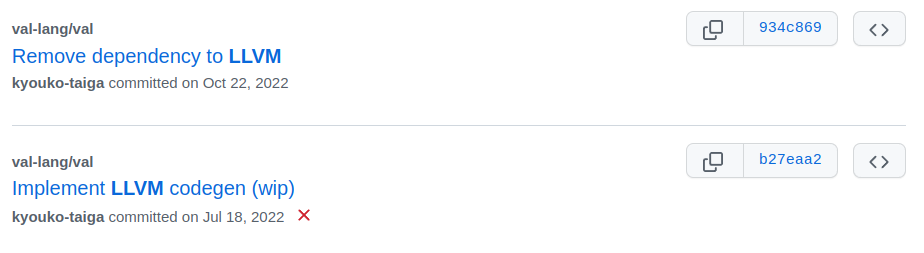
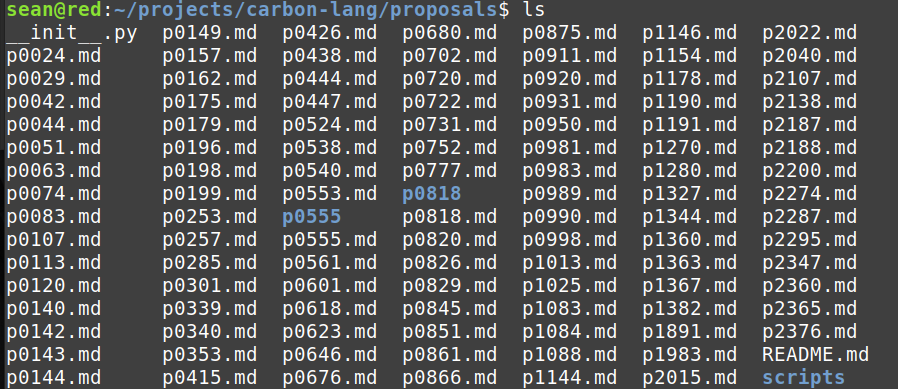
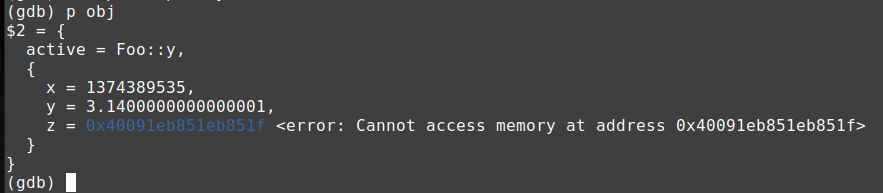

# New Circle notes

2022 has been dubbed [Year of the C++ Successor Languages](https://accu.org/journals/overload/30/172/teodorescu/). Everyone is talking about _successor languages_. What is a successor language?

* A language that has fewer defects/wrong defaults compared to C++.
* A language that has friendly features compared to C++.
* A language that tries to be safer, clearer and more productive than C++.
* A language that is broadly compatible with existing C++ code (somehow).

The successor language goals are good goals. But is it productive to invent all new compilers to achieve them? This project delivers the benefits of successor languages by evolving an existing C++ toolchain. For language designers this strategy has many advantages:

* The language is fully compatible with existing C++ code, by construction.
* There's always a working toolchain.
* You can focus on high-value changes, rather than reinventing everything.
* Developers can work on different features in parallel, because they aren't backed up waiting on the completion of critical subsystems (like code generation, interoperability, overloading, etc).

Many C++ detractors claim that the language is _inherently_ broken. That it's _inherently_ unsafe or _inherently_ slow to compile or _inherently_ hard to fix defects. These are content-free statements. There is nothing _inherent_ about software. Software does what it does, and with effort, can be made to do something new.

The techniques documented here extend C++ toolchains to **fix language defects** and make the language **safer** and **more productive** while maintaining **100% compatibility** with existing code assets.

[**carbon1.cxx**](carbon1.cxx) - [(Compiler Explorer)](https://godbolt.org/z/nb5WzdYhW)
```cpp
#pragma feature edition_carbon_2023
#include <string>
#include <iostream>

using String = std::string;

choice IntResult {
  Success(int32_t),
  Failure(String),
  Cancelled,
}

fn ParseAsInt(s: String) -> IntResult {
  var r : int32_t = 0;
  for(var c in s) {
    if(not isdigit(c)) {
      return .Failure("Invalid character");
    }

    // Accumulate the digits as they come in.
    r = 10 * r + c - '0';
  }

  return .Success(r);
}

fn TryIt(s: String) {
  var result := ParseAsInt(s);
  match(result) {
    .Success(var x)   => std::cout<< "Read integer "<< x<< "\n";
    .Failure(var err) => std::cout<< "Failure '"<< err<< "'\n";
    .Cancelled        => std::terminate();
  };
}

fn main() -> int {
  TryIt("12345");
  TryIt("12x45");
  return 0;
}
```

Which programming language is this? Parts look like C++: it includes familiar header files and uses C++'s standard output. Parts look like Rust or Carbon: it uses `fn` and `var` declarations, which are completely different from C++'s declarations, and it has choice types and pattern matching.

This example code is almost a perfect 1:1 copy of a [sample in the Carbon design document](
https://github.com/carbon-language/carbon-lang/tree/trunk/docs/design#choice-types
). It compiles with the Circle C++ toolchain, with [25 new features](#edition_carbon_2023) enabled. These new features are at the heart of the successor language goals. They make the language:

* **safer** by [disabling harmful implicit conversions](#no_implicit_integral_narrowing) and [initializing](#default_value_initialization) all objects,
* **easier to read** with a [clearer declaration syntax](#new_decl_syntax) and new [bracing requirements](#require_control_flow_braces),
* **more powerful** with new language entities like [choice types](#choice), [pattern matching](#pattern-matching), [interfaces](#interface) and [type erasure](#type-erasure-and-dyn), and
* **simpler** by disabling features that contribute to complexity, like [multiple inheritance](#no_multiple_inheritance) and [function overloading](#no_function_overloading).

This mix of features allows the toolchain to fulfill many choices of the the [Carbon language design](https://github.com/carbon-language/carbon-lang/tree/trunk/docs/design#language-design), not with a new compiler distinct from C++, but by evolving an existing C++ toolchain. By construction, the resulting [_edition_](#edition_carbon_2023) is fully compatible with existing C++ code.

The design tradeoffs of the Carbon project represent just one point on the Pareto front of the language design space. What is the right design for your organization and your project? Your language should embody your vision of best practice. Institutional users will shape the language so that it delivers the best experience for their engineers. The C++ toolchain can grow to serve different kinds of users with different requirements.

**The C++ of the future isn't just a language. It's a starting point for evolving programming towards greater safety, simplicity and productivity, while staying interoperable with existing C++ assets.**

## Table of contents

1. [Versioning with feature pragmas](#versioning-with-feature-pragmas)
    1. [To err is human, to fix divine](#to-err-is-human-to-fix-divine)
    1. [`pragma.feature` file](#pragmafeature-file)
    1. [`[edition_2023]`](#edition_2023)
    1. [Editions in Rust](#editions-in-rust)
    1. [`__future__` in Python](#__future__-in-python)
    1. [`[edition_carbon_2023]`](#edition_carbon_2023)
    1. [Pragma.feature philosophy](#pragmafeature-philosophy)
    1. [The case for evolver languages](#the-case-for-evolver-languages)
        * [Cppfront](#cppfront)
        * [Val](#val)
        * [Carbon](#carbon)
1. [Feature catalog](#feature-catalog)
    1. [`[adl]`](#adl)
    1. [`[as]`](#as)
    1. [`[choice]`](#choice)
        * [Pattern matching](#pattern-matching)
        * [Structured binding patterns](#structured-binding-patterns)
        * [Test patterns](#test-patterns)
        * [Designated binding patterns](#designated-binding-patterns)
        * [Other ways to access choice objects](#other-ways-to-access-choice-objects)
        * [Choice type requirements](#choice-type-requirements)
    1. [`[default_value_initialization]`](#default_value_initialization)
    1. [`[forward]`](#forward)
        * [std::forward is bad](#stdforward-is-bad)
        * [First-class forwarding](#first-class-forwarding)
    1. [`[interface]`](#interface)
        * [Interface definitions](#interface-definitions)
        * [Impls](#impls)
        * [Interface name lookup](#interface-name-lookup)
        * [Interfaces in templates](#interfaces-in-templates)
        * [Type erasure and `dyn`](#type-erasure-and-dyn)
        * [Type erasure and the heap](#type-erasure-and-the-heap)
        * [Value semantics containers](#value-semantics-containers)
    1. [`[new_decl_syntax]`](#new_decl_syntax)
        * [Function declarations](#function-declarations)
        * [Object declarations](#object-declarations)
    1. [`[no_function_overloading]`](#no_function_overloading)
    1. [`[no_implicit_ctor_conversions]`](#no_implicit_ctor_conversions)
    1. [`[no_implicit_enum_to_underlying]`](#no_implicit_enum_to_underlying)
    1. [`[no_implicit_floating_narrowing]`](#no_implicit_floating_narrowing)
    1. [`[no_implicit_integral_narrowing]`](#no_implicit_integral_narrowing)
    1. [`[no_implicit_pointer_to_bool]`](#no_implicit_pointer_to_bool)
    1. [`[no_implicit_signed_to_unsigned]`](#no_implicit_signed_to_unsigned)
    1. [`[no_implicit_user_conversions]`](#no_implicit_user_conversions)
    1. [`[no_implicit_widening]`](#no_implicit_widening)
    1. [`[no_integral_promotions]`](#no_integral_promotions)
    1. [`[no_multiple_inheritance]`](#no_multiple_inheritance)
    1. [`[no_signed_overflow_ub]`](#no_signed_overflow_ub)
    1. [`[no_user_defined_ctors]`](#no_user_defined_ctors)
    1. [`[no_virtual_inheritance]`](#no_virtual_inheritance)
    1. [`[no_zero_nullptr]`](#no_zero_nullptr)
    1. [`[placeholder_keyword]`](#placeholder_keyword)
    1. [`[require_control_flow_braces]`](#require_control_flow_braces)
    1. [`[safer_initializer_list]`](#safer_initializer_list)
    1. [`[self]`](#self)
    1. [`[simpler_precedence]`](#simpler_precedence)
    1. [`[switch_break]`](#switch-break)
    1. [`[template_brackets]`](#template_brackets)
        * [Abbreviated template arguments](#abbreviated-template-arguments)
    1. [`[tuple]`](#tuple)
1. [Research catalog](#research-catalog)
    1. [`[borrow_checker]`](#borrow_checker)
    1. [`[context_free_grammar]`](#context_free_grammar)
    1. [`[cyclone_pointers]`](#cyclone_pointers)
    1. [`[generic]`](#generic)
    1. [`[meta]`](#meta)
    1. [`[parameter_directives]`](#parameter_directives)
1. [Core extensions](#core-extensions)
    1. [Template parameter kinds](#template-parameter-kinds)
    1. [Overload sets as arguments](#overload-sets-as-arguments)
        * [Unqualified and qualified name lookup](#unqualified-and-qualified-name-lookup)
        * [Template arguments for overload sets](#template-arguments-for-overload-sets)
        * [Lifting lambdas over customization points](#lifting-lambdas-over-customization-points)
    1. [String constant operators](#string-constant-operators)
        * [String constant formatting](#string-constant-formatting)
    1. [Backtick identifiers](#backtick-identifiers)
1. [Metaprogramming](#metaprogramming)
    1. [Pack subscripts and slices](#pack-subscripts-and-slices)
    1. [Tuple subscripts and slices](#tuple-subscripts-and-slices)
    1. [Integer packs](#integer-packs)
    1. [Member pack declarations](#member-pack-declarations)
    1. [Multi-conditional operator](#multi-conditional-operator)
    1. [Circle Imperative Arguments](#circle-imperative-arguments)
    1. [Extending the language with traits and metafunctions](#extending-the-language-with-traits-and-metafunctions)
    1. [Reflection traits](#reflection-traits)
    1. [Pack traits](#pack-traits)
    1. [Type traits](#type-traits)
    1. [Non-type traits](#non-type-traits)
    1. [Universal traits](#universal-traits)

# Versioning with feature pragmas

> If we had an alternate C++ syntax, it would give us a "bubble of new code that doesn't exist today" where we could make arbitrary improvements (e.g., change defaults, remove unsafe parts, make the language context-free and order-independent, and generally apply 30 years' worth of learnings), free of backward source compatibility constraints.
> 
> -- Herb Sutter, [Cppfront Goals & History](https://github.com/hsutter/cppfront#goals-and-history)

We need to create "bubbles of new code" to add features and fix defects. But we don't actually need a new language to do this. I contend we don't _want_ a new language to do this. This section describes how to evolve C++ into whatever we imagine, without creating any discrete breaks. It can be an incremental, evolutionary process.

Per-file feature scoping allows language modification without putting requirements on the project's dependencies. We want each bubble of new code to be as small as possible, capturing only one independent feature.

C++ should not be versioned with command-line options, as those apply to the whole translation unit, including system and library dependencies not owned by the programmer. Command-line version allows us to only evolve the language so far. New syntax must fill the gaps in existing syntax. Defects cannot be fixed, because doing so may change the meaning of existing code. 

This section describes Circle's file-scope versioning. During lexing, each file is given its own active feature mask, initially cleared.
* `#pragma feature` - set fields in the active feature mask.
* `#pragma feature_off` - clear fields in the active feature mask.

Setting or clearing features _only effects the current file_. The active masks of all other files in the translation unit are unaffected.

[**features.cxx**](features.cxx) - [(Compiler Explorer)](https://godbolt.org/z/e3faaMTe8)
```cpp
// Enable four features:
// [interface] - Enables the dyn, interface, impl and make_dyn keywordcs.
// [tuple] - Enables new syntax for tuple expressions and types.
// [choice] - Enables the choice and match keywords.
// [self] - Retires 'this' and replaces it with the lvalue 'self'.
#pragma feature interface tuple choice self

// These files are included after the features have been activated, but are
// unaffected by them. Every file on disk gets its own feature mask.
#include <iostream>
#include <tuple>

struct Obj {
  void Inc(int inc) {
    // 'self' is new.
    self.x += inc;

    // Error, 'this' is disabled. That's new.
    // this->x -= inc;
  }
  int x;
};

// Choice types are new.
template<typename T, typename U>
choice Result {
  Ok(T),
  Err(U),
};

void ProcessChoice(Result<Obj, std::string> obj) {
  // Pattern matching is new.
  match(obj) {
    .Ok(auto obj)  => std::cout<< "Got the value "<< obj.x<< "\n";
    .Err(auto err) => std::cout<< "Got the error '"<< err<< "'\n";
  };
}

// Interfaces are new.
interface IPrint { 
  void print() const;
  std::string to_string() const;
};

// Impls are new.
template<typename T> requires (T~is_arithmetic)
impl T : IPrint {
  void print() const {
    std::cout<< T~string + ": "<< self<< "\n";
  }
  std::string to_string() const {
    return T~string + ": " + std::to_string(self);
  }
};

int main() {
  // Create choice objects by naming the active alternative.
  ProcessChoice(.Ok({ 5 }));
  ProcessChoice(.Err("An error string"));

  // Bring impl<int, IPrint> and impl<double, IPrint> into scope. This means
  // we can use unqualified member lookup to find the print and to_string 
  // interface methods.
  using impl int, double : IPrint;

  // Call interface methods on arithmetic types! That's new.
  int x = 100;
  x.print();

  double y = 200.2;
  std::cout<< y.to_string()<< "\n";

  // Dynamic type erasure! That's new.
  dyn<IPrint>* p1 = make_dyn<IPrint>(new int { 300 });
  dyn<IPrint>* p2 = make_dyn<IPrint>(new double { 400.4 });
  p1->print();
  std::cout<< p2->to_string()<< "\n";
  delete p1;
  delete p2;

  // Tuple expressions are new.
  auto tup = (1, "Two", 3.3);

  // Tuple types are new.
  using Type = (int, const char*, double);
  static_assert(Type == decltype(tup));
}
```
```
$ circle features.cxx
$ ./features
Got the value 5
Got the error 'An error string'
int: 100
double: 200.200000
int: 300
double: 400.400000
```

One miraculous line at the top of [**features.cxx**](features.cxx),
```
#pragma feature interface tuple choice self
```
enables a new world of functionality. 

1. [`[interface]`](#interface) - Enables the `dyn`, `interface`, `impl` and `make_dyn` keywords.
2. [`[tuple]`](#tuple) - Enables new syntax for tuple expressions and types.
3. [`[choice]`](#choice) - Enables the `choice` and `match` keywords.
4. [`[self]`](#self) - Retires `this` and replaces it with the lvalue `self`.

These changes won't conflict with any of the program's dependencies. The source file **feature.cxx** has its own _feature mask_, which controls:
* reserved words recognized
* new features enabled
* old features disabled
* language semantics changed

The `#pragma feature` directive adjusts a _feature mask_ which extends to the end of the **features.cxx** files. It _only_ effects that file. All other files included in the translation unit, either directly or indirectly from **features.cxx**, are unaffected by **features.cxx**'s feature mask, and they each have their own feature masks. Every file is versioned independently of every other file.

We can finally innovate without restriction and be secure in the knowledge that we aren't creating incompatibilities with our existing code.

Does the existence of per-file features mean each file is translated with a different "version" of the compiler? Definitely not. There is one compiler. The feature pragmas simply control if features are picked up in a region of text. This is classic monolithic compiler development. We have one type system and one AST. The goal is to incrementally evolve the language towards productivity, improved safety, readibility, simpler tooling, and so on, without introducing incompatibilities with project dependencies or requiring extensive training for developers.

Compiler warnings may detect a lot of conditions, but they're often turned off or ignored, because they detect things in lines of code that you don't own, and therefore don't care about. Per-file features let engineers select contracts that error when violated, scoped to their own source files. For example, by erroring on implicit narrowing, implicit widening, C-style downcasts, uninitialized automatic variable declarations, etc. Programs, or even just files, that deal with a public network or with user data, have a larger attack surface and may opt into more strict settings than processes that run only internally.

Importantly, we can use per-file features to _fix defects_ in the language. For example, [`[simpler_precedence]`](#simpler_precedence) adopts Carbon-style [operator silos](https://github.com/carbon-language/carbon-lang/tree/trunk/docs/design/expressions#precedence) to reduce bugs caused by programmers not considering operator precedence. Does `||` or `&&` bind with higher precedence? I know the answer, but not every engineer does. Not only does this error when operators from different silos are used within unparenthesized expressions, it effectively _changes the precedence_ of operators like bitwise AND, OR and XOR by making them bind more tightly than `==`, a peculiar mistake that has been with C/C++ for fifty years.

It's even in scope to replace the entire C++ grammar with a modern, name-on-the-left [context-free syntax](#context_free_grammar), which is parsable from a simple [PEG grammar](https://en.wikipedia.org/wiki/Parsing_expression_grammar). The point is, we don't have to go all-in at once. We can start work on features when they're needed and deploy them when they're ready. Unlike Herb Sutter's Cpp2 design, we don't need an all-new syntax, completely distinct from Standard C++, to introduce these bubbles of new code.

Proposals that aim to fix defects are usually rebuffed with comments like "we can't, because it would break or change the meaning of existing code." That's not true with feature pragmas. Only _your_ source files are effected by _your_ features pragmas.

### How are the features actually applied by the compiler? 

The translation unit is mapped to source locations, with one source location per token. When tokens are emitted from files into the translation unit, the active feature mask for that file is recorded at that token's source location. Because long runs of tokens will all share the same feature mask, the per-token feature masks are stored compactly with a sparse data set.

The compiler responds in different ways depending on the presence of features:

* When parsing the grammar for [first-class tuple types](#tuple) or for [`[simpler_precedence]`](#simpler_precedence) operator silos, the compiler checks the feature mask for the current source location before matching either the Standard C++ grammar or the feature's grammar.
* During tokenization, some identifiers are promoted to keywords. For example, [`[interface]`](#interface) causes the promotion of `interface`, `impl`, `dyn` and `make_dyn`.
* When enforcing semantic changes, the compiler checks for features at important source locations. For example, [`[no_integral_promotions]`](#no_integral_promotions) disables the usual arithmetic promotions. The compiler simply checks for that feature at the source location where the integral promotion would normally be performed.

### What sorts of things can be developed and deployed as features?

* [`[parameter_directives]`](#parameter_directives) - Parameter passing directives like `[in]`, `[out]`, `[move]` and so on. These are more declarative and hopefully more understandable than reference types.
* [`[default_value_initialization]`](#default_value_initialization) - Default initialization of automatic variables. `int x` shouldn't be uninitialized, unless escaped like `int x = void;` That's an easy fix.
* [`[no_integral_promotions]`](#no_integral_promotions) - Disabling implicit promotion of integer types to `int` before performing arithmetic.
* [`[no_signed_overflow_ub]`](#no_signed_overflow_ub) - Disabling undefined behavior for signed arithmetic overflow. This UB provides a poison state for compiler optimizations, but it's also a known source of program misbehavior. Turning it off, while also turning on features related to detecting overflow phenomena, can reduce bugs.
* [`[generic]`](#generic) - A `generic` entity which parallels `template` but performs early type-checking. It disables partial and explicit specializations and requires full type annotation on its generic parameters. You can envision class generics, function generics, choice generics, interface generics and so on. This feature relies on the presence of [`[interface]`](#interface).
* [`[borrow_checker]`](#borrow_checker) -  `ref` and `refmut` types for invasive borrow checking. A radical addition to C++, something that most people think is impossible. But what's really impossible? Extending C++ with memory safety semantics, or somehow bridging C++ and Rust type systems and ASTs to allow near-seamless interop? With a monolithic compiler, there is one type system and one AST. It's easier to extend one language than it is to bridge two very different toolchains.

The list can go on and on. Envision extending the productive life of C++ by decades using this approach. New cities are built on the ruins of old cities. You can incrementally modernize infrastructure without displacing everyone working and living there. The fear of introducing incompatibilities has killed creativity in C++ language design. But this fear of incompatibility is almost entirely the product of versioning translation units all at once. If a user or organization is ready to opt into an extension, they should be able to do that. It won't break their dependencies.

## To err is human, to fix divine

C++ has a number of "wrong defaults," design decisions either inherited from C or specific to C++ which many programmers consider mistakes. They may be counter-intuitive, go against expected practice in other languages, leave data in undefined states, or generally be prone to misuse. 

Here's a non-exhaustive list of C++ "wrong defaults":

1. [Uninitialized automatic variables.](http://eel.is/c++draft/dcl.init#general-7.3)
1. [Integral promotions.](http://eel.is/c++draft/conv.prom)
1. [Implicit narrowing conversions.](http://eel.is/c++draft/conv.integral#3)
1. [Switches should break rather than fallthrough.](http://eel.is/c++draft/stmt.switch#6)
1. [Operator precedence is complicated and wrong.](http://eel.is/c++draft/expr.compound#expr.bit.and)
1. [Hard-to-parse declarations and the most vexing parse.](http://eel.is/c++draft/dcl.pre#nt:simple-declaration)
1. [Template brackets `< >` are a nightmare to parse.](http://eel.is/c++draft/temp.names#nt:template-argument-list)
1. [Forwarding parameters and `std::forward` are error prone.](http://eel.is/c++draft/temp.deduct#call-3)
1. [Braced initializers can choose the wrong constructor.](http://eel.is/c++draft/dcl.init.list#2)
1. [0 shouldn't be a null pointer constant.](http://eel.is/c++draft/expr#conv.ptr-1)
1. [`this` shouldn't be a pointer.](http://eel.is/c++draft/expr.prim.this#1)

We should fix all these "wrong defaults." A system that cannot fix its mistakes is a broken system. The feature pragma mechanism allows us to patch the language for new code, and keep the existing syntax and semantics of the existing language for code already written.

Circle already has feature pragmas that target each of these defects. By keeping the scope of our features narrow, we make them easy to document and to think about. What they do is evident from their names:

1. [`[default_value_initialization]`](#default_value_initialization) - [Uninitialized automatic variables.](http://eel.is/c++draft/dcl.init#general-7.3)
1. [`[no_integral_promotions]`](#no_integral_promotions) - [Integral promotions.](http://eel.is/c++draft/conv.prom)
1. [`[no_implicit_integral_narrowing]`](#no_implicit_integral_narrowing) - [Implicit narrowing conversions.](http://eel.is/c++draft/conv.integral#3)
1. [`[switch_break]`](#switch-break) - [Switches should break rather than fallthrough.](http://eel.is/c++draft/stmt.switch#6)
1. [`[simpler_precedence]`](#simpler_precedence) - [Operator precedence is complicated and wrong.](http://eel.is/c++draft/expr.compound#expr.bit.and)
1. [`[new_decl_syntax]`](#new_decl_syntax) - [Hard-to-parse declarations and the most vexing parse.](http://eel.is/c++draft/dcl.pre#nt:simple-declaration)
1. [`[template_brackets]`](#template_brackets) - [Template brackets `< >` are a nightmare to parse.](http://eel.is/c++draft/temp.names#nt:template-argument-list)
1. [`[forward]`](#forward) - [Forwarding parameters and `std::forward` are error prone.](http://eel.is/c++draft/temp.deduct#call-3)
1. [`[safer_initializer_list]`](#safer_initializer_list) - [Braced initializers can choose the wrong constructor.](http://eel.is/c++draft/dcl.init.list#2)
1. [`[no_zero_nullptr]`](#no_zero_nullptr) - [0 shouldn't be a null pointer constant.](http://eel.is/c++draft/expr#conv.ptr-1)
1. [`[self]`](#self) - [`this` shouldn't be a pointer.](http://eel.is/c++draft/expr.prim.this#1)

Not only can we fix broken aspects of the language, we can fuse off access to features that aren't wanted anymore, for any reason. [`[edition_carbon_2023]`](#edition_carbon_2023) fuses off function overloading, which is perhaps the most complex part of C++. The compiler still knows how to perform function overloading, and it needs to know to compile your project's dependencies, but the ability to declare overloads while the feature is active is denieds. There is concern about C++ becoming an ever-increasing ball of complexity. Judicious pruning of features that aren't wanted or have been superceded is possible in new [editions](#edition_2023).

## **pragma.feature** file

**I don't want you to mark files with pragmas.** The textual pragma is for demonstration purposes and to give curious programmers an easy way to probe the effects of each feature. Marking up every source file with feature pragmas creates its own kind of dependency issue: in most cases you'd prefer a way to keep them all in sync. There's a solution:

* For each source file opened, Circle looks in that file's folder for a file named **pragma.feature**. Each line of this file indicates one feature. The feature mask of each file is initialized to the features listed in **pragma.feature**.

When a project lead says it's time to upgrade to a new feature (and this may be a frequent thing, as fine-grained safety-related features get deployed on a rapid schedule), a build engineer can simply insert a new line in each `pragma.feature` file in the folders of interest, and go through the compile/test/edit cycle until the issues are resolved. Push those changes and you've updated your project to satisfy the new set of requirements. This is a path to strengthen your confidence _in existing code_ by increasing strictness in the language.

What's the migration vision for Carbon or Cpp2? Rewrite all your code in Carbon or Cpp2! I don't want people to have to rewrite anything. Instead, enable one feature at a time and keep at your compile/test cycle until you've resolved any conflicts created by these new "bubbles of code."

## `[edition_2023]`

To deliver shared C++ experiences, users should continue to expect features bundled in big packages, as C++11, 14, 17 and 20 have been. I'm calling these bundles editions.

`#pragma feature edition_2023` - Enable all edition 2023 features.

An edition is selection of low-controversy features that language developers consider to represent "best practice." The first Circle edition is `edition_2023`. It includes features which improve the richness and consistency of the language:

1. [`[adl]`](#adl) - Disables argument dependent lookup. Introduce the `adl` keyword to opt in.
1. [`[as]`](#as) - Enables the _as-expression_ for casting.
1. [`[choice]`](#choice) - Choice types and pattern matching.
1. [`[forward]`](#forward) - `forward` parameter directive and _forward-expression_.
1. [`[interface]`](#interface) - Interfaces and type erasure.
1. [`[placeholder_keyword]`](#placeholder_keyword) - Reserve `_` as a placeholder object name.
1. [`[template_brackets]`](#template_brackets) - Replace `< >` _template-argument-list_ with the context-insensitive braced set `!< >`.
1. [`[tuple]`](#tuple) - Language syntax for tuple types and tuple expressions.
1. [`[self]`](#self) - Replace `this` pointer with `self` lvalue.

It includes features which improve the safety of the language:

1. [`[default_value_initialization]`](default_value_initialization) - Don't allow uninitialized objects; instead, value-initialize them.
1. [`[no_implicit_floating_narrowing]`](#no_implicit_floating_narrowing) - Disallow potentially-narrowing implicit floating-point conversions.
1. [`[no_implicit_integral_narrowing]`](#no_implicit_integral_narrowing) - Disallow potentially-narrowing implicit integral conversions.
1. [`[no_implicit_pointer_to_bool]`](#no_implicit_pointer_to_bool) - Disallow implicit pointer to bool conversions.
1. [`[no_implicit_signed_to_unsigned]`](#no_implicit_signed_to_unsigned) - Disallow signed to unsigned implicit arithmetic conversions.
1. [`[no_integral_promotions]`](#no_integral_promotions) - Don't promote integral types to `int` print to arithmetic. This has the effect of enabling arithmetic on sub-`int` types.
1. [`[no_zero_nullptr]`](#no_zero_nullptr) - The `0` numeric literal cannot be used to indicate `nullptr`. The user must write out `nullptr`.
1. [`[safer_initializer_list]`](#safer_initializer_list) - Fix the _initializer-list-ctor_ ambiguity defect.
1. [`[simpler_precedence]`](#simpler_precedence) - Reorganize binary operators from precedence tiers to operator silos.
1. [`[switch_break]`](#switch_break) - Switch cases break by default rather than falling through to the next case.

Programs with large attack surfaces can opt into additional safety-related features to flush out bugs.

## Editions in Rust

Rust has supported a [similar edition system](https://doc.rust-lang.org/edition-guide/editions/index.html) since version 1.0 was released in 2015. 

> The most important rule for editions is that crates in one edition can interoperate seamlessly with crates compiled in other editions. This ensures that the decision to migrate to a newer edition is a "private one" that the crate can make without affecting others.
>
> -- [_Editions do not split the ecosystem_](https://doc.rust-lang.org/edition-guide/editions/index.html#editions-do-not-split-the-ecosystem)

Even in the absence of crates, Circle's feature pragmas deliver the same value. The headers and translation unit files (.cpp/.cxx files) in a folder are conceptually like a crate, and they are often linked together. The [**pragma.feature** file](#pragmafeature-file) specifies the edition for that folder's source code. As with Rust's editions, the decision to migrate to a new edition does not affect the source in other folders.

## `__future__` in Python

Python has a similar mechanism for easing modules into using new features. It can import _features_ from the [`__future__` module](https://docs.python.org/3/library/__future__.html).

> The future statement is intended to ease migration to future versions of Python that introduce incompatible changes to the language. It allows use of the new features on a per-module basis before the release in which the feature becomes standard.
>
> A future statement is recognized and treated specially at compile time: Changes to the semantics of core constructs are often implemented by generating different code. It may even be the case that a new feature introduces new incompatible syntax (such as a new reserved word), in which case the compiler may need to parse the module differently. Such decisions cannot be pushed off until runtime.
>
> -- [Future statements](https://docs.python.org/3/reference/simple_stmts.html#future-statements)

```python
$ python3
Python 3.8.10 (default, Mar 15 2022, 12:22:08) 
[GCC 9.4.0] on linux
Type "help", "copyright", "credits" or "license" for more information.
>>> from pprint import pprint
>>> import __future__
>>> pprint(__future__.all_feature_names)
['nested_scopes',
 'generators',
 'division',
 'absolute_import',
 'with_statement',
 'print_function',
 'unicode_literals',
 'barry_as_FLUFL',
 'generator_stop',
 'annotations']
```

Like Circle, Python uses fine-grained versioning to package small, self-contained changes from the base language. For example, the [future division statement](https://peps.python.org/pep-0238/), `from __future__ import division`, changes the semantics of the `x/y` operator to return the "true division," introducing a new operator, `x//y`, that provides "floor division." Just making this change without versioning through `__future__` would change the meaning of existing code, which expects the `x/y` operator to perform "floor division" when given integral operands.

## `[edition_carbon_2023]`

Circle implements a collection of feature pragmas that allow it to look and operate like the language described in the [Carbon design documents](https://github.com/carbon-language/carbon-lang/tree/trunk/docs/design#language-design). This is not an exact recreation of that project. This is an attempt to cover the major design points in a **single C++ toolchain**, rather than writing a completely new compiler.

`[edition_carbon_2023]` includes all features from [`[edition_2023]`](#edition_2023). It builds on these by activating:

1. [`[new_decl_syntax]`](#new_decl_syntax) - [Carbon uses `var` to declare objects.](https://github.com/carbon-language/carbon-lang/tree/trunk/docs/design#variable-var-declarations)
1. [`[require_control_flow_braces]`](#require_control_flow_braces) - [Carbon requires braces after control flow statements.](https://github.com/carbon-language/carbon-lang/blob/trunk/proposals/p0623.md)
1. [`[no_function_overloading]`](#no_function_overloading) - [Carbon does not support funciton overloading.](https://github.com/carbon-language/carbon-lang/tree/trunk/docs/design#inheritance) Instead, it relies on [interfaces](#interface) to dispatch functions based on a receiver type.
1. [`[no_multiple_inheritance]`](#no_multiple_inheritance) - [Carbon does not support multiple inheritance.](https://github.com/carbon-language/carbon-lang/tree/trunk/docs/design#inheritance)
1. [`[no_user_defined_ctors]`](#no_user_defined_ctors) - [Carbon does not support C++ constructors.](https://github.com/carbon-language/carbon-lang/tree/trunk/docs/design#class-functions-and-factory-functions)
1. [`[no_virtual_inheritance]`](#no_virtual_inheritance) - [Carbon does not support virtual inheritance.](https://github.com/carbon-language/carbon-lang/blob/trunk/docs/design/classes.md#virtual-base-classes)

This is not an exhaustive catalog of differences between Carbon's capabilities and C++'s. However, the feature pragma design allows a C++ toolchain to very quickly transform to accommodate design ideas as they roll out. 

## Pragma.feature philosophy

### This creates incentives for stakeholders to contribute to the C++ ecosystem

Big companies have software architects, principal scientists and directors of research who opine about software engineering and organize meetups and attend conferences and submit standardization proposals, all with the remote hope that an international committee adopts their preferences, so that a PDF gets amended, and compilers follow suit, and they can see their engineering preferences finally practiced back in their own organizations. Instead, why don't these companies just go build the features they want and use them within their own organizations?

Organizations and their software architects can control their own destiny. There is a roadmap for exercising creativity in language technology:

1. Conceptualize the feature
1. Build the feature
1. Test the feature
1. Deploy the feature
1. Upstream the feature

The C++ monthly proposal mailing can remain intact. But now, contributors have a path for implementing and deploying features within their organizations, independently of the proposal process. Features can be submitted for ISO's blessing, an imprimatur which may mean much or little to different users.

Institutional users employ language opiners, sponsor and send workers to conferences and contribute financial and human resources to tooling projects. Why do they do this? Because they believe there's an economic interest in maintaining and advancing language technology. There's value at stake, yet by being continually thwarted by a committee that can't get anything through, **companies are leaving money on the table**. Empowering institutional users to control their own destiny will allow them to reap the bounty of their investment.

**If C++ is to continue to thrive far into the future, it needs to be responsive to economic demands.**

### Will this cause an explosion of features, and will the C++ community crumble like the Tower of Babel? 

No, because cost/benefit is a real thing. If your project has adopted so many extensions that a new hire takes three months to get up to speed, you're paying three months salary per head for those features. If your project is super special and the benefits are worth the costs, then great. If not, economics will scale down the features you're using. The feature system gives options when before there were none:

1. Use Standard C++, or
1. Use only the latest _edition_ set of features, or
1. Use the latest _edition_ plus enhancements.

Since cost/benefit differs for every project, let's leave these choices to project leads. They represent the stakeholders in the project and should be empowered to make an informed choice.

A language designer isn't the arbiter of right and wrong. It is fruitless to argue which language got which defaults "right" or "wrong." Different projects have different requirements. The mature position is to leave choices open to your users, so they can select features that have the appropriate trade-offs for their situation.

## The case for evolver languages

> Improving C++ to deliver the kind of experience developers expect from a programming language today is difficult in part because C++ has decades of technical debt accumulated in the design of the language. It inherited the legacy of C, including textual preprocessing and inclusion. At the time, this was essential to C++'s success by giving it instant and high quality access to a large C ecosystem. However, over time this has resulted in significant technical debt ranging from integer promotion rules to complex syntax with "the most vexing parse".
>
> -- [Difficulties improving C++](
https://github.com/carbon-language/carbon-lang/blob/trunk/docs/project/difficulties_improving_cpp.md)

The claim that the history of design choices in C++ represent an insurmountable technical debt is what's pushing interest in successor languages. But I don't think it's true. The responsibility for supporting ancient and strange behaviors should not burden ordinary developers. It only has to be an issue for toolchain developers. Software is flexible. Software is plastic. I don't see technical debt here. I see a continually-improving language that year by year fixes its old mistakes, adds desired features, and improves safety, clarity and expresiveness.

> Be mindful of legacy. Globally, there may be as many as 50 billion lines of C++ code. Any evolution of Carbon that fails to account for human investment/training and legacy code, representing significant capital, is doomed from the start.
>
> -- [Software and language evolution](
https://github.com/carbon-language/carbon-lang/blob/trunk/docs/project/goals.md#software-and-language-evolution)

How do you honor the 50 billion lines of revenue-generating C++ code that exists now? 
* First, guarantee source compatibility, something not possible with separate toolchain successor languages.
* Second, provide a reasonable plan for strengthening existing code with features that represent best practice: update [**pragma.feature**](#pragmafeature-file), one feature at a time, and resolve build issues until all files compile and all tests pass.

As a language developer, I always want to have a working toolchain. Similarly, as an application developer, you always want to have a working application. A feature-by-feature migration keeps you close to home. Rewriting your program in Cppfront, Val or Carbon pushes you out to terra incognita.

| Language  | Lines of code  | Has compiler? |
| --------- | -------------- | ------------- |
| Cppfront  | 12,000         | ❌            |
| Val       | 27,000         | ❌            |
| Carbon    | 42,000         | ❌            |
| Circle    | 282,000        | :heavy_check_mark: |

It's good to leverage an existing toolchain. It's better to have a working compiler than not to have one. By building on Circle, I enjoyed a huge headstart over the successor language projects, which started from scratch. Every day I had a working toolchain. Every day I could evaluate the merits of features, test how they interacted with standard library code, and discard ones that felt uninspiring in practice.

### Cppfront

[Cppfront](https://github.com/hsutter/cppfront) is implemented as a preprocessor pass. Function and object declarations that conform to the Cpp2 grammar are recognized by the preprocessor, parsed, and lowered to C++. All Standard C++ is passed-through without modification. The idea is to translate Cpp2 to C++, marking up functions with constraints that are compatible with Standard C++.

One of the big problems with this design is that **it doesn't allow new language entities**. Circle introduces [choice](#choice) types and [interfaces](#interface). Cppfront can't do anything like that. Since it's not a compiler, it doesn't control template instantiation, so wouldn't be able to instantiate new language entities inside dependent contexts.

Another big problem is that it doesn't understand [overload resolution](http://eel.is/c++draft/over.match) or [implicit conversion sequences](http://eel.is/c++draft/over.best.ics), so it can't reliably modify language semantics, like Circle does with [`[no_implicit_user_conversions]`](#no_implicit_user_conversions), [`[no_implicit_pointer_to_bool]`](#no_implicit_pointer_to_bool), and [`[as]`](#as).

Since it doesn't examine its C++ dependencies, it's impossible to introspect types with Cppfront. Circle provides [reflection traits](#reflection-traits), which yield packs of entities describing enum types, class types, functions types, class specializations, and so on.

Investing in a compiler frontend is necessary if you want the flexibility to realize your language design.

### Val

[Val](https://github.com/val-lang/val) is a language all about [_mutable value semantics_](https://www.jot.fm/issues/issue_2022_02/article2.pdf). I like that this research project claims to be about one thing. If it can demonstrate that its flavor of mutable value semantics is both expressive and safe, that would be useful. Even a negative result would be useful.

The Val compiler, on the other hand, doesn't focus on mutable value semantics. It chooses to reinvent everything: a different lexer/preprocessor, a different syntax, different form of operator overloading, a different form of generics. None of these things have anything to do with mutable value semantics. These things are a distraction. All of them put more burden on the compiler's developers.

Changing everything hurts the scientific proposition. If Val's authors adopted C++ and just added a `[mutable_value_semantics]` feature (in the way a [`[borrow_checker]`](#borrow_checker) feature could be introduced), programmers could experiment with the ownership model _without learning an entirely new language_. The Val plan raises the barrier of entry so high that only true believers will invest the effort to learn to use.

Deploying Val as a separate toolchain as opposed to a C++ extension creates a high bar for the language's own authors. There is no working Val compiler. There's no path for ingesting C++ dependencies. There's no Val standard library. There's no system-level language facilities for writing a standard library. And there's no code generator.



The authors started work on LLVM code generation, only to remove it three months later. LLVM has a steep learning curve. You can be defeated by it. You can be defeated by many demands of compiler engineering. What is their option now? Val will try emitting C++ code for transpilation instead of emitting LLVM IR. That's easier in the short run, but much harder in the long run. LLVM exists for a reason. 

It's hard to pursue research when you're battling the technical demands of tooling. If the authors had decided to extend another toolchain (not necessarily a C++ toolchain, there's Java, C#, Swift, Go, etc), they wouldn't be fighting all battles at once. They'd on a faster path to implementing mutable value semantics and deploying a compiler to users for feedback.

### Carbon

[Carbon](https://github.com/carbon-language/carbon-lang) is the successor language effort with a lot of staffing, experience and investment behind it. Its design principles motivated many of Circle's new feature pragmas, bundled together in [`[edition_carbon_2023]`](#edition_carbon_2023).

Carbon has stuck down some of C++'s most complicated aspects:
* [No C++ exception handling.](https://github.com/carbon-language/carbon-lang/blob/trunk/docs/project/principles/error_handling.md#applications-of-these-principles)
* [No function overloading.](https://github.com/carbon-language/carbon-lang/blob/trunk/docs/project/principles/static_open_extension.md#principle)
* [No constructors.](https://github.com/carbon-language/carbon-lang/blob/trunk/docs/design/classes.md#constructors)
* [No multiple inheritance.](https://github.com/carbon-language/carbon-lang/blob/trunk/docs/design/classes.md#polymorphic-types)
* [No variadic templates.](https://github.com/carbon-language/carbon-lang/blob/trunk/docs/design/generics/goals.md#template-use-cases-that-are-out-of-scope)

With much of C++'s foundation gone, how will Carbon achieve a high level of interoperability? As a separate toolchain, I don't think it's possible. 

Overload resolution is a crucial part of C++. You can't use any Standard Library types or algorithms without it. Everything is overloaded. Carbon doesn't do overload resolution. How does a Carbon code call into C++ code? That overload resolution knowledge has reside somewhere.

In my experience, an architecture with two separate type systems and two separate ASTs will prove irreconcilable. 

Suppose the Carbon compiler interfaces with an existing toolchain like Clang. It can rely on Clang to find the best viable candidate for a function call. But now Clang needs to know about the template and function arguments provided to the call, which means it needs to know about Carbon. If a call to a Carbon function is instantiated from a C++ template compiled by Clang, Clang has to know about that Carbon function. So you'd "teach" Clang about Carbon by extending Clang's type system and AST to support the features in Carbon that aren't in C++. You'd have to teach it about late-checked generics and [interfaces](#interface) and [choice types](#choice) and [pattern matching](#pattern-matching).

**In effect, although you start with a separate toolchain, you end up with a single toolchain.** Either evolve the Carbon compiler into a C++ compiler, or evolve the C++ compiler into a Carbon compiler. 

Is there a way to make a separate toolchain really work? That hasn't been demonstrated. Carbon's [C++ interoperability goals](https://github.com/carbon-language/carbon-lang/blob/trunk/proposals/p0175.md) are vague. There's no classification as to what parts of C++ are supported and what parts aren't. There's no Carbon compiler, so there's no way to see it ingesting C++ dependencies and emitting C++-compatible binaries. There's no Carbon standard library and there's no system-level language facilities to build one. If the Carbon team wants to deploy a compiler, I anticipate that they'll do what I did with Circle: extend a C++ compiler with Carbon-like features and call that Carbon.

[](https://github.com/carbon-language/carbon-lang/tree/trunk/proposals)

In my opinion, the real value in Carbon is the big folder of proposals submitted by team members. These are numbered like C++ proposals. Many of them describe fine-grained, self-contained features similar to Circle's feature pragmas. For example, [P0845](https://github.com/carbon-language/carbon-lang/blob/trunk/proposals/p0845.md) describes _as-expressions_, already in Circle as [`[as]`](#as). These proposals can be immediately implemented in an existing C++ toolchain and start gathering usage experience. Carbon's missing compiler is blocking the deployment of Carbon's ideas.

Compared to C++, Carbon is a very restrictive language. Can C++ programmers remain productive after moving to Carbon? Nobody knows. We need to gather experience. And the way to do that is to launch a compiler and get developres to try it. Circle can be amended quickly. The fine-grained treatment of features means it's easy to explore a continuum of language candidates. Building on an existing platform gets your technology into the hands of users quickly and inexpensively.

I believe the best way to evolve C++ is to hang features off a C++ compiler. It's easy for people to reject this way as inelegant. They'll say they want something "designed from the ground up." This is an irrelevant philosophical objection. Humans evolved from synapsids, which evolved from bony fish, which evolved from bags of goo that exhibited bilateral symmetry, which evolved from single-celled prokaryotes. We are built on a platform billions of years old. The C/C++ platform is only fifty years old. It has many years of productive use ahead of it.

# Feature catalog

## `[adl]`

* Reserved words: `adl`
* Interactions: [Overload sets as arguments](#overload-sets-as-arguments)
* Editions: [`[edition_2023]`](#edition_2023)

The `[adl]` feature disables calling named functions found [argument-dependent lookup](https://eel.is/c++draft/basic.lookup.argdep) (and [here](https://en.cppreference.com/w/cpp/language/adl)). Following the principle of least surprise, if you turn on this feature, _the meaning of your code will not change_, but it may become ill-formed. That is, ADL is still performed when calling a function by its unqualified name, but if a function found by ADL, rather than by ordinary unqualified name lookup, is the best viable candidate, then the program is ill-formed.

Use the `adl` reserved word before the unqualified function name to re-enable calling ADL candidates.

[**adl1.cxx**](adl1.cxx)
```cpp
#pragma feature adl
#include <tuple>

int main() {
  auto tup = std::make_tuple(1, 2.2, "Three");

  // Can call with qualified name lookup.
  auto x1 = std::get<0>(tup);

  // OK. the adl keyword enables the ADL candidate.
  auto x2 = adl get<0>(tup);

  // Error: [adl]: adl candidate called without adl token before unqualified name
  auto x3 = get<0>(tup);
}
```
```
$ circle adl1.cxx
error: adl1.cxx:14:19
[adl]: adl candidate called without adl token before unqualified name
  best viable candidate int& std::get(std::tuple<int, double, const char*>&) noexcept was chosen by adl
  function declared at /usr/include/c++/10/tuple:1299:5
  auto x3 = get<0>(tup); 
                  ^
```

* `x1`'s initializer compiles, because the function called was found with _qualified name lookup_, meaning the specific namespace was provided.
* `x2`'s initializer compiles, because although the function called was found with argument-dependent lookup, the unqualified function name was preceded by the `adl` keyword. 
* `x3`'s initializer is ill-formed, because the function called was found with ADL. The error message indicates the problem, suggests a fix (use the `adl` token before the unqualified name), and shows the specific function, including its source location, that the compiler attempted to call.

ADL is a powerful but unpredictable tool. It's main drawback is that you don't really know when you're relying on it to find your functions. Most functions are called with unqualified lookup. There's nothing textual to signal that this complex aparatus is at work. The `adl` opt-in fixes that: now every expression that calls an ADL candidate is prefixed by the `adl` keyword, making it easily searchable. Additionally, the compiler errors point out the namespace of the best viable candidate, so you can qualify function names yourself, rather than relying on ADL to do so.

[**adl2.cxx**](adl2.cxx)
```cpp
#pragma feature adl

namespace ns {
  struct obj_t { 
    void f();

    void func(int);      // #1
  };

  void func(obj_t obj);  // #2
}

void ns::obj_t::f() {
  // Error: [adl]: no arguments in adl call have associated namespaces.
  adl func(1, "Hello world");

  // Tries to call #1
  // Error: cannot convert lvalue ns::obj_t to int.
  func(*this);

  // [basic.lookup.argdep] dictates that if unqualified 
  // lookup finds any of:
  // * declaration of a class member, or
  // * function declaration inhabiting a block scope, or
  // * declaration not of a function or function template
  // then ADL is not used.
  // But we used the adl keyword, meaning we really want ADL!
  // Therefore, when any of these three things is found by
  // unqualified lookup, the compiler discards the declaration 
  // and goes straight to ADL.

  // Calls #2 successfully.
  adl func(*this);
}
```
```
$ circle adl2.cxx
error: adl2.cxx:15:11
[adl]: no arguments in adl call have associated namespaces
  adl func(1, "Hello world"); 
          ^

error: adl2.cxx:18:8
cannot convert lvalue ns::obj_t to int
  ns::obj_t declared at adl2.cxx:4:3
  func(*this); 
       ^
```

Like the [`[forward]`](#forward) extension, `[adl]` intends to prevent incorrect usage of the feature. If there are no [associated entities](https://eel.is/c++draft/basic.lookup.argdep#3) for any of the function arguments, no attempt to call a function is made and the program is ill-formed. Because there are no associated entities, there is nothing for ADL to do, and therefore the prefix was used in error. This test only occurs at definition; if the call has any dependent arguments, then ADL is assumed to occur at instantiation, and the call compiles.

The [rules for ADL](https://eel.is/c++draft/basic.lookup.argdep#1) state that if unqualified name lookup finds any of:
* declaration of a class member, or  
* function declaration inhabiting a block scope, or  
* declaration not of a function or function template,  

then ADL is not used. But the user explicitly opted in to adl with the prefix. As a convenience, the feature responds by discarding the disqualifying declaration and going straight to argument-dependent lookup.

This convenience is illustrated by the failed call to #1 and the successful call to #2. On both lines, the user intends to call #2. But on the first try, unqualified lookup finds the member function `obj_t::func`. This disqualifies ADL, leaving the candidate only with that member function. The compiler can't convert `obj_t` to `int` so translation fails. On the second try, the `adl` prefix tells the compiler to discard the disqualifying member function declaration and use ADL anyways.

The obligatory `adl` prefix makes the feature much safer while drawing attention to its use. All uses in your code base become easily searchable.

[**adl3.cxx**](adl3.cxx)
```cpp
#pragma feature adl

namespace ns {
  struct obj_t { };
  void func(obj_t obj);   // #1
}

int main() {
  // Ok. Unqualified lookup fails to find any declarations. ADL is not 
  // disqualified, so will be attempted at the point of the call.
  auto lift1 = [] func;

  // Error. [adl]: adl candidate called without adl token before unqualified name
  // The best viable candidate was found by ADL, but the adl prefix wasn't 
  // used.
  lift1(ns::obj_t());
  
  // A declaration to disqualify ADL, from [basic.lookup.argdep]/1.
  using func = int;       // #2

  // Error: func finds #2, which is not a function, so disqualifies 
  // ADL. The lifting lambda cannot be created, because its set of
  // candidates is empty.
  auto lift2 = [] func;

  // Ok. func finds #2, which is not a function. But because the adl prefix
  // is used, that declaration is discarded. The lifting lambda is created
  // ADL-capable. The actual lookup is deferred until its used.
  auto lift3 = [] adl func;

  // lift2 performs ADL at the point of the call. This is allowed, because
  // we used the adl token at its creation.
  lift3(ns::obj_t());
}
```
```
$ circle adl3.cxx
error: adl3.cxx:16:8
[adl]: adl candidate called without adl token before unqualified name
  best viable candidate void ns::func(ns::obj_t) was chosen by adl
  function declared at adl3.cxx:5:8
  lift1(ns::obj_t()); 
       ^

error: adl3.cxx:24:23
argument func is not an overload set
  auto lift2 = [] func; 
                      ^
```

[Overload sets as arguments](#overload-sets-as-arguments) introduces the _lifting lambda_, a new language entity, which may invoke argument-dependent lookup at the point of call. The `adl` prefix works the same way for creating lifting lambdas as it does for calling functions by unqualified names.

* If the lifting lambda is created without the `adl` prefix and it calls an ADL candidate, the program is ill-formed.
* If the lifting lambda finds a disqualifying declaration with unqualified lookup, ind it has the `adl` prefix, the declaration is discarded and the lifting lambda will perform ADL at the point of call.

Because the lambda's arguments are not provided with the `adl` prefix at the lambda's creation, but rather deferred until a call, the compiler does not enforce the requirement that at least one of the function arguments have associated entities. The caller may have received the lambda generically; since it doesn't know how the lambda was created, it's not responsible for parsimonious usage. 

## `[as]`

* Reserved words: `as`
* Editions: [`[edition_2023]`](#edition_2023)

The `as` keyword enables the _as-expression_ operator with the precedence of _postfix-expression_. The _as-expression_ has two uses:

1. _expr_ `as` _type-id_ - This is shorthand for `static_cast<`_type-id_`>(`_expr_`)`.
1. _expr_ `as _` - This enables implicit conversions which have been disabled by other feature pragmas. This meaning is borrowed from Rust's [as keyword](https://doc.rust-lang.org/std/keyword.as.html): 
    
    > as can also be used with the _ placeholder when the destination type can be inferred. Note that this can cause inference breakage and usually such code should use an explicit type for both clarity and stability. 

    This form interacts with these restrictions:
    
    * [`[no_implicit_ctor_conversions]`](#no_implicit_ctor_conversions)
    * [`[no_implicit_enum_to_underlying]`](#no_implicit_enum_to_underlying)
    * [`[no_implicit_floating_narrowing]`](#no_implicit_floating_narrowing)
    * [`[no_implicit_integral_narrowing]`](#no_implicit_integral_narrowing)
    * [`[no_implicit_pointer_to_bool]`](#no_implicit_pointer_to_bool)
    * [`[no_implicit_signed_to_unsigned]`](#no_implicit_signed_to_unsigned)
    * [`[no_implicit_user_conversions]`](#no_implicit_user_conversions)
    * [`[no_implicit_widening]`](#no_implicit_widening)

[**as.cxx**](as.cxx) - [(Compiler Explorer)](https://godbolt.org/z/d6MoMbK5M)
```cpp
#pragma feature as        // Permit any implicit conversion with "x as _".
void f_short(short x);
void f_int(int x);
void f_unsigned(unsigned x);
void f_long(long x);
void f_float(float x);
void f_double(double x);
void f_bool(bool x);

int main() {
  #pragma feature no_implicit_integral_narrowing
  int x_int = 100;
  f_short(x_int);              // Error
  f_short(x_int as _);         // OK
  #pragma feature_off no_implicit_integral_narrowing

  #pragma feature no_implicit_floating_narrowing
  double x_double = 100;
  f_float(x_double);           // Error
  f_float(x_double as _);      // Ok
  #pragma feature_off no_implicit_floating_narrowing

  #pragma feature no_implicit_signed_to_unsigned
  f_unsigned(x_int);           // Error
  f_unsigned(x_int as _);      // OK
  f_unsigned(x_double);        // Error
  f_unsigned(x_double as _);   // OK
  #pragma feature_off no_implicit_signed_to_unsigned

  #pragma feature no_implicit_widening
  char x_char = 'x';
  f_short(x_char);             // Error
  f_short(x_char as _);        // OK
  f_long(x_int);               // Error
  f_long(x_int as _);          // OK
  float x_float = 1;  
  f_double(x_float);           // Error
  f_double(x_float as _);      // OK
  #pragma feature_off no_implicit_widening

  #pragma feature as no_implicit_enum_to_underlying
  enum numbers_t : int {
    Zero, One, Two, Three,
  };

  f_int(Zero);                 // Error
  f_int(Zero as _);            // OK

  f_int(numbers_t::Zero);      // Error
  f_int(numbers_t::Zero as _); // OK 
  #pragma feature_off no_implicit_enum_to_underlying 

  // Use as _ to allow implicit narrowing conversions inside 
  // braced-initializer.
  short s1 { x_int };           // Error
  short s2 { x_int as _ };      // OK
  f_short({ x_int });           // Error
  f_short({ x_int as _});       // OK
  #pragma feature_off no_implicit_enum_to_underlying

  // Implicit conversions from pointers to bools are permitted by C++.
  const char* p = nullptr;
  f_bool(p);                    // OK
  #pragma feature no_implicit_pointer_to_bool
  // They are disabled by [no_implicit_pointer_to_bool]
  f_bool(p);                    // Error
  f_bool(p as bool);            // OK
  f_bool(p as _);               // OK
};
```

[**as.cxx**](as.cxx) shows how to use the _as-expression_ to enable implicit arithmetic and enum-to-int conversions. This is a form that stands out in text, and can be easily searched for. 

[**user_conversions.cxx**](user_conversions.cxx) - [(Compiler Explorer)](https://godbolt.org/z/4jsEjzsKP)
```cpp
#pragma feature as    // Enable as-expression.

struct S {
  // [no_implicit_user_conversion] only applies to non-explicit 
  // conversions.
  // explicit conversions must already be called explicitly or from a 
  // contextual conversion context.
  operator int() const noexcept;
  operator const char*() const noexcept;
  explicit operator bool() const noexcept;
};

void f1(int);
void f2(const char*);

int main() {
  S s;
  int x1 = s;
  const char* pc1 = s;

  #pragma feature no_implicit_user_conversions

  // Contextual conversions are permitted to use user-defined conversions.
  if(s) { }

  // Implicit user-defined conversions outside contextual conversions are
  // prohibited.
  int x2 = s;                         // Error
  const char* pc2 = s;                // Error
  f1(s);                              // Error
  f2(s);                              // Error
  
  // You may use as-expression to cast to a type.
  int x3 = s as int;                  // Ok
  const char* pc3 = s as const char*; // Ok
  f1(s as int);                       // Ok
  f2(s as const char*);               // Ok

  // You may use as-expression to permit implicit conversions.
  int x4 = s as _;                    // Ok
  const char* pc4 = s as _;           // Ok
  f1(s as _);                         // Ok
  f2(s as _);                         // Ok
}
```

The [`[no_implicit_user_conversions]`](#no_implicit_user_conversions) feature disables implicit use of user-defined conversion operators. The _as-expression_ will re-enable these implicit conversions.

[**ctor_conversions.cxx**](ctor_conversions.cxx) - [(Compiler Explorer)](https://godbolt.org/z/8forsGYaf)
```cpp
struct S {
  // [no_implicit_ctor_conversions] only applies to non-explicit
  // constructors.
  S(int i);
};

void func(S);

int main() {
  #pragma feature as no_implicit_ctor_conversions

  // Applies to implicit conversion sequences.
  func(1);       // Error
  func(1 as S);  // Ok
  func(1 as _);  // Ok  

  // Also applies to copy-initalization.
  S s1 = 1;      // Error
  S s2 = 1 as S; // Ok
  S s3 = 1 as _; // Ok
  S s4 = S(1);   // Ok
  S s5 { 1 };    // Ok
}
```

The [`[no_implicit_ctor_conversions]`](#no_implicit_ctor_conversions) feature disables use of converting constructors as part of implicit conversion sequences. This mirrors  [`[no_implicit_user_conversions]`](#no_implicit_user_conversions), which disables conversion operators as part of implicit conversion sequences. The _as-expression_ will re-enable these implicit conversions.

## `[choice]`

* Reserved words: `choice` and `match`.
* Editions: [`[edition_2023]`](#edition_2023)

Enable choice types and pattern matching.

Circle `choice` types are like [Rust enums](https://doc.rust-lang.org/book/ch06-01-defining-an-enum.html), [Swift enums](https://docs.swift.org/swift-book/LanguageGuide/Enumerations.html#ID148) and [Carbon choice](https://github.com/carbon-language/carbon-lang/tree/trunk/docs/design#choice-types) types. The are type-safe discriminated unions, where each alternative has an optional associated type that defines its data payload. Unlike the C++ [`std::variant`](https://en.cppreference.com/w/cpp/utility/variant) class template, choice is a first-class language feature. It doesn't have any header dependencies, it compiles quickly, and it has user-friendly ergonomics.

```cpp
template<typename T>
choice Option {
  None,
  Some(T),
};

template<typename T, typename E>
choice Result {
  Ok(T),
  Err(E),
};
```

Choice types allow C++ to implement Rust's [Option](https://doc.rust-lang.org/std/option/) and [Result](https://doc.rust-lang.org/std/result/) generics.

Accessing choice alternatives is most cleanly accomplished with `match` statements and expressions. This is like the [Rust match](https://doc.rust-lang.org/book/ch06-02-match.html#the-match-control-flow-construct), the [Carbon match](https://github.com/carbon-language/carbon-lang/tree/trunk/docs/design#match), the [Python match](https://peps.python.org/pep-0634/#the-match-statement) and the [C# switch](https://learn.microsoft.com/en-us/dotnet/csharp/language-reference/proposals/csharp-7.0/pattern-matching#switch-statement). The `match` statement has additional functionality compared to ordinary if-else cascades. It can succinctly destructure classes and aggregates and perform tests on their elements.

### Pattern matching

[**choice1.cxx**](choice1.cxx) - [(Compiler Explorer)](https://godbolt.org/z/TohPe8sje)
```cpp
#pragma feature choice
#include <iostream>

choice IntResult {
  Success(int),
  Failure(std::string),
  Cancelled,
};

template<typename T>
void func(T obj) {
  match(obj) {
    .Success(auto x) => std::cout<< "Success: "<< x<< "\n";
    .Failure(auto x) => std::cout<< "Failure: "<< x<< "\n";
    .Cancelled       => std::terminate();
  };
}

int main() {
  IntResult r1 = .Success(12345);
  IntResult r2 = .Failure("Hello");
  IntResult r3 = .Cancelled();
  func(r1);
  func(r2);
  func(r3);
}
```
```
$ circle choice1.cxx
$ ./choice1
Success: 12345
Failure: Hello
terminate called without an active exception
Aborted (core dumped)
```

The Circle choice type is very similar to the choice type in the [Carbon design](https://github.com/carbon-language/carbon-lang/tree/trunk/docs/design#choice-types). The _choice-specifier_ is similar to an _enum-specifier_, but each alternative may have a payload _type-id_. The choice type is implemented with an implicit discriminator member, which is the smallest integer type that can enumerate all the choice alternatives. The payload data are variant members of an implicit union member. The copy and move constructors and assignment operators are implicitly defined to perform type-safe operations. For most uses, choice types are a safer and more feature-rich data type than unions.

Note the initializer for a choice type. You can write it long-hand:
```cpp
  IntResult r1 = IntResult::Success(12345);
  IntResult r2 = IntResult::Failure("Hello");
  IntResult r3 = IntResult::Cancelled();
```

But Circle provides a _choice-name-initializer_ syntax, a welcome convenience:
```cpp
  IntResult r1 = .Success(12345);
  IntResult r2 = .Failure("Hello");
  IntResult r3 = .Cancelled();
```

Write the alternative name after a dot `.`, and then a parenthesis initializer, a braced initializer, or a designated initializer. By itself the _choice-name_initializer_ has no meaning. In that way it is much like a _braced-initializer_. The left-hand side must be a choice object declaration or function parameter taking a choice type.

In this example we specialize `func` so that the _match-statement_ takes `IntResult` operands with different active variant members. _match-statements_ are collection of _clauses_, and each clause consists of a _pattern_, a double arrow `=>`, and a result statement or expression. The great succinctness and flexibility of pattern matching comes from the recursive construction of the patterns. Each _match-clause_ starts with a _choice-pattern_:

```
clause:         choice-pattern => statement-or-expression;
                choice-pattern if-guard => statement-or-expression;

choice-pattern: .name
                .name(pattern)
                .(name1, name2, name3)
                .(name1, name2, name3)(pattern)
```

A leading dot `.` puts us in a _choice-pattern_. The next token must be an identifier of a choice alternative or enumerator name, or a parenthesized comma-separated list of them. The compiler performs name lookup into the type of the current operand for the name or names in the pattern. If a name is not found, the program is ill-formed. After the list of names, the user can optionally recurse into a new parenthesized pattern.

```
pattern:             declaration-pattern
                     test-pattern-or
                     _

declaration-pattern: auto binding-pattern
                     var binding-pattern  (with [`)

binding-pattern:     name 
                     ... name
                     _
                     ...
                     [binding-pattern, binding-pattern, etc]
                     [name1: binding-pattern, name2: binding-pattern, etc]

test-pattern-or:     test-pattern-and
                     test-pattern-or || test-pattern-and

test-pattern-and:    test-pattern
                     test-pattern-and && test-pattern

test-pattern:
                     shift-expression
                     !shift-expression
                     < shift-expression
                     <= shift-expression
                     > shift-expression
                     >= shift-expression
                     shift-expression ... shift-expression
                     ! shift-expression ... shift-expression
                     adl-name
                     !adl-name
                     .name
                     !.name
```

In [choice1.cxx](choice1.cxx), the .Success and .Failure _choice-patterns_ recurse to _declaration-patterns_ which bind a name `x` to the active variant member. That is, if the choice operand has an active .Success member, then `x` is bound to that, and the statement after the first `=>` is executed. Then the statement returns.

### Structured binding patterns

[**choice2.cxx**](choice2.cxx) - [(Compiler Explorer)](https://godbolt.org/z/1ecjK1dY9)
```cpp
#pragma feature choice new_decl_syntax
#include <string>
#include <tuple>
#include <iostream>

choice MyChoice {
  MyTuple(int, std::string),   // The payload is a tuple.
  MyArray(double[3]),          // The payload is an array.
  MyScalar(short),             // The payload is a scalar.
}

fn test(obj : MyChoice) {
  // You can pattern match on tuples and arrays.
  match(obj) {
    .MyTuple([1, var b])    => std::cout<< "The tuple int is 1\n";
    .MyArray([var a, a, a]) => std::cout<< "All array elements are "<< a<< "\n";
    .MyArray(var [a, b, c]) => std::cout<< "Some other array\n";
    .MyScalar(> 10)         => std::cout<< "A scalar greater than 10\n";
    .MyScalar(var x)        => std::cout<< "The scalar is "<< x<< "\n";
    _                       => std::cout<< "Something else\n";
  };
}

fn main() -> int {
  test(.MyTuple{1, "Hello choice tuple"});
  test(.MyArray{10, 20, 30});
  test(.MyArray{50, 50, 50});
  test(.MyScalar{100});
  test(.MyScalar{6});
  test(.MyTuple{2, "Foo"});
}
```
```
$ circle choice2.cxx
$ ./choice2
The tuple int is 1
Some other array
All array elements are 50
A scalar greater than 10
The scalar is 6
Something else
```

This example illustrates a couple more features. There is syntax sugar for declaring tuple payload types:

```cpp
  MyTuple(int, std::string)              // This is equivalent to:
  MyTuple(std::tuple<int, std::string>)
```

The [`[tuple]`](#tuple) feature adds similar syntax for tuple support in more contexts.

The _match-statement_ demonstrates some recursive _pattern_ definitions. First, there's a _structured-binding-pattern_ in the `.MyTuple` _choice-pattern_. This pattern closely follows the [[dcl.struct.bind]](http://eel.is/c++draft/dcl.struct.bind) grammar for declarations. The pattern's operand is destructured, and each element is recursively handled by another pattern. In the first clause, we match and extract the .MyTuple alternative from the choice (which has type `std::tuple<int, std::string>`), then destructure its two components, test that the first component is 1, and then bind the declaration `b` to the second component.

The second clause destructures the three elements of the array operand. The first element is bound to the declaration `a`. The second and third elements test their operands against the previous declaration `a`. Keep in mind that declarations start with the `auto` keyword, or when the [`[new_decl_syntax]`](#new_decl_syntax) feature is enabled, the `var` keyword.

```cpp
  .MyArray([var a, a, a])                             => // equivalent to:
  .MyArray([var a, var b, var c]) if a == b && a == c => 
```

It's up to you if you choose to mix declarations and tests within a pattern. You can use a trailing _match-guard_, but that's usually much more verbose.

The pattern in the third clause, `MyArray(var [a, b, c])`, shows how to distribute the `auto`/`var` keyword over the binding. Writing it before a _structured-binding-pattern_ makes all patterns within the structured binding declarations themselves. `a`, `b` and `c` are new variables, bound to the first, second and third elements of the array operand. They aren't tests.

The pattern in the fourth clause, `.MyScalar(> 10)`, contains a relational test. Write `!`, `<`, `<=`, `>` or `>=`, followed by a _shift-expression_, to compare the operand to the expression on the right of the operator. These can be chained together with `||` and `&&`. [C#'s pattern matching](https://learn.microsoft.com/en-us/dotnet/csharp/fundamentals/functional/pattern-matching#multiple-inputs) provides the same service with relational operators.

The pattern in the last clause is just `_`. Underscore is the scalar wildcard, and it matches any operand. By placing a wildcard pattern at the end of your match construct, you ensure that it's exhaustive--that is, every possible operand value gets matched.

### Test patterns

[**choice3.cxx**](choice3.cxx) - [(Compiler Explorer)](https://godbolt.org/z/qh6TrG1sT)
```cpp
#pragma feature choice new_decl_syntax
#include <iostream>
#include <concepts>

fn even(x : std::integral auto) noexcept -> bool {
  return 0 == x % 2;
}

fn func(arg : auto) {
  match(arg) {
    5                => std::cout<< "The arg is five.\n";
    10 ... 20        => std::cout<< "The arg is between 10 and 20.\n";
    even             => std::cout<< "The arg is even.\n";
    1 || 3 || 7 || 9 => std::cout<< "The arg is special.\n";
    _                => std::cout<< "The arg is not special.\n";
  };
}

fn main() -> int {
  func(5);
  func(13);
  func(32);
  func(7);
  func(21);
}
```
```
$ circle choice3.cxx -std=c++20
$ ./choice3
The arg is five.
The arg is between 10 and 20.
The arg is even.
The arg is special.
The arg is not special.
```

Pattern matching is useful even when you don't use choice type operands. It's just more concise than if-else chains. In [choice3.cxx](choice3.cxx), we test some integral arguments against five different clauses:

1. `5` - Test against `5`. This is equivalent to `arg == 5`.
1. `10 ... 20` - Test that the argument is in the half-open range 10 ... 20. This is equivalent to `10 <= arg && arg < 20`.
1. `even` - Perform unqualified lookup. Since we found a function or overload set, perform an ADL call on `even`, passing the operand as its argument. This also works if name lookup finds nothing, as long as the function is in an associated namespace of the operand's type.
1. `1 || 3 || 7 || 9` - Test against the values 1, 3, 7 and 9. 
1. `_` - The wildcard pattern matches all operands. It ensures the match construct is exhaustive.

You can freely combine scalar tests, relational tests, ranges and function calls with the `||` and `&&` logical operators.

### Designated binding patterns

[**choice4.cxx**](choice4.cxx) - [(Compiler Explorer)](https://godbolt.org/z/jsTKzaj6P)
```cpp
#pragma feature choice tuple new_decl_syntax
#include <tuple>
#include <iostream>

struct obj_t {
  var a : (int, int);                  // A 2-tuple.
  var b : (std::string, double, int);  // A 3-tuple.
}

fn func(arg : auto) {
  match(arg) {
    // Destructure the a member and test if it's (10, 20)
    [a: (10, 20)]             => std::cout<< "The 'a' member is (10, 20).\n";

    // Check the range of the double tuple element.
    [_, [_,  1...100, _] ]   => std::cout<< "The double is between 1 and 100\n";

    // a's 2nd element matches b's third element.
    [ [_, var x], [_, _, x] ] => std::cout<< "A magical coincidence.\n";

    // Everything else goes here.
    _                         => std::cout<< "A rubbish struct.\n";
  };
}

fn main() -> int {
  func(obj_t { { 10, 20 }, { "Hello", 3, 4     } });
  func(obj_t { { 2, 4 },   { "Hello", 3, 4     } });
  func(obj_t { { 2, 5 },   { "Hello", 19.0, 4  } });
  func(obj_t { { 2, 5 },   { "Hello", 101.0, 5 } });
  func(obj_t { { 2, 5 },   { "Hello", 101.0, 6 } });
}
```
```
$ circle choice4.cxx -std=c++20
$ ./choice4
The 'a' member is (10, 20).
The double is between 1 and 100
The double is between 1 and 100
A magical coincidence.
A rubbish struct.
```

The _designated-binding-pattern_ is similar to the _structured-binding-pattern_, but uses the names of data members rather than positions to destructure a type. The operand must be a class object. 

```cpp
designated-binding-pattern: [name1: pattern, name2: pattern, ...]
```

You can recursively use a _designated-binding-pattern_ inside a _structured-binding-pattern_, and vice versa. All the pattern entities compose.

The pattern of the first match clause, `[a: (10, 20)]`, uses a _designated-binding-pattern_ to access the `a` member of the operand type `obj_t`. The pattern for this member comes after the `:`. `(10, 20)` is a _tuple-expression_, literally the result object of `std::make_tuple(10, 20)`. This is special syntax enabled by [`[tuple]`](#tuple), which is activated on the first line of the file.

```cpp
[a: (10, 20)]   // Compare the a member operand with the tuple (10, 20)
[a: [10, 20]]   // Destructure the a member operand and compare it element-wise with 10 and 20.
```

These two patterns look the same, but aren't the same. The former does ADL lookup for `operator==` on `std::tuple<int, int>` arguments, finds the function template provided by `<tuple>`, and invokes that for the comparison. The latter recursively destructures the tuple elements of `a` and does element-wise comparison with the integers 10 and 20. The latter form is much more powerful, because it allows recursive nesting of relational tests, ADL tests, bindings, etc. But that's not necessarily what you want.

The pattern of the second match clause, `[_, [_, 1...100, _] ]`, uses wildcards to match destructured elements. The value of the `a` member always matches the wildcard. The first and third tuple elements of the `b` member always match. The second tuple element of `b` is tested against the half-open interval 1...100.

The pattern of the third match clause, `[ [_, var x], [_, _, x] ]`, binds a tuple element to the name `x`, and then uses that declaration to test the value of a different tuple element. This is equivalent to writing:

```cpp
if(std::get<1>(arg.a) == std::get<2>(arg.b))
```

### Other ways to access choice objects

Provisionally, all choice types implicitly declare an enum member called `alternatives`. This is a scoped enum with a fixed underlying type that matches the underlying type of the implicit discriminator member. The constants in this enum match the names of the alternatives. Qualified lookup for a choice alternative actually returns an `alternatives` enumerator. There is an implicit data member for all choice types called `active`, which holds the enumerator for the currently active alternative. 

[**choice5.cxx**](choice5.cxx) - [(Compiler Explorer)](https://godbolt.org/z/jE9Pbj7Ea)
```cpp
#pragma feature choice
#include <type_traits>
#include <iostream>

choice Foo {
  x(int),
  y(double),
  z(const char*),
};

template<typename T> requires (T~is_enum)
const char* enum_to_string(T e) noexcept {
  return T~enum_values == e ...? 
    T~enum_names :
    "unknown enum of type {}".format(T~string);
}

int main() {
  // "alternatives" is an enum member of Foo.
  static_assert(Foo::alternatives~is_enum);

  // It has enumerators for each choice alternative.
  std::cout<< "alternatives enumerators:\n";
  std::cout<< "  {} = {}\n".format(Foo::alternatives~enum_names,
    Foo::alternatives~enum_values~to_underlying) ...;

  // Naming a choice alternative gives you back an enumerator.
  static_assert(Foo::alternatives == decltype(Foo::x));

  // Foo::y is an enumerator of type Foo::alternatives. But it's also 
  // how you construct choice types! The enumerator has been overloaded to 
  // work as an initializer. 

  // Foo::y is type Foo::alternatives.
  static_assert(Foo::alternatives == decltype(Foo::y));

  // Foo::y() is an initializer, so Foo::y() is type Foo. 
  static_assert(Foo == decltype(Foo::y()));

  // Initialize a Foo object.
  Foo obj = .y(3.14);

  // .active is an implicit data member set to the active alternative.
  // The type is Foo::alternatives.
  std::cout<< "obj.active = "<< enum_to_string(obj.active)<< "\n";

  // Compare an enumerator with the .active member to see what's active.
  if(Foo::x == obj.active)
    std::cout<< "x is active\n";
  else if(Foo::y == obj.active)
    std::cout<< "y is active\n";
  else if(Foo::z == obj.active)
    std::cout<< "z is active\n";
}
```
```
$ circle choice5.cxx 
$ ./choice5
alternatives enumerators:
  x = 0
  y = 1
  z = 2
obj.active = y
y is active
```

It's convenient to have a way to test and extract the active choice alternative without opting into [pattern matching](#pattern-matching), which is a fairly heavy-weight feature. Use the `alternatives` enumerators and `active` data member outside of match statements to succinctly test the active choice alternative.



Defining the active alternative as a data member of type `alternatives` has the benefit of making choice objects easy to inspect in unmodified debuggers. The `active` fields shows the actual name of the field, `Foo::y`, not just an index. The union members follow.

Very often we want not just to test the active alternative, but to extract it into a declaration inside of an _if-statement_ condition object.

TODO: [if-let syntax](https://web.mit.edu/rust-lang_v1.25/arch/amd64_ubuntu1404/share/doc/rust/html/book/first-edition/if-let.html).

** UNDER CONSTRUCTION **

### Choice type requirements

A usability defect with `std::variant` is that it can be put into a [valueless-by-exception](https://en.cppreference.com/w/cpp/utility/variant/valueless_by_exception) state. This requires the user to check if the variant is valueless before doing any operations with it.

The valueless-by-exception occurs during a type-changing assignment. If the variant starts with type A, and you assign a variant with type B, this sequence of operations is executed:

1. The left-hand side has type A and the right-hand side has type B.
2. The destructor of A is called on the left-hand side's data.
3. The left-hand side is now valueless-by-exception.
4. The copy- or move-constructor of B is called on the left-hand side.
5. The left-hand side now has type B.

What happens when step 4 throws? Then the left-hand side is left in a valueless-by-exception state.

Circle's choice type prevents this state by deleting assignment operators that could potentially lead to the valueless-by-exception state.

If the choice type has only one alternative, then valueless-by-exception cannot occur, because there are no type-changing operations once the the choice object has been initialized.

Otherwise, 
* if any alternative type has a potentially-throwing copy constructor, then the choice type's copy assignment operator is deleted, and
* if any alternative type has a potentially-throwing move constructor, then the choice type's move assignment operator is deleted.

There are additional structural requirements:
* if any alternative type has a deleted copy assignment operator, then the choice type's copy assignment operator is deleted, and
* if any alternative type has a deleted or missing move assignment operator (see [[class.copy.assign]/4](https://eel.is/c++draft/class.copy.assign#4)), then the choice type's move assignment operator is deleted.

Note that the assignment operators of the payload types are only called when the left- and right-hand choice objects have the same active member, and therefore the potentially-throwing status of the assignment operators cannot lead to a valueless-by-exception state.

Many types have potentially-throwing copy constructors. Does that mean we can't assign choice types that include them as payloads? Of course not! We can assign them by breaking one step into two steps:

1. Copy-construct the right-hand side into a temporary. This can throw, but that's okay, because it won't leave any objects in a valueless-by-exception state.
1. Move-assign the temporary into the left-hand side. Internally this invokes eithier the move constructor or move assignment operator of the left-hand side. But these shouldn't throw! (If they do throw, your type is very strange.) 

The temporary creation shifts the point of the exception outside of the compiler-generated assignment operator. As most move constructors and move assignment operators are compiler-generated, they'll be emitted inline and very likely optimized away, leading to code that is competitive with a copy assignment operator that would have the unhappy side effect of leaving the object valueless-by-exception.

[**choice7.cxx**](choice7.cxx) - [(Compiler Explorer)](https://godbolt.org/z/eKv1fE6aj)
```cpp
#pragma feature choice
#include <type_traits>

struct A {
  // Declare a non-trivial destructor to keep things interesting.
  ~A() { }

  // Declare potentially-throwing copy constructor.
  A(const A&) noexcept(false);

  // We must define a non-throwing move constructor.
  A(A&&) noexcept;

  // Define a move assignment operator, because [class.copy.assign]/4 
  // prevents is generation.
  A& operator=(A&&) noexcept;
};

choice my_choice_t {
  // We need a choice type with at least two alternatives to get into
  // a code path that calls copy constructors during choice assignment.
  value(A),
  value2(int),
};

// The choice type is *not* copy-assignable, because that could leave it in
// a valueles-by-exception state.
static_assert(!std::is_copy_assignable_v<my_choice_t>);

// However, it *is* move-assignable.
static_assert(std::is_move_assignable_v<my_choice_t>);

void copy_assign(my_choice_t& lhs, const my_choice_t& rhs) {
  // Simulate copy-assignment in 2 steps:
  // 1. Copy-construct the rhs.
  // 2. Move-assign that temporary into the lhs.
  // lhs = rhs;            // ERROR!
  lhs = my_choice_t(rhs);  // OK!
}
```

For the move assignment operator to be generated, make sure to have a non-throwing move constructor and move assignment operator on each of your payload types. These are not automatically generated for types like the copy constructor and copy assignment operators are. See [[class.copy.ctor]/8](https://eel.is/c++draft/class.copy.ctor#8) and [[class.copy.assign]/4](https://eel.is/c++draft/class.copy.assign#4) for conditions that will suppress implicit declarations.

## `[default_value_initialization]`

* Editions: [`[edition_2023]`](#edition_2023)
* Interactions: Changes trivial initialization for automatic duration objects.

The default-initializer for builtin types and class types with trivial default constructors are uninitialized when given automatic storage duration. These uninitialized objects are a major driver of bugs. [P2723: Zero-initialize objects of automatic storage duration](https://www.open-std.org/jtc1/sc22/wg21/docs/papers/2022/p2723r0.html) proposes to zero-initialize those objects. That proposal estimates the bug-squashing impact this would have on the software industry.

The `[default_value_initialization]` feature implements this propsal, but scoped according to the feature pragma. I am calling it _value-initialization_ rather than _zero-initialization_, because not all builtin types are cleared to 0 for their default state. Namely, pointers-to-data-members should be set to -1! I think this was a bad ABI choice, but it's one we have to deal with. The C++ Standard is pretty unclear what [_zero-initialization_](http://eel.is/c++draft/dcl.init#general-6) really means, but a generous reading of it could include setting the bits of builtin types rather than clearing them. (In practice, "zero-initialization" does set pointers-to-data-members to -1.)

[**default_value_initialization.cxx**](default_value_initialization.cxx) - [(Compiler Explorer)](https://godbolt.org/z/MdvvKTvKx)
```cpp
#pragma feature default_value_initialization

// Has a trivial default constructor, so it gets value-initialized.
struct foo_t { int x, y, z, w; };

// Has a non-trivial default constructor, so that gets called instead.
struct bar_t { bar_t() { } int x, y; };

int main() {
  int a;                     // Value-initialized to 0.
  int foo_t::*b;             // Value-initialized to -1.
  int (foo_t::*c)();         // Value-initialized to 0.
  foo_t d;                   // Value-initialized to 0.
  bar_t e;                   // bar_t::bar_t is executed.
   
  int f           = void;    // Uninitialized.
  int foo_t::*g   = void;    // Uninitialized.
  int (foo_t::*h) = void;    // Uninitialized.
  foo_t i         = void;    // Uninitialized.    
  // bar_t j         = void; // Error! bar_t must have a trivial default constructor.
}
```

Objects with arithmetic types, pointers-to-member-functions and class types with trivial default constructors get zero initialized. Pointer-to-data-member objects get initialized with -1, because that's the null value according to the ABI. Class types with non-trivial default constructors get initialized as normal: their default constructor is called.

To turn off default value initialization, assign `void` into it. Note that you can only do this for objects that would otherwise be value-initialized under this feature pragma. We can't void-initialize a `bar_t` object, because that has a non-trivial default constructor, and the normal thing is to run that, rather than leave the object uninitialized. Likewise, you can't void-initialize an object that has static (or thread_local) storage duration.

## `[forward]`

* Reserved words: `forward`
* Editions: [`[edition_2023]`](#edition_2023)

The `[forward]` feature makes `forward` a reserved word. Don't use [std::forward](https://en.cppreference.com/w/cpp/utility/forward), because it's easy to misuse. Don't write a forwarding parameter declaration--that's an rvalue reference now.

### `std::forward` is bad

The way C++ currently supports parameter forwarding is unacceptable. It gets misused all the time. It's burdensome. It's hard to teach. Even experts get it wrong, a lot.

```cpp
void func2(auto&& x);

void func1(auto&& x) {
  // How do we forward x to func2?
}
```

How do we forward `x` to func2? [CppFront](https://github.com/hsutter/cppfront/blob/main/include/cpp2util.h#L219) uses this macro to do it:

```cpp
#define CPP2_FORWARD(x) std::forward<decltype(x)>(x)
```

Now we can use the macro to extract the decltype of the forwarding parameter.

[**forward-old1.cxx**](forward-old1.cxx) - [(Compiler Explorer)](https://godbolt.org/z/qqET9jxGo)
```cpp
#include <functional>
#include <iostream>

#define CPP2_FORWARD(x) std::forward<decltype(x)>(x)

void func2(auto&& x) {
  std::cout<< decltype(x)~string + "\n";
}

void func1(auto&& x) {
  func2(CPP2_FORWARD(x));
}

int main() {
  int x = 1;
  func1(x);
  func2(1);
}
```
```
$ circle forward-old1.cxx 
$ ./forward-old1
int&
int&&
```

But this is actually different from naming the invented template parameter (the `auto` parameter) and forwarding that. With the macro, decltype yields either an lvalue reference or rvalue reference. When using a named template parameter, you'd pass an lvalue reference or a non-reference type! We're relying on reference collapsing to make them equivalent.

So far it works, but there's a trap waiting for us.

[**forward-old2.cxx**](forward-old2.cxx) - [(Compiler Explorer)](https://godbolt.org/z/v8jGG4f85)
```cpp
#include <iostream>

#define CPP2_FORWARD(x) std::forward<decltype(x)>(x)

struct pair_t {
  int first;
  double second;
};

void print(auto&&... args) {
  std::cout<< "  " + decltype(args)~string ...;
  std::cout<< "\n";
}

void func(auto&& obj) {
  print(CPP2_FORWARD(obj.first), CPP2_FORWARD(obj.second));
}

int main() {
  std::cout<< "Pass by lvalue:\n";
  pair_t obj { 1, 2.2 };
  func(obj);

  std::cout<< "Pass by rvalue:\n";
  func(pair_t { 3, 4.4 });
}
```
```
$ circle forward-old2.cxx
$ ./forward-old2
Pass by lvalue:
  int&&  double&&
Pass by rvalue:
  int&&  double&&
```

Catastrophe! We pass an lvalue pair_t, yet the .first and .second elements of that pair get _moved_ to `print`. Those elements should be `int&` and `double&`, not `int&&` and `double&&`. What in the world happened? We used the macro!

[**forward-old3.cxx**](forward-old3.cxx) - [(Compiler Explorer)](https://godbolt.org/z/8P7TM86av)
```cpp
#include <iostream>

struct pair_t {
  int first;
  double second;
};

void func(auto&& obj) {
  std::cout<< decltype(obj)~string + "\n";
  std::cout<< decltype(obj.first)~string + "\n";
}

int main() {
  pair_t pair { 1, 2 };
  func(pair);
}
```
```
$ circle forward-old3.cxx 
$ ./forward-old3
pair_t&
int
```

The trap is that [decltype](http://eel.is/c++draft/dcl.type.decltype) is so subtle, mortal beings should not rely on it. Why is `decltype(obj)` an lvalue reference, while `decltype(obj.first)` is a non-reference type?

If the expression E in in decltype is an unparenthesized _id-expression_ that names a function parameter, the result is the type of that function parameter. In this case, `obj` is type `pair_t&`, which is what we want.

`obj.first`, on the other hand, is an unparenthesized expression naming a member. For this case, the rules for decltype say to ignore the value category of the expression, and just return the type of the data member, which is `int`. So by accessing a subobject, we've inadvertently allowed the lvalue to slide off the subexpression, which then results in reference collapsing adding an rvalue-reference to `int`, resulting in an ownership bug.

[**forward-old4.cxx**](forward-old4.cxx) - [(Compiler Explorer)](https://godbolt.org/z/8G7cvc9P6)
```cpp
#include <iostream>

#define CPP2_FORWARD(x) std::forward<decltype(x)>(x)

struct pair_t {
  int first;
  double second;
};

void print(auto&&... args) {
  std::cout<< "  " + decltype(args)~string ...;
  std::cout<< "\n";
}

void func(auto&& obj) {
  print(CPP2_FORWARD(obj.first), CPP2_FORWARD(obj.second));   // BAD!
  print(CPP2_FORWARD(obj).first, CPP2_FORWARD(obj).second);   // GOOD!
}

int main() {
  std::cout<< "Pass by lvalue:\n";
  pair_t obj { 1, 2.2 };
  func(obj);

  std::cout<< "Pass by rvalue:\n";
  func(pair_t { 3, 4.4 });
}
```
```
$ circle forward-old4.cxx
$ ./forward-old4
Pass by lvalue:
  int&&  double&&
  int&  double&
Pass by rvalue:
  int&&  double&&
  int&&  double&&
```

This sample shows the fix: apply the `CPP2_FORWARD` macro only to the function parameter, and then access its subobject. Putting the _member-access_ inside the macro does the wrong thing.

> Flag a function that takes a TP&& parameter (where TP is a template type parameter name) and does anything with it other than std::forwarding it exactly once on every static path.
> 
> -- [CppCoreGuidelines](https://github.com/isocpp/CppCoreGuidelines/blob/master/CppCoreGuidelines.md#enforcement-43)

This is a common bug, because even the C++ Core Guidelines specify the wrong thing! We should be forwarding `obj` not just once, but once for every subobject access. This is one of those situations where C++ is thoroughly underdeveloped, and by making a library feature, it opens a big trap under users' feet.

### First-class forwarding

The `forward` keyword is robust. It's an operator with the highest precedence. It binds tightly. `forward pair.first` is parsed like `(forward pair).first`. That is, it applies to the _id-expression_ on the left, and then you can perform member-access to get subobjects, that keep the value category of the forwarded parameter.

[**forward1.cxx**](forward1.cxx) - [(Compiler Explorer)](https://godbolt.org/z/WaK476jja)
```cpp
#pragma feature forward
#include <iostream>

void consume(forward auto... args) {
  std::cout<< "  " + decltype(forward args)~string ...;
  std::cout<< "\n";
}

void func(forward auto pair) {
  // Use the forward-operator on a forwarding parameter to get the right
  // value category. This is a primary-expression, even though it comes on
  // the left. It applies to the parameter, not the subobject. Member-access
  // does the right thing here, propagating the value category of the parameter
  // to its subobjects.
  consume(forward pair);
  consume(forward pair.first, forward pair.second);
}

template<typename T1, typename T2>
struct pair_t {
  T1 first;
  T2 second;
};

int main() {
  std::cout<< "Pass by lvalue:\n";
  pair_t pair { 100, 200.2 };
  func(pair);

  std::cout<< "Pass by rvalue:\n";
  func(pair_t { 1i8, 2ui16 });
}
```
```
$ circle /forward1.cxx
$ ./forward1
Pass by lvalue:
  pair_t<int, double>&
  int&  double&
Pass by rvalue:
  pair_t<char, unsigned short>&&
  char&&  unsigned short&&
```

`forward` is a directive that declares a forwarding parameter. This is a break from Standard C++, where a forwarding parameter is an unqualified rvalue-reference to a template parameter declared on that same function template. This is explicit, that was implicit.

You can _only_ name `forward` parameters in a _forward-expression_. Naming any other entity leaves the program ill-formed.

It's worth noting that the invented template parameter 'auto' is deduced as either an lvalue reference or an rvalue reference. It is never deduced as a non-reference type. Reference collapsing is not involved in argument deduction for a `forward` parameter.

[**forward2.cxx**](forward2.cxx) - [(Compiler Explorer)](https://godbolt.org/z/5534jYzo9)
```cpp
// T&& is now freed up to mean rvalue reference.
#pragma feature forward

void f1(forward auto x);  // This is a forwarding parameter.
void f2(auto&& x);        // This is an rvalue reference parameter.

int main() {
  int x = 1;

  f1(1);   // Pass an xvalue to the forward parameter.
  f1(x);   // Pass an lvalue to the forward parameter.

  f2(1);   // Pass an xvalue to rvalue reference parameter.
  f2(x);   // Error: cannot pass an lvalue to the rvalue reference parameter.
}
```
```
$ circle forward2.cxx
error: forward2.cxx:14:6
cannot convert lvalue int to int&&
  f2(x);   // Error: cannot pass an lvalue to the rvalue reference parameter. 
     ^
```

Standard C++ makes it very difficult to declare rvalue reference function parameters, because that syntax is taken by forwarding references. But with the `forward` parameter directive, Circle reclaims that capability. `void f2(auto&& x)` is an _rvalue reference parameter_, not a _forwarding reference parameter_. We can't pass lvalues to it, because it expects an rvalue reference.

[**forward3.cxx**](forward3.cxx) - [(Compiler Explorer)](https://godbolt.org/z/1GcYjr198)
```cpp
// A function with a forwarding reference parameter.
void func(auto&& x) { }    // #1

#pragma feature forward

// A function with an rvalue reference parameter. This is a different
// overload from #1.
void func(auto&& x) { }    // #2

int main() {
  // Pass an lvalue. 
  // OK: This matches #1 and not #2.
  int x = 1;
  func(x);

  // Pass an xvalue.
  // ERROR: This is ambiguous, because it matches both #1 and #2.
  func(5);
}
```

The compiler knows the difference between a legacy forwarding reference parameter and a `[feature]` rvalue reference parameter. They can indeed overload one another. The two `func` declarations are _different functions_. This overloading makes it safe to include function declarations into a file with the `[forward]` feature activated. A redeclaration/definition won't change the meaning of that existing code. Instead, a new function declaration is created which overloads the old one.

## `[interface]`

* Reserved words: `dyn`, `impl`, `interface` and `make_dyn`.
* Editions: [`[edition_2023]`](#edition_2023)

C++ has two strategies for organizing functions with respect to a _receiver_ type:
1. Object-oriented design, where methods are written as part of a class definition, and the receiver object is the implicit class object.
2. Free functions, where methods are _overloaded_, and the receiver type is the overloaded function parameter type. [Overload resolution](https://en.cppreference.com/w/cpp/language/overload_resolution) is the complicated process by which a specific overloaded is chosen from an overload set when a function call is attempted.

Some modern languages, notably Rust and Swift, include a third way to organize functions: _external polymorphism_. Rust calls this mechanism _traits_. Swift calls it _protocols_. Carbon calls it _interfaces_. The attempted [C++0x extension](https://www.open-std.org/jtc1/sc22/wg21/docs/papers/2008/n2773.pdf) called them _concepts_. (No close relation to C++20 concepts.) Circle calls them _interfaces_.

Most simply, an interface declares a collection of functions. An impl statement implements the interface methods for a specific type, but external to that type's definition. This creates a loose coupling between data and methods, as opposed to the strong coupling of object-oriented programming. 

[**polymorphism.cxx**](polymorphism.cxx) - [(Compiler Explorer)](https://godbolt.org/z/ad8TYT981)
```cpp
// Classes: methods are bound with data.
struct A1 {
  void print() const;
};

struct B1 {
  void print() const;
};

// Overloading: free functions are overloaded by their receiver type.
struct A2 { };
void print(const A2& a);

struct B2 { };
void print(const B2& b);

// Interfaces: types externally implement interfaces.
// Rather than function overloading, interfaces are implemented by types.
#pragma feature interface

interface IPrint {
  void print() const;
};

struct A3 { };
struct B3 { };

impl A3 : IPrint {
  void print() const;
};

impl B3 : IPrint {
  void print() const;
};

void call() {
  A1 a1;
  a1.print();          // A member function call.

  A2 a2;
  print(a2);           // A free function call.

  A3 a3;
  a3.IPrint::print();  // An interface function call.
}
```

1. In object-oriented design, the _receiver_ type is the type of the surrounding class. You can access its value with the `this` or [`self`](#self) keywords.
2. With overloading of free functions, the receiver type is some function parameter slot, which is overloaded for all participating types. In the above example, the `print` free function is overloaded to support operations on `A2` and `B2`. 
3. With interfaces, a receiver-type agnostic interface is defined, and then implemented for each receiver type. As with member functions, overload resolution isn't needed to call interface methods on a type.

Following Rust, Carbon doesn't support function overloading. It requires that you organize functions as interface methods. The [`[edition_carbon_2023]`](#edition_carbon_2023) edition enables interfaces and disables function overloading, to more closely adhere to the Carbon design goals.

But it's not necessary to disable function overloading. Rust does, but Swift keeps it. Interface organization of functions can co-exist with member functions and free functions. My advice is to use whichever strategy best addresses your problem.

From a C++ point of view, a big strength of interfaces is its excellent suitability for delivering customization points. [We need a language mechanism for customization points](https://www.open-std.org/jtc1/sc22/wg21/docs/papers/2021/p2279r0.html#better-enough) makes a forceful case that Rust traits are the way to do that. `[interface]` is the equivalent for C++.

As a major side benefit, [type erasure](#type-erasure-with-dyn) builds on all of this. It's low on boilerplate, and allows you to easily switch between static calls to interface methods and dynamic calls to interface methods.

### Interface definitions

The `[interface]` feature brings in four new keywords:

* `interface` - a blueprint for an `impl`. There are non-template interfaces, interface primary templates, interface partial templates and interface explicit specializations. Interfaces are similar to classes: they may inherit other interfaces, they have member lookup, they have methods.
* `impl` - a collection of methods named in an interface and implemented for a type. `impl` is a primary template entity with two parameters: a type and an interface. Qualified member lookup of an expression (of any object type, even non-class types) where the _nested-name-specifier_ is an interface causes implicit generation of an `impl` for the type on the left-hand side. Then member lookup continues in that impl. The impl's methods notionally "extend" the type's definition externally. This is non-invasive extension.
* `dyn` - an abstract type template (where specializations have `sizeof` and `alignof` 1 so that libraries see them as complete types) that erases the type behind an interface. `dyn<IFace>` implements `IFace`, meaning `impl<dyn<IFace>, IFace>`, the impl check, is true. Each of that impl's methods forward calls on the dyn type to the complete type implementing the interface via a dyn pointer. The dyn pointer is the size of two normal pointers. It contains a pointer to the data object, and a pointer to a dyntable, which is an externalized virtual table, with slots for each impl method and slots for auxiliary information like a deleting dtor, `std::type_info` pointer, and complete type size and alignment.
* `make_dyn` - an operator that takes a pointer to a complete object and yields a dyn pointer. This does the acutal type-erasure. When this instruction is lowered during codegen, the dyn table is emitted to the module's IR.

Let's take a close look at `interface`:

```cpp
[template-head]
interface [interface-name] [auto] : [base-interfaces] {
  [explicit] [static] [return-type] func([parameters]) [cv-ref] [noexcept-spec] [default-spec] {
    // Optional Default function implementation.
  }
};
```

You can have _interface templates_ in addition to non-templated interfaces. Interface templates are parameterized just like _class templates_. Additionally, you can parameterize any template entity (class templates, [choice templates](#choice), function templates, variable templates, interface templates and concepts) with [interface and interface template parameters](#template-parameter-kinds), which are a new language entity in Circle.

Interfaces permit a wide spectrum of support between explicitness and implicitness. Much of the C++0x concepts work was caught up in arguments as to where to peg the design along this spectrum. [Simplifying the use of concepts](https://www.open-std.org/Jtc1/sc22/wg21/docs/papers/2009/n2906.pdf) makes the argument for implicit concept map generation.

I think it makes sense to let organizations do what they want, and avoid one-size fits all prescriptions that raise discord. There are enough dials on the interface to get any effect you're looking for:

* `auto` - Mark an interface definition as `auto` to permit implicit generation of impls. Do this when you expect most of the functionality to be provided by the interface's own function default definitions. Turning this on reduces explicitness. The `auto` token comes after the interface name, the same place where the contextual keyword `final` occurs in a [_class-virt-specifier_](http://eel.is/c++draft/class.pre#nt:class-virt-specifier).
* `explicit` - Mark a method as `explicit` to prevent its implementation in an impl from being picked up implicitly from a member function in the type. For example, if your method is called _write_, and your interface expects some very specific behavior, it may be appropriate to mark the method `explicit`, _especially if the interface is marked `auto`_, so that an unrelated _write_ method isn't brought in inadvertently. Turning this on increases explicitness.
* `default` - The _default-specifier_ considers a value-dependent expression before permitting default function generation. Each interface has a `Self` declaration, which is a dependent type that is substituted when the interface generates an impl. We can constrain the availability of default implementations with checks on the receiver type.
* `static` - Interface methods may be static (meaning they don't need an actual object on the left-hand side) or non-static (the default).
* _cv-ref_ - Non-static interface methods may be const-volatile qualified. This effects how `this`/[`self`](#self) is typed inside the implementation.

`Self` is a dependent type alias that's implicitly declared inside interfaces and interface templates. It's a placeholder for the to-be-determined receiver type. For interface templates, the interface's name is implicitly declared as an _injected-interface-name_, similar to the _injected-class-name_ in class templates. It behaves like an interface, unless given a _template-argument-list_, in which case it behaves like an interface template.

To jump into the deep end, here's a peek at how to annotate a _clone_ function to deliver value semantics in a type erasure container like Rust's `Box` type. 

```cpp
// Create a unique_ptr that wraps a dyn.
template<typename Type, interface IFace>
std::unique_ptr!dyn!IFace make_unique_dyn(forward auto... args) {
  return std::unique_ptr!dyn!IFace(make_dyn<IFace>(new Type(forward args...)));
}

// Implicitly generate a clone interface for copy-constructible types.
template<interface IFace>
interface IClone auto : IFace {
  // The default-clause causes SFINAE failure to protect the program from
  // being ill-foremd if IClone is attempted to be implicitly instantiated 
  // for a non-copy-constructible type.
  std::unique_ptr!dyn!IClone clone() const 
  default(Self~is_copy_constructible) {
    // Pass the const Self lvalue to make_unique_dyn, which causes copy
    // construction.
    return make_unique_dyn!<Self, IClone>(self);
  }
};
```

This interface does the right thing in all conceivable circumstances. We save the discussion of `IClone` and the advanced interface options for [Value semantics containers](#value-semantics-containers).

### Impls

The impl is just like a Rust's `impl`. It specifies how a type implements an interface. But my implementation leverages C++'s partial template deduction mechanism to allow for very flexible generation impls.

```cpp
[optional template-head] [requires-clauses]
impl type-id : interface-name {
  // function impls.
};
```

Both the _type-id_ and _interface-name_ parts of the declaration may be templated. The compiler treats this as a partial or explicit specialization of a single primary template:

```cpp
template<typename Type, interface IFace>
impl __impl;
```

This is a completely new language entity. It's _highly_ generic, yet it requires minimal wording because it builds on the existing partial template argument deduction framework.

[**print_impl.cxx**](print_impl.cxx) - [(Compiler Explorer)](https://godbolt.org/z/dG3813zsT)
```cpp
#pragma feature interface self
#include <iostream>

interface IScale {
  // Self is dependent in the interface context, and non-dependent
  // in the impl context.
  void scale(Self x);
};

interface IPrint {
  void print() const;
};

// Implement IScale on double. 
impl double : IScale {
  // Self is an alias for double, so can also write this as 
  // void scale(double x)
  void scale(Self x) {
    // There is no implicit object. You must use `this` or `self`
    // to access objects of non-static member functions.
    std::cout<< "impl<double, IScale>::scale(): " << self << " to ";
    self *= x;
    std::cout<< self << "\n";
  }
};

// A partial template that will undergo successfull argument 
// deduction for arithmetic types.
template<typename T> requires(T~is_arithmetic)
impl T : IPrint {
  void print() const {
    std::cout<< "impl<" + T~string + ", IPrint>::print(): "<< self<< "\n";
  }
};

int main() {
  double x = 100;
  x.IScale::scale(2.2);
  x.IPrint::print();
}
```
```
$ circle print_impl.cxx
$ ./print_impl
impl<double, IScale>::scale(): 100 to 220
impl<double, IPrint>::print(): 220
```

The impl syntax `impl type-id : interface-name` is meant to suggest _inheritance_. It's _as if_ your type is _externally inheriting_ the interface, just like it would be _internally inheriting_ a base class.

[**external_impl.cxx**](external_impl.cxx) - [(Compiler Explorer)](https://godbolt.org/z/MPWMYqMnT)
```cpp
#pragma feature interface self
#include <iostream>

interface IPrint {
  void print() const;
};

impl double : IPrint {
  void print() const;
};

template<typename T> requires(T~is_arithmetic)
impl T : IPrint {
  void print() const;
};

// Out-of-line definition for impl<double, IPrint>::print.
// This has external linkage.
void impl<double, IPrint>::print() const {          // #1
  std::cout<< "explicit specialization: "<< self<< "\n";
}

// Out-of-line definition for impl<T, IPrint>::print. 
// This has inline linkage, because it's a template entity.
template<typename T> requires (T~is_arithmetic)
void impl<T, IPrint>::print() const {               // #2
  std::cout<< "partial template: "<< self<< "\n";
}

int main() {
  (3.14).IPrint::print();  // Calls the explicit specialization.
  (101ul).IPrint::print(); // Calls the partial specialization.
}
```
```
$ circle external_impl.cxx
$ ./external_impl
explicit specialization: 3.14
partial template: 101
```

Out-of-line impl function definitions are permitted. These are intended to have the same semantics as out-of-line member function definitions. `impl<type-id, interface-name>::` serves as a _nested-name-specifier_ for the purpose of out-of-line definitions. Function #1, which is a non-template function, has _external linkage_, meaning that it may only be defined in one translation unit in the program. Function #2, which is a templated function (specifically a non-function template inside an impl partial template), still has inline linkage, as if it were defined inside the _impl-specifier_.

This feature was chosen to leverage programmer familiarity with object-oriented programming, to reduce the learning burden. If you typically write your _class-specifier_ in a header file and your member function definitions in a .cxx file, you can keep doing that with interfaces and impls!

The `impl` reserved word has another use: the _impl-expression_ tests if an impl is available for a type and interface. This is similar to evaluating a C++20 concept.

[**impl_test.cxx**](impl_test.cxx) - [(Compiler Explorer)](https://godbolt.org/z/xGahvoTan)
```cpp
#pragma feature interface
#include <type_traits>
#include <string>

interface IFace { };

template<typename T> requires(T~is_arithmetic)
impl T : IFace { };

// impl is defined for all arithmetic types.
static_assert(impl<uint8_t, IFace>);
static_assert(impl<int16_t, IFace>);
static_assert(impl<long long, IFace>);
static_assert(impl<long double, IFace>);

// impl is undefined for all other types.
static_assert(!impl<void, IFace>);
static_assert(!impl<const char*, IFace>);
static_assert(!impl<std::string, IFace>);
static_assert(!impl<int[10], IFace>);
```

### Interface name lookup

So far we've been using _qualified name lookup_, such as `(3.14).IPrint::print()` to call interface methods on objects. If you call a lot of methods, _unqualified name lookup_, like `(3.14).print()` is a lot more convenient.

Due to the separate definitions of impls and types, we can't just write something like `(3.14).print()` -- how does the compiler know _which_ interface we want to call the print method from? Often the compiler doesn't even know that you intend to implement an interface for some type--the generic `IPrint` implementation I've been showing is specialized over a template parameter and constrained with a `T~is_arithmetic` check. 

We have to put an impl _in scope_ to use unqualified name lookup to call interface methods. There are two ways to do this, the manual, described here, and the automatic way, with [interfaces in templates](#interfaces-in-templates).

* `using impl type-id-list : interface-list;` - Put all the impls in the outer product of _type-id-list_ and _interface-list_ in scope.

[**impl_scope.cxx**](impl_scope.cxx) - [(Compiler Explorer)](https://godbolt.org/z/PfjsKvqsq)
```cpp
#pragma feature interface self
#include <iostream>

interface IPrint {
  void print() const;
};

template<typename T> requires(T~is_arithmetic)
impl T : IPrint {
  void print() const {
    std::cout<< T~string + ": "<< self<< "\n";
  }
};

int main() {
  // Put these five impls in scope.
  using impl short, int, long, float, double : IPrint;

  // Because their impls are in scope, we can use
  // unqualified member access to call IPrint::print.
  (1i16).print();
  (2).print();
  (3l).print();
  (4.4f).print();
  (5.55).print();

  // Error: 'print' is not a member of type unsigned.
  // (6u).print();
}
```
```
$ circle impl_scope.cxx
$ ./impl_scope
short: 1
int: 2
long: 3
float: 4.4
double: 5.55
```

We can call `print` on `short`, `int`, `long`, `float` and `double` types without qualifying the interface name. _using-impl-declaration_ tells the compiler to consider these interface scopes during member lookup.

### Interfaces in templates

The power of interfaces is let loose when used in templated code. Unlike Rust and Swift, which use early type-checking in their generics, C++ uses late type-checking. This is far more flexible with respect to supporting a wide variety of template parameter kinds, variadics, and so on. And it's more forgiving to the user. The tradeoff is that errors may be issued from deep inside a library, rather than at the point of a call, in code that is more familiar to its programmer. Late-binding may be implemented with the [`[generic]`](#generic) feature, if some open questions are resolved.

When used with templates, interfaces serve as "super concepts." Instead of evaluating a boolean-valued expression, the compiler will check if a type implements one or a series of interfaces. `auto`-marked interfaces may even be _implicitly_ implemented by types that implement all their requirements.

There is new syntax for fitting interfaces into template type parameters:

* `template<typename T : IFace1 & IFace2 & IFace3>` - The template parameter `T` must implement the &-separated list of interfaces.

This syntax has two effects:
1. There is an implicit constraint on the template that fails if the template parameter does not implement all the listed interfaces.
1. During template instantiation, the impl over T for each of the listed interfaces is put into scope, so that unqualified name lookup can be used to call interface methods. This is like injecting a _using-impl-declaration_ in the subsequent template definition.

[**interface_template.cxx**](interface_template.cxx) - [(Compiler Explorer)](https://godbolt.org/z/q8cK656es)
```cpp
#pragma feature interface self
#include <iostream>

interface IPrint {
  void print() const;
};

interface IScale {
  void scale(double x);
};

template<typename T : IPrint & IScale>
void func(T& obj) {
  obj.print();
  obj.scale(1.1);
  obj.print();
}

impl double : IPrint {
  void print() const {
    std::cout<< self<< "\n";
  }
};

impl double : IScale {
  void scale(double x) {
    self *= x;
  }
};

int main() {
  double x = 100;
  func(x);

  int y = 101;

  // Error: int does not implement interface IPrint.
  // func(y);
}
```
```
$ circle interface_template.cxx 
$ ./interface_template
100
110
```

The `IPrint & IScale` requirements on the template parameter declaration are constraints. It's similar to writing `requires impl<T, IPrint> && impl<T, IScale>` after the _template-header_. But it also has the useful side effect of bringing both those impls into the scope of the function, so you can call `print` and `scale` without using qualified names. Attempting to pass an `int` argument raises an error, because `int` does not implement either of those interfaces.

#### Interface packs

[**interface_template2.cxx**](interface_template2.cxx) - [(Compiler Explorer)](https://godbolt.org/z/b3c4KzKoc)
```cpp
#pragma feature interface self

interface IPrint {
  void print() const;
};

interface IScale {
  void scale(double x);
};

interface IUnimplemented { };

// IFace is an interface pack.
// Expand IFace into the interface-list that constrains T.
template<interface... IFace, typename T : IFace...>
void func(T& obj) {
  obj.print();
  obj.scale(1.1);
  obj.print();
}

impl double : IPrint {
  void print() const { }
};

impl double : IScale {
  void scale(double x) { }
};

int main() {
  double x = 100;
  func<IPrint, IScale>(x);

  // Error: double does not implement interface IUnimplemented
  func<IPrint, IScale, IUnimplemented>(x);
}
```

Interfaces and interface templates are first-class language entities. The template system has grown to accommodate them as [template parameter kinds](#template-parameter-kinds). The first template parameter takes a pack of interfaces, and the template parameter declaration `T` expands that pack into an _interface-list_. This kind of flexibility is afforded by C++'s late type-checking. 

#### Interface inheritance

[**interface_template3.cxx**](interface_template3.cxx) - [(Compiler Explorer)](https://godbolt.org/z/nocYd4z7z)
```cpp
#pragma feature interface self
#include <iostream>

// IGroup inherits a pack of interfaces.
// It's marked 'auto', meaning that if a type implements its
// requirements, an implicit impl is generated for it.
// Since it has no interface methods, the only requirements are that
// the type implement all base interfaces IFaces.
template<interface... IFaces>
interface IGroup auto : IFaces... { };

interface IPrint {
  void print() const;
};

interface IScale {
  void scale(double x);
};

interface IUnimplemented { };

template<interface IFace, typename T : IFace>
void func(T& obj) {
  obj.print();
  obj.scale(1.1);
  obj.print();
}

impl double : IPrint {
  void print() const { }
};

impl double : IScale {
  void scale(double x) { }
};

int main() {
  double x = 100;
  func<IGroup<IPrint, IScale>>(x);

  // Error: double does not implement interface IUnimplemented
  func<IGroup<IPrint, IScale, IUnimplemented>>(x);
}
```

Circle's interfaces are modeled on C++ classes. Since classes can inherit classes, interfaces can inherit interfaces. Interfaces can even inherit packs of interfaces with a [_base-specifier-list_](http://eel.is/c++draft/class.derived.general#nt:base-specifier-list). The `IGroup` _interface template_ takes an interface pack and inherits from its expansion. It's marked `auto`, meaning an implicit impl can be generated for a type that satisfies all of its requirements. In this case, since `IGroup` has no interface methods, the only requirements are that the type implement all its base interfaces.

Interface composition boasts similar strengths as class composition. Critically, the ability to collect a group of interfaces and bind them into a single interface drastically improves the flexibility of [type erasure](#type-erasure-and-dyn).

### Type erasure and `dyn`

There have been [many](https://www.youtube.com/watch?v=0I0FD3N5cgM), [many](https://www.youtube.com/watch?v=QGcVXgEVMJg), [many](https://www.youtube.com/watch?v=tn8vlo14FT0), [many](https://www.youtube.com/watch?v=bkWpL6wEX6M) conference talks on C++ dynamic polymorphism, or "type erasure". I think the clearest treatment for people who don't have a mastery of this idea is [Klaus Iglberger's CppCon 2021 presentation](https://www.youtube.com/watch?v=4eeESJQk-mw). There's a good blog post on the topic [here](https://davekilian.com/cpp-type-erasure.html#the-type-erasure-idiom).

There are many [advanced](https://github.com/ldionne/dyno) [libraries](https://www.boost.org/doc/libs/1_55_0/doc/html/boost_typeerasure.html) that try to reduce the boilerplate burdens of implementing type erasure. But I think it's time that type erasure become a first-class language feature. Rust does it, everyone likes it, and with interfaces available in C++, it's a easy step to dynamic polymorphism.

Rust delivers dynamic polymorphism with [trait objects](https://doc.rust-lang.org/book/ch17-02-trait-objects.html). You specialize the `dyn` generic over a trait that only has _dispatchable_ functions, meaning non-templated functions that have no reference to the receiver type in their declarations. These serve as _pure virtual_ functions in the C++ sense.

Circle's `dyn` type is used the same way. `dyn`, the reserved word, is a _type template_. *But its specializations are not classes*. They're dyns, a new language entity. Like abstract base classes, which they model, they're [abstract types](http://eel.is/c++draft/class.abstract) that implicitly implement the interfaces they're specialized on. As with all abstract types, you can't declare objects and you can't copy them. You can work with dyn pointers or dyn lvalues. 

* `dyn<interface-name>` - a dyn type, specialized on an interface. It implements `impl<dyn<interface-name>, interface-name>`.
* `make_dyn<interface-name>(expr)` - given a pointer expression, generate a _dyntable_ and populate it with function pointers to each member function implementation from the _interface-name_.

The point of `dyn` is to provide a base pointer type that incorporates the interface, but _not the type_ being erased.

[**dyn.cxx**](dyn.cxx) - [(Compiler Explorer)](https://godbolt.org/z/3hsefvWWP)
```cpp
#pragma feature interface self
#include <iostream>
#include <string>

interface IFace { 
  void print() const;
};

impl int : IFace { 
  void print() const { 
    std::cout<<"int.print = "<< self<< "\n";
  }
};

impl std::string : IFace {
  void print() const {
    std::cout<<"string.print = "<< self<< "\n";
  }
};

int main() {
  // dyn<IFace> implements IFace.
  static_assert(impl<dyn<IFace>, IFace>);

  // Get a pointer to the type-erased dyn<IFace>.
  int x = 100;
  dyn<IFace>* p1 = make_dyn<IFace>(&x);

  // Call its interface method. Look, it doesn't say 'int' anywhere!
  p1->IFace::print();

  // Type erase string and call IFace::print.
  std::string s = "My nifty string";
  dyn<IFace>* p2 = make_dyn<IFace>(&s);
  p2->IFace::print();
}
```
```
$ circle dyn.cxx
$ ./dyn
int.print = 100
string.print = My nifty string
```

`int` and `std::string` implement the interface `IFace`. This interface is _dispatchable_, meaning it has no function templates and no functions with dependent types (most likely from the `Self` type). We can type erase it.

1. Declare an object. `x` is put on the stack.
1. Pass the object's address to `make_dyn`, specialized on the interface we want to type erase through. In this case, `make_dyn<IFace>(&x)`.
1. The result object is a pointer to dyn: `dyn<IFace>*`. This is used just like an abstract base class pointer in C++'s virtual function polymorphism.
1. Call `IFace`'s methods through the dyn pointer. The type of the object has been erased.

Dyn pointers are different from all other C++ pointers: they're twice as big. These fat pointers include two fields:
1. A pointer to the data object. In this case, `&x` or `&s`.
1. A pointer to the dyntable for the impl.

C++ classes with virtual functions (or virtual base claasses) are called _dynamic classes_.) They keep hidden vtable pointers at the start of their data, ahead of named non-static data members. When calling a virtual function through a base class pointer, the vtable pointer is loaded from the object data. The offset of the virtual function pointer within the vtable is added to the vtable pointer, and that data is loaded, and the resulting function pointer is invoked.

With type erasure, we don't have the convenience of a vtable pointer bound up with an object's data. The whole point is _external polymorphism_, where we define the interface relationships outside of the _class-specifier_. Consequently, since the vtable pointer isn't part of the object data, we pass around the dyntable pointer as part of the dyn pointer, doubling its size.

Don't fret over the performance implications of using fat pointers. The extra pointer size is offset by the fact that we don't have to load the dyntable pointer from memory like we have to load the vtable pointer. Fat pointers are passed by register, and we can just extract from register.

### Type erasure and the heap

Type erasure gets powerful when you can manage a _collection_ of type-erased objects. You're going to want to allocate them on the heap. With external polymorphism/virtual functions, you'd use a container like this:

```cpp
std::vector<std::unique_ptr<BaseType>> vec;
```

For type erasure, it's ideal to keep on using [std::unique_ptr](https://en.cppreference.com/w/cpp/memory/unique_ptr). This time, the unique_ptr tracks a dyn specialization:

```cpp
std::vector<std::unique_ptr<dyn<IFace>>> vec;
```

By reusing the standard containers, I hope programmers can reuse their familiar coding idioms. The mental shift is just about going from _virtual function polymorphism_ to _external polymorphism_, not about learning an exotic programming paradigm.

[**dyn2.cxx**](dyn2.cxx) - [(Compiler Explorer)](https://godbolt.org/z/WThzce1EM)
```cpp
#pragma feature interface self forward template_brackets
#include <iostream>
#include <string>
#include <vector>
#include <memory>

// make_type_erased is like std::make_unique, but it returns a 
// *type erased* unique_ptr. There are two explicit template parameters:
// 1. The type to allocate on the heap.
// 2. The interface of the return dyn type.
// This is library code. Write it once, file it away.
template<typename Type, interface IFace>
std::unique_ptr!dyn!IFace make_unique_dyn(forward auto... args) {
  return std::unique_ptr!dyn!IFace(make_dyn<IFace>(new Type(forward args...)));
}

// Define an interface. This serves as our "abstract base class".
interface IPrint {
  void print() const;
};

// Implement for arithmetic types.
template<typename T> requires(T~is_arithmetic)
impl T : IPrint {
  void print() const {
    std::cout<< T~string + ": "<< self<< "\n";
  }
};

// Implement for string.
impl std::string : IPrint {
  void print() const {
    std::cout<< "std::string: "<< self<< "\n";
  }
};

// Implement for a container of type-erased types.
impl std::vector!std::unique_ptr!dyn!IPrint : IPrint {
  void print() const {
    std::cout<< "std::vector!std::unique_ptr!dyn!IPrint:\n";
    for(const auto& obj : self) {
      // Loop through all elements. Print out 2 spaces to indent.
      std::cout<< "  ";

      // Invoke the type-erased print function.
      obj->print();
    }
  }
};

int main() {
  std::vector!std::unique_ptr!dyn!IPrint vec;

  // Allocate and a push an unsigned short : IPrint;
  vec.push_back(make_unique_dyn!<unsigned short, IPrint>(2));

  // Allocate and push an int : IPrint.
  vec.push_back(make_unique_dyn!<int, IPrint>(5));

  // Allocate and push a double : IPrint.
  vec.push_back(make_unique_dyn!<double, IPrint>(3.14));

  // Allocate and push a string : IPrint.
  vec.push_back(make_unique_dyn!<std::string, IPrint>("Hello type erasure"));

  // Loop over all elements and call the print() interface method.
  // This is a homogeneous, type-erased interface for heterogeneous data.
  vec.IPrint::print();

  // When vec goes out of scope, its destructor calls unique_ptr's destructor,
  // and that calls the dyn-deleting destructor stored in the dyntable of
  // each type. For types with trivial destructors, this is just the
  // deallocation function.
  // *All resources get cleaned up*.
}
```
```
$ circle dyn2.cxx
$ ./dyn2
std::vector!std::unique_ptr!dyn!IPrint:
  unsigned short: 2
  int: 5
  double: 3.14
  std::string: Hello type erasure
```

This design, which by in large copies Rust, looks and feels like idiomatic C++. It builds on the intuition we already have from dealing with virtual functions and class inheritance. This is recognizable polymorphism. Only in its implementation details are we concerned that it's _external_ polymorphism.

This design also is consistent with our understanding of abstract base classes. A dyn type is like an abstract base. You can't instantiatiate it or assign to it. You can form and pass around pointers or references to it. And you can call methods on it.

The `make_unique_dyn` function is modeled on [std::make_unique](https://en.cppreference.com/w/cpp/memory/unique_ptr/make_unique). It has a harder job, so it takes two explicit template parameters. The type parameter, which comes first, indicates the type of the object to allocate on the heap. Additional arguments are [forwarded](#forward) to the type's constructor. The second explicit parameter is the interface behind which we type erase access to the object. make_unique_dyn uses the `make_dyn` operator to yield a fat pointer. Marvelously, the dyn pointer is totally compatible with std::unique_ptr, even though it's 16 bytes and has some weird properties. The Circle compiler implements [_delete-expression_](http://eel.is/c++draft/expr#nt:delete-expression) to call the implicitly-defined dyn-deleting destructor via the dyntable. All this extra plumbing just works with std::unique_ptr.

We load up a vector with four type-erased unique_ptr-wrapped objects and call print() on the vector, which calls print() on its members. Because the vector type also implements `IPrint`, we can store vectors of type-erased objects _in the vector of type-erased objects_!. External polymorphism lends itself to recursive data structures, even when the original types weren't intended to be composed in that way.

### Value semantics containers

In [**dyn2.cxx**](dyn2.cxx), we wrap a dyn object in a unique_ptr. This type provides:
* default constructor - initialize with a nullptr.
* move constructor - detach from the rhs and attach to the lhs.
* move assignment operator - detach from the rhs and attach to the lhs.
* destructor - call the dyn-deleting destructor on the type-erased pointer.

However, C++ _value semantics_ typically calls for two more functions:
* copy constructor - clone the rhs and attach to the lhs.
* copy assignment operator - clone the rhs and attach to the lhs.

We want to add copy constructor and assignment semantics to our type-erased containers. Rust does this with a [`Box` type](https://doc.rust-lang.org/rust-by-example/trait/dyn.html). With the `[interface]` feature, an equivalent Box type can be written in C++. Box wraps a unique_ptr\<dyn\> and supplements the missing copy constructor and assignment operators with calls to `IClone::clone`.

```cpp
// Create a unique_ptr that wraps a dyn.
template<typename Type, interface IFace>
std::unique_ptr!dyn!IFace make_unique_dyn(forward auto... args) {
  return std::unique_ptr!dyn!IFace(make_dyn<IFace>(new Type(forward args...)));
}

// Implicitly generate a clone interface for copy-constructible types.
template<interface IFace>
interface IClone auto : IFace {
  // The default-clause causes SFINAE failure to protect the program from
  // being ill-foremd if IClone is attempted to be implicitly instantiated 
  // for a non-copy-constructible type.
  std::unique_ptr!dyn!IClone clone() const 
  default(Self~is_copy_constructible) {
    // Pass the const Self lvalue to make_unique_dyn, which causes copy
    // construction.
    return make_unique_dyn!<Self, IClone>(self);
  }
};
```

IClone is the most sophisticated bit of code in this [New Circle](#new-circle-notes) document. It uses a lot of advanced features for great expressiveness. Let's break it down:
* IClone is an interface template parameterized on interface IFace. It _inherits_ IFace.
* IClone is marked `auto`, meaning it may be _implicitly_ implemented by types that satisfy all its requirements. The requirements are its clone function and the requirements of its base interface.
* The clone function has an inline function definition. When the compiler tries to build an impl for a type over IClone, and there is no impl-provided clone function, and there is no exactly-matching clone function as one of the type's member functions, it can instantiate the definition in the interface as the definition of last resort. This definition calls `make_unique_dyn` and passes the const Self lvalue, which causes Self's copy constructor to be called.
* The clone function has a _default-clause_, part of the language special to interfaces. When the interface method has an inline definition, the _default-clause_ is evaluated in the course of testing if the impl is satisfied. If the _default-clause_ evaluates to false, then the defaulted interface function _cannot be used to satisfy the impl_, and impl generation fails. This is a critical mechanism, because without it, the program would be left ill-formed, failing to call the copy constructor invoked inside `make_unique_dyn`. The _default-clause_ serves as a guard, moving the failure to a SFINAE context. It serves the same purpose as the C++20 [_requires-clause_](http://eel.is/c++draft/temp.pre#9), moving the point of failure to a recoverable context. The difference between the two is that _requires-clause_ is evaluated before a function is called, and _default-clause_ is evaluated before a default implementation is generated.

The effect of IClone's is that users don't have to do anything to opt a type into this interface, as long as the type supports copy construction. If a type doesn't support copy construction, you can still manually implement IClone.

[**dyn3.cxx**](dyn3.cxx) - [(Compiler Explorer)](https://godbolt.org/z/j1PWzrn6s)
```cpp
#pragma feature interface forward self template_brackets
#include <memory>
#include <iostream>

// This is all goes into a library.

// Create a unique_ptr that wraps a dyn.
template<typename Type, interface IFace>
std::unique_ptr!dyn!IFace make_unique_dyn(forward auto... args) {
  return std::unique_ptr!dyn!IFace(make_dyn<IFace>(new Type(forward args...)));
}

// Implicitly generate a clone interface for copy-constructible types.
template<interface IFace>
interface IClone auto : IFace {
  // The default-clause causes SFINAE failure to protect the program from
  // being ill-foremd if IClone is attempted to be implicitly instantiated 
  // for a non-copy-constructible type.
  std::unique_ptr!dyn!IClone clone() const 
  default(Self~is_copy_constructible) {
    // Pass the const Self lvalue to make_unique_dyn, which causes copy
    // construction.
    return make_unique_dyn!<Self, IClone>(self);
  }
};

template<interface IFace>
class Box {
public:
  using Ptr = std::unique_ptr!dyn!IClone!IFace;

  Box() = default;

  // Allow direct initialization from unique_ptr!dyn!IClone!IFace.
  explicit Box(Ptr p) : p(std::move(p)) { }
  
  Box(Box&&) = default;
  Box(const Box& rhs) {
    // Copy constructor. This is how we clone.
    p = rhs.p->clone();
  }

  Box& operator=(Box&& rhs) = default;
  Box& operator=(const Box& rhs) {
    // Clone here too. We can't call the type erased type's assignment, 
    // because the lhs and rhs may have unrelated types that are only 
    // common in their implementation of IFace.
    p = rhs.p->clone();
    return self;
  }

  // Return a dyn<IFace>*. This is reached via upcast from dyn<IClone<IFace>>*.
  // It's possible because IFace is a base interface of IClone<IFace>.
  // If the user wants to clone the object, it should do so through the Box.
  dyn!IFace* operator->() noexcept {
    return p.get();
  }

  void reset() {
    p.reset();
  }

private:
  Ptr p;
};

template<typename Type, interface IFace>
Box!IFace make_box(forward auto... args) {
  return Box!IFace(make_unique_dyn!<Type, IClone!IFace>(forward args...));
}

// This is the user-written part. Very little boilerplate.
interface IText {
  void print() const;
  void set(std::string s);
  void to_uppercase();
};

impl std::string : IText {
  void print() const {
    // Print the address of the string and its contents.
    std::cout<< "string.IText::print ("<< &self<< ") = "<< self<< "\n";
  }
  void set(std::string s) {
    std::cout<< "string.IText::set called\n";
    self = std::move(s);
  }
  void to_uppercase() {
    std::cout<< "string.IText::to_uppercast called\n";
    for(char& c : self)
      c = std::toupper(c);
  }
};

int main() {
  Box x = make_box!<std::string, IText>("Hello dyn");
  x->print();

  // Copy construct a clone of x into y.
  Box y = x;

  // Mutate x.
  x->to_uppercase();

  // Print both x and y. y still refers to the original text.
  x->print();
  y->print();

  // Copy-assign y back into x, which has the original text.
  x = y;

  // Set a new text for y.
  y->set("A new text for y");

  // Print both.
  x->print();
  y->print();
}
```
```
$ circle dyn3.cxx
$ ./dyn3
string.IText::print (0x553eb0) = Hello dyn
string.IText::to_uppercast called
string.IText::print (0x553eb0) = HELLO DYN
string.IText::print (0x5542f0) = Hello dyn
string.IText::set called
string.IText::print (0x554320) = Hello dyn
string.IText::print (0x5542f0) = A new text for y
```

We get copy and assign mechanics without `std::string` having to subscribe to the `IClone` interface. Since strings are copy-constructible, IClone's default `clone` implementation is used to generate `impl<std::string, IClone<IPrint>>` without requiring anything of the programmer.

The `Box` class clones object managed by the argument in both its copy constructor and copy assignment operators. We can't call the assignment operator on the type-erased object, because the left and right hand sides of the assignment might not be the same type! All we know is that their type-erased types, `dyn!IClone!IText`, are the same. If you track the pointers in the output, you'll see that `x = y` has the effect of changing the address of `x`'s object. The original object at 0x553eb0 gets replaced with a clone of y (0x5542f0), allocated at 0x554320.

Compare the text from this sample that the user writes (the _interface-specifier_ for `IText` and its impl by std::string) with the [boilerplate required by unextended C++](https://www.youtube.com/watch?v=4eeESJQk-mw). If you're a capable C++ programmer not interested adopting interfaces to escape the complexity of function overloading, you may still love them for dynamic type erasure. 

## `[new_decl_syntax]`

* Reserved words: `fn`, `in` and `var`.
* Interactions: Changes syntax for function, parameter and object declarations.
* Editions: [`[edition_carbon_2023]`](#edition_carbon_2023)

`[new_decl_syntax]` is a work in progress to replace the declaration syntax in C++ with something much clearer. The `fn` token is reserved for declaring functions. The `var` token is reserved for declaring objects and data members.

This feature resolves some context-sensitivities which C++ inherited from C. For example, is `a * b` declaring a pointer to type `a` and calling it `b`? Or is it multiplying to values? With `[new_decl_syntax]`, you'd need to write `var b : a*;` to get the former.

> Improving C++ to deliver the kind of experience developers expect from a programming language today is difficult in part because C++ has decades of technical debt accumulated in the design of the language. It inherited the legacy of C, including textual preprocessing and inclusion. At the time, this was essential to C++'s success by giving it instant and high quality access to a large C ecosystem. However, over time this has resulted in significant technical debt ranging from integer promotion rules to complex syntax with "the most vexing parse".
>
> -- [Difficulties improving C++](
https://github.com/carbon-language/carbon-lang/blob/trunk/docs/project/difficulties_improving_cpp.md)

The Carbon project cites the [most vexing parse](https://en.wikipedia.org/wiki/Most_vexing_parse) as a motivation to start a new syntax. The `[new_decl_syntax]` resolves that surprising parse without requiring development of an entirely new toolchain.

[**most_vexing_parse.cxx**](most_vexing_parse.cxx) - [(Compiler Explorer)](https://godbolt.org/z/zj57afj8d)
```cpp
struct a_t { };

struct b_t { 
  b_t(a_t); 
  int x; 
};

int main() {
  // Most vexing parse: This is not an object declaration. It's a function
  // declaration in block scope. a_t() is parsed like a function parameter
  // rather than an initializer.
  b_t obj(a_t());

  // Error: can't access obj.x, because obj isn't an object, it's a 
  // function name.
  obj.x = 1;
}
```

The most vexing parse is the object declaration `b_t obj(a_t())`. Unfortunately, the C++ grammar doesn't see that as an object declaration, but rather as a function declaration like this: `b_t obj(a_t param)`. The parentheses in the initializer `a_t()` are parsed as superfluous parentheses around a non-existing _declaration-id_. 

[**most_vexing_parse2.cxx**](most_vexing_parse.cxx) - [(Compiler Explorer)](https://godbolt.org/z/67nc6Evjo)
```cpp
#pragma feature new_decl_syntax

struct a_t { }

struct b_t { 
  fn b_t(a : a_t);
  var x : int; 
}

fn main() -> int {
  // Ok. The most vexing parse has been resolved. This is explicitly
  // a variable declaration, not a function declaration.
  var obj : b_t = a_t();

  // Ok. obj really is an object.
  obj.x = 1;
}
```

The `[new_decl_syntax]` requires marking function declarations with `fn` and object and data member declarations with `var`. Additionally, the type of the object and its name are textually by a `:` token, eliminating the chance of confusion.

### Function declarations

[**fn.cxx**](fn.cxx) - [(Compiler Explorer)](https://godbolt.org/z/PWE4a9cd7)
```cpp
#pragma feature new_decl_syntax

// Clearer function declaration syntax. Always use trailing-return-type.
fn func1(x: int) -> double { return 3.14; }

// Works like usual with templates.
template<typename T>
fn func2(x: T) -> int {
  return (int)x;
}

// Parameter packs use leading dots.
template<typename... Ts>
fn func3(...args: Ts);

// Or use an invented template parameter pack.
fn func4(...args: auto);

// C-style ellipsis parameters are indicated as usual.
fn func5(p: const char*, ...);

struct obj_t {
  // Special member functions are declared in the typical way, but now have
  // an unambiguous syntax.
  fn obj_t() = default;
  fn ~obj_t() = default;

  // For conversion functions, the return type is implied by the 
  // function name.
  fn operator int() const {
    return 1;
  }

  // Ordinary member functions.
  fn func() const -> int {
    return 100;
  }
}
```
```
fn-declaration:  fn [storage-class] function-name ([parameter-list])[cv-qualifiers] [->trailing-return-type] [definition]
parameter-list:  parameter
                 parameter-list, parameter
parameter:       [...] name : type-id
                 name : type-id = default-argument
                 ...
```

The new declaration syntax is Rust-like. Write `fn`, then the function name, then the parameter list, then the cv-qualifiers, then an optional _trailing-return-type_. If you don't specify the _trailing-return-type_, it's assumed to be `void`, except in the case of conversion functions (like the `operator int()` in the example), where it's set to the type of the conversion.

Depending on your level of skill, this may be a valuable or a fairly trivial improvement to your programming experience. However, it tremendously simplifies the operation of tooling, because many potentially-ambiguous paths in the grammar are walled off thanks to these new tokens.

### Object declarations

[**var.cxx**](var.cxx) - [(Compiler Explorer)](https://godbolt.org/z/fsbMrz4fY)
```cpp
#pragma feature new_decl_syntax placeholder_keyword
#include <iostream>

// Standard syntax.
var x0 : int;         // Default-initalization.
var x1 : int = 100;   // Copy-initialization.

// Nice syntax for type inference.
var y := 10;          // Copy-initialization.

// Put the decl-specifier-seq in the usual place.
var static z := 5;

// You can use a braced-initializer for types that support it.
var array : int[] { 1, 2, 3 };

// We don't need 'var' for function parameter declarations. That's assumed.
fn foo(x : int, y : double) -> int { return 1; }

// Get a function pointer. You have to give the function parameter a name, 
// but you can use the placeholder _.
// The declarator syntax hasn't been redesigned, so you still need a base type
// in function types.
var fp1 : int(*)(_ : int, _ : double) = &foo;
var fp2 : auto(*)(_ : int, _ : double)->int = &foo;
var fp3 := &foo;   // Use type inference

struct foo_t {
  var x : int;

  // Put the storage-class-specifier right after 'var'.
  var static y : double;
}

// Use var-declaration for non-type template parameters.
template<var A : int, var B : int>
fn func();

template<typename... Ts>
struct tuple {
  // A member pack declaration. Use leading ...
  var ...m : Ts;
}

fn main()->int {
  // Use var for declaring init-statement variables for loops.
  for(var i := 0; i < 5; ++i)
    std::cout<< "for: "<< i<< "\n";

  // Use var with 'in' for ranged-for statements. This replaces the ':'
  // in Standard C++.
  for(var i in 5)
    std::cout<< "ranged for: "<< i<< "\n";

  // Use var for condition objects in if-statements.
  if(var i := y * y)
    std::cout<< "if: "<< i<< "\n";
}
```
```
var-declaration: var [storage-class] [...] name : type-id;
                 var [storage-class] name : [type-id] = init;
                 var [storage-class] name : [type-id] { init };
```

For object and member declarations, write `var`, then the declaration name, then a colon. Here, you can write a type-id for the object, or elide that and use type inference when an initializer is provided. The type inference form is pleasing, as the `=` is collapsed into the `:`, like `var x := 5`.

To declare a [member pack declaration](#member-pack-declarations) with `[new_decl_syntax]`, write a pack-expansion token `...` before the member name.

While `[new_decl_syntax]` is still under development, many forms of declaration have been updated:

* Variables
* Data members
* Condition objects (eg _if-statement_)
* Init-statement objects (eg _for-statement_)
* Ranged-for declarations - use `in` to separate the declaration from its initializer.
* Non-type template parameters

We could go further, and update all forms of template parameters, eg,
```cpp
template<
  var           NonType   : int,              // a non-type parameter
                Type      : typename,         // a type parameter
  template<...> Temp      : typename,         // a type template parameter 
  template<...> var Var   : auto,             // a variable template paremeter
  template<...> Concept   : concept,          // a concept parameter
                Interface : interface,        // an interface parameter
  template<...> ITemp     : interface,        // an interface template parameter
                Namespace : namespace,        // a namespace paremeter
                Universal : template auto     // a universal parameter
>
```

Does this gain us anything? The [existing forms](#template-parameter-kinds) are already unambiguous and easy to read.

One side benefit of `[new_decl_syntax]` is that union, struct/class and [choice](#choice) definitions no longer share syntax with other declarations. This means we can drop the semicolon after the closing brace in a _class-specifier_. Eg,

```cpp
struct A { }   // OK!
struct B { }   // OK!
```

This is a modest improvement, but it does help developers coming from other languages which don't require semicolons there.

## `[no_function_overloading]`

* Interactions: Completely turns off function overloading.
* Editions: [`[edition_carbon_2023]`](#edition_carbon_2023)

## `[no_implicit_ctor_conversions]`

## `[no_implicit_enum_to_underlying]`

## `[no_implicit_floating_narrowing]`

* Editions: [`[edition_2023]`](#edition_2023)

## `[no_implicit_integral_narrowing]`

* Editions: [`[edition_2023]`](#edition_2023)

## `[no_implicit_pointer_to_bool]`

* Editions: [`[edition_2023]`](#edition_2023)

> A prvalue of arithmetic, unscoped enumeration, pointer, or pointer-to-member type can be converted to a prvalue of type bool. A zero value, null pointer value, or null member pointer value is converted to false; any other value is converted to true.
>
> -- [[conv.bool]](http://eel.is/c++draft/conv.bool#1)

In Standard C++, pointer types may be implicitly converted to bool. There are situations in which this can be very confusing.

[**pointer_to_bool1.cxx**](pointer_to_bool1.cxx) - [(Compiler Explorer)](https://godbolt.org/z/eTK4Wd37r)
```cpp
#include <iostream>
#include <string>

void func(const std::string& s) {
  std::cout<< s<< "\n";
}

void func(bool b) {
  std::cout<< (b ? "true" : "false") << "\n";
}

int main() {
  // Prints "true"!!! We wanted the std::string overload!
  func("Hello world!");
}
```
```
$ circle pointer_to_bool1.cxx
$ ./pointer_to_bool1 
true
```

We have two overloads of func: one taking a `const std::string&` and one taking a bool. We pass the string constant "Hello world!". And the compiler calls the bool version of `func`. This isn't what we want at all. Anybody can fall into this trap.

The `[no_implicit_pointer_to_bool]` feature disables _implicit_ conversions of pointers to bools, except in the context of a [contextual conversion to bool](http://eel.is/c++draft/conv#general-4), such as the _condition_ of an _if-statement_.

[**pointer_to_bool2.cxx**](pointer_to_bool2.cxx) - [(Compiler Explorer)](https://godbolt.org/z/71d1qM97d)
```cpp
#pragma feature as
#include <iostream>
#include <string>

void func(const std::string& s) {
  std::cout<< s<< "\n";
}

void func(bool b) {
  std::cout<< (b ? "true" : "false") << "\n";
}

int main() {
  // Prints "true"!!! We wanted the std::string overload!
  func("Hello world!");

  // Opt into safety.
  #pragma feature no_implicit_pointer_to_bool
  
  // Error: no implicit conversion from const char* to bool.
  func("Hello world!");

  // Explicitly cast to a string. This works.
  func("Hello world!" as std::string);

  // We can opt-back into implicit conversions and match the bool overload.
  func("Hello world!" as _);
}
```
```
$ circle pointer_to_bool2.cxx
error: pointer_to_bool2.cxx:21:8
[no_implicit_pointer_to_bool]: no implicit conversion from const char* to bool
  func("Hello world!"); 
       ^
```

The implicit conversion that chose the unwanted overload is prohibited under this feature, making the program ill-formed. You can invoke the desired overload of `func` with explicit _as-expression_ cast to `std::string`. Or you can revert to the normal behavior with the [_as-expression_](#as) `as _`, which allows prohibit the prohibit conversions. (But they aren't implicit anymore, since you're _explicitly_ allowing them.)

## `[no_implicit_signed_to_unsigned]`

* Editions: [`[edition_2023]`](#edition_2023)

## `[no_implicit_user_conversions]`

## `[no_implicit_widening]`

## `[no_integral_promotions]`
 
* Interactions: Disables interal promotions during usual arithmetic conversions.
* Editions: [`[edition_2023]`](#edition_2023)

> A prvalue of an integer type other than bool, char8_t, char16_t, char32_t, or wchar_t whose integer conversion rank ([conv.rank]) is less than the rank of int can be converted to a prvalue of type int if int can represent all the values of the source type; otherwise, the source prvalue can be converted to a prvalue of type unsigned int.
>
> A prvalue of type char8_t, char16_t, char32_t, or wchar_t ([basic.fundamental]) can be converted to a prvalue of the first of the following types that can represent all the values of its underlying type: int, unsigned int, long int, unsigned long int, long long int, or unsigned long long int. If none of the types in that list can represent all the values of its underlying type, a prvalue of type char8_t, char16_t, char32_t, or wchar_t can be converted to a prvalue of its underlying type.
>
> -- [[conv.prom]](http://eel.is/c++draft/conv.prom)

C++ automatically promotes values of integral types smaller than `int` to `int` during [usual arithmetic conversions](http://eel.is/c++draft/expr.arith.conv). This is a surprising operation, as the result type of your expression will not match the types of your operands. Most other languages don't do this. I think this is a surprising operation, especially since unsigned types are promoted to `signed int` (but _not always_). The `[no_integral_promotions]` feature disables this.

[**promote.cxx**](promote.cxx) - [(Compiler Explorer)](https://godbolt.org/z/vEb74cnh7)
```cpp
int main() {
  char           x = 1;
  unsigned char  y = 2;
  short          z = 3;
  unsigned short w = 4;

  // Integral types smaller than int are automatically promoted to int
  // before arithmetic.
  static_assert(int == decltype(x * x), "promote to int");
  static_assert(int == decltype(y * y), "promote to int");
  static_assert(int == decltype(z * z), "promote to int");
  static_assert(int == decltype(w * w), "promote to int");

  char8_t  a = 'a';
  char16_t b = 'b';
  char32_t c = 'c';
  wchar_t  d = 'd';
  static_assert(int      == decltype(a * a), "promote to int");
  static_assert(int      == decltype(b * b), "promote to int");
  static_assert(unsigned == decltype(c * c), "promote to unsigned");
  static_assert(int      == decltype(d * d), "promote to int");

  // Turn this very surprising behavior off.
  #pragma feature no_integral_promotions
  static_assert(char           == decltype(x * x), "does not promote to int");
  static_assert(unsigned char  == decltype(y * y), "does not promote to int");
  static_assert(short          == decltype(z * z), "does not promote to int");
  static_assert(unsigned short == decltype(w * w), "does not promote to int");

  static_assert(char8_t  == decltype(a * a), "does not promote to int");
  static_assert(char16_t == decltype(b * b), "does not promote to int");
  static_assert(char32_t == decltype(c * c), "does not promote to unsigned");
  static_assert(wchar_t  == decltype(d * d), "does not promote to int");
}
```

## `[no_multiple_inheritance]`

* Editions: [`[edition_carbon_2023]`](#edition_carbon_2023)

## `[no_signed_overflow_ub]`

>  Unsigned arithmetic does not overflow. Overflow for signed arithmetic yields undefined behavior ([expr.pre]).
>
> -- [[basic.fundamental]](http://eel.is/c++draft/basic#fundamental-note-2)

In Standard C++, addition, subtraction and multiplication on signed integer types that causes overflow is undefined behavior. During code generation, signed integer arithmetic may create a [poison value](https://llvm.org/docs/LangRef.html#poison-values), which opens up certain optimizations which can change the execution of your program. If the optimizations are actually applied is unspecified. A program that executes correctly when compiled with -O0, may fail mysteriously when compiled with -O2. This may be caused by signed integer overflow.

See [this post](https://mohitmv.github.io/blog/Shocking-Undefined-Behaviour-In-Action/) for an example of shocking behavior due to UB.

On the hardware, signed and unsigned addition, subtraction and multiplication all use the same opcode. They're literally the same thing. But compiler frontends know the difference between signed and unsigned types, and emit signed integer operations with these poison values.

The `[no_signed_overflow_ub]` feature turns off undefined behavior during signed integer overflow. 

[**signed_overflow.cxx**](signed_overflow.cxx) - [(Compiler Explorer)](https://godbolt.org/z/a1nocWaPG)
```cpp
int add_test1(int x, int y) {
  return x + y;
}
int sub_test1(int x, int y) {
  return x - y;
}
int mul_test1(int x, int y) {
  return x * y;
}

#pragma feature no_signed_overflow_ub

int add_test2(int x, int y) {
  return x + y;
}
int sub_test2(int x, int y) {
  return x - y;
}
int mul_test2(int x, int y) {
  return x * y;
}
```
```
$ circle signed_overflow.cxx -S -emit-llvm -O2
$ more signed_overflow.ll
; ModuleID = 'signed_overflow.cxx'
source_filename = "signed_overflow.cxx"
target datalayout = "e-m:e-p270:32:32-p271:32:32-p272:64:64-i64:64-f80:128-n8:16:32:64-S128-i128:128"
target triple = "x86_64-pc-linux-gnu"

; Function Attrs: norecurse nounwind readnone willreturn
define i32 @_Z9add_test1ii(i32 %0, i32 %1) local_unnamed_addr #0 {
  %3 = add nsw i32 %1, %0
  ret i32 %3
}

; Function Attrs: norecurse nounwind readnone willreturn
define i32 @_Z9sub_test1ii(i32 %0, i32 %1) local_unnamed_addr #0 {
  %3 = sub nsw i32 %0, %1
  ret i32 %3
}

; Function Attrs: norecurse nounwind readnone willreturn
define i32 @_Z9mul_test1ii(i32 %0, i32 %1) local_unnamed_addr #0 {
  %3 = mul nsw i32 %1, %0
  ret i32 %3
}

; Function Attrs: norecurse nounwind readnone willreturn
define i32 @_Z9add_test2ii(i32 %0, i32 %1) local_unnamed_addr #0 {
  %3 = add i32 %1, %0
  ret i32 %3
}

; Function Attrs: norecurse nounwind readnone willreturn
define i32 @_Z9sub_test2ii(i32 %0, i32 %1) local_unnamed_addr #0 {
  %3 = sub i32 %0, %1
  ret i32 %3
}

; Function Attrs: norecurse nounwind readnone willreturn
define i32 @_Z9mul_test2ii(i32 %0, i32 %1) local_unnamed_addr #0 {
  %3 = mul i32 %1, %0
  ret i32 %3
}

attributes #0 = { norecurse nounwind readnone willreturn }
```

This example file generates add, subtract and multiply ops with undefined behavior, and then without it. The `nsw` token in the LLVM disassembly stands for "No Signed Wrap," meaning if signed overflow occurs, the result of the instruction is a poison value. Enabling the feature turns off the `nsw` flag.

## `[no_user_defined_ctors]`

* Editions: [`[edition_carbon_2023]`](#edition_carbon_2023)

## `[no_virtual_inheritance]`

* Editions: [`[edition_carbon_2023]`](#edition_carbon_2023)

## `[no_zero_nullptr]`

* Interactions: 0-valued literals are not null pointer constants.
* Editions: [`[edition_2023]`](#edition_2023)

> A null pointer constant is an integral literal with value zero or a prvalue with type std::nullptr_t.
> 
> -- [[conv.ptr]](http://eel.is/c++draft/expr#conv.ptr-1)

The `[no_zero_nullptr]` feature makes it so 0 literals are not null pointer constants. The `nullptr` keyword (and the `std::nullptr_t` first-class language entity) was only introduced in C++11. Prior to that, everyone used a macro NULL, which was defined to `0L`. Because we have `nullptr`, we don't need this capability, and this feature disables it.

[**nullptr.cxx**](nullptr.cxx) - [(Compiler Explorer)](https://godbolt.org/z/PEqKGj6ro)
```cpp
void func(const int*);

int main() {
  func(nullptr);  // OK
  func(0);        // OK

  #pragma feature no_zero_nullptr
  func(nullptr);  // OK
  func(0);        // Error
}
```
```
$ circle nullptr.cxx
error: nullptr.cxx:9:8
cannot convert prvalue int to const int*
  func(0);        // Error 
       ^
```

## `[placeholder_keyword]`

* Reserved words: `_` 
* Editions: [`[edition_2023]`](#edition_2023)

> A common request of C++ users is the addition of a special placeholder name keyword which could be used to instantiate variables with scope lifetime that have a unique unutterable name - useful for types like std::scoped_lock. There have been attempts to do this in the past, but most were shut down due to the possibility of name collisions between the placeholder syntax and existing symbols.
>
> -- [P1881 Epochs](https://www.open-std.org/jtc1/sc22/wg21/docs/papers/2019/p1881r0.html#introduce-a-placeholder-keyword)

The `[placeholder_keyword]` feature implements this idea from the Epochs proposal, turning `_` (underscore) into a reserved word that creates anonymous declarations. This feature works with both the standard declaration syntax and [`[new_decl_syntax]`](#new_decl_syntax)

[**placeholder.cxx**](placeholder.cxx) - [(Compiler Explorer)](https://godbolt.org/z/6d9sbqa6f)
```cpp
#pragma feature placeholder_keyword

// You can use a placeholder in parameter-declaration. It's clearer than
// leaving the declarator unnamed.
void f1(int _, double _) {
  // Permit any number of placeholder name objects.
  auto _ = 1;
  auto _ = 2.2;

  // Error: object must be automatic duration. We need a non-placeholder name
  // for name mangling static duration objects.
  static auto _ = 3;

  // Error: '_' is not an expression.
  func(_);
}

// Works with [new_decl_syntax] too.
#pragma feature new_decl_syntax

// [new_decl_syntax] requires parameter names, so we must use placeholders
// if we want them unnamed.
fn f2(_ : int, _ : double) {
  // Permit any number of placeholder name objects.
  var _ := 1;
  var _ := 2.2;

  // Error: object must be automatic duration. We need a non-placeholder name
  // for name mangling static duration objects.
  var static _ := 3;
}
```
```
$ circle placeholder.cxx
error: placeholder.cxx:12:15
[placeholder_keyword]: only objects with automatic storage duration may have placeholder names
  static auto _ = 3; 
              ^

error: placeholder.cxx:15:8
[placeholder_keyword]: '_' is the placeholder keyword and not an expression
  func(_); 
       ^

error: placeholder.cxx:30:3
[placeholder_keyword]: only objects with automatic storage duration may have placeholder names
  var static _ := 3; 
  ^
```

Note from epochs:

## `[require_control_flow_braces]`

* Interactions: Requires `{ }` after control-flow statement constructs `if`, `else` (unless immediately followed by `if`), `for`, `while`, `do` and `switch`.
* Editions: [`[edition_carbon_2023]`](#edition_carbon_2023)

> Code that is easy to read, understand, and write: We have a preference to give only one way to do things, and optional braces are inconsistent with that. It's also easier to understand and parse code that uses braces, and defends against the possibility of goto fail-style bugs, whether accidental or malicious.
> 
> -- [P0632 Require braces](https://github.com/carbon-language/carbon-lang/blob/trunk/proposals/p0623.md)

The Carbon project keeps its own collection of proposals, also with four-digit numbers, that are separate from C++ proposals. [P0632 Require braces](https://github.com/carbon-language/carbon-lang/blob/trunk/proposals/p0623.md) stipulates that braces must be used in the scope that follows control flow statements.

The Circle feature `[require_control_flow_braces]` implements this change.

[**require_control_flow_braces.cxx**](require_control_flow_braces.cxx) - [(Compiler Explorer)](https://godbolt.org/z/snvEzefT8)
```cpp
#pragma feature require_control_flow_braces

int main() {
  int x = 0;

  if(1) { 
    ++x;          // OK.
  }

  if(1)           // Error.
    ++x;

  for(int i = 0; i < 10; ++i) {
    x *= 2;       // OK
  }

  for(int i = 0; i < 10; ++i)
    x *= 2;       // Error.

  while(false) {
    x *= 3;       // OK
  }

  while(false)
    x *= 3;       // Error.
}
```
```
$ circle require_control_flow_braces.cxx
error: require_control_flow_braces.cxx:11:5
[require_control_flow_braces]: expected braces { } after control-flow statement
    ++x; 
    ^

error: require_control_flow_braces.cxx:18:5
[require_control_flow_braces]: expected braces { } after control-flow statement
    x *= 2;       // Error. 
    ^

error: require_control_flow_braces.cxx:25:5
[require_control_flow_braces]: expected braces { } after control-flow statement
    x *= 3;       // Error. 
    ^
```

## `[safer_initializer_list]`

* Interactions: Changes std::initializer_list overload resolution rules.
* Editions: [`[edition_2023]`](#edition_2023)

> Currently, variable initialization can subtly and massively change meaning depending on what syntax is used. As an example, std::vector<int>{4, 4} is wildly different from std::vector<int>(4, 4). Many agree that this behavior is problematic (especially in template definitions), and that it prevents developers from uniformly using curly braces everywhere, thus defeating the purpose of uniform initialization.
> 
> -- [P1881 Epochs](https://www.open-std.org/jtc1/sc22/wg21/docs/papers/2019/p1881r0.html#improve-stdinitializer_list-and-uniform-initialization-interactions)

The `[safer_initializer_list]` feature changes the behavior of list-initialization [[over.match.list]](http://eel.is/c++draft/over.match.list), so that _even if_ an `std::initializer_list` constructor is found ([[over.match.list]/1.1](http://eel.is/c++draft/over.match.list#1.1)), overload resolution considers all constructors ([[over.match.list]/1.2](http://eel.is/c++draft/over.match.list#1.2)). If an `std::initializer_list` constructor is found in 1.1, and another constructor is found in 1.2, then the match is ambiguous and object initialization fails. The user should then disambiguate the initializer with an extra set of braces.

[**safer_initializer_list.cxx**](safer_initializer_list.cxx) - [(Compiler Explorer)](https://godbolt.org/z/5W8vdjP3n)
```cpp
#include <vector>

int main() {
  std::vector<int> v1(4, 4);   // OK, [4, 4, 4, 4]
  std::vector<int> v2{4, 4};   // OK, [4, 4] - Surprising!

  #pragma feature safer_initializer_list
  std::vector<int> v3(4, 4);   // OK, [4, 4, 4, 4]
  std::vector<int> v4{4, 4};   // ERROR, Ambiguous initialization
  std::vector<int> v5{{4, 4}}; // OK, [4, 4]
}
```

This example is taken from [[P1881 Epochs]](https://www.open-std.org/jtc1/sc22/wg21/docs/papers/2019/p1881r0.html#improve-stdinitializer_list-and-uniform-initialization-interactions). The surprising initializer for `v2` is flagged as ambiguous when `[safer_initializer_list]` is enabled. The user resolves the ambiguity with an extra brace set.

## `[self]`

* Reserved words: `self`.
* Interactions: Disables `this` keyword.
* Editions: [`[edition_2023]`](#edition_2023)

The `[self]` feature replaces the `this` pointer with the `self` lvalue expression. While the token remains reserved, it is illegal to refer to `this`.

** UNDER CONSTRUCTION **

## `[simpler_precedence]`

* Interactions: _binary-expression_.
* Editions: [`[edition_2023]`](#edition_2023)

> In C++, expressions such as a & b << c * 3 are valid, but the meaning of such an expression is unlikely to be readily apparent to many developers. Worse, for cases such as a & 3 == 3, there is a clear intended meaning, namely (a & 3) == 3, but the actual meaning is something else -- in this case, a & (3 == 3).
>
> Do not have a total ordering of precedence levels. Instead, define a partial ordering of precedence levels. Expressions using operators that lack relative orderings must be disambiguated by the developer, for example by adding parentheses; when a program's meaning depends on an undefined relative ordering of two operators, it will be rejected due to ambiguity.
> 
> -- [P0555 Operator precedence](https://github.com/carbon-language/carbon-lang/blob/trunk/proposals/p0555.md)

I like to think about this alternative operator syntax in terms of _operator silos_. 

[](https://github.com/carbon-language/carbon-lang/tree/trunk/docs/design/expressions#precedence)

Once you're in a silo, you may parse additional operator tokens in the same silo. To move to a different silo, write parentheses.

The `[simpler_precedence]` feature implements operator silos in a form that's similar, but not identical to, that considered in the Carbon design. For one thing, in Circle's version, `>>` and `<<` may be parsed in sequence, which allows us to continue using iostreams insertion and extraction operators.

[**precedence.cxx**](precedence.cxx) - [(Compiler Explorer)](https://godbolt.org/z/axj1cc987)
```cpp
int main() {
  const int mask  = 0x07;
  const int value = 0x03;

  static_assert(3 != mask & value);

  #pragma feature simpler_precedence

  static_assert(3 == mask & value);
}
```

This feature fixes the precedence of bitwise AND, OR and XOR operations, by making them _higher precedence_ than comparison and relational operators, but still putting them in their own silos.

## `[switch_break]`

* Editions: [`[edition_2023]`](#edition_2023) 

** UNDER CONSTRUCTION **

[**switch_break.cxx**](switch_break.cxx) - [(Compiler Explorer)](https://godbolt.org/z/85z7cK9ve)
```cpp
#include <iostream>
#pragma feature switch_break

int main() {
  for(int arg = 1; arg < 8; ++arg) {
    int x = 0;
    switch(arg) {
      case 1:
      case 2:
        x = 100;
        // implicit break here.

      case 3:
      case 4:
        x = 200;
        [[fallthrough]];  // Use the fallthrough attribute from C++17.
                          // Effectively "goto case 5"

      case 5:
      case 6:
        x = 300;

        // Support conditional fallthroughs, as long as the next statement
        // is a label.
        if(6 == arg)
          [[fallthrough]];  // Effectively "goto default".

      // implicit break here. It stops arg==5, but not arg==6.
      default:
        x = 400;
    }

    std::cout<< arg<< " -> "<< x<< "\n";
  }
}
```
```
$ circle switch_break.cxx
$ ./switch_break
1 -> 100
2 -> 100
3 -> 300
4 -> 300
5 -> 300
6 -> 400
7 -> 400
```

## `[template_brackets]`

* Interactions: _template-argument-list_.
* Editions: [`[edition_2023]`](#edition_2023)

The `[template_brackets]` feature drops the `<` token as the sigil for _template-argument-list_. `!< >` is used instead. This forms a brace pair and never requires a user's disambiguation (the `template` keyword after a dependent name and before `<`). It's far easier for tools to parse. It's easier for humans to write. It provides more consistent use of _template-argument-list_ over all aspects of the language. The `<` that opens _template-parameter-list_ remains unchanged, because it was never a problem.

[**lambda.cxx**](lambda.cxx) - [(Compiler Explorer)](https://godbolt.org/z/1nKP8brE5)
```cpp
#include <cstdio>

int main() {
  // Define a lambda that takes two template arguments.
  auto f = []<typename T, typename U>() {
    puts("T = {}, U = {}".format(T~string, U~string));
  };

  // Call it the old way.
  f.template operator()<int, double>();

  // Call it the new way.
  #pragma feature template_brackets
  f!<int, double>();
}
```
```
$ circle lambda.cxx
$ ./lambda
T = int, U = double
T = int, U = double
```

Importantly, the `!< >` _template-argument-list_ syntax makes passing template arguments to _callables_ like lambda objects, _much easier_. This is an unambiguous syntax for use with [[over.call.object]](https://eel.is/c++draft/over.call.object).

This syntax is the _only_ way to pass template arguments to [lifting lambdas](#overload-sets-as-arguments).

### Abbreviated template arguments

When `[template_brackets]` is enabled, you can also specify a single-argument _template-argument-list_ right after the `!` without using brackets. This _abbreviated-template-argument_ form is inspired by [D's _template-single-argument_](https://dlang.org/spec/template.html#TemplateSingleArgument).

There are three kinds of entities you can specify after the `!`:
1. an _id-expression_
2. a _simple-type-name_
3. any other single token

In my experience, this helps code readibility, because the user doesn't have to mentally balance brackets.

[**single_argument.cxx**](single_argument.cxx) - [(Compiler Explorer)](https://godbolt.org/z/Mba3Gzd6q)
```cpp
#pragma feature template_brackets
#include <vector>
#include <string>

// Use the full template-parameter-list form. There is no abbreviated form.
template<int N>
struct obj_t { };

template<typename X>
void func(int i) { }

int main() {
  // Use an abbreviated form of template-argument-list.

  // 1. ! id-expression
  std::vector!std::string v1;

  // 2. ! simple-type-name
  std::vector!int v2;

  // 3. ! a single token
  obj_t!100 v3;

  // This works well for calling function templates.
  func!float(10);
}
```

## `[tuple]`

* Reserved words: None.
* Interactions: _comma-expression_.
* Editions: [`[edition_2023]`](#edition_2023)

The `[tuple]` feature provides language syntax to form tuple types and tuple expressions.

Tuple types:

* `(-)` - An empty tuple type.
* `(_type-id_,)` - A 1-tuple type.
* `(_type-id_, _type-id_ [, _type-id_ ...])` - A comma-separated n-tuple type.

Tuple expressions:

* `(,)` - An empty tuple expression.
* `(_expression_,)` - A 1-tuple expression.
* `(_expression, _expression_ [, _expression_ ...])`- A comma-separate n-tuple expression.

Inside parenthesis, the _comma-operator_/_discard-operator_ is effectively hidden. If you want to discard an expression inside of parenthesis, which can be useful inside of _mem-initializer-list_ constructs, perform an explicit cast of the discarded operand to `void`.

```cpp
auto x = (a, b);         // This is a 2-tuple
auto y = ((void)a, b);   // This discards a and returns b.
```

To access a user-defined `operator,`, either write it outside of parenthesis, write the call syntax `operator,(a, b)`, or turn off the `[tuple]` feature.

[**tuple1.cxx**](tuple1.cxx) - [(Compiler Explorer)](https://godbolt.org/z/MoThbaMdc)
```cpp
#pragma feature tuple
#include <tuple>
#include <iostream>

// An empty type tuple is spelled (-).
using T0 = (-);
static_assert(T0 == std::tuple<>);

// A 1-tuple is spelled (type-id,)
using T1 = (int*,);
static_assert(T1 == std::tuple<int*>);

// Higher-level tuples are comma separated.
using T2 = (int*, double[5]);
static_assert(T2 == std::tuple<int*, double[5]>);

int main() {

  // An empty tuple expression is (,).
  std::tuple<> tup0 = (,);

  // A 1-tuple expression is (expr, ).
  std::tuple<int> tup1 = (5,);

  // Higher-level tuple expressions are comma separated.
  std::tuple<int, double> tup2 = (5, 3.14);

  // Revert to the discard operator by casting the first element to void.
  int x = ((void)printf("Hello not a tuple\n"), 5);
  std::cout<< "x = "<< x<< "\n";
}
```
```
$ circle tuple1.cxx
$ ./tuple1
Hello not a tuple
x = 5
```

# Research catalog

## `[borrow_checker]`

* Reserved words: `ref`, `refmut`, `safe` and `unsafe`.

Rust references represent a [borrow](https://doc.rust-lang.org/std/primitive.reference.html) of an owned value. You can borrow through any number of non-mutable references, or exactly one mutable reference. This system proves to the compiler's borrow checker that you aren't mutating an object from two different places, and that you aren't mutating or reading from a dead object.

This functionality should be a high-priority for C++ extension. A hypothetical `[borrow_checker]` can introduce `ref` and `refmut` types, which represent these borrows. `safe` and `unsafe` modifiers can apply to objects and to lexical scopes, to indicate which objects can be accessed through the checked references.

C++11 changed the fundamental expression model by codifying value categories. Currently there are three:
* lvalues
* xvalues
* prvalues

Naming an object, parameter or function produces an lvalue expression. Copying an object produces a prvalue. Materializing an object produces an xvalue.

I'm not educated in this field, but I think it may be fruitful to add two more value categories for borrow checking:
* ref
* refmut

When you name an object you get an lvalue expression. When you name an object with `ref` you get a ref expression. When you name an object with `refmut` you get a refmut expression. All value categories (except prvalue) are viral to their subobjects.

I think this implies either new reference types (called `ref` and `refmut`) or [parameter directives](#parameter-directives), so that the borrowed state of an object or subobject is communicated between function calls.

Objects may be declared `safe`, which denies the user the ability to access it by lvalue. Additionally, a scope can be declared `safe` (or by `safe` by default depending on a feature), so that all objects declared in the scope are `safe`.

I think we need a two-pronged approach for introducing borrow checking:
1. Make it opt-in, so that users can dip their toe in and write their new code with checking.
1. Provide a safe-by-default feature, to create a migration path for existing code. Set the safe-by-default feature in your project's [**pragma.feature** file](#pragmafeature-file), and resolve the "can't access lvalue in a safe scope" errors until your files are fully borrow-checked.

## `[context_free_grammar]`

Most modern languages have syntaxes that are context free (or more precisely, [LALR](https://en.wikipedia.org/wiki/LALR_parser)), effectively meaning that a parse tree can be produced without the compiler needing to perform semantic analysis. C++ is very context sensitive. That makes writing compilers hard, and writing non-compiler tooling very very difficult. 

Does the context sensitivity C++'s grammar make things harder for humans? In some cases, for sure. The [`[new_decl_syntax]`](#new_decl_syntax) feature clarifies function and object declarations, and resolves some context sensitivities in the language, for example, `x * y` is always an expression with `[new_decl_syntax]`, it's never the declaration of a pointer object. The [`[template_brackets]`](#template_brackets) syntax replaces `< >` _template-argument-list_, which in dependent contexts requires user-disambiguation the `template` keyword, with `!< >`, which is unambiguous.

For the long-term health of the C++ ecosystem, it's probably good to consider adding a context-free grammar. The syntax should be orthogonal to the semantics of the language, meaning you can swap out the current syntax and swap in the new one, without changing the meaning of your program.

The SPECS project, [A Modest Proposal: C++ Resyntaxed](https://users.monash.edu/~damian/papers/HTML/ModestProposal.html) from 1996 aimed to reskin C++ with a context free grammar. The most significant change is the new _declarator_ syntax, which reads from left-to-right, rather than in a confusing [clockwise spiral](https://c-faq.com/decl/spiral.anderson.html).

From the [SPECS paper](https://users.monash.edu/~damian/papers/HTML/ModestProposal.html#section3.1.1): 

    The following are simple C++ abstract declarators:
        int               // integer
        int *             // pointer to integer
        int *[3]          // array of 3 pointers to integer
        int (*)[3]        // pointer to array of 3 integers
        int *()           // function having no parameters, returning pointer to integer
        int (*)(double)   // pointer to function of double, returning an integer
    
    The equivalent SPECS type IDs are:
        int                // integer
        ^ int              // pointer to integer
        [3] ^ int          // array of 3 pointers to integer
        ^ [3] int          // pointer to array of 3 integers
        (void -> ^int)     // function having no parameters, returning pointer to integer
        ^ (double -> int)  // pointer to function taking a double, returning an integer

I think this is a definite improvement. Do we want to just replace C++'s awful _declarator_ syntax with a `[new_declarator_syntax]`, or is a completely new grammar worth the learning curve it puts on users? A big advantage would be to simplify tooling. In the long term, this will probably prove to be worth the retraining costs, but it's not necessarily high priority.

SPECS is twenty-five years out of date. It would take more effort to amend and supplement this design to resyntax the current version of the language. But resyntaxing the language is not very difficult from a compiler engineering standpoint, and feature pragmas would support this without breaking any dependencies. Only new code would be written in the new syntax, and it would continue to operate with existing code in the old syntax.

## `[cyclone_pointers]`

[Cyclone](http://cyclone.thelanguage.org/) was a research compiler for a memory-safe dialect of C. It had many safety-oriented features, chief among them was _fat pointers_ for performing run-time bounds checking. 

From [Cyclone: A safe dialect of C](http://www.cs.umd.edu/projects/cyclone/papers/cyclone-safety.pdf):

```cpp
int strlen(const char ?s) {
  int i, n;
  if (!s) return 0;
  n = s.size;
  for (i = 0; i < n; i++,s++)
    if (!*s) return i;
  return n;
}
```

`?` is Cyclone's declarator for a fat pointer. This includes a pointer, and a count of elements left in the range. This `strlen` implementation searches for internal null characters. In the case of a string that isn't null terminated, the loop won't read past the end of the data, because it has accessed the count of elements, `s.size`. In an ordinary C/C++ compiler, the program would run off the end of the data and into undefined behavior.

Rust adopted this fat pointer idea and put it into production. [Out-of-bounds accesses in Rust](https://doc.rust-lang.org/stable/reference/expressions/array-expr.html#array-and-slice-indexing-expressions) will raise a panic.

C++ can be extended with run-time bounds checking under a `[cyclone_pointers]` feature.

## `[generic]`

* Reserved words: `generic`.

In C++, templates are _late-checked_, meaning the semantic requirements of statements may be deferred until instantiation when the constituent types are dependent on template parameters. By contrast, Rust generics are _early-checked_, meaning the user must define an implementation, including relating dependent types of generic parameters (called _associated types_). The primary goal of early-checking is to move error checking closer to definition, so that error messages show what the user did wrong, rather than pointing deep within library code. The downside of early-checking is that it doesn't handle variadics, non-type template parameters, or interface template parameters.

In the 2000s, early-checked generics [N2773 Proposed Wording for Concepts](https://www.open-std.org/jtc1/sc22/wg21/docs/papers/2008/n2773.pdf) were added to the C++ working draft before being removed prior to C++11. A research feature, `[generic]`, would add a `generic` keyword and support early-checked versions of all the language entities that now support templates:

* function generics
* class generics
* choice generics
* variable generics
* interface generics

I made a big effort in this direction, but there were [too many open questions](https://gist.github.com/seanbaxter/74580fe39601eafaf9644c40ad98f606) to close the loop.

## `[meta]`

* Reserved words: `meta` and `emit`.

_Circle classic_ focused on compile-time execution. It was an exercise rotating the language from the runtime to the compile-time domain: the compiler integrated a complete ABI-aware interpreter, and could execute any code during translation, including making foreign function calls to compiled libaries. This allowed configuration-driven program generation, where a translation unit could open a file (like a .json or .csv file), read the contents at compile time, and programmatically generate types and AST by branching on the loaded data.

The keyword for activating this behavior was `@meta`. I used the `@` character to prefix reserved tokens without clashing with identifiers in existing code. With the pragma feature mechanism, this is no longer necessary. A `[meta]` feature can reserved ordinary identifiers. 

```cpp
template<typename... Ts>
struct tuple {
  @meta for(int i : sizeof...(Ts))
    Ts...[i] @("m", i);
};
```

This is the Circle Classic tuple definition, circa 2017. The `@meta` token applies to the _for-statement_, and causes compile-time execution of the loop during template instantiation. The loop steps over each element of the parameter pack, and at each step emits a data member declaration: we know it's a data member declaration, because it's a non-meta statement, and the inner-most enclosing non-meta scope is a _class-specifier_. 

`Ts...[i]` is a [pack subscript](#pack-subscripts-and-slices), which yields one element of the type parameter pack at each step. `@("m", i)` is a _dynamic name_, which evaluates all operands, converts them to strings, concatenates them, and changes the result to an identifier. For a three-element tuple, the data member names are `m0`, `m1` and `m2`.

```cpp
template<typename... Ts>
struct tuple {
  Ts ...m;
};
```

With New Circle's [member pack declarations](#member-pack-declarations), tuple is even more concise, compiles much more quickly, and appears less exotic. Additionally, because the layout of the type is known during definition, it can be used with aggregate CTAD to automatically deduce the types of the parameter pack elements from an initializer.

As Circle's [metaprogramming](#metaprogramming) became more sophisticated, many of Circle Classic's `@meta` use cases became less compelling. I'm refactoring and modernizing the compile-time execution "meta" system. The new design focuses on "heavy lifting" in metaprogramming, high-level and elaborate tasks for which the more succinct operators in New Circle aren't well-suited.

## `[parameter_directives]`

* Reserved words: `in`, `out`, `inout`, `copy`, and `move`.

There's long been a desire to use parameter directives to indicate the flow of data through a function. This would replace the role of reference types in doing this. References memory, they don't convey intent. A set of parameter-passing directives would help the user convey intent to the compiler, and the compiler would choose an efficient implementation.

[D0708 Parameter passing](https://github.com/hsutter/708/blob/main/708.pdf) describes the problem and makes some first attempts at architecting a vocabulary of parameter directives. However, the semantics need to be nailed down, and wording has to be generated, before this functionality can be implemented as the `[parameter_directive]` feature.

# Core extensions

## Template parameter kinds

Standard C++ supports three kinds of template parameters. Circle supports nine kinds:

1. Non-type parameter
2. Type parameter
3. Type template parameter
4. Variable template parameter - _template-header_ 'auto' _name_
5. Concept parameter - _template-header_ 'concept' _name_
6. [Interface parameter](#interface) - 'interface' _name_
7. [Interface template parameter](#interface) - _template-header_ 'interface' _name_
8. Namespace parameter - 'namespace' _name_
9. Universal parameter - 'template auto' _name_ [(P1985R1)](https://www.open-std.org/jtc1/sc22/wg21/docs/papers/2020/p1985r1.pdf)

For templated parameter kinds (type template, variable template, concept and interface template), it's often convenient to not have to specify the kinds of templates expected from the argument. We can simply _wildcard_ the _template-header_ with a pack of universal parameters, which will match any kind of template:

```cpp
    template<template auto...> - match templates of any parameterization.
```

Because this construct occurs so frequently, Circle provides an abbreviated form:

```cpp
    template<...> - match templates of any parameterization.
```

Namespace parameters are a new feature. This allows parameterization of qualified name lookup. It's useful for specializing a template with a _version_ of code, when code is versioned by namespace. To pass a namespace argument, just pass the name of the namespace. To specify the global namespace, pass `::` as the template argument.

[**template_params.cxx**](template_params.cxx) - [(Compiler Explorer)](https://godbolt.org/z/Wje4jaq9s)
```cpp
#pragma feature interface
#include <iostream>
#include <concepts>
#include <vector>

template<
                auto      nontype,
                typename  type,
  template<...> typename  type_template,
  template<...> auto      var_template,
  template<...> concept   concept_,
                interface interface_,
  template<...> interface interface_template, 
                namespace namespace_,
  template      auto      universal
> void f() {
  std::cout<< "nontype            = {}\n".format(nontype~string);
  std::cout<< "type               = {}\n".format(type~string);
  std::cout<< "type_template      = {}\n".format(type_template~string);
  std::cout<< "var_template       = {}\n".format(var_template~string);
  std::cout<< "concept            = {}\n".format(concept_~string);
  std::cout<< "interface          = {}\n".format(interface_~string);
  std::cout<< "interface_template = {}\n".format(interface_template~string);
  std::cout<< "namespace          = {}\n".format(namespace_~string);
  std::cout<< "universal          = {}\n".format(universal~string);
}

interface IPrint { };

template<interface IBase>
interface IClone : IBase { };

int main() {
  f<
    5,                 // non-type
    char[3],           // type
    std::basic_string, // type template
    std::is_signed_v,  // variable template
    std::integral,     // concept
    IPrint,            // interface
    IClone,            // interface template
    std,               // namespace
    void               // universal
  >();
}
```
```
$ circle template_params.cxx -std=c++20
$ ./template_params
nontype            = 5
type               = char[3]
type_template      = std::basic_string
var_template       = std::is_signed_v
concept            = std::integral
interface          = IPrint
interface_template = IClone
namespace          = std
universal          = void
```

This expanded support for template parameters increases the composability of language entities, without having to wrap non-type entities in classes.

[**namespace.cxx**](namespace.cxx) - [(Compiler Explorer)](https://godbolt.org/z/GEY7Yc41o)
```cpp
#include <iostream>

// Version your code by namespace.
namespace v1 { 
  void func() {
    std::cout<< "Called v1::func()\n";
  }
}

namespace v2 { 
  void func() {
    std::cout<< "Called v2::func()\n";
  }
}

// Parameterize a function template over a namespace.
template<namespace ns>
void f() {
  // Qualified dependent name lookup.
  ns::func();
}

int main() {
  // Specialize the template based on version.
  f<v1>();
  f<v2>();
}
```
```
$ circle namespace.cxx
$ ./namespace
Called v1::func()
Called v2::func()
```

You can organize code into version namespaces, and specialize application code on those namespaces. This is pretty frictionless compared to the current practice of having to organize all your declarations as class members.

[**tuple_like_of.cxx**](tuple_like_of.cxx) - [(Compiler Explorer)](https://godbolt.org/z/jhWMh3Mee)
```cpp
#include <iostream>
#include <tuple>

// Use Circle member traits to turn the std::tuple_elements of a tuple-like
// into a pack. Evaluate the concept C on each tuple_element of T.
// They must all evaluate true.
template<typename T, template<typename> concept C>
concept tuple_like_of = (... && C<T~tuple_elements>);

// Constrain func to tuple-like integral types. Note we're passing a concept
// as a template parameter.
void func(tuple_like_of<std::integral> auto tup) { 
  std::cout<< "func called with type {}\n".format(decltype(tup)~string);
}

int main() {
  func(std::tuple<int, unsigned short>());    // OK
  func(std::array<char, 5>());                // OK
  func(std::pair<short, char>());             // OK
  // func(std::tuple<int, const char*>());    // Error
}
```
```
$ circle tuple_like_of.cxx -std=c++20
$ ./tuple_like_of
func called with type std::tuple<int, unsigned short>
func called with type std::array<char, 5ul>
func called with type std::pair<short, char>
```

You can compose concepts that are parameterized on other concepts, or interface templates that are parameterized on other interfaces. The `tuple_like_of` concept takes a concept _C_ as a template parameter, and if the receiver type _T_ is tuple-like (meaning there exists a partial or explicit specialization of `std::tuple_size` for it), all those element types are extracted and tested through _C_. If `C<T~tuple_elements>` is true for each element, then the _fold-expression_ evaluates true, and the concept is satisfied.

This form of composition is made much easier when the compiler supports parameterization for additional kinds language entities.

## Overload sets as arguments

Standard C++ doesn't permit the passing of function templates or overload sets as function parameters. Typical usage is to create a forwarding wrapper around the overload set, with [`std::bind`](https://en.cppreference.com/w/cpp/utility/functional/bind) or a _lambda-expression_. [N3617 "Lifting overload sets into function objects"](https://isocpp.org/files/papers/n3617.txt) (2013) by Philipp Juschka makes the case for "lifting lambdas," which are callable, trivially-copyable, empty class types that provide access to the overload set through an implicitly-generated `operator()`.

Circle implements the lifting lambda using N3617's _[]id-expression_ syntax. If the _id-expression_ names a non-member function, overload set or _using-declaration_, a new type is minted which can be passed by value and invoked.

[Passing overload sets to functions](https://blog.tartanllama.xyz/passing-overload-sets/) documents the challenges of implementing lifting in Standard C++. A [LIFT macro](https://blog.tartanllama.xyz/passing-overload-sets/#lambdas-and-lift) is the best one can do. The demand for this capability is compelling. Circle makes it a first-class language feature.

[**lifting1.cxx**](lifting1.cxx) - [(Compiler Explorer)](https://godbolt.org/z/xqc58M7Tv)
```cpp
#include <vector>
#include <iostream>
#include <cassert>

template<typename It, typename F>
auto find_extreme(It begin, It end, F f) {
  assert(begin != end);

  auto x = *begin++;
  while(begin != end)
    x = f(x, *begin++);

  return x;
}

int main() {
  std::vector<int> vec { 10, 4, 7, 19, 14, 3, 2, 11, 14, 15 };

  // Pass a lifting lambda for the max and min function templates.
  auto max = find_extreme(vec.begin(), vec.end(), []std::max);
  auto min = find_extreme(vec.begin(), vec.end(), []std::min);

  std::cout<< "min is "<< min<< "\n";
  std::cout<< "max is "<< max<< "\n";
}
```
```
$ circle lifting1.cxx
$ ./lifting1
min is 2
max is 19
```

We can't pass `std::max` directly to a function, because function parameters need types, and an overload set (and function templates) don't have types. The _lifting-expression_ `[]std::max` creates a new type which can be passed by value. Calling it performs argument deduction, overload resolution, and calls the right specialization of `std::max`.

### Unqualified and qualified name lookup

[**lifting2.cxx**](lifting2.cxx) - [(Compiler Explorer)](https://godbolt.org/z/5Krd3x9EW)
```cpp
#include <iostream>

namespace ns1 {
  struct item_t { };

  // This is found with ADL.
  void f(item_t) {
    std::cout<< "called ns1::f(item_t)\n";
  }
}

namespace ns2 {
  void f(double) {
    std::cout<< "called ns2::f(double)\n";
  }
};

template<typename T>
void f(T) {
  std::cout<< "called ::f({})\n".format(T~string);
}

void doit(auto callable, auto arg) {
  // Invoke the lifting lambda. 
  // * If the lambda was formed with unqualified lookup, ADL is used to
  //   find the candidate. Using-declarations encountered during unqualified
  //   lookup may inject additional candidates for overload resolution.
  // * If the lamdba was formed with qualified lookup, ADL is not used.
  callable(arg);
}

int main() {
  // Make an ADL call to f. The argument type int has no associated 
  // namespaces, so only ::f is a candidate.
  doit([]f, 1);

  // Make an ADL call to f. The argument type has ns1 as an associated
  // namespace. Both ::f and ns1::f are candidates, but ns1::f is the
  // better match.
  doit([]f, ns1::item_t{});

  // Make a qualified call to f. The associated namespaces of item_t aren't
  // considered, because ADL only happens with unqualified lookup.
  doit([]::f, ns1::item_t{});

  // Unqualified name lookup finds the alias-declaration for ns2::f.
  // This becomes one of the candidates, even though it's not a member of 
  // an associated of the argument type double. This is exactly the 
  // std::swap trick.
  using ns2::f;
  doit([]f, 3.14);
}
```
```
$ circle lifting2.cxx
$ ./lifting2
called ::f(int)
called ns1::f(item_t)
called ::f(ns1::item_t)
called ns2::f(double)
```

There are a lot of considerations made when calling functions. When the name of a function in a call expression in as _unqualified-id_, and unqualified lookup does not find 

1. a declaration of a class member, or
1. a function declaration inhabiting block scope, or
1. a declaration not of a function or function template,

then [argument-dependent lookup (ADL)](http://eel.is/c++draft/basic.lookup.argdep) searches namespaces associated with the types of the call's arguments for additional candidates. Circle's lifting lambdas support this capability. If an _unqualified-id_ is specified after the `[]`, then ADL may produce additional candidates for overload resolution at the point of the call. Functions and overload sets named in _using-declarations_ are added to the candidate set _at the point of the lifting-expression_. This allows users to reproduce the [std::swap trick](http://ericniebler.com/2014/10/21/customization-point-design-in-c11-and-beyond/).

If the [`[adl]`](#adl) feature is enabled, or if an [edition](#edition_2023) containing it is, there is an interaction with lifting lambdas. Use the `adl` prefix to enable calls to ADL candidates.

Keep in mind that there is no actual _forwarding_ going on. This differs from the implementation suggestions in [N3617 "Lifting overload sets into function objects"](https://isocpp.org/files/papers/n3617.txt) (2013). Circle's lifting lambda is pure compiler magic. It allows the user to put some distance between naming an overload set and calling it.

### Template arguments for overload sets

[**lifting3.cxx**](lifting3.cxx) - [(Compiler Explorer)](https://godbolt.org/z/fhdc4W3zh)
```cpp
#pragma feature template_brackets
#include <iostream>

// auto function parameters generate "invented" template parameters.
void f1(auto... x) {
  std::cout<< decltype(x)~string<< " " ...;
  std::cout<< "\n";
}

// Be careful because invented parameters are tacked to the end.
// That may be surprising since the order of template params doesn't
// match the order of function params.
template<typename Z, typename W>
void f2(auto x, auto y, Z z, W w) {
  std::cout<< decltype(x)~string<< " "
           << decltype(y)~string<< " "
           << Z~string<< " "
           << W~string<< "\n";
}

void dispatch(auto f) {
  // Use !< > to pass a template-argument-list on an object expression. 
  // This allows explicit template arguments for [over.call.object].
  // For lambdas, it is shorthand for f.template operator()<char16_t, short>.
  f!<char16_t, short>(1, 2, 3, 4);
}

int main() {
  dispatch([]f1);
  dispatch([]f1!wchar_t);
  dispatch([]f2);
  dispatch([]f2!wchar_t);  // f2 has invented parameters, which are at the end.
}
```
```
$ circle lifting3.cxx
$ ./lifting3
char16_t short int int 
wchar_t char16_t short int 
int int char16_t short
short int wchar_t char16_t
```

You're free to specify lifting lambda template arguments _at the site of the lambda-expression_ and _at the site of the call_. Since you create the lambda first, those template parameters are loaded first. At the point of the call, the optional _template-argument-list_ is appended to any arguments that may have been pushed when the lambda was created.

Users should keep in mind that [invented template parameters](http://eel.is/c++draft/temp#func.order-6.1) in abbreviated function templates (i.e., functions taking an 'auto' parameter) are always stored user-declared template parameters in the function. The ability to specify template arguments at two places, paired with the re-sequencing of invented template parameters, should indicate a degree of caution for developers.

### Lifting lambdas over customization points

A proposal from the newest C++ mailing, [P2769R0 "get_element customization point object"](https://www.open-std.org/jtc1/sc22/wg21/docs/papers/2023/p2769r0.html) desires to pass a template-argument-qualified overload set (specifically `std::get`) as a function parameter. But the Standard language doesn't support this. So the authors propose a customization point object that memoizes the template argument as a template parameter, and then forwards to `std::get`. 

1.3. The desired approach
> The nicest way to get what we want would be:
> 
> ```// The code that does not work because std::get is not fully instantiated```  
> ```std::ranges::sort(v, std::less{}, std::get<0>);```
>
> But it doesn’t work because std::get is a function template, and one cannot pass function templates as arguments without instantiating them.
>
> -- [1.3. The desired approach](https://www.open-std.org/jtc1/sc22/wg21/docs/papers/2023/p2769r0.html#desired_approach)

Of course, this _does work_ with lifting lambdas!

[**lifting4.cxx**](lifting4.cxx) - [(Compiler Explorer)](https://godbolt.org/z/8v3567xof)
```cpp
#include <ranges>
#include <algorithm>
#include <vector>
#include <iostream>

int main() {
  // {3, 0} should come AFTER {3, 1}, because we're only comparing the
  // get<0> element, not a full tuple comparison.
  std::vector<std::tuple<int, int> > v{{3,1},{2,4},{1,7},{3,0}};

  // Use the lifting lambda []std::get<0>. This is invoked internally by
  // ranges::sort to extract the 0th element from each tuple, for
  // comparison purposes.
  std::ranges::sort(v, std::less{}, []std::get<0>);

  for(auto obj : v) {
    std::cout<< get<0>(obj)<< ", "<< get<1>(obj)<< "\n";
  }
}
```
```
$ circle lifting4.cxx -std=c++20
$ ./lifting4
1, 7
2, 4
3, 1
3, 0
```

In the call to `ranges::sort`, we pass a function template with template arguments _as a function argument_. Powerful language features like lifting lambdas greatly reduce the need for the explosion of library types that serve only to work around deficiencies in the standard language.

## String constant operators

Circle enriches the language with concatenation and comparison operators for string constant operands. These are tremendously convenient, because Circle provides [so many ways](#reflection-traits) to programmatically produce string constants.

* `+` - string constant concatenation
* `==`, `!=`, `<`, `<=`, `>`, `>=` - string constant comparison

The `+` operator concatenates two string constants and yields a new string constant. The null terminator of the left-hand operand is popped off before concatenated. This is fundamentally different from using the preprocessor's string concatenation facility, because it works during program translation, rather than during tokenization. If a string constant is produced inside template instantiation with reflection, you can concatenate that with another string constant, during instantiation.

The six comparison and relation operators call into [std::char_traits::compare](https://en.cppreference.com/w/cpp/string/char_traits/compare). 

[**string_sort.cxx**](string_sort.cxx) - [(Compiler Explorer)](https://godbolt.org/z/37TqGffeW)
```cpp
#include <iostream>

enum class shapes_t {
  circle,
  triangle,
  square, 
  pentagon,
  hexagon, 
  septagon,
  octagon,
};

int main() {
  std::cout<< shapes_t~enum_names~sort(_1 < _2) + "\n" ...;
}
```
```
$ circle string_sort.cxx
$ ./string_sort
circle
hexagon
octagon
pentagon
septagon
square
triangle
```

Circle has powerful compile-time mechanisms. The `~enum_names` [reflection trait](#reflection-traits) yields a non-type pack of string constants for each enumerator in the left-hand enumeration type. The `~sort` [pack algorithm](#pack-traits) sorts the elements of a pack and returns a new pack. We use the string comparison operator `<` to _lexicographically_ sort the enumerators of `shapes_t`, and print them to the terminal in one go with a pack-expansion statement `...`.

### String constant formatting

Circle integrates a subset of [std::format](https://en.cppreference.com/w/cpp/utility/format/format) into the compiler frontend. This is exposed through a call to the string-literal suffix `.format`. The format pattern is specified in the string literal, and the arguments, which fill in braces in the pattern, are the operands of the `format` call. This is differs from calling into std::format or [fmtlib](https://github.com/fmtlib/fmt), as there is no textual dependence on those libraries. The string formatting routines are part of the compiler binary and execute at native speeds.

Tha beauty of this system is that the result of the format is another string constant, and is compatible with the string constant comparison operators, string constant concatenation, `static_assert` messages, and so on.

[**format.cxx**](format.cxx) - [(Compiler Explorer)](https://godbolt.org/z/f1nseab13)
```cpp
// Supports arithmetic arguments.
static_assert("The answer is {}.".format(42) == "The answer is 42.");

// Supports formatted arithmetic arguments.
static_assert("This is {:04x}.".format(0xc001) == "This is c001.");

// Supports named arguments.
static_assert("My name is {name}.".format(name: "Sean") == "My name is Sean.");

// Automatically converts enums to enum names.
enum class command {
  READ, WRITE, READWRITE
};

static_assert("Command is {}.".format(command::WRITE) == "Command is WRITE.");
```

We can combine Circle's [metaprogramming](#metaprogramming), `static_assert` strings and pack expansions to write sophisticated tests on a function's preconditions.

[**format2.cxx**](format2.cxx) - [(Compiler Explorer)](https://godbolt.org/z/9T1xvoE68)
```cpp
#include <type_traits>

template<typename... Ts>
void func() {
  static_assert(
    Ts~is_arithmetic, 
    "parameter {0}, type {1}, is not arithmetic".format(int..., Ts~string)
  ) ...;
}

int main() {
  func<int, double, char*, float>();
}
```
```
$ circle format2.cxx
ODR used by: int main()
format2.cxx:12:34
  func<int, double, char*, float>(); 
                                 ^

  instantiation: format2.cxx:4:13
  during instantiation of function template void func()
  template arguments: [
    'Ts#0' = int
    'Ts#1' = double
    'Ts#2' = char*
    'Ts#3' = float
  ]
  void func() { 
              ^
    error: format2.cxx:5:3
    static_assert failed; message: "parameter 2, type char*, is not arithmetic"
      static_assert( 
      ^
```

`func` takes a template parameter pack of types. We want to test that each element of the pack is an arithmetic type. If it's not, we want to format a `static_assert` message that indicates which parameter fails the test and the type of that parameter.

`static_assert` takes two operands:
1. The condition - `Ts~is_arithmetic`. This is a pack expression using the [type trait](#type-traits) `is_arithmetic`. When `static_assert` gets expanded with the trailing `...`, the first element of `Ts~is_arithmetic` that evaluates false raises the compiler error.
1. The message - `"parameter {0}, type {1}, is not arithmetic".format(int..., Ts~string)`. This is another pack expression, with the same pack size as the condition. When one of the condition element that evaluates, the corresponding pack element in the message expression undergoes template substitution. `int...` is the [integer pack](#integer-packs) operator, and yields the current index of the pack expansion, which in this case is the index of the illegal parameter type. The `Ts~string` expression is the [string trait](#reflection-traits), which produces a string constant that spells out the parameter type.

Put all this together, and you have the very informative, very legible compiler error:

```
static_assert failed; message: "parameter 2, type char*, is not arithmetic"
```

## Backtick identifiers

Many of the Circle features introduce new keywords. This raises the question: how do we access old identifiers once they've been shadowed by new keywords?

Backtick identifiers are the answer. Write a string inside backticks, like \`this\`, and it gets emitted to the token stream as an identifier with that spelling, and never a reserved word. In fact, any string can be turned into an identifier, including strings with whitespace, or C escape sequences, or Unicode characters.

[**backtick.cxx**](backtick.cxx) - [(Compiler Explorer)](https://godbolt.org/z/GYjc7YMEh)
```cpp
#include <string>
#include <iostream>

struct Data {
  // Strings in tickmarks 
  std::string `First Name`;
  std::string `Last Name`;
  int single, `double`, triple;
};

int main() {
  Data data { };
  data.`First Name` = "Abe";
  data.`Last Name` = "Lincoln";
  data.single = 1;
  data.`double` = 2;
  data.triple = 3;

  // Use reflection to print the name of each member and its value.
  std::cout<< Data~member_names + ": "<< data~member_values<< "\n" ...;
}
```
```
$ circle backtick.cxx
$ ./backtick
First Name: Abe
Last Name: Lincoln
single: 1
double: 2
triple: 3
```

Circle supports [reflection](#reflection-traits) on data members and enumerators. This is an opening to use backtick identifiers to store strings for presentation. Name your fields \`First Name\` and \`Last Name\`, and reflection will produce a pack of string constants for those identifiers, which you can expand out and print to the terminal, or to a logging library, or whatever you want.

Backtick identifiers:

1. solve the keyword shadowing problem, so you can activate features which define new reserved words without cutting yourself off from those same identifiers, and
1. allows the program to use user-facing strings to declare data members and enumerators internally, and programmatically generate serialization code with reflection.

# Metaprogramming

## Pack subscripts and slices

Subscript or slice any kind of parameter pack with `...[]`. There are three forms:
* `...[index]` - subscript the `index`'th element of a parameter pack.
* `...[begin:end]` - slice a parameter pack, returning a new pack in the half-open interval `[begin, end)`.
* `...[begin:end:step]` - slice a parameter pack, returning a new pack with elements starting at `begin`, ending at `end`, and incrementing by `step` at each step. If `step` is negative, the pack order is reversed.

[**subscript.cxx**](subscript.cxx) - [(Compiler Explorer)](https://godbolt.org/z/rcbE7zMen)
```cpp
#include <iostream>

template<typename... Ts>
void func(Ts... x) {
  // Print the first parameter type and value.
  std::cout<< Ts...[0]~string<< " "<< x...[0]<< "\n";
  
  // Print the last parameter type and value.
  std::cout<< Ts...[-1]~string<< " "<< x...[-1]<< "\n";
}

int main() {
  func(10i16, 20i32, 30i64, 40.f, 50.0);
}
```
```
$ circle subscript.cxx
$ ./subscript
short 10
double 50
```

This example subscripts the first (0) and last elements of a function parameter pack. Valid index operands range from -size (a synonym for the first element) through size - 1 (the last element). This covers the range of elements twice: it's convenient because you can name elements from the end without querying the pack size. -1 is the last element, -2 is the second-to-list element, and so on.

** UNDER CONSTRUCTION **

## Tuple subscripts and slices

** UNDER CONSTRUCTION **

## Integer packs

[std::make_index_sequence](https://en.cppreference.com/w/cpp/utility/integer_sequence) is one of the worst designs in C++. You want a pack of integers. But instead of just giving you a pack of integers, you have to call std::make_index_sequence, which returns a trivial type, but will match a specialization of std::index_sequence, which then has the desired integers as template arguments. That is, instead of imperatively creating the integers, you have to _deduce_ the integers.

[**index_sequence.cxx**](index_sequence.cxx) - [(Compiler Explorer)](https://godbolt.org/z/x4vdoTszq)
```cpp
#include <utility>
#include <iostream>

template<typename F, size_t... Is>
void func_inner(F f, std::index_sequence<Is...>) {
  // Call f on each index Is. This is a Circleism.
  f(Is) ...;
}

template<size_t N, typename F>
void func(F f) {
  // we can't do anything with N here. We have to deduce the integers
  // from another function.
  func_inner(f, std::make_index_sequence<N>());
}

int main() {
  func<5>([](size_t i) {
    std::cout<< "Got index "<< i<< "\n";
  });
}
```
```
$ circle index_sequence.cxx
$ ./index_sequence
Got index 0
Got index 1
Got index 2
Got index 3
Got index 4
```

With this intolerable design, we have to create a _new function_ just to receive the generated integers. C++20 provides a slight affordance, allowing us to name template parameters of generic lambdas, so that we can nested the inner function in the outer function:

[**index_sequence2.cxx**](index_sequence2.cxx) - [(Compiler Explorer)](https://godbolt.org/z/8PqzWqMo3)
```cpp
#include <utility>
#include <iostream>

template<size_t N, typename F>
void func(F f) {
  // We can't do anything directly. Deduce the integer sequence into a
  // generate lambda. C++20 only.
  auto inner = []<size_t... Is>(F f, std::index_sequence<Is...>) {
    // Call f on each index Is. This is a Circleism.
    f(Is)...;
  };
  inner(f, std::make_index_sequence<N>());
}

int main() {
  func<5>([](size_t i) {
    std::cout<< "Got index "<< i<< "\n";
  });
}
```

It's faint praise to call this progress. C++20 now permits some tighter scoping, but we still are forced to write spaghetti code.

* `int...(N)` - generate N integers.
* `int...(begin:end:step)` - generate integers as a slice.
* `int...` - yield the current pack expansion index. Shorthand for `int...(N)` where N is inferred from other packs in the expansion.

Circle's integer pack operator `int...(N)` imperatively provides a pack of N integers. You ask for it, and there it is. You don't have to be inside a template at all, as packs outside of templates are fully supported. The shorthand form `int...` is most useful, especially in conjunction with the [multi-conditional operator](#multi-conditional-operator) `...?:`. This returns a pack of ascending integers which is automatically sized to the other packs in the expansion. That is, it provides the index of the current element of the expansion, which is what the user most often wants.

[**pack_index.cxx**](pack_index.cxx) - [(Compiler Explorer)](https://godbolt.org/z/qWxaP6844)
```cpp
#include <iostream>

template<int I>
void func() {
  std::cout<< "Got index "<< I<< "\n";
}

int main() {
  // Call func once for each index {0, 1, 2, 3, 4}
  func<int...(5)>() ...;

  // Or just do it directly, with no function call.
  std::cout<< "Even better "<< int...(5)<< "\n" ...;
}
```
```
$ circle pack_index.cxx
$ ./pack_index
Got index 0
Got index 1
Got index 2
Got index 3
Got index 4
Even better 0
Even better 1
Even better 2
Even better 3
Even better 4
```

Circle uses packs to manage all kinds of collections. They are no longer bound to template paremeters. The [reflection traits](#reflection-traits) return information about types in packs. The [pack traits](#pack-traits) include transformations on packs. The integer pack `int...` is the most fundamental Circle metaprogramming operator. You'll see that generating numbers is critical to solving all manner of compile-time programming problems.

## Member pack declarations

Circle provides member pack declarations, as proposed in [P1858 “Generalized pack declarations”](https://open-std.org/JTC1/SC22/WG21/docs/papers/2020/p1858r2.html). This makes implementing generic classes like tuples and variants truly easy.

Use `...` before the _id-expression_ in a member [_declarator_](http://eel.is/c++draft/dcl.decl.general#nt:declarator). The names of the instantiated members have the pack index appended. For example, a pack declaration `m` instantiates non-pack members named `m0`, `m1`, `m2` and so on.

[**member_pack.cxx**](member_pack.cxx) - [(Compiler Explorer)](https://godbolt.org/z/5azYj3Yhq)
```cpp
#include <iostream>

template<typename... Types>
struct tuple {
  [[no_unique_address]] Types ...m;
};

int main() {
  // Declare and use the aggregate initializer.
  tuple<int, double, char> A {
    5, 3.14, 'X'
  };
  std::cout<< "A:\n";
  std::cout<< "  "<< decltype(A)~member_decl_strings<< ": "<< A.m<< "\n" ...;

  // It even works with CTAD! Deduced through the parameter pack.
  tuple B {
    6ll, 1.618f, true
  };
  std::cout<< "B:\n";
  std::cout<< "  "<< decltype(B)~member_decl_strings<< ": "<< B.m<< "\n" ...;
}
```
``` 
$ circle member_pack.cxx
$ ./member_pack
A:
  int m0: 5
  double m1: 3.14
  char m2: X
B:
  long long m0: 6
  float m1: 1.618
  bool m2: 1
```

Idiomatic usage names pack data members and expands them in pack-expansion statements to apply an operation to every instantiated member. 

[**member_pack2.cxx**](member_pack2.cxx) - [(Compiler Explorer)](https://godbolt.org/z/evMY9nrYc)
```cpp
#include <iostream>

template<typename T, int N>
struct soa {
  [[member_names(T~member_names...)]] T~member_types ...m[N];

  T get_object(int index) const {
    // Use the pack name in member functions: this is generic.
    return { m[index]... };
  }

  void set_object(int index, T obj) {
    // Decompose obj and write into component arrays.
    m[index] = obj~member_values ...;
  }
};

struct vec3_t { float x, y, z; };
using my_soa = soa<vec3_t, 8>;

int main() {
  std::cout<< my_soa~member_decl_strings + "\n" ...; 

  my_soa obj;
  obj.x[0] = 1;   // Access member names cloned from vec3_t
  obj.y[1] = 2;
  obj.z[2] = 3;
}
```
```
$ circle member_pack2.cxx
$ ./member_pack2
float x[8]
float y[8]
float z[8]
```

This example raises the bar in sophistication. It performs struct-of-array transformations to increase performance from improved data layout. The `soa` template is specialized on `vec3_t`. The caller indicates a SIMD width of 8. The member pack declaration uses [reflection](#reflection-traits) to break apart the components of the vector type and spam them out 8 times in an array. Now all 8 .x components are adjacent in memory, the 8 .y components are adjacent in memory and the 8 .z components are adjacent in memory. All of this is done _generically_ using a member pack declaration.

## Multi-conditional operator

* `a ...? b : c` - The multi-conditional operator. `a` must be a pack expression. `b` may be a pack expression. `c` must be a non-pack expression.

The multi-conditional operator is the logical soul of Circle's metaprogramming. It's the _key operator_, and I use it everywhere. It's the variadic version of the [conditional operator](http://eel.is/c++draft/expr.cond#nt:conditional-expression). The packs `a` and `b` are simultaneously expanded into a cascade of conditionals. The use cases are innumerable.

[**enum_to_string.cxx**](enum_to_string.cxx) - [(Compiler Explorer)](https://godbolt.org/z/4xa9eWPo1)
```cpp
#include <iostream>

template<typename T> requires(T~is_enum)
const char* enum_to_string(T e) {
  //   return
  //     circle   == e ? "circle"           :
  //     line     == e ? "line"             :
  //     triangle == e ? "triangle"         :
  //     square   == e ? "square"           :
  //     pentagon == e ? "pentagon"         :
  //                     "unknown<shapes_t>";
  return T~enum_values == e ...?
    T~enum_names : 
    "unknown <{}>".format(T~string);
}

enum shapes_t {
  circle, line, triangle, square, pentagon,
};

int main() {
  shapes_t shapes[] { line, square, circle, (shapes_t)10 };
  std::cout<< enum_to_string(shapes[:])<< "\n" ...;
}
```
```
$ circle enum_to_string.cxx 
$ ./enum_to_string 
line
square
circle
unknown <shapes_t>
```

The `enum_to_string` function is converts an enum value into its string constant representation. It uses the pack expression `T~enum_values == e` to feed the multi-conditional operator `...?:` and return each of corresponding enumerator names.

```cpp
    return
      circle   == e ? "circle"           :
      line     == e ? "line"             :
      triangle == e ? "triangle"         :
      square   == e ? "square"           :
      pentagon == e ? "pentagon"         :
                      "unknown<shapes_t>";
```

The _return-statement_ expands to this equivalent conditional cascade. The first matching predicate `a` causes the corresponding pack element `b` to be returned. If there's no match, the `c` expression is returned.

[**variant_dtor.cxx**](variant_dtor.cxx) - [(Compiler Explorer)](https://godbolt.org/z/orExYxfo4)
```cpp
#include <type_traits>
#include <limits>
#include <vector>
#include <string>
#include <memory>

static constexpr size_t variant_npos = size_t~max;

template<class... Types>
class variant {
  static constexpr bool trivially_destructible = 
    (... && Types~is_trivially_destructible);

  union { Types ...m; };
  uint8_t _index = variant_npos;

public:
  // Conditionally define the default constructor.
  constexpr variant() 
  noexcept(Types...[0]~is_nothrow_default_constructible) 
  requires(Types...[0]~is_default_constructible) : 
    m...[0](), _index(0) { }

  // Conditionally-trivial destructor.
  constexpr ~variant() requires(trivially_destructible) = default;
  constexpr ~variant() requires(!trivially_destructible) { reset(); }

  constexpr void reset() noexcept {
    if(_index != variant_npos) {
      int... == _index ...? m.~Types() : __builtin_unreachable();
      _index = variant_npos;        // set to valueless by exception.
    }
  }
};

int main() {
  // Instantiate the variant so that the destructor is generated.
  variant<std::string, std::vector<int>, double, std::unique_ptr<double>> vec;
}
```

Circle metaprogramming easily implements the variant destructor, a [very complicated function](https://www.youtube.com/watch?v=va9I2qivBOA
) when approached with Standard C++. It's just one line here:

```cpp
      int... == _index ...? m.~Types() : __builtin_unreachable();
```

There are three Circle features working together:
1. [Member pack declarations](#member-pack-declarations) declare the variant alternatives inside a union,
1. the [integer pack operator](#integer-packs) `int...` yields up the index of the pack expansion, and
1. the multi-conditional operator `...?:` compares the index of the pack expansion with the active variant alternative, and when they match, calls the destructor on the corresponding union member.

These three capabilites, used together, make variadic programming feel a lot like ordinary programming.

## Circle Imperative Arguments

Circle Imperative Arguments are a set of compile-time control flow mechanisms, deployed inside template and function argument lists. They can filter, loop, and amplify arguments. They're a game changer for advanced metaprogramming.

* `if pred => generic-argument`
* `if pred => generic-argument else generic-argument`

** UNDER CONSTRUCTION **

## Extending the language with traits and metafunctions

Most of Circle's metaprogramming value is delivered with _traits_ and _metafunctions_. Traits are compiler builtins, expressed with a _postfix-expression_ of the form `~trait_name`. (Previous Circle versions used the form `.trait_name`, which conflicted with expression operands.) Metafunctions are traits that take additional arguments, like a list of entities or a value-dependent code fragment that serves as a predicate for an algorithm.


## Reflection traits

* Class template destructuring - the left-hand side is a class/choice template specialization.
    * `is_specialization` - returns true if the type is a class/choice template specialization.
    * `template` - yields the class template of the specialization.
    * `type_args` - yields the template arguments of the specialization as type pack.
    * `nontype_args` - yields the template arguments of the specialization as a non-type pack.
    * `template_args` - yields the template arguments of the specialization as a type template pack.
    * `var_template_args` - yields the template arguments of the specialization as a variable template pack.
    * `concept_args` - yields the template arguments of the specialization as a concept pack.
    * `interface_args` - yields the template arguments of the specialization as an interface pack.
    * `interface_template_args` - yields the template arguments of the specialization as an interface template pack.
    * `namespace_args` - yields the template arguments of the specialization as a namespace pack.
    * `universal_args` - yields the template arguments of the specialization as a universal pack.

* Class type traits - the left-hand side is a class type.
    * `base_count` - the number of public direct base classes.
    * `base_offsets` - byte offsets of public direct base class subobjects as a non-type pack.
    * `base_types` - the types of public direct base classes as a type pack.
    * `member_count` - the number of public non-static data members.
    * `member_decl_strings` - declaration string constants for public non-static data members as a non-type pack.
    * `member_names` - string constants for public non-static data members as a non-type pack.
    * `member_offsets` - byte offsets of public non-static data members as a non-type pack.
    * `member_ptrs` - pointers-to-data-members to public non-static data members as a non-type pack.
    * `member_types` - types of public non-static data members as a type pack.

* Class object traits - the left-hand side is an expression of class type.object.
    * `base_values` - lvalues of public direct base class subobjects as a non-type pack.
    * `member_values` - lvalue of public non-static data members as a non-type pack.

* Enum type traits - the left-hand side is an enum type.
    * `enum_count` - the number of unique-valued enumerators.
    * `enum_names` - string constants for enumerators as a non-type pack.
    * `enum_values` - enumerator constants as a non-type pack.

* Enum object traits - the left-hand side is an enum value.
    * `to_underlying` - convert the enum object to an expression of its underlying integral type. This is like [std::to_underlying](https://en.cppreference.com/w/cpp/utility/to_underlying) but as a compiler builtin and without the C++23 requirement.

* Function type traits - the left-hand side is a function type.
    * `return_type` - the return type of the function.
    * `param_count` - the number of function parameters.
    * `param_types` - types of function parameters as a type pack.

* String trait - the left-hand side is any language entity.
    * `string` - a string constant naming the entity. If an expression, the left-hand side must be `constexpr`. Not all expression types are supported.

* Tuple type traits - the left-hand side must be a type that implements the [std::tuple_size](https://en.cppreference.com/w/cpp/utility/tuple_size) customization point.
    * `tuple_size` - the number of tuple elements.
    * `tuple_elements` - types of tuple elements as a type pack.

* Variant type traits - the left-hand side must be a type that implements the [std::variant_size](https://en.cppreference.com/w/cpp/utility/variant/variant_size) customization point.
    * `variant_size` - the number of variant alternatives.
    * `variant_alternatives` - types of variant alternatives as a type pack.
    
## Pack traits

* Pack algorithms - the left-hand side must be a pack of entities.
    * `append(entity-list)` - append the _entity-list_ to the end of the lhs pack.
    * `contains_all(entity-list)` - returns true if the lhs contains all elements in from the _entity-list_.
    * `contains_any(entity-list)` - returns true if the lhs contains any elements from the _entity-list_.
    * `count(entity)` - the number of occurences of _entity_ in the lhs pack.
    * `erase(index)` - remove element _index_ from the lhs pack.
    * `erase(index, count)` - remove _count_ elements starting at location _index_ from the lhs pack.
    * `filter(unary-predicate)` - returns a pack of elements from the lhs for which the _unary-predicate_ expression is true. _unary-predicate_ examines the special symbol `_0`, which represents an element of the lhs pack, and evaluates true to keep the element or false to discard it.
    * `filter_indices(unary-predicate)` - returns indices of elements to keep from the lhs pack after evaluating the _unary-predicate_ on them.
    * `find(entity)` - the index of the first element in lhs that matches the _entity_ operand.
    * `find_all(entity)` - all indices in lhs that match the _entity_ operand as a non-type pack.
    * `insert(index, entity-list)` - insert the _entity-list_ into the lhs pack at location _index_.
    * `replace(index, entity-list)` - replace elements from the lhs pack with the _entity-list_ starting at location _index_.
    * `rotate(index)` - rotate elements in the lhs pack to the left _index_ positions.
    * `sort(binary-predicate)` - returns a pack of elements from lhs sorted by the _binary-predicate_ expression. _binary-predicate_ examines the special symbols `_0` and `_1`, which represent elements of the lhs pack, and evaluates true if `_0` is less-than `_1`, and false otherwise.
    * `sort_indices(binary-predicate)` - returns indices of sorted elements of the lhs pack as a non-type pack.
    * `unique` - discards duplicate entities of the lhs pack.
    * `unique_indices` - returns indices of non-duplicate entities of the lhs pack as a non-type pack.

* Pack set operations
    * `difference(entity-list)` - Emit elements from the lhs not in _entity-list_.
    * `difference_indices(entity-list)` - Return indices of the elements that would be emitted from the corresponding call to `difference`.
    * `intersection` - Emit elements from the lhs that have a corresponding element in _entity-list_.
    * `intersection_indices` - Return indices of the elements that would be emitted from the corresponding call to `intersection`.
    * `symmetric_difference(entity-list)` - Emit elements from the lhs not in _entity-list_, then emit elements from _entity-list_ not in the left-hand side.
    * `symmetric_difference_indices(entity-list)` - Return indices of the elements that would be emitted from the corresponding call to `symmetric_difference`.
    * `union(entity-list)` - Emit elements from the lhs, then emit elements from _entity-list_ that are not also in lhs.
    * `union_indices(entity-list)` - Return indices of the elements that would be emitted from the corresponding call to `union`.

## Type traits

* Numeric limits - the left-hand side must be a type that implements [std::numeric_limits](https://en.cppreference.com/w/cpp/types/numeric_limits).
    * `has_numeric_limits`
    * `is_signed`
    * `is_integer`
    * `is_exact`
    * `has_infinity`
    * `has_quiet_NaN`
    * `has_signaling_NaN`
    * `has_denorm`
    * `has_denorm_loss`
    * `round_style`
    * `is_iec559`
    * `is_bounded`
    * `is_modulo`
    * `digits`
    * `digits10`
    * `max_digits10`
    * `radix`
    * `min_exponent`
    * `min_exponent10`
    * `max_exponent`
    * `max_exponent10`
    * `traps`
    * `tinyness_before`
    * `min`
    * `lowest`
    * `max`
    * `epsilon`
    * `round_error`
    * `infinity`
    * `quiet_NaN`
    * `signaling_NaN`
    * `denorm_min`

* Type categories - the left-hand side must be a type.
    * `is_void`
    * `is_null_pointer`
    * `is_integral`
    * `is_floating_point`
    * `is_array`
    * `is_enum`
    * `is_union`
    * `is_class`
    * `is_function`
    * `is_pointer`
    * `is_lvalue_reference`
    * `is_rvalue_reference`
    * `is_member_object_pointer`
    * `is_member_function_pointer`
    * `is_fundamental`
    * `is_arithmetic`
    * `is_scalar`
    * `is_object`
    * `is_compound`
    * `is_reference`
    * `is_member_pointer`

* Type modifications - the left-hand side must be a type.
    * `remove_cv`
    * `remove_const`
    * `remove_volatile`
    * `add_cv`
    * `add_const`
    * `add_volatile`
    * `remove_reference`
    * `add_lvalue_reference`
    * `add_rvalue_reference`
    * `remove_pointer`
    * `add_pointer`
    * `make_signed`
    * `make_unsigned`
    * `remove_extent`
    * `remove_all_extents`
    * `decay`
    * `remove_cvref`
    * `underlying_type`
    * `unwrap_reference`
    * `unwrap_ref_decay`
    * `return_type`

* Type properties - the left-hand side must be a type.
    * `is_const`
    * `is_volatile`
    * `is_trivial`
    * `is_trivially_copyable`
    * `is_standard_layout`
    * `has_unique_object_representations`
    * `is_empty`
    * `is_polymorphic`
    * `is_abstract`
    * `is_final`
    * `is_aggregate`
    * `is_unsigned`
    * `is_bounded_array`
    * `is_unbounded_array`
    * `is_scoped_enum`
    * `rank`

* Supported operations - the left-hand side must be a type.
    * `is_default_constructible`
    * `is_trivially_default_constructible`
    * `is_nothrow_default_constructible`
    * `is_copy_constructible`
    * `is_trivially_copy_constructible`
    * `is_nothrow_copy_constructible`
    * `is_move_constructible`
    * `is_trivially_move_constructible`
    * `is_nothrow_move_constructible`
    * `is_copy_assignable`
    * `is_trivially_copy_assignable`
    * `is_nothrow_copy_assignable`
    * `is_move_assignable`
    * `is_trivially_move_assignable`
    * `is_nothrow_move_assignable`
    * `is_destructible`
    * `is_trivially_destructible`
    * `is_nothrow_destructible`
    * `has_virtual_destructor`
    * `is_swappable`
    * `is_nothrow_swappable`

## Universal traits

* Universal parameter categories - the left-hand side must be a universal template parameter.
    * `is_type` - true if the universal parameter substitutes to a type.
    * `is_nontype` - true if the universal parameter substitutes to a non-type.
    * `is_template` - true if the universal parameter substitutes to a type template.
    * `is_var_template` - true if the universal parameter substitutes to a variable template.
    * `is_concept` - true if the universal parameter substitutes to a concept.
    * `is_interface` - true if the universal parameter substitutes to an interface.
    * `is_interface_template` - true if the universal parameter substitutes to an interface template.
    * `is_namespace` - true if the universal parameter substitutes to a namespace.

* Universal parameter conversions - the left-hand side must be a universal template parameter.
    * `to_type` - change the semantics of the parameter to a type.
    * `to_nontype` - change the semantics of the parameter to an expression.
    * `to_template` - change the semantics of the parameter to a type template.
    * `to_var_template` - change the semantics of the parameter to a variable template.
    * `to_concept` - change the semantics of the parameter to a concept.
    * `to_interface` - change the semantics of the parameter to an interface.
    * `to_interface_template` - change the semantics of the parameter to an interface template.
    * `to_namespace` - change the semantics of the parameter to a namespace.
