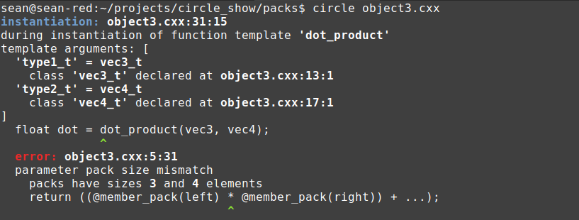

# Parameter packs in Circle

Parameter packs are the least developed feature in C++ 11, and one that presented the biggest burden to both compiler developers and C++ users. In Standard C++, parameter packs are both difficult to deal with and not very powerful. Circle makes major structural changes to the way parameter packs are treated.

## Parameter packs are no longer bound to templates.

In Standard C++, parameter pack content is carried around in template arguments. You must name to a type, non-type or template parameter in a class template context. In a function template context, you may also name a function parameter pack, which is in turn backed by a type parameter pack.

By introducing operators that yield unexpanded packs, Circle makes parameter packs more generic and more powerful. These operator-yielded packs may be used in dependent or non-dependent contexts. Pack-dependent expressions are still "dependent," even when programmed in otherwise non-dependent contexts. During source translation, these types and expressions are run through the normal template substitution machinery, and their packs are expanded.

## Expression locus

[**locus.cxx**](locus.cxx)  
```cpp
#include <iostream>

template<typename... args_t>
void print_args(const args_t&... x) {
  // Note the trailing ... in the expression.
  std::cout<< x<< "\n" ...;
}

int main() {
  print_args(1, 3.14, "Hello");
  return 0;
}
```
```
$ circle locus.cxx
$ ./locus
1
3.14
Hello
```

In Standard C++, parameter packs may only be expanded from inside function call argument lists, braced initializers or fold expressions. Circle adds expressions to the list of expansion loci. 

Pack expansion in argument list, template argument list or braced initializer contexts generates a _list_ of typse or expressions; pack expansion in the expression context generates a single expression, where subexpressions are joined by the comma operator `,`. This is functionally equivalent to the unary right fold operator `((pack) , ...)`, but with a more natural syntax. 

## Pack subscript

Inexplicably, Standard C++ does not support direct subscripting on parameter packs. The only way to access individual elements is through template abuse. 

Circle implements the `...[]` operator to perform direct indexing on parameter packs. Use this in conjunction with the Standard C++ operator `sizeof...` to loop over a parameter pack and sample its elements. This operator works with any kind of parameter pack.

```cpp
template<typename... types_t>
struct tuple_t {
  @meta for(int i = 0; i < sizeof...(types_t); ++i)
    types_t...[i] @(i);
};
```

When the `tuple_t` class template is instantiated, the body of the meta for is injected once per loop iteration. The type parameter pack `types_t` is accessed _like an array_. `types_t...[i]` yields the i'th element of the parameter pack at each step.

## `@member_pack`, `@member_names` and `@member_types`

The indexed versions of the Circle introspection operators have pack-yielding equivalents. These three intrinsics yield values, names and types of the non-static member objects of a class object or class type.

Consider this one-line for printing the definition of a class and the value of an instance:

[**object.cxx**](object.cxx)
```cpp
#include <iostream>
#include <iomanip>
#include <type_traits>

template<typename type_t>
void print_object(const type_t& obj) {
  static_assert(std::is_class<type_t>::value, 
    "argument to print_object must be a class object");

  std::cout<< "Value of type_t obj from print_object():\n";

  // Print the member declarator and the member name using pack expansion.
  std::cout<< 
    std::setw(20)<< std::left<< 
    @decl_string(@member_types(type_t), @member_names(type_t))<< " : "<<
    @member_pack(obj)<< "\n" ...;
}

struct bar_t {
  int a;
  double b;
  std::string c;
};

int main() {
  bar_t bar { 5, 3.14, "Hello" };

  // Try this in a non-dependent context.
  std::cout<< "Value of bar_t bar from main():\n";
  std::cout<< 
    std::setw(20)<< std::left<< 
    @decl_string(@member_types(bar_t), @member_names(bar_t))<< " : "<<
    @member_pack(bar)<< "\n" ...;
  std::cout<< "\n";

  // Try it as a template.
  print_object(bar);

  return 0;
}
```
```
$ circle object.cxx 
$ ./object
Value of bar_t bar from main():
int a                : 5
double b             : 3.14
std::string c        : Hello

Value of type_t obj from print_object():
int a                : 5
double b             : 3.14
std::string c        : Hello
```

We can build complicated expressions from unexpanded parameter packs. When the expression is expanded, everything built around the pack is expanded as well.

In this example, we use the Circle intrinsic `@decl_string` to stringify a type and id as a declarator. We then print a colon and print out `@member_pack`, which returns a glvalue to each member in the argument class-object expression.

We could write a loop and step through each member, but Circle parameter packs are more succinct.

[**object2.cxx**](object2.cxx)
```cpp
#include <iostream>

template<typename... params_t>
void func(const params_t&... params) {
  // Print each of the arguments.
  std::cout<< params<< "\n" ...;
}

struct foo_t {
  int x;
  double y;
  std::string z;
};

int main() {
  foo_t foo { 1, 3.14, "Hello" };

  // Expand the foo_t instance into a list of its members.
  func(@member_pack(foo)...);

  return 0;
}
```
```
$ circle object2.cxx
$ ./object2
1
3.14
Hello
```

This example illustrates a good use of the `@member_pack` operator. A class object is broken into its constituent members and passed to a function. The function infers its parameters from the arguments, and prints them with an expanded cout expression.

[**object3.cxx**](object3.cxx)
```cpp
#include <cstdio>

template<typename type1_t, typename type2_t>
auto dot_product(const type1_t& left, const type2_t& right) {
  return ((@member_pack(left) * @member_pack(right)) + ...);
}

template<typename type_t>
auto norm(const type_t& obj) {
  return sqrt(dot_product(obj, obj));
}

struct vec3_t {
  float x, y, z;
};

struct vec4_t {
  float x, y, z, w;
};

int main() {
  vec3_t vec3 { 1, 2, 3 };
  float mag3 = norm(vec3);
  printf("mag3 = %f\n", mag3);

  vec4_t vec4 { 1, 2, 3, 4 };
  float mag4 = norm(vec4);
  printf("mag4 = %f\n", mag4);

  // Uncomment this to attempt the dot product of a vec3_t and vec4_t.e
  // float dot = dot_product(vec3, vec4);

  return 0;
}
```
```
$ circle object3.cxx
$ ./object3
mag3 = 3.741657
mag4 = 5.477226
```

The `@member_pack` operator allows us to automate loops over not merely elements of arrays, but members of class objects. The generic `dot_product` function adds up the products of corresponding members of any two classes that have the same number of non-static data members, with types that can be multiplied and accumulated. We test this out on our own `vec3_t` and `vec4_t` types.

What happens if we uncomment the `dot_product(vec3, vec4)` line?



Pack expansion in the unary right fold fails, because the operand packs have different dimensions. Type safety is built into C++, and carries through to ad hoc pack expressions in Circle.

## `@enum_pack`, `@enum_names` and `@enum_types`

Enumerations and classes are similar in that they contain a sorted collection of countable non-type entities. Classes contain non-static data members and enums contain enumerators. These three intrinsics function similarly to their `@member` brethren. They return parameter packs of enumerators, enumerator names (as string literals) and associated types of enumerators (for typed enums only).

[**enum.cxx**](enum.cxx)
```cpp
#include <iostream>
#include <iomanip>

enum typename class my_list_t {
  a = int,
  b = double,
  c = const char*,
  d = float(*)(float, float)
};

template<typename type_t>
void print_typed_enum() {
  static_assert(__is_typed_enum(type_t),
    "argument to print_typed_enum must be a typed enum");

  std::cout<< "Definition of type_t from print_typed_enum:\n";

  std::cout<< 
    std::setw(30)<< std::left<< 
    @decl_string(@enum_types(type_t), @enum_names(type_t))<< " : "<<
    (int)@enum_pack(type_t)<< "\n" ...;
}

int main() {
  std::cout<< "Definition of my_list_t bar from main():\n";

  // Try this in a non-dependent context.
  std::cout<< 
    std::setw(30)<< std::left<< 
    @decl_string(@enum_types(my_list_t), @enum_names(my_list_t))<< " : "<<
    (int)@enum_pack(my_list_t)<< "\n" ...;
  std::cout<< "\n";

  // Try it as a template.
  print_typed_enum<my_list_t>();

  return 0;
}
```
```
$ circle enum.cxx
$ ./enum
Definition of my_list_t bar from main():
int a                          : 0
double b                       : 1
const char* c                  : 2
float(*d)(float, float)        : 3

Definition of type_t from print_typed_enum:
int a                          : 0
double b                       : 1
const char* c                  : 2
float(*d)(float, float)        : 3
```

One distinction is that `@member_pack` takes a class object-returning expression while `@enum_pack` takes the type-id of an enumeration. It's not returning data about an instance, but rather data about the type.

[**enum2.cxx**](enum2.cxx)
```cpp
#include <iostream>

enum class my_enum_t {
  a, b, c, d, e
};

// Create a class template.
template<my_enum_t e> 
struct my_class_t {
  int func() { return 1 + (int)e; }
};

// Define an explicit specialization over b.
template<> 
struct my_class_t<my_enum_t::b> {
  int func() { return 50; }
};

template<typename type_t>
int fold_from_enum() {
  // Instantiate my_class_t specialized over each enumerator, call
  // func(), and add the results up.
  // Use a binary fold expression so that even if the enum is empty we'll 
  // get a valid integer out.
  return (0 + ... + my_class_t<@enum_pack(type_t)>().func());  
}

int main() {

  // Perform the fold expression in a non-dependent context.
  int result1 = (0 + ... + my_class_t<@enum_pack(my_enum_t)>().func()); 
  std::cout<< "Result from main = "<< result1<< "\n";

  // Perform the fold expression inside a function template.
  int result2 = fold_from_enum<my_enum_t>();
  std::cout<< "Result from template = "<< result2<< "\n";

  return 0;
}
```
```

$ circle enum2.cxx
$ ./enum2
Result from main = 63
Result from template = 63
```

In the second example, we generate a parameter pack of all enumerators from an enum as the argument to a class template, instantiate that type, invoke the `func` member function, and add them all together with a binary fold expression. Again, the parameter pack feature has been liberated from templates, and we're able to perform a fold expression on a pack entity declared in a non-dependent context.

## `@pack_nontype`

`@pack_nontype` is a critical operator for sweeping up data and presenting it is a non-type parameter pack. The first argument is always an indexable expression, such as an array, pointer or std::vector. The second argument indicates the size of the input. If the first argument is an array, the size may be deduced from the array bounds.

This mechanism allows users to imperatively work with data at compile time in ordinary containers, then sweep it unto a parameter pack and expanding it into a template or function argument list.

[**non_type.cxx**](non_type.cxx)
```cpp
#include <vector>
#include <cstdio>
#include <cstdlib>
#include <algorithm>

template<int... indices>
struct foo_t { 
  @meta printf("foo_t instantiated on ( ");
  @meta printf("%d ", indices)...;
  @meta printf(")\n");
};

int main() {
  // Create an uninitialized array of integer values.
  @meta int values[10];

  // Use expression pack expansion to set each element of values. The length
  // of the array is deduced from the type.
  @meta @pack_nontype(values) = rand() % 100 ...;

  // Sort the indices.
  @meta std::sort(values, values + 10);

  // Instantiate foo_t on the sorted indices.
  foo_t<@pack_nontype(values)...> my_foo;

  return 0;
}
```
```
$ circle non_type.cxx
foo_t instantiated on ( 15 21 35 49 77 83 86 86 92 93 )
```

This example deploys non-type parameter packs in some unique ways. When `foo_t` is instantiated, it prints out all its template argument indices on a single line. The `indices` parameter is a non-type parameter pack, and we expand the containing expression with the trailing `...`.

In `main` we allocate a compile-time array `values` and initialize it with a pack expansion over `@pack_nontype(values)`. This operator transforms `values` into `values[0]`, `values[1]` and so on. `rand()` is called once for each pack element.

After using the STL sort the indices, we use `@pack_nontype` again, this time in the context of a template argument list, to specialize `foo_t` over the sorted indices. ODR-using the type by making an instance of it causes `foo_t`s definition to be executed, and our sorted array is printed.

Like the architecture of Circle generally, Circle's parameter pack support is intended to help bridge the gap between metaprogramming and imperative programming. We use normal imperative constructs like `std::sort` to transform some template arguments. We use `@pack_nontype` to take us back into the metaprogramming world, yielding an arguments list of sorted constants.

## `@pack_type`

`@pack_type` is a twist on `@pack_nontype`. It is specialized to only accept arrays of type `@mtype`, and it yields a type parameter pack by extracting the type-ids from the `@mtype` boxes.

[**pack_type.cxx**](pack_type.cxx)
```cpp
#include <algorithm>
#include <vector>
#include <cstdio>

template<typename... types_t>
struct foo_t {
  @meta printf("%s\n", @type_name(types_t)) ...;
};

int main() {

  @meta const char* type_names[] {
    "int",
    "double",
    "void*",
    "double",
    "char[3]",
    "int",
    "const char[5]",
    "char[3]"
  };

  // Convert strings to mtypes.
  @meta std::vector<@mtype> types {
    @dynamic_type(@type_id(@pack_nontype(type_names))) ...
  };

  // Sort and unique the types.
  @meta std::sort(types.begin(), types.end());
  @meta types.erase(std::unique(types.begin(), types.end()), types.end());

  // Instantiate foo_t on the unique types.
  foo_t<@pack_type(types.data(), types.size())...> foo;

  return 0;
}
```
```
$ circle pack_type.cxx
int
double
void*
char[3]
const char[5]
```

Consider reading in types as strings from an external source, like disk or a shell command or a shared object library. We can convert the strings to types with `@type_id`, convert the type to an `@mtype` with `@dynamic_type`, and do it as a one-liner with `@pack_nontype`.

Now we'll use the STL to sort and unique the vector. We can then specialize a class template over the unique elements by converting the vector's contents to a type parameter pack with `@pack_type`.

C++ puts an emphasis on "constness." Circle is more fluid, allowing you to freely mix and mutate strings, `@mtypes` and types. The essential concept with Circle isn't constness, but compile-timeness. We can perform extensive transformations on an input (and involve the full power of the host environment, if desired), and convert the compile-time data back into template arguments to continue with ordinary C++ metaprogramming.

## `__integer_pack`

A critical library class for dealing with parameter packs in C++ is `std::integer_sequence`. This is simply a class template specialized over the first N natural numbers. It is used for feeding other templates, which may peel off the first number and send the rest to another template, to indirectly iterate over N integer arguments.

Crazily, the C++ implementation of `std::make_index_sequence` (the function that returns an `std::integer_sequence` instance) is so painfully slow to build that all the compiler vendors have added a compiler extension, `__integer_pack`. This simply returns an unexpanded non-type pack of the first N non-negative numbers. The STL uses this extension to initialize `std::integer_sequence`, but I find it convenient to use it directly.

All the pack-yielding extensions named above can be reimplemented using `__integer_pack` and other non-pack operators. For example, `@member_names` can be implemented as `@member_name(type_t, __integer_pack(@member_count(type_t)))`. Run some numbers through and you'll see:

* 0: `@member_name(type_t, 0)`
* 1: `@member_name(type_t, 1)`
* 2: `@member_name(type_t, 2)`
and so on.

Circle's pack-yielding operators are more legible, but `__integer_pack` is more general. Consider using it in conjunction with `...[]` to reverse the order of a pack:

[**integer_pack.cxx**](integer_pack.cxx)
```cpp
#include <utility>
#include <cstdio>

template<typename type_t>
struct reverse_args_t;

template<template<typename...> class temp, typename... types_t>
struct reverse_args_t<temp<types_t...> > {
  enum { count = sizeof...(types_t) };
  typedef temp<types_t...[count - 1 - __integer_pack(count)] ...> type_t;
};

template<typename... types_t>
struct tuple_t {
  @meta for(int i = 0; i < sizeof...(types_t); ++i)
    types_t...[i] @(i);
};

int main() {
  tuple_t<int, double*, char[3], float> a;
  typename reverse_args_t<decltype(a)>::type_t b;

  @meta printf("a is %s\n", @type_name(decltype(a), true));
  @meta printf("b is %s\n", @type_name(decltype(b), true));

  return 0;
}
```
```
$ circle integer_pack.cxx
a is tuple_t<int, double*, char[3], float>
b is tuple_t<float, char[3], double*, int>
```

We'll instantiate a `tuple_t` with four arguments. We'll then instantiate the typedef inside the `reverse_args_t` class template. This involves using the pack subscript operator `...[]` with a pack on both sides! The left side is the type parameter pack `types_t`, which is bound to a template argument. The right side specifies the index, and since this is an unexpanded parameter pack, it propagates through the pack subscript operator and into the template argument list, where it is expanded. This lets us evaluate all `count` subscripts, each in reverse order.
