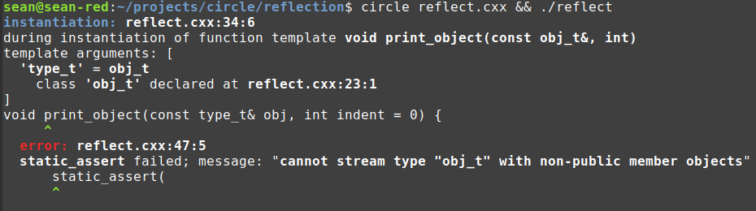

# Circle reflection and typed enums

1. [Reflection](#reflection)
1. [Introspection reference](#introspection-reference)
    * [Utilities](#utilities)
    * [Enumerations introspection](#enumerations-introspection)
    * [Direct base classes introspection](#direct-base-classes-introspection)
    * [Non-static data members introspection](#non-static-data-members-introspection)
    * [Virtual functions introspection](#virtual-functions-introspection)
    * [User attributes introspection](#user-attributes-introspection)
    * [Enum attribute overloads](#enum-attribute-overloads)
    * [Access flags](#access-flags)
1. [Reflection on enums](#reflection-on-enums)
1. [Reflection on bases and members](#reflection-on-bases-and-members)
1. [User attributes](#user-attributes)
1. [Type strings and decl strings](#type-strings-and-decl-strings)
1. [Typed enums](#typed-enums)
    * [Reflection on typed enums](#reflection-on-typed-enums)
    * [Joining typed enums](#joining-typed-enums)
    * [Sorting typed enums](#sorting-typed-enums)
    * [Queries into typed enums](#queries-into-typed-enums)
1. [Dynamic names](#dynamic-names)
1. [AoS to SoA](#aos-to-soa)
1. [Loading JSON into C++](#loading-json-into-c)
1. [Defining types from JSON](#defining-types-from-json)

## Reflection

Circle defines dozens of extension keywords that provide introspection information into user-defined types. You can currently query enumerators within an enumeration and base classes and non-static data members within a class object. Work is ongoing to provide similar introspection into virtual member functions. 

What these things have in common is that they belong to indexed, orderded collections. An application will often want to _iterate_ over enumerators or _iterate_ over data members. It is uncommon for an application to need to iterate over namespace, typedefs and alias templates, constructors, function overloads, global or local variables, deduction guides, friend declarations, variable templates, concepts and the like. C++ is full of different kinds of declarations, but most of these are best accessed with existing language mechanisms. Enums and classes are the exception that must be addressed.

Additionally, the new [user attributes](https://github.com/seanbaxter/shaders/#user-attributes) capability requires introspection: how do we know which attributes have been declared on which declarations? Special introspection extensions provide this information.

I've wanted to avoid defining a complex class hierarchy that models C++. Access to enumeration and class type information should be primitive and direct.

All the introspection extensions are named to describe you what you're getting: `@enum_name` yields the name of an enumerator, `@base_type` yields the type of a base class and `@member_offset` yields the byte offset of a data member within its class object.

[**one.cxx**](one.cxx)
```cpp
#include <cstdio>
#include <string>

struct record_t {
  std::string first;
  std::string last;
  char32_t middle_initial;
  int year_of_birth;  
};

template<typename type_t>
void print_members() {
  printf("%s:\n", @type_string(type_t));
  @meta for(int i = 0; i < @member_count(type_t); ++i) {
    printf("%d: %s - %s\n", i, @member_type_string(type_t, i), 
      @member_name(type_t, i));
  }
}

int main() {
  print_members<record_t>();
}
```
```
$ circle one.cxx && ./one
record_t:
0: std::string - first
1: std::string - last
2: char32_t - middle_initial
3: int - year_of_birth
```

Each of the collection kinds includes a count extension for accessing the number of elements (enumerators, base classes or data members) in the collection: `@enum_count`, `@base_count` and `@member_count`. Use a compile-time loop to step through each element in the collection. Provide the step index to the introspection keywords to get the data you want.

Circle provides _static reflection_ only, meaning that introspection information is only available at compile time. This differs from languages like Java and C#, which execute on virtual machines that generally have object metadata available at runtime.

The nature of static reflection implies that the index argument of an introspection keyword must be a compile-time value. However, it needn't be a compile-time _constant_. Use the `@meta` keyword in front of a _for-statement_ to define a compile-time loop. The loop above injects its child statement once for each data member in `type_t`. Thanks to loop unrolling in the frontend, for each step in the loop, `i` is known at compile time.

This code loops over each non-static data member in the type of the template parameter and prints its data type (as a string) and its member name.

[**two.cxx**](two.cxx)
```cpp
#include <cstdio>
#include <string>

struct record_t {
  std::string first;
  std::string last;
  char32_t middle_initial;
  int year_of_birth;  
};

template<typename type_t>
void print_members() {
  printf("%s:\n", @type_string(type_t));
  printf("%d: %s - %s\n", int..., @member_type_strings(type_t), 
    @member_names(type_t))...;
}

int main() {
  print_members<record_t>();
}
```
```
$ circle two.cxx && ./two
record_t:
0: std::string - first
1: std::string - last
2: char32_t - middle_initial
3: int - year_of_birth
```

It's very common to loop over introspection elements. As a convenience, parameter pack-yielding introspection extensions have been provided for most of the introspection extensions. Instead of writing a loop over `@member_name`, just expand `@member_names`. It's easy to remember which extensions yield parameter packs: they're given plural-form names.

Example 2 is just like Example 1, but with no loop. `@member_type_strings` and `@member_names` yield non-type parameter packs of string literals for each data member in the argument class. The presence of an unexpanded parameter pack makes the containing expression a parameter pack in turn. Before hitting the closing semicolon, you'll need to expand this pack with `...`. This transforms the statement into _many statements_, one for each pack element. The operator `int...` is a non-type parameter pack which yields the current index of the pack expansion. It corresponds to the step index of a loop.

Parameter packs are usually more concise and expressive than loops, but you can't nest them. Use whichever form feels best.

## Introspection reference

### Utilities

* **@type_string**(_type_) - Create a string from a type.
* **@decl_string**(_type_, _decl-name_) - Create decl string from a type and a decl name.
* **@dynamic_type**(_type_) - Box a type into an `@mtype`.
* **@static_type**(_@mtype-expression_) - Unboxes an `@mtype` object to yield a type.

### Enumerations introspection

* **@enum_count**(_enum-type_) - Number of unique-valued enumerators.
* **@enum_name**(_enum-type_, _ordinal_) - Enumerator's name.
* **@enum_name**(_enum-value_)
* **@enum_names**(_enum-type_) - Pack of enum names.
* **@enum_value**(_enum-type_, _ordinal_) - Enumerator prvalue.
* **@enum_values**(_enum-type_) - Pack of enumerator prvalues.

These attributes apply to [typed enums](#typed-enums):

* **@enum_decl_string**(_enum-type_, _ordinal_) - Enumerator's decl string.
* **@enum_decl_string**(_enum-value_)
* **@enum_decl_strings**(_enum-type_) - Pack of decl strings.
* **@enum_type**(_enum-type_, _ordinal_) - Associated type of an enumerator.
* **@enum_type**(_enum-value_)
* **@enum_types**(_enum-type_) - Pack of associated types.
* **@enum_type_string**(_enum-type_, _ordinal_) - Enumerator's type string.
* **@enum_type_string**(_enum-type_, _ordinal_)
* **@enum_type_strings**(_enum-type_) - Pack of type strings.

### Direct base classes introspection

* **@base_count**(_class-type_ [, _access-flags_]) - Number of direct base classes.
* **@base_offset**(_class-type_, _ordinal_ [, _access-flags_]) - Offset to base class in bytes. 
* **@base_offsets**(_class-type_ [, _access-flags_])- Pack of base class offsets.
* **@base_type**(_class-type_, _ordinal_ [, _access-flags_]) - Type of base class.
* **@base_types**(_class-type_ [, _access-flags_]) - Pack of base class types.
* **@base_type_string**(_class-type_, _ordinal_ [, _access-flags_]) - Base class's type string.
* **@base_type_strings**(_class-type_ [, _access-flags_]) - Pack of type strings.
* **@base_value**(_object_, _ordinal_ [, _access-flags_]) - Base object lvalue. 
* _object_.**@base_value**(_ordinal_ [, _access-flags_])
* **@base_values**(_object_ [, _access-flags_]) - Pack of base object lvalues.
* _object_.**@base_values**([_access-flags_])

### Non-static data members introspection

* **@member_count**(_class-type_ [, _access-flags_]) - Number of non-static data members.
* **@member_has_default**(_class-type_, _ordinal_ [, _access-flags_]) - Has default member initializer.
* **@member_default**(_class-type_, _ordinal_ [, _access-flags_]) - Expression for default member initializer.
* **@member_name**(_class-type_, _ordinal_ [, _access-flags_]) - Data member's name.
* **@member_names**(_class-type_ [, _access-flags_]) - Pack of member names.
* **@member_offset**(_class-type_, _ordinal_ [, _access-flags_]) - Offset to data member in bytes.
* **@member_offsets**(_class-type_ [, _access-flags_]) - Pack of data member offsets.
* **@member_ptr**(_class-type_, _ordinal_ [, _access-flags_]) - Pointer to data member expression.
* **@member_ptrs**(_class-type_ [, _access-flags_]) - Pack of pointers to data members.
* **@member_decl_string**(_class-type_, _ordinal_ [, _access-flags_]) - Data member's decl string.
* **@member_decl_strings**(_class-type_ [, _access-flags_]) - Pack of decl strings.
* **@member_type**(_class-type_, ordinal [, _access-flags_]) - Type of data member.
* **@member_types**(_class-type_ [, _access-flags_])- Pack of data member types.
* **@member_type_string**(_class-type_, _ordinal_ [, _access-flags_]) - Data member's type string.
* **@member_type_strings**(_class-type_ [, _access-flags_]) - Pack of type strings.
* **@member_value**(_object, ordinal_ [, _access-flags_]) - Data member lvalue.
* _object_.**@member_value**(_ordinal_ [, _access-flags_])
* **@member_values**(_object_ [, _access-flags_]) - Pack of data member lvalues.
* _object_.**@member_values**([_access-flags_])

### Virtual functions introspection

Under construction.

### User attributes introspection

User attributes are key/value pairs stored on a per-declaration, not per-instance, basis. Accordingly, they don't fit into the core C++ language, but rather the introspection and reflection extension. For convenience, enum- and data member-centric extensions are included to directly iterate over attributes associated with those declarations.

* **@attribute**(_decl_, _attrib-name_)
* **@has_attribute**(_decl_, _attrib-name_)
* **@attribute_list**(_decl_)
* **@enum_attribute**(_enum-expression_, _attrib-name_)
* **@enum_attribute**(_enum-type_, _ordinal_, _attrib-name_)
* **@enum_attributes**(_enum-type_, _attrib-name_)
* **@enum_has_attribute**(_enum-expression_, _attrib-name_)
* **@enum_has_attribute**(_enum-type_, _ordinal_, _attrib-name_)
* **@enum_attribute_list**(_enum-expression_)
* **@enum_attribute_list**(_enum-type_, _ordinal_)
* **@member_attribute**(_class-type_, _ordinal_, _attrib-name_ [, _access-flags_])
* **@member_attributes**(_class-type_, _attrib-name_ [, access-flags_])
* **@member_has_attribute**(_class-type_, _ordinal_, _attrib-name_ [, _access-flags_])
* **@member_attribute_list**(_class-type_, _ordinal_ [, _access-flags_])

### Enum attribute overloads

The three enum attribute extensions that take enumerator arguments have two overloads: one takes an enumeration-valued expression, and the other an enumeration type/ordinal pair. The expression overloads closely resemble their non-enum counterparts, but they are more specified with respect to which declarations they reflect.

[**enum_attrib.cxx**](enum_attrib.cxx)
```cpp
#include <cstdio>

using name [[attribute]] = const char*;
using width [[attribute]] = int;

template<typename type_t>
void func() {

  // This works fine.
  printf("@enum_has_attribute:\n");
  @meta for(int i = 0; i < @enum_count(type_t); ++i){ 
    if constexpr(@enum_has_attribute(type_t, i, name)) {
      printf("  %s : %s\n", @enum_name(type_t, i),
        @enum_attribute(type_t, i, name));
    }
  }

  // This always misses the attributes on the enumerators of type_t.
  // Why? Because we're literally asking for attributes on the loop object 
  // e, which is a different declaration from the underlying enumerator it
  // gets set to each step.
  printf("Loop with @has_attribute:\n");
  @meta for enum(type_t e : type_t) {
    if constexpr(@has_attribute(e, name)) {
      printf("  %s : %s\n", @enum_name(e), @attribute(e, name));
    }
  }

  // This works fine, because @enum_attribute and @enum_has_attribute
  // reflects on attributes of the enumerator with the provided value, rather
  // than reflecting on the provided declaration.
  printf("Loop with @enum_has_attribute:\n");
  @meta for enum(type_t e : type_t) {
    if constexpr(@enum_has_attribute(e, name)) {
      printf("  %s : %s\n", @enum_name(e), @enum_attribute(e, name));
    }
  }
}

enum my_enum_t {
  a [[.name="Foo", .width=100]],
  b [[.name="Bub"]],
  c,
};

int main() {
  func<my_enum_t>();
}
```
```
$ circle enum_attrib.cxx && ./enum_attrib
@enum_has_attribute:
  a : Foo
  b : Bub
Loop with @has_attribute:
Loop with @enum_has_attribute:
  a : Foo
  b : Bub
```

Circle provides the _for-enum_ control flow statement to loop over enumerators in an enumeration. But using `@has_attribute` to query attributes on the step index `e` literally looks for attributes on the object `e`, not on the enumerator with that value. The _enum_-prefixed attribute extensions will evaluate an expression and extract the enumerator declaration given its integral value.

[**enum_attrib2.cxx**](enum_attrib2.cxx)
```cpp
#include <cstdio>

using name [[attribute]] = const char*;

enum [[.name="an enumeration"]] foo_t {
  a [[.name="an enumerator"]]
};

[[.name="an object"]] const foo_t x = a;  

int main() {
  puts(@attribute(foo_t, name));         // prints "an enumeration"
  puts(@attribute(a, name));             // prints "an enumerator"
  puts(@attribute(x, name));             // prints "an object"
  puts(@attribute(decltype(x), name));   // prints "an enumeration"
  puts(@enum_attribute(x, name));        // prints "an enumerator"
}
```

Always keep in mind that types, objects, functions, members, enumerators and aliases are all declarations. Feeding one of these to `@attribute` will return the attributes _on that declaration_. Use the `@enum_attribute` family of extensions to load the value out of an object and return attributes on the enumerator stored there.

### Access flags

All base class and data member introspection extensions take an optional _access-flags_ argument. By default, only public bases and members are retrieved. Pass one or more of these flags in sequence without intervening commas to form a mask of which access classes are queried:

* 1 - `public`
* 2 - `protected`
* 4 - `private`
* 7 - `any`

For example, the access flags `public protected` will retrieve only public or protected bases and members. Equivalently you can pass a an integral mask: 3 also retrieves the public and protected members.

[**access.cxx**](access.cxx)
```cpp
#include <cstdio>

struct vec3_t {
public:    float x;
protected: float y;
private:   float z;
};

template<typename type_t, int access>
void print_members() {
  static_assert(access >= 0 && access <= 7);
  printf("access = %d:\n", access);
  printf("  %2d: %-10s (offset %2d)\n",
    int..., 
    @member_decl_strings(type_t, access), 
    @member_offsets(type_t, access)
  )...;
}

int main() {
  // Use a template parameter for access protection.
  @meta for(int access = 0; access <= 7; ++access)
    print_members<vec3_t, access>();
}
```
```
$ circle access.cxx && ./access
access = 0:
access = 1:
   0: float x    (offset  0)
access = 2:
   0: float y    (offset  4)
access = 3:
   0: float x    (offset  0)
   1: float y    (offset  4)
access = 4:
   0: float z    (offset  8)
access = 5:
   0: float x    (offset  0)
   1: float z    (offset  8)
access = 6:
   0: float y    (offset  4)
   1: float z    (offset  8)
access = 7:
   0: float x    (offset  0)
   1: float y    (offset  4)
   2: float z    (offset  8)
```

Like almost all Circle extensions, the access flag mask may be a value-dependent expression.

## Reflection on enums

[**enum_to_string.cxx**](enum_to_string.cxx)
```cpp
#include <cstdio>
#include <cstring>
#include <optional>

template<typename enum_t>
std::optional<const char*> enum_to_string(enum_t e) {
  switch(e) {
    @meta for enum(enum_t e2 : enum_t) {
      case e2:
        return @enum_name(e2);
    }

    default:
      return { };
  }
}

template<typename enum_t>
std::optional<enum_t> string_to_enum(const char* s) {
  @meta for enum(enum_t e : enum_t) {
    if(0 == strcmp(@enum_name(e), s))
      return e;
  }
  return { };
}

enum class shapes_t {
  circle,
  ellipse,
  square,
  rectangle,
  octagon,
  trapezoid,
  rhombus,
};

int main(int argc, char** argv) {
  printf("Map from enum values to strings:\n");
  int values[] { 4, 2, 8, -3, 6 };
  for(int x : values) {
    if(auto name = enum_to_string((shapes_t)x)) {
      printf("  Matched shapes_t (%d) = %s\n", x, *name);
    } else {
      printf("  Cannot match shapes_t (%d)\n", x);
    }
  }

  printf("\nMap from strings to enum values:\n");
  const char* names[] {
    "trapezoid", "giraffe", "duck", "circle", "Square", "square"
  };
  for(const char* s : names) {
    if(auto value = string_to_enum<shapes_t>(s)) {
      printf("  Matched shapes_t (%s) = %d\n", s, *value);
    } else {
      printf("  Cannot match shapes_t (%s)\n", s);
    }
  }
}
```
```
Map from enum values to strings:
  Matched shapes_t (4) = octagon
  Matched shapes_t (2) = square
  Cannot match shapes_t (8)
  Cannot match shapes_t (-3)
  Matched shapes_t (6) = rhombus

Map from strings to enum values:
  Matched shapes_t (trapezoid) = 5
  Cannot match shapes_t (giraffe)
  Cannot match shapes_t (duck)
  Matched shapes_t (circle) = 0
  Cannot match shapes_t (Square)
  Matched shapes_t (square) = 2
```

Reflecting on enums is easy. This sample generates `enum_to_string` and `string_to_enum` function templates that move static reflection information into a translation unit for runtime execution. 

The _for-enum-statement_ is a compile-time unrolled loop that internally uses introspection to step over all unique enumerators of an enum. You can use this construct almost anywhere inside curly braces, including inside a switch statement. For each enumerator a _case-statement_ is emitted which returns the name of the enumerator. The switch does the important work of mapping a variable, `e`, to a compile-time value, `e2`.

## Reflection on bases and members

[**reflect.cxx**](reflect.cxx)
```cpp
#include <cstdio>
#include <cstdarg>
#include <cstdint>
#include <string>
#include <type_traits>

using namespace std::string_literals;

inline void print(int indent, const char* pattern, ...) {
  va_list args;
  va_start(args, pattern);

  while(indent--)
    printf("  ");
  
  std::vprintf(pattern, args);
}

struct a_t { int x; };
struct b_t { float y[3]; };
struct c_t { const char* z; };

struct obj_t : a_t, b_t, c_t { 
  std::string message;
  bool amazing;

//   void(*pf)(int);
// private:
//   int private_member;
};

// Recursively print a class object's data.
template<typename type_t>
void print_object(const type_t& obj, int indent = 0) {
  if constexpr(std::is_same_v<std::string, type_t>) {
    print(indent, "\"%s\"\n", obj.c_str());

  } else if constexpr(std::is_class_v<type_t>) {
    // Raise a compiler error for protected/private bases.
    static_assert(
      !@base_count(type_t, protected private),
      "cannot stream type \""s + @type_string(type_t) + 
        "\" with non-public bases"
    );

    // Raise a compiler error for protected/private data members.
    static_assert(
      !@member_count(type_t, protected private),
      "cannot stream type \""s + @type_string(type_t) + 
        "\" with non-public member objects"
    );

    // Loop over base classes and recurse.
    const int num_bases = @base_count(type_t);
    @meta for(int i = 0; i < num_bases; ++i) {
      print(indent, "base %s:\n", @base_type_string(type_t, i));
      print_object(obj.@base_value(i), indent + 1);
    }

    // Loop over data members and recurse.
    const int num_members = @member_count(type_t);
    @meta for(int i = 0; i < num_members; ++i) {
      print(indent, "%s:\n", @member_decl_string(type_t, i));
      print_object(obj.@member_value(i), indent + 1);
    }

  } else if constexpr(std::is_array_v<type_t>) {
    const int extent = std::extent_v<type_t>;
    for(int i = 0; i < extent; ++i) {
      print(indent, "[%d]:\n", i);
      print_object(obj[i], indent + 2);
    }

  } else if constexpr(std::is_same_v<const char*, type_t>) {
    print(indent, "\"%s\"\n", obj);

  } else if constexpr(std::is_same_v<bool, type_t>) {
    print(indent, "%s\n", obj ? "true" : "false");

  } else if constexpr(std::is_floating_point_v<type_t>) {
    print(indent, "%f\n", obj);

  } else {
    // If the type isn't integral, raise a compiler error.
    static_assert(
      std::is_integral_v<type_t>, 
      "type \""s + @type_string(type_t) + "\" not supported"
    );

    print(indent, "%lld\n", (int64_t)obj);
  }
}

int main() {
  obj_t obj { };
  obj.x = 501;
  obj.y[0] = 1.618, obj.y[1] = 2.718, obj.y[2] = 3.142;
  obj.z = "A string";

  obj.message = "C++ and reflection together";
  obj.amazing = true;

  print_object(obj);
}
```
```
$ circle reflect.cxx && ./reflect
base a_t:
  int x:
    501
base b_t:
  float y[3]:
    [0]:
        1.618000
    [1]:
        2.718000
    [2]:
        3.142000
base c_t:
  const char* z:
    "A string"
std::string message:
  "C++ and reflection together"
bool amazing:
  true

```

This detailed sample prints the base class and data member contents of an object by switching over each subobject type and recursing when that type is a class. The _if-constexpr_ construct was added to the language with C++17. The introspection and meta control flow is a Circle extension.

Special attention is due the error-handling code. We want to write robust components, even compile-time components. If handed a class object with non-public bases or members, it's desirable for the translation unit to break with a pretty message. This is what the first two `static_assert`s achieve. The trick is again used at the end of the type handlers, if the type is an unexpected non-class type.

Since Circle implements compile-time execution of any code (not just constexpr-tagged functions on [literal types](https://en.cppreference.com/w/cpp/named_req/LiteralType)), we can use normal string formatting routines to construct a compiler error message. `"type \""s + @type_string(type_t) + "\" not supported"` is `std::string` concatenation using overloaded operator+. It's not the fastest way, but we don't care, since this is only done at compile time, and then only for a build-killing failure. The compiler's integrated interpreter kicks in here, giving you all possible flexibility to build the most responsive compile-time software.



Uncomment the private and pointer-to-function data members to see these errors.

## User attributes

User attributes are documented in [this section](https://github.com/seanbaxter/shaders/blob/master/README.md#user-attributes) of the Circle C++ Shaders doc.

Be aware the inconsistent placement of attributes in the [C++ grammar](http://eel.is/c++draft/#gram). 
* Attributes on member declarations go _before_ the declaration.
* Attributes on alias declarations go _after_ the identifier.
* Attributes on enumerator declarations go _after_ the identifier.
* Attributes on enumerator declarations in typed enums go _just before_ the type.

## Type strings and decl strings

The C++ grammar is not good. Writing object declarations requires study of the [Clockwise/Spiral Rule](http://c-faq.com/decl/spiral.anderson.html). This is an occult art. You may think that a declaration is written with a type on the left and a name on the right, but this breaks down as soon as you hit arrays:

`int array[10];`

Functions are worse. But pointers to members are where it really gets bad. Since the rules are so complicated, Circle provides both `@type_string` and `@decl_string` families of keywords. Use `@type_string` when you want to represent a type. Use `@decl_string` when you want to incorporate a name.

## Typed enums

Some of the most interesting early C++ metaprogramming work was done by [Andrei Alexandrescu](https://twitter.com/incomputable) for his book [Modern C++ Design](https://www.amazon.com/Modern-Design-Generic-Programming-Patterns/dp/0201704315). The most innovative part was the [Loki type list](http://loki-lib.sourceforge.net/html/a00681.html).

The type list is essentially a linked list of struct:

```cpp
template <class T, class U>
struct Typelist
{
   typedef T Head;
   typedef U Tail;
};
```

Each `Typelist` node has a typedef `Head` that holds the value of the node. It has a typedef `Tail` that "points" to the next link in list. This is not a linked list in memory; it's a recursively-nested class template that has no data members, only alias metadata. The Loki type list was very clever and could build on early-2000s C++ compilers. But due to language design limitations, the library was slow to compile and very hard to use. 

C++11 introduced parameter packs. Packs improved the language's expressiveness, but at the cost of legibility. Iterating over types in a type parameter pack required mysterious incantations that had to be copy/pasted from Stack Overflow.

Circle adds a type list as a builtin langugae type. It's the typed enum. Consider an ordinary enum, scoped or unscoped, and optionally with an explicit underlying type. But assign each enumerator an _associated type_. The associated type can be accessed at compile time using introspection.

A typed enum represents a list of types. An instance of the enumeration represents one element of that list. It's the same logic as ordinary enums, but with types instead of integral values. A Loki type list is a linked list. A Circle typed enum is an array and it offers direct indexing into its elements. This is my favorite data type. It's the Swiss Army Knife of Circle metaprogramming.

### Reflection on typed enums

[**typed_enum1.cxx**](typed_enum1.cxx)
```cpp
#include <cstdio>

enum typename my_types_t {
  double,
  int,
  char*,
  int[5],
  char,
};

template<typename type_t>
void print_enum_types1() {
  printf("%s (for loop):\n", @type_string(type_t));

  // Use a for loop.
  @meta for(int i = 0; i < @enum_count(type_t); ++i)
    printf("  %s\n", @enum_type_string(type_t, i));
}

template<typename type_t>
void print_enum_types2() {
  printf("%s (for-enum):\n", @type_string(type_t));

  // Use a for-enum loop.
  @meta for enum(type_t e : type_t)
    printf("  %s\n", @enum_type_string(e));
}

template<typename type_t>
void print_enum_types3() {
  printf("%s (pack):\n", @type_string(type_t));
  printf("  %s\n", @enum_type_strings(type_t))...;
}

int main() {
  print_enum_types1<my_types_t>();
  print_enum_types2<my_types_t>();
  print_enum_types3<my_types_t>();
}
```
```
$ circle typed_enum1.cxx && ./typed_enum1
my_types_t (for loop):
  double
  int
  char*
  int[5]
  char
my_types_t (for-enum):
  double
  int
  char*
  int[5]
  char
my_types_t (pack):
  double
  int
  char*
  int[5]
  char
```

A typed enum is declared by using the `enum typename` keywords together. List your enumerators inside the curly braces. The form is <type> or <name = type>. If you don't supply a name, one will be provided implicitly. (Implictly-generated names are \_0, \_1 and so on.)

This sample demonstrates three ways to print all types in the typed enum.
1. Use a for loop. Loop from 0 to `@enum_count`.
2. Use a for-enum loop. This has ranged-for syntax but is fed by introspection to loop over all unique enumerators. Since introspection is a compile-time feature, you must use the `@meta` context keyword to make this a compile-time loop.
3. Parameter pack expansion.

### Joining typed enums

[**typed_enum2.cxx**](typed_enum2.cxx)
```cpp
#include <cstdio>

// Define four typed enums. We'll programmatically join these.
enum typename list1_t {
  double,
  int[5],
  char,
};

enum typename list2_t {
  int[5],
  bool&&,
  std::nullptr_t,
};

enum typename list3_t {
  void*,
  char16_t,
  char(*)(double),
};

enum typename list4_t {
  char,
  short,
  int,
};

// Join the two.
enum typename joined_list_t {
  // Declare individual types.
  float, double, ptrdiff_t;

  // Use a for loop.
  @meta for(int i = 0; i < @enum_count(list1_t); ++i)
    @enum_type(list1_t, i);

  // Use a for-enum loop.
  @meta for enum(list2_t e : list2_t)
    @enum_type(e);

  // Use a pack expansion.
  @enum_types(list3_t)...;

  // Use a pack expansion and reverse the order of elements.
  @enum_types(list4_t)...[::-1] ...;
};

int main() {
  printf("%2d: %s\n", int..., @enum_type_strings(joined_list_t))...;
}
```
```
$ circle typed_enum2.cxx && ./typed_enum2 
 0: float
 1: double
 2: ptrdiff_t
 3: double
 4: int[5]
 5: char
 6: int[5]
 7: bool&&
 8: std::nullptr_t
 9: void*
10: char16_t
11: char(*)(double)
12: int
13: short
14: char
```

C++ curly-brace scopes (namespace, function block, class-specifier and enum-specifier) all support Circle compile-time control flow. You can use semicolons to delimit both enumerator declarations and meta control flow statements within an enum-specifier. 

In this example, several type lists are joined into a single typed enum. You can use a general compile-time _for-statement_, an introspection-powered _for-enum_ statement or a pack expansion on `@enum_types`. The last statement uses a [Python-style extended slice](https://python-reference.readthedocs.io/en/latest/docs/brackets/slicing.html) on a parameter pack to reverse the order of the pack. The syntax of pack slices is `...[start:stop:step]`. All three indices are optional, as is the second colon.

### Sorting typed enums

High-level operations on collections of types are punishingly difficult in Standard C++. Template libraries like [Boost.Mp11](https://www.boost.org/doc/libs/develop/libs/mp11/doc/html/mp11.html), [Boost.Hana](https://www.boost.org/doc/libs/1_74_0/libs/hana/doc/html/index.html) and [Boost.Fusion](https://www.boost.org/doc/libs/1_74_0/libs/fusion/doc/html/index.html) provide different yet overlapping ideas of what operations on types should consist of. These libraries are slow to compile, hard to use and generate perplexing errors. Worst of all, they exist. Why do we need yet another library to sort, or split, or do fundamental STL-like operations on collections? The STL and the core C++ language exist, are well understood, and a language metaprogramming extentsion should leverage them.

The Circle promise is that you can ditch all your old template metaprogramming libraries. Everything you wanted from those should be easy to achieve using this new compiler frontend. If it's not, let me know and I'll add the missing functionality.

[**typed_enum3.cxx**](typed_enum3.cxx)
```cpp
#include <vector>
#include <algorithm>
#include <string>
#include <cstdio>

// A nice order-preserving unique function.
template<typename value_t>
void stable_unique(std::vector<value_t>& vec) {
  auto begin = vec.begin();
  auto end = begin;
  for(value_t& value : vec) {
    if(end == std::find(begin, end, value))
      *end++ = std::move(value);
  }
  vec.resize(end - begin);
}

enum typename typelist_t {
  int,
  double,
  char[4],
  int,
  char[4],
  void*,
};

// Create a collection of the unique types. Use an order-preserving unique
// function.
enum typename unique_list_t {
  // Convert each type in joined_list_t to an @mtype. @mtype is a builtin
  // type that encapsulates a type and has comparison/relational operators
  // defined. You can sort or unique with it.
  @meta std::vector types { 
    @dynamic_type(@enum_types(typelist_t)) ... 
  };

  // Create a unique set of @mtypes.
  @meta stable_unique(types);

  // Convert all the unique types into enumerator declarations.
  @pack_type(types)...;
};

// We can also sort the type lexicographically by their string representations.
enum typename sorted_list_t {
  // Expand the string spellings of the types into an array, along with the
  // index into the type.
  @meta std::array types {
    std::make_pair<std::string, int>( 
      @enum_type_strings(typelist_t),
      int...
    )...
  };

  // Lexicographically sort the types.
  @meta std::sort(types.begin(), types.end());

  // Gather the types and define enumerators.
  @enum_type(typelist_t, @pack_nontype(types).second) ...;
};

int main() {
  printf("unique_list_t:\n");
  printf("  %2d: %s\n", int..., @enum_type_strings(unique_list_t))...;

  printf("\nsorted_list_t:\n");
  printf("  %2d: %s\n", int..., @enum_type_strings(sorted_list_t))...;
}
```
```
$ circle typed_enum3.cxx && ./typed_enum3
unique_list_t:
   0: int
   1: double
   2: char[4]
   3: void*
sorted_list_t:
   0: char[4]
   1: char[4]
   2: double
   3: int
   4: int
   5: void*
```

This samples takes a typed enum `typelist_t` and defines a new typed enum `unique_list_t` where each associated type appears only once, and a new typed enum `sorted_list_t` where the types are sorted lexicographically.

In each case we can use _standard algorithms_. The STL provides a function `unique`, which can be paired with `sort` to create a unique set. But that re-orders all the inputs. The `stable_unique` utility function has quadratic running time but is stable.

How does the unique enum work? The curly braces of an _enum-specifier_ provide a declarative region for meta objects. These objects only have compile-time storage duration. Unlike `constexpr` objects, they're mutable. The `@dynamic_type` Circle extension boxes a type in a pointer-sized `@mtype` object, which can be manipulated like other builtin types. We can even specialize containers like `std::vector` and functions like `std::find` on `@mtype`, but only with code used at compile time.

`unique_list_t`'s definition creates a meta vector `types` in the scope of the typed enum. This _isn't_ an enumerator definition, and name lookup outside the _enum-specifier_ will not find `types`. Think of the _enum-specifier_ as scratch space that holds intermediate declarations required for defining an enum. The vector is initialized with a collection of `@mtype` objects, each returned by `@dynamic_type` on the interspection extension `@enum_types`. The next statement runs `stable_unique` on this vector at compile time; redundant elements are tossed and unique elements remain. The last statement does the actual declaration: `@pack_type` takes a pointer/count, array, `std::vector` or `std::array` of `@mtype` objects and yields the corresponding type parameter pack. By expanding this in the _enum-specifier_, we create an enumerator for each unique type.

`sorted_list_t` again leverages STL algorithms for lexicographically sorting types. Since we don't change the number of types from the `typelist_t` input, we don't need an elastic container like `std::vector`. A builtin array type won't work, however, because it doesn't accommodate the case of empty type lists. (Zero-length arrays are prohibited in C++.)

The compile-time array `types` has elements of type `std::pair<std::string, int>` where the string is the type string for each type, and the int is the ordinal of that type. `std::pair` defines `operator<` to first compare the `.first` elements; if those are equal, it compares the `.second` elements. Using `std::sort` in a meta statement to sort the input types orders types lexicographically and turns the ordinals into gather indices. The `@pack_nontype` extension opens an STL container of values and exposes them as a non-type parameter pack. We grab the `.second` element of each array element and provide that as the index argument to `@enum_type`, which gathers types from the original type list. Expanding pack declaration generates the type's enumerators.

```
$ time circle typed_enum3.cxx

real  0m0.172s
user  0m0.161s
sys 0m0.012s
```

This shows some pretty extreme metaprogramming. But it doesn't require any new and expensive dependencies. Leaning on STL containers and algorithms gives us implementations that have pretty good efficiency, even when executed by the compiler's interpreter. It's worlds away from abusing template specialization to affect similar operations. This is a kind of C++ metaprogramming that does not blow up compile time.

### Queries into typed enums

[**typed_enum4.cxx**](typed_enum4.cxx)
```cpp
#include <type_traits>
#include <algorithm>
#include <cstdio>

enum typename typelist_t {
  int,
  double,
  char[4],
  double(double),
  float,
  void*,
};

// Check if a type is in the list.
template<typename type_t, typename list_t>
constexpr bool is_type_in_list_v =  
  (... || std::is_same_v<type_t, @enum_types(list_t)>);

// Use + to get a count of the occurrences for a type in the list.
template<typename type_t, typename list_t>
constexpr size_t occurence_in_list_v =
  (... + (size_t)std::is_same_v<type_t, @enum_types(list_t)>);

// True if the list has no duplicate types.
template<typename list_t>
constexpr bool is_unique_list = 
  (... && (1 == occurence_in_list_v<@enum_types(list_t), list_t>));

// Check for any type matching the provided type trait.
template<template<typename> class trait_t, typename list_t>
constexpr bool any_trait_in_list_v =  
  (... || trait_t<@enum_types(list_t)>::value);

// Check that all types match the trait.
template<template<typename> class trait_t, typename list_t>
constexpr bool all_trait_in_list_v =  
  (... && trait_t<@enum_types(list_t)>::value);

// Search for the index of the first occurence of type_t in list_t.
template<typename type_t, typename list_t>
constexpr size_t find_first_in_list_v = std::min({ 
  std::is_same_v<type_t, @enum_types(list_t)> ? int... : @enum_count(list_t)... 
});

int main() {
  printf("char* is in typelist_t = %d\n", is_type_in_list_v<char*, typelist_t>);
  printf("float is in typelist_t = %d\n", is_type_in_list_v<float, typelist_t>);

  printf("float is in typelist_t %d times\n", occurence_in_list_v<float, typelist_t>);
  printf("void* is in typelist_t %d times\n", occurence_in_list_v<void*, typelist_t>);  

  printf("typelist_t is a unique list = %d\n", is_unique_list<typelist_t>);

  printf("integral is in typelist_t = %d\n", any_trait_in_list_v<std::is_integral, typelist_t>);
  printf("function is in typelist_t = %d\n", any_trait_in_list_v<std::is_function, typelist_t>);

  printf("typelist_t are all integral = %d\n", all_trait_in_list_v<std::is_integral, typelist_t>);
  printf("typelist_t are all fundamental = %d\n", all_trait_in_list_v<std::is_fundamental, typelist_t>);

  printf("index of first char[4] = %d\n", find_first_in_list_v<char[4], typelist_t>);
  printf("index of first bool = %d\n", find_first_in_list_v<bool, typelist_t>);
}
```
```
$ circle typed_enum4.cxx && ./typed_enum4
char* is in typelist_t = 0
float is in typelist_t = 1
float is in typelist_t 2 times
void* is in typelist_t 1 times
typelist_t is a unique list = 0
integral is in typelist_t = 1
function is in typelist_t = 1
typelist_t are all integer = 0
typelist_t are all fundamental = 0
index of first char[4] = 2
index of first bool = 6
```

We can easily program queries into type lists. This sample uses C++17 [fold expressions](https://en.cppreference.com/w/cpp/language/fold) to search for types in a typed enum and to match types satisfying a trait.

The left fold _(... op pack)_ expands to a left-associative sequence of operators: _pack[0] op pack[1] op pack[2]_ and so on. This is the initializer for a variable template expressing the type list query. Note that these aren't recursive expressions, as would be required in pre-fold Standard C++.

The fourth variable template, `find_first_in_list_v` returns the index of the first occurrence of the specified type in the typed enum. If the type doesn't occur, `@enum_count` is returned as the _end_ index. C++17 defines reduction-like overloads of common algorithms like [`std::min`](https://en.cppreference.com/w/cpp/algorithm/min) and [`std::max`](https://en.cppreference.com/w/cpp/algorithm/max):

```cpp
template< class T >
constexpr T min( std::initializer_list<T> ilist );

template< class T >
constexpr T max( std::initializer_list<T> ilist );
```

The Circle introspection extensions will yield a pack of all associtaed types in a typed enum, and we can expand the index of each of these into an initializer list, and pass that to the reduction overload of `std::min`.

```cpp
template<typename type_t, typename list_t>
constexpr size_t find_first_in_list_v = std::min({ 
  std::is_same_v<type_t, @enum_types(list_t)> ? int... : @enum_count(list_t)... 
});
```

We do an element-wise type comparison of the type we're searching for, `type_t` with the associated types of the enum. If they match, `std::is_same_v` is true, and the `int...` Circle extension returns the current index of the pack expansion. If they don't match, `@enum_count` yields the end index. This pack expansion is expanded into an initializer list, and that is passed to the reduction min. All this occurs at compile time; the result of the function call is a constant.

## Dynamic names

The dynamic name operator `@()` concatenates a sequence of strings or integers and converts the result to an identifier which can be used for name lookup or declarations. If the leading character after concatenation is a digit, an underscore is prepended to form a valid C++ identifier.

```cpp
template<typename... types_t>
struct tuple_t {
  @meta for(int i = 0; i < sizeof...(types_t); ++i)
    types_t...[i] @(i);
};
``` 

This is the ur-Circle program. It embodies of the idea of using ordinary C++ control flow constructs at compile time to control the structure of a program. When the `tuple_t` class template is specialized, the meta statment is executed by the integrated interpreter. At each step, the child statement is instantiated. Because this is a _non-meta_ declaration, it's embedded in the inner-most enclosing _non-meta_ scope, which is the class template definition. Accordingly, the statement is a member declaration, not an object declaration. You can use meta control flow in namespace, class-specifier, enum-specifier or function block scope to programmatically inject declarations.

The `...[index]` operator subscripts a parameter pack. The dynamic name operator `@()` converts the step index integer to an identifier, which provides the data member name. In this tuple, the names are `_0`, `_1` and so on.

```cpp
template<typename... types_t>
struct tuple_t {
  types_t @(int...) ...;
};
```

As with most Circle reflection features, you can use pack expansion instead of writing a loop. This more concise tuple definition states the parameter pack `types_t` as the type of a data member. A `...` at the end of the statement expands this single declaration into a set of data members. The name of each data member is its ordinal within the pack. During instantiation, the pack index operator `int...` yields 0 for the first element of the expansion, 1 for the second element, and so on.

[**reverse.cxx**](reverse.cxx)
```cpp
#include <cstdio>

template<typename... types_t>
struct reverse_t {
  types_t...[::-1] @(int...) ...;
};

@meta puts(@member_decl_strings(reverse_t<int, float, char[4]>))...;
```
```
$ circle -c reverse.cxx
char _0[4]
float _1
int _2
```

You can also use a Python-like extended slice expression [`...[begin:end:step]`](https://github.com/seanbaxter/circle/blob/master/comprehension/comprehension.md#static-slice-expressions) to reorder or skip elements in your class definition. This class template is a tuple that reverses the argument types using negative step index in an extended parameter pack slice expression.

## AoS to SoA

```cpp
#include <vector>
#include <sstream>
#include <cstdio>

// Define a struct that has a std::vector for each member of type_t.
template<typename type_t>
struct vectors_t {
  std::vector<@member_types(type_t)> @("vec_", @member_names(type_t)) ...;
};

// Perform AOS to SOA by copying data members into the vectors.
template<typename type_t>
vectors_t<type_t> aos_to_soa(const type_t* objects, size_t count) {
  vectors_t<type_t> vec;
  vec.@member_values().resize(count)...;

  for(size_t i = 0; i < count; ++i)
    vec.@member_values()[i] = objects[i].@member_values()...;

  return vec;
}

template<typename type_t>
std::string print_vector(const std::vector<type_t>& vec) {
  std::ostringstream oss;
  oss<< "[";
  if(vec.size()) {
    oss<< " "<< vec[0];
    oss<< ", "<< vec[1:]...;
  }
  oss<< " ]";
  return oss.str();
}

template<typename type_t>
void print_vectors(const type_t& vecs) {
  printf("%s\n", @type_string(type_t));
  printf("  %s: %s\n", @member_names(type_t), 
    print_vector(vecs.@member_values()).c_str())...;
}

struct vec3_t {
  double x, y, z;
};

int main() {
  vec3_t data[] {
    1.0, 2.0, 3.0,
    1.1, 2.1, 3.1,
    1.2, 2.2, 3.2,
    1.3, 2.3, 3.3
  };

  auto soa = aos_to_soa(data, data.length);

  print_vectors(soa);
}
```
```
$ circle soa.cxx && ./soa
vectors_t<vec3_t>
  vec_x: [ 1, 1.1, 1.2, 1.3 ]
  vec_y: [ 2, 2.1, 2.2, 2.3 ]
  vec_z: [ 3, 3.1, 3.2, 3.3 ]
```

[AoS-SoA](https://en.wikipedia.org/wiki/AoS_and_SoA) transformations are trivial to perform generically when reflection is available. We convert an array of structs to a struct of `std::vectors`, each holding one of the scalar members. A tuple-like class template `vectors_t` holds the storage. For accuracy in reporting, each `std::vector` member is given the name of its corresponding scalar member, but prepended with "\_vec". 

The transformation itself involves two pack expansion expressions. The first calls `.resize` on each `std::vector` data member. Then a runtime loop iterates over each array element, and the second expansion performs member-wise assignment.

Printing the contents of an `std::vector` is done concisely with a Python-style [extended slice](https://github.com/seanbaxter/circle/blob/master/comprehension/comprehension.md#a-slice-expressions). `oss<< ", "<< vec[1:]...` prints all vector elements, starting from index 1, prepended by a comma delimiter.

## Loading JSON into C++

[**json1.cxx**](json1.cxx)
```cpp
using alt_name [[attribute]] = const char*;

enum class weightclass_t {
  featherweight,
  lightweight,
  welterweight,
  middleweight,
  heavyweight,

  // We can't use a hyphen in a c++ identifier, but we can in a JSON key.
  // Associate this alternate name using an attribute.
  lheavyweight [[.alt_name="light-heavyweight"]],
};

enum class stance_t {
  orthodox,
  southpaw,
};

struct boxer_t {
  std::string name;
  weightclass_t weight;
  int height;
  int reach;

  // By providing a default here, we don't error if the JSON doesn't have one.
  stance_t stance = stance_t::orthodox;
};
```

Consider using Circle reflection to generate a function that reads a JSON object into the `boxer_t` type. Protocol for decoding is embedded in the C++ declarations. Enumeration members must have JSON values that match enumerator names. To provide a more natural interface with JSON tools, an alternate name can be attached to enumerators using the _alt_name_ user attribute. Data members with default member initializers decome optional in the JSON representation.

[**json1.cxx**](json1.cxx)
```cpp
template<typename enum_t>
std::optional<enum_t> string_to_enum(const char* s) {
  @meta for enum(enum_t e : enum_t) {

    if constexpr(@enum_has_attribute(e, alt_name)) {
      if(0 == strcmp(@enum_attribute(e, alt_name), s))
        return e;
    }

    if(0 == strcmp(@enum_name(e), s))
      return e;
  }
  return { };
}
```

First let's extend `string_to_enum` to reflect both on enumerator names and _alt\_name_ attributes. Just use the _for-enum_ statement to loop over all enumerators and check for _alt\_name_ with `@enum_has_attribute`. This needs to be used in an _if-constexpr_ statement, because trying to access an attribute that doesn't exist will generate a compiler error; the _if-constexpr_ prevents the compiler's template machinery from substituting the untaken branch.

[**json1.cxx**](json1.cxx)
```cpp
#define ERROR(pattern, ...) \
  { fprintf(stderr, pattern, __VA_ARGS__); exit(1); }


template<typename type_t>
type_t load_from_json(json& j) {
  type_t obj { };

  if constexpr(std::is_same_v<std::string, type_t>) {
    obj = j.get<std::string>();

  } else if constexpr(std::is_class_v<type_t>) {

    // Don't support classes with non-public members.
    static_assert(
      !@member_count(type_t, protected private),
      "cannot stream type \""s + @type_string(type_t) + 
        "\" with non-public member objects"
    );

    // Don't support classes with bases.
    static_assert(
      !@base_count(type_t, all),
      "cannot stream type \""s + @type_string(type_t) + "\" with base classes"
    );

    // Loop over data members.
    @meta for(int i = 0; i < @member_count(type_t); ++i) {
      // Look up a value.
      json& j2 = j[@member_name(type_t, i)];

      // Error if it's not available and with no defaulted.
      if(!j2.is_null()) {
        obj.@member_value(i) = load_from_json<@member_type(type_t, i)>(j2);

      } else if constexpr(!@member_has_default(type_t, i))
        ERROR("JSON missing member %s\n", @member_name(type_t, i));
    }

  } else if constexpr(std::is_array_v<type_t>) {
    typedef std::remove_extent_t<type_t> inner_t;
    size_t i = 0;
    for(json& j2 : j) 
      obj[i++] = load_from_json<inner_t>(j2);

  } else if constexpr(std::is_enum_v<type_t>) {
    if(auto e = string_to_enum<type_t>(j.get<std::string>().c_str())) {
      obj = *e;

    } else {
      ERROR("%s is not a %s enumerator\n", j.get<std::string>().c_str(), 
        @type_name(type_t));
    }

  } else if constexpr(std::is_same_v<bool, type_t>) {
    obj = j.get<bool>();

  } else {
    static_assert(std::is_arithmetic_v<type_t>);
    obj = j.get<type_t>();
  }

  return obj;
}
```

The logic for decoding a JSON object into a C++ struct models the `print_object` logic from [reflect.cxx](reflect.cxx). A series of _if-constexpr_ statements help specify decoding behaviors for specific types or categories of types. As with `print_object` we reflect over the structure of the C++ class, because that structure is known at compile time, whereas the schema implied by the JSON is known at runtime--too late for code generation.

Of interest is the code for optionally supporting data members with default member initializers, such as `boxer_t::stance`. `@member_has_default` indicates that the member has a default initializer, and it permits us to skip raising an error when the JSON lacks the corresponding member. We don't care _what_ the default initializer actually is, because it's applied when constructing the return variable at the top of `load_from_json`. (FYU, `@member_default` gives you the default member initializer.)

[**boxers.json**](boxers.json)
```json
{
  "boxers" : [
    {
      "name" : "Tyson Fury",
      "weight" : "heavyweight",
      "height" : 206,
      "reach" : 216,
      "stance" : "orthodox"
    },
    {
      "name" : "Artur Beterbiev",
      "weight" : "light-heavyweight",
      "height" : 183,
      "reach" : 185
    },
    {
      "name" : "Demetrius Andrade",
      "weight" : "middleweight",
      "height" : 185,
      "reach" : 187
    },
    {
      "name" : "Sergio Martinez",
      "weight" : "welterweight",
      "height" : 178,
      "reach" : 185,
      "stance" : "southpaw"
    },
    {
      "name" : "Devin Haney",
      "weight" : "lightweight",
      "height" : 173,
      "reach" : 180
    }
  ]
}
```

No additional tooling is needed to decode this JSON file into `boxer_t` C++ objects. Alternative spellings for the weightclass are supported due to the user attribute on the enumerator declarations. `stance` is an optional field thanks to a default member initializer.

## Defining types from JSON

The [primitives ray marcher](https://github.com/seanbaxter/shaders/#configuring-a-shader-from-json) C++ shaders sample generates actual C++ types from a JSON file that is loaded and parsed _at compile time_. This can be very useful when paired with algorithms that use reflection to scrape data members to operate on.

[**types.json**](types.json)
```json
{
  "types" : [
    {
      "name" : "address_t",
      "members" : [
        {
          "name" : "street",
          "type" : "std::string"
        },
        { 
          "name" : "zip",
          "type" : "int"
        },
        {
          "name" : "state",
          "type" : "char[2]"
        }
      ]
    },
    {
      "name" : "person_t",
      "members" : [
        {
          "name" : "first",
          "type" : "std::string"
        },
        {
          "name" : "last",
          "type" : "std::string"
        },
        {
          "name" : "address",
          "type" : "address_t"
        }
      ]
    }
  ]
}
```

Circle can reflect on its introspection data, because that's known at compile time. It can also reflect on external data assets that can be loaded at compile time. By using _json.hpp_ to iterate over a configuration file like _types.json_, we can emit new C++ types conform to this external schema. By making the "types" value an array, we ensure that the elements are visited in order, so that each successive type use the previously-defined types in its definition, as is the case with `person_t` including an `address_t` data member.

[**json2.cxx**](json2.cxx)
```cpp
#include "json.hpp"
#include <fstream>

using namespace nlohmann;

// Load types.json at compile time. All meta statements are executed at 
// compile time.
@meta std::ifstream file("types.json");
@meta json j;
@meta file>> j;

@meta for(json& types : j["types"]) {

  // Use a dynamic name to turn the JSON "name" value into an identifier.
  struct @(types["name"]) {

    // Loop over the JSON "members" array.
    @meta for(json& members : types["members"]) {
      // Emit each member. The inner-most enclosing non-meta scope is the
      // class-specifier, so this statement is a member-specifier.
      @type_id(members["type"]) @(members["name"]);
    }
  };
}

// Make a typed enum to keep a record of the types we injected.
enum typename new_types_t {
  @meta for(json& types : j["types"])
    @type_id(types["name"]);
};

int main() {
  @meta for enum(new_types_t e : new_types_t) {
    printf("struct %s {\n", @enum_type_string(e));
    printf("  %s;\n", @member_decl_strings(@enum_type(e)))...;
    printf("};\n");
  }
}
```
```
$ circle json2.cxx && ./json2
struct address_t {
  std::string street;
  int zip;
  char state[2];
};
struct person_t {
  std::string first;
  std::string last;
  address_t address;
};
```

The heart of this reflection sample is a member specifier powered by a `@type_id` and a dynamic name, both fed with JSON string values, inside a meta _for-statement_, inside a _class-specifier_, inside another meta _for-statement_. Types and other non-meta declarations fall through meta scopes and embed in the innermost enclosing non-meta scope, so the injected structs all sit in the global namespace, and the injected members belong to the structs.

The `file` and `j` objects which hold the JSON data are _only available at compile time_. When the Circle parser finishes the translation unit, the objects fall out of scope and are destroyed. The `types.json` does not need to accompany the executable.

To bridge the compile-time/runtime boundary, a typed enum `new_types_t` is defined which holds the types we just injected. Typed enums are clean, iterable, closed collections of types, whereas the global namespace is a place of rank pollution. The typed enum is defined by traversing the JSON data and emitting enumerators at compile time, and it is used at runtime to print the injected types and their data members to the terminal. 


Is this capability useful? I think it can be. The algorithms that operate on these schema-defined types must be reflection-enabled to operate generically on them. The signed distance functions in the [Shadertoy sample](https://github.com/seanbaxter/shaders/blob/master/README.md#configuring-a-shader-from-json) are specified from a set of C++-defined SDF primitives. The JSON could be edited by a modeling tool and fed back into C++ for shader generation.
