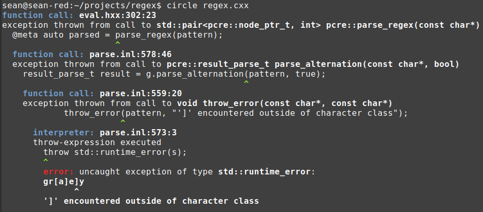
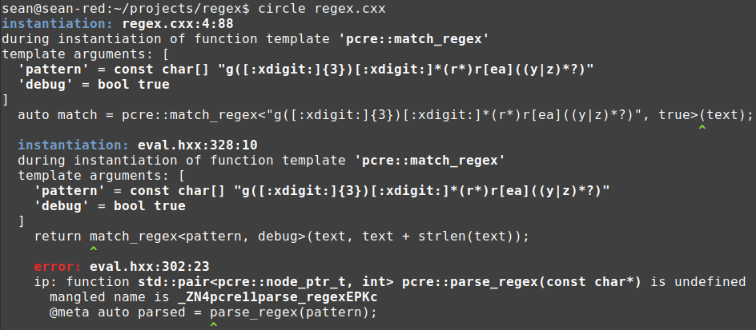

# Compile-time regular expressions in Circle

Circle's compile-time execution helps accelerate domain-specific languages. One of the most-used DSLs is [Perl-compatible regular expressions](https://en.wikipedia.org/wiki/Perl_Compatible_Regular_Expressions). By processing the regex pattern at compile time, we can emit code optimized for specific patterns. The pattern-specific code exposes much more potential for the compiler backend to make optimizations. A regex generated for a specific pattern might run 100x faster than a regex library that dynamically parses the pattern.

Compile-time regex for Standard C++ is pretty much owned by [Hana Dusikova](https://twitter.com/hankadusikova) and its implementation is thoroughly explained in her [slide presentations](https://www.compile-time.re/). A rich compile-time regex implementation can be broken into three partes:

1. Parse the regex pattern. This can be done with an LL(1) or recursive-descent parser.
1. _Optional:_ Convert the graph from a non-deterministic to a deterministic finite automata. This involves running [Powerset construction](https://en.wikipedia.org/wiki/Powerset_construction]) and [DFA minimization](https://en.wikipedia.org/wiki/DFA_minimization), transforming a backtracking regex to a non-backtracking regex.
1. Convert the data structure holding the NFA or DFA into an expression template type. Provide a function template overload for each node type (for NFAs) to support sequences, alternations, repetitions, etc. These functions lower the regex to code.

The really heavy lifting (from a metaprogramming standpoint) resides in the pattern parsing. By contrast, Dusikova's evaluation code for NFAs, once you have the expression template, is pretty straight-forward. For the Circle treatment I'll follow her lead and use function template overloads to lower the pattern's expression template to code, but use an ordinary recursive descent parser, with unrestricted access to the C++ language and libraries, to process the pattern.

```cpp
#include "eval.hxx"
#include "parse.inl"

int main() {
  const char* text = "gray";
  if(auto match = pcre::match_regex<"gr[ae]y">(text)) {
    printf("Input matches pattern\n");

  } else {
    printf("Input doesn't match pattern\n");
  }
  
  return 0;
}
```

To use the the regex library, call `pcre::match_regex` and specialize the function template over the regex pattern as a string. You can specialize over a string literal or a `const char*`/`std::string` meta object. You can invoke this function as many times as you want, and code generation will only be performed once for each unique pattern.

```cpp
struct range_t { 
  it_t begin, end;
};

template<int capture_count>
struct parse_state_t {
  enum { num_capture_groups = capture_count };
  it_t begin, end;
  std::array<range_t, capture_count> captures;
};
```

The result object is type `std::optional<parse_state_t<capture_count> >`. A successful match returns a valid optional. The number of capture groups in the result object is implicit in the regex pattern text.

# Regex evaluation

The evaluator is driven by a list of types, which are manipulated like a queue using template parameter packs. This is more natural than it sounds.

My PCRE implementation supports these operator types:

* `eps_t` - Returns a successful match.
* `ch_t` - Match a single specific character.
* `crange_t` - Match a character range. In regex, use the minus in character class pattern: `[a-b]`.
* `any_t` - Match any single character. In regex, use the meta character `.`.
* `metachar_t` - Test a character against a function. This includes all the character tests in the C header [`<cctype>`](https://en.cppreference.com/w/cpp/header/cctype).
* `boundary_t` - Match a word boundary. A "word" character is a letter, number or underscore. A word boundary test is successful when the previous character is a word and the current character is not, or vice-versa. This test consumes no characters.
* `cclass_t` - A character class. In regex, list single-character or range alternatives inside braces: `gr[ae]y`. Unlike normal alternatives, the first match is always taken, and no backtracking is used.
* `seq_t` - A sequence. In regex, list two productions consecutively to match the first, then the second. Although no operator token is used, this really is an operator. It has the same look and similar precedence to the sequence operator in EBNF.
* `alt_t` - An alternative. Separate two productions with a pipe `|`. Try matching the first alternative. If that does not lead to a successful parse (of the entire rule, not just the alternative), try matching the second. This operator has the lowest precedence (as it does in EBNF and in C++'s' grammar).
* `opt_t` - Optionally match the subobject. In regex, put a `?` after the subject.
* `star_t` - Match the subobject 0 or more times. In regex, put a `*` after the subobject.
* `plus_t` - Match the subobject 1 or more times. In regex, put a `+` after the subobject.
* `quant_t` - A quantifier. Put the min and max repetition counts inside braces. `{5}` means match the subobject 5 times. `{5,10}`, `{,5}` and `{5,}` mean match between five and ten times, match no more than five times, or match at least five times, respectively.
* `capture_t` - A capture group. PCRE patterns have operator precedences, just like C++ expressions. To override the precedence, use a group, written as `(?: )`. In `a(?:b|c)d`, the `b|c` are alternatives in a sequence with `a` and `d`; without the grouping, you'd have an alternative with sequences of two characters each. Oddly, the more natural expression for grouping `( )` performs _capture_ in addition to overriding precedence. The ranges of characters matched inside parentheses are noted in the output of the match.

[**eval.hxx**](eval.hxx*)
```cpp
// Match a single character in the sequence.
template<char c>
struct ch_t { };

template<typename state_t, char c, typename... ts>
result_t match(state_t& state, it_t it, list_t<ch_t<c>, ts...>) {
  if(it == state.end || c != *it) return { };
  return match(state, ++it, list_t<ts...>());
}

// Match a character range.
template<char a, char b>
struct crange_t { };

template<typename state_t, char a, char b, typename... ts>
result_t match(state_t& state, it_t it, list_t<crange_t<a, b>, ts...>) {
  if(it == state.end || a > *it || b < *it) return { };
  return match(state, ++it, list_t<ts...>());
}

// Match any character.
struct any_t { };
template<typename state_t, typename... ts>
result_t match(state_t& state, it_t it, list_t<any_t, ts...>) {
  if(it == state.end) return { };
  return match(state, ++it, list_t<ts...>());
}
```

Following Dusikova's slides, classes representing each operator are spelled out in a parameter pack, which is passed between stages of evaluation. The parameter pack is expanded as template arguments to an empty `list_t` structure, which serves as a _expression template_, mapping a complex data structure (the regex pattern) to a kind of meta structure which can be traversed by the language's template machinery.

Overload resolution is used to match the next operator in the list with the function that performs its evaluation. Each operator bakes its data into template parameters so they are available at compile time, and argument deduction retrieves this data when entering the function.

In this fragment, the single-character match operator `ch_t` is matched with its evaluation function when it's at the front of the list. If the iterator into the text is at the end (`state.end`) or doesn't match the test's value (the deduced argument `c`), the test fails. Otherwise, the iterator is advanced and the match continues on `list_t<ts...>`, which is the same list of operators with the just-processed character match removed.

The `crange_t` match function tests the character at `*it` against the inclusive range `a` to `b`, and the `any_t` match function accepts any character, failing only when we've hit the end of the input.

Operators involving control flow (alternatives, optionals and repetitions) must implement backtracking when the regex is an NFA.

[**eval.hxx**](eval.hxx)
```cpp
// Match an alternative.
template<typename... args>
struct alt_t { };

template<typename state_t, typename... args, typename... ts>
result_t match(state_t& state, it_t it, list_t<alt_t<args...>, ts...>) {
  // Try each alternative in order.
  @meta for(int i = 0; i < sizeof...(args); ++i) {
    if(auto out = match(state, it, list_t<args...[i], ts...>()))
      return out;
  }
  return { };
}
```

This implementation of the alternative operator shows how clever this parameter pack scheme is. Since this version of regex is only matching full inputs (and not searching for the longest match), we'll only test alternatives until we find one that succeeds. So we meta for loop over each of the alternatives (that is, the items in the `args` pack). Rather than testing testing the alternative and the subsequent text separately, we can _detach_ each of the alternatives at their respective steps and prepend them to the following operators, and test the result as a single sequence. That is, to test `(a|b|c)def`, we can test `adef` on the first step, `bdef` on the second step and `cdef` on the third step. The backtracking here is implicit: the match could fail at any point in the sequence `adef`, at which point we'd enter the second step and test the input against `bdef`.

Most of the logic in the evaluation of the regex is performed at compile time, specifically during overload resolution that matches the next operator in the list with its corresponding function template. Operator list surgery is performed entirely at compile time. The runtime logic mostly consists of comparing characters from the input against constant values provided by argument deduction. This simple logic allows the LLVM backend to produce very optimized code.

# Regex pattern parsing in C++

Regex patterns are a context-free grammar. The smart choice for processing these patterns is to write a recursive descent parser which lowers the pattern to an AST. We could then traverse the AST to generate the expression template. However, we need to do this at compile time. The C++ template and constexpr language (that is, the subset of C++ available for compile-time logic) is not sufficient for writing _real software_. 

The template metaprogramming involved in evaluating a regex given the expression template is pretty nice. The template metaprogramming involved in parsing the regex pattern and generating the expression template is horrifying. Dusikova's compile-time [LL(1) parser](https://en.wikipedia.org/wiki/LL_parser) is what gives her regex library its heroic quality. The LL parser is a crusty bit of computer science that aims to parse a subset of context-free grammars by way of a table of state transitions. These state-transitions parsers (which are usually left-to-right parsers, as they are less impractical) are usually generated by tools like [Yacc](https://en.wikipedia.org/wiki/Yacc). The user specifies the grammar in BNF form with embedded semantic actions, and the tool emits C code, with the users actions embedded in the parser code. A tool is considered necessary for LR parsers, because identifying all the parse states and establishing transitions between them is both intricate and tedious.

Why don't we just use Yacc to generate a compile-time regex pattern parser? Yacc generates C code, and you can't run C code at compile time in C++! You can only express your intent through the logic of template argument deduction, overload resolution and constexpr functions. C++ metaprogramming doesn't give you even a 1960s level of software technology with data structures like arrays, strings and lists, and capabilities like i/o and dynamic memory. Oh no: you basically have to fashion everything out of parameter packs. 

[**grammars.hpp**](https://github.com/hanickadot/compile-time-regular-expressions/blob/master/include/ctll/grammars.hpp#L37)
```cpp
// additional overloads for type list
template <typename... Ts> constexpr auto push_front(pop_input, list<Ts...>) -> list<Ts...> { return {}; }

template <typename... Ts> constexpr auto push_front(epsilon, list<Ts...>) -> list<Ts...> { return {}; }

template <typename... As, typename... Bs> constexpr auto push_front(list<As...>, list<Bs...>) -> list<As..., Bs...> { return {}; }

template <typename T, typename... As> constexpr auto pop_front_and_push_front(T item, list<As...> l) {
  return push_front(item, pop_front(l));
}
```

Since you can't use `std::stack`, you're forced to jerry-rig a stack-like thing from parameter packs. Since packs don't hold values, you spam out user-defined types that _represent_ values:

[**pcre.hpp**](https://github.com/hanickadot/compile-time-regular-expressions/blob/master/include/ctre/pcre.hpp#L54)
```cpp
// 'action' types:
  struct class_digit: ctll::action {};
  struct class_named_alnum: ctll::action {};
  struct class_named_alpha: ctll::action {};
  struct class_named_ascii: ctll::action {};
  struct class_named_blank: ctll::action {};
  struct class_named_cntrl: ctll::action {};
  struct class_named_digit: ctll::action {};
  struct class_named_graph: ctll::action {};
  struct class_named_lower: ctll::action {};
  struct class_named_print: ctll::action {};
  struct class_named_punct: ctll::action {};
  struct class_named_space: ctll::action {};
  struct class_named_upper: ctll::action {};
  struct class_named_word: ctll::action {};
  struct class_named_xdigit: ctll::action {};
  struct class_nondigit: ctll::action {};
  struct class_nonnewline: ctll::action {};
  struct class_nonspace: ctll::action {};
  struct class_nonword: ctll::action {};
  <ad infinitum>
```

The meat of this implementation is the hand-written set of rules governing LL(1) state machine operations, spelling out as hundreds of function declarations:

[**pcre.hpp**](https://github.com/hanickadot/compile-time-regular-expressions/blob/master/include/ctre/pcre.hpp#L124)
```cpp
// (q)LL1 function:
  using _others = ctll::neg_set<'!','$','\x28','\x29','*','+',',','-','.',':','<','=','>','?','A','B','C','D','E','F','G','H','I','J','K','L','M','N','O','P','Q','R','S','T','U','V','W','X','Y','Z','[','\\',']','^','_','a','b','c','d','e','f','g','h','0','i','j','k','l','m','n','o','p','q','r','s','t','u','v','w','x','y','z','\x7B','|','\x7D','1','2','3','4','5','6','7','8','9'>;
  static constexpr auto rule(s, ctll::term<'\\'>) -> ctll::push<ctll::anything, backslash, repeat, string2, content2>;
  static constexpr auto rule(s, ctll::term<'['>) -> ctll::push<ctll::anything, c, repeat, string2, content2>;
  static constexpr auto rule(s, ctll::term<'\x28'>) -> ctll::push<ctll::anything, prepare_capture, block, repeat, string2, content2>;
  static constexpr auto rule(s, ctll::term<'^'>) -> ctll::push<ctll::anything, push_assert_begin, repeat, string2, content2>;
  static constexpr auto rule(s, ctll::term<'$'>) -> ctll::push<ctll::anything, push_assert_end, repeat, string2, content2>;
  static constexpr auto rule(s, ctll::set<'!',',','-',':','<','=','>','A','B','C','D','E','F','G','H','I','J','K','L','M','N','O','P','Q','R','S','T',']','_','0','U','V','W','X','Y','Z','a','b','c','d','e','f','g','h','i','j','k','l','m','n','o','p','q','r','s','t','u','v','w','x','y','z','1','2','3','4','5','6','7','8','9'>) -> ctll::push<ctll::anything, push_character, repeat, string2, content2>;
  static constexpr auto rule(s, _others) -> ctll::push<ctll::anything, push_character, repeat, string2, content2>;
  static constexpr auto rule(s, ctll::term<'.'>) -> ctll::push<ctll::anything, push_character_anything, repeat, string2, content2>;
  static constexpr auto rule(s, ctll::epsilon) -> ctll::push<push_empty>;
  static constexpr auto rule(s, ctll::set<'\x29','*','+','?','\x7B','|','\x7D'>) -> ctll::reject;

  static constexpr auto rule(a, ctll::term<'\\'>) -> ctll::push<ctll::anything, backslash, repeat, string2, content2, make_alternate>;
  static constexpr auto rule(a, ctll::term<'['>) -> ctll::push<ctll::anything, c, repeat, string2, content2, make_alternate>;
  static constexpr auto rule(a, ctll::term<'\x28'>) -> ctll::push<ctll::anything, prepare_capture, block, repeat, string2, content2, make_alternate>;
  static constexpr auto rule(a, ctll::term<'^'>) -> ctll::push<ctll::anything, push_assert_begin, repeat, string2, content2, make_alternate>;
  static constexpr auto rule(a, ctll::term<'$'>) -> ctll::push<ctll::anything, push_assert_end, repeat, string2, content2, make_alternate>;
  static constexpr auto rule(a, ctll::set<'!',',','-',':','<','=','>','A','B','C','D','E','F','G','H','I','J','K','L','M','N','O','P','Q','R','S','T',']','_','0','U','V','W','X','Y','Z','a','b','c','d','e','f','g','h','i','j','k','l','m','n','o','p','q','r','s','t','u','v','w','x','y','z','1','2','3','4','5','6','7','8','9'>) -> ctll::push<ctll::anything, push_character, repeat, string2, content2, make_alternate>;
  static constexpr auto rule(a, _others) -> ctll::push<ctll::anything, push_character, repeat, string2, content2, make_alternate>;
  static constexpr auto rule(a, ctll::term<'.'>) -> ctll::push<ctll::anything, push_character_anything, repeat, string2, content2, make_alternate>;
  static constexpr auto rule(a, ctll::term<'\x29'>) -> ctll::push<push_empty, make_alternate>;
  static constexpr auto rule(a, ctll::epsilon) -> ctll::push<push_empty, make_alternate>;
  static constexpr auto rule(a, ctll::set<'*','+','?','\x7B','|','\x7D'>) -> ctll::reject;
  <ad infinitum>
```

This code is very explicit about overload resolution's role in facilitating compile-time logic. There is no standard control flow here. All rules are expressed as overloads of the same function! Each state is indicated by the first parameter type. The input is indicated by the second parameter type. The _trailing-return-type_ dictates the change to make to the state machine. Consumers of these rules use `decltype` to read out the operation given the current state and the input character. How does the compiler support this? For each request it has to determine the viability of all 250-some `rule` overloads.

There are some clever hacks here. How does the `ctll::set` class template support matching a given input character against its collection of most of the ASCII table?

[**grammars.hpp**](https://github.com/hanickadot/compile-time-regular-expressions/blob/master/include/ctll/grammars.hpp#L69)
```cpp
// match terms defined in set
template <auto... Def> struct set {
  constexpr inline set() noexcept { }

  template <auto V, typename = std::enable_if_t<((Def == V) || ... || false)>> constexpr inline set(term<V>) noexcept;
};

// match terms not defined in set
template <auto... Def> struct neg_set {
  constexpr inline neg_set() noexcept { }
  
  template <auto V, typename = std::enable_if_t<!((Def == V) || ... || false)>> constexpr inline neg_set(term<V>) noexcept;
};
```

A templated converting constructor is declared which takes a single input character (wrapped in `term` to make it parameteric). The template's constraint uses a C++17 binary right fold expression to blow out a test of each of the set's pack elements `Def...` against the term's enclosed character `V`. If the test fails, the constraint fails and that constructor is removed from the set of constructor candidates. With no viable constructors, the implicit conversion to `rule`'s second parameter fails, removing that `rule` from the candidate set. Identifying the relevant rule involves effecting a waterfall of candidate-rejection operations.

This is very hard engineering. It brings to mind Turing's code-breaking efforts or the Oak Ridge Uranium gas diffusion process during the Manhattan Project. It is willpower applied against inadequate technology. Our WW2 cases had good reason to be difficult: crytography and atomic theory were _super new_. Why is regular expression parsing so difficult in C++? Programmers have been dealing with text processing for more than fifty years, over which time computers have become a million times more powerful. Yet compile-time regex in C++ is inanely difficult, and that's the consequence of _intentional design_.

The Circle language is predicated on the essential insight to end this agony: execute _real code_ at compile time. If you want to use recursive descent to parse the regex pattern into an AST, and connect the nodes in the tree with `std::unique_ptr`, just write normal code to do that. If you want to write Powerset construction and DFA minimization to improve the performance of your regex, just paste in code that you stole off the internet. That's called programming!

# The compile-time recursive descent parser (spoiler: it's an ordinary RD parser)

[**pcre.hxx**](pcre.hxx)
```cpp
enum class metachar_func_t {
  none,
  iscntrl, isprint, isspace, isblank, isgraph, ispunct, isalnum, 
  isalpha, isupper, islower, isdigit, isxdigit, isword,
};

struct node_t {
  enum kind_t {
    // terminals
    kind_char,
    kind_range,
    kind_any,
    kind_meta,
    kind_boundary,
    kind_cclass,

    // unary operators
    kind_opt,
    kind_star,
    kind_plus,
    kind_quant,
    kind_capture,

    // binary operators
    kind_seq,
    kind_alt,
  } kind;

  // kind_cclass, kind_meta, kind_boundary
  bool negate = false;

  union {
    char32_t c;                         // kind_char
    struct { char32_t c_min, c_max; };  // kind_range
    metachar_func_t metachar_func;      // kind_meta
    struct { int r_min, r_max; };       // kind_quant
    int capture_index;                  // knid_capture
  };

  node_t(kind_t kind) : kind(kind) { }
  std::vector<node_ptr_t> children;
};

std::pair<node_ptr_t, int> parse_regex(const char* pattern);

void print_ast(const node_t* node, int indent = 0);
```

Let's define a single AST node type, along with a vector of `unique_ptr`s to child nodes. An enum serves as a discriminator between operator types. Any node-specific data is stored in an enum. That data is _not_ baked into the type.

[**parse.inl**](parse.inl)
```cpp
struct grammar_t {
  // character class.
  result_parse_t parse_cclass_item(const char* pattern);
  result_parse_t parse_cclass_char(const char* pattern, bool expect = false);
  result_parse_t parse_escape(const char* pattern);
  result_parse_t parse_metachar(const char* pattern);

  // Productions in highest-to-lowest precedence.
  result_parse_t parse_term(const char* pattern, bool expect);
  result_parse_t parse_duplication(const char* pattern, bool expect = false);
  result_parse_t parse_concat(const char* pattern, bool expect);
  result_parse_t parse_alternation(const char* pattern, bool expect = false);

  void throw_error(const char* pattern, const char* msg);

  const char* begin = nullptr;
  int capture_count = 0;
};
```
Let's collect our parser methods into a class called `grammar_t`. The methods correspond to productions in the regex pattern BNF. `parse_alternation` parses `|`, which has the lowest precedence: we enter parsing at this point. `parse_alternation` calls `parse_concat`, which calls `parse_duplication`, which calls `parse_term`, which calls `parse_escape` and `parse_metachar` thus moving us from low to high operator precedence. This is the nature of recursive descent. The code mirrors the grammar.

The pattern inside character class brackets `[ ]` has its own grammar, which is implemented in `parse_cclass_item` and `parse_cclass_char`.

As we encounter capture groups we assign `capture_count` from the grammar into `capture_index` in the node, and increment that counter. This isn't some constexpr thing: we have variables.

If the pattern is ill-conditioned in any way, we'll throw an exception which gives an error in a nicely formatted package. Uncaught exceptions in the Circle language are printed as compiler errors, complete with backtrace information.

[**parse.inl**](parse.inl)
```cpp
PCRE_LINKAGE result_parse_t grammar_t::parse_alternation(const char* pattern, 
  bool expect) {

  result_parse_t a = parse_concat(pattern, expect);
  while(a) {
    // Advance past the lhs.
    pattern = a->next;
    if('|' == *pattern) {
      result_parse_t b = parse_concat(pattern + 1, true);

      if(node_t::kind_alt != a->attr->kind) {
        auto alt = std::make_unique<node_t>(node_t::kind_alt);
        alt->children.push_back(std::move(a->attr));
        a->attr = std::move(alt);
      }

      a->attr->children.push_back(std::move(b->attr));
      a->next = b->next;

    } else
      break;
  }

  return a;
}
```

Let's examine one production to get a taste for recursive descent. The alternation is the lowest-precedence operator, so its the rule we enter first. We start by parsing the next-lowest precedence operator (concatenation). While that succeeds, we loop and consume `|` tokens. After each alternation token we parse another concatenation. We then promote the first result to an alternation node, if it isn't already, and append the right-hand side of the `|` list of child nodes. This way all alternatives are children of a single node: the root node of the pattern's AST.

# Reporting parse errors

[**parse.inl**](parse.inl)
```cpp
PCRE_LINKAGE void grammar_t::throw_error(const char* pattern, const char* msg) {
  ptrdiff_t col = pattern - begin;
  std::string s = format("%s\n%*s^\n%s\n", begin, col, "", msg);
  throw std::runtime_error(s);
}
```

At any parse error, the parser throws an `std::runtime_error` with a detailed error message. A pointer to the offensive character in the pattern is provided: this establishes a column within the full pattern (pointed at by `begin`). After printing the full pattern on its own line, the format specifier `%*s^` indents the cursor `col` spaces and prints the caret character. This gives a clang-like error with a caret pointing to the error.



The exception unrolls through the compile-time function calls. When it exits uncaught, the Circle prints its message as a compiler error along with backtrace information through those compile-time functions.

# Lowering the AST to the expression template

We need to bridge the divide between the `node_t` hierarchy and the eval code's template hierarchy. We can't specialize templates over non-literal class objects. But we can use Circle expression macros with `@mtype` to yield types from nodes.

[**eval.hxx**](eval.hxx)
```cpp
// Given a compile-time node_t*, return the corresponding mtype.
@macro auto lower_ast(node_t* p) {

  // Evaluate the types of the child nodes.
  @meta std::vector<@mtype> types { 
    lower_ast(@pack_nontype(p->children).get())... 
  };

  @meta+ if(node_t::kind_char == p->kind) {
    @emit return @dynamic_type(ch_t<p->c>);

  } else if(node_t::kind_range == p->kind) {
    @emit return @dynamic_type(crange_t<p->c_min, p->c_max>);

  } else if(node_t::kind_any == p->kind) {
    @emit return @dynamic_type(any_t);

  } else if(node_t::kind_meta == p->kind) {
    // Retrieve the name of the enum, eg isalpha or isxdigit.
    // Wrap in @() to turn the string into an identifier. 
    // Ordinary name lookup finds the function name in this namespace or the
    // global namespace and chooses the overload to match the lhs function 
    // pointer.
    metachar_ptr_t fp = @(@enum_name(p->metachar_func));
    @emit return @dynamic_type(metachar_t<p->negate, fp, @pack_type(types)...>);

  } else if(node_t::kind_boundary == p->kind) {
    @emit return @dynamic_type(boundary_t<p->negate, @pack_type(types)...>);

  } else if(node_t::kind_cclass == p->kind) {
    @emit return @dynamic_type(cclass_t<p->negate, @pack_type(types)...>);

  } else if(node_t::kind_opt == p->kind) {
    @emit return @dynamic_type(opt_t<@pack_type(types)...>);

  } else if(node_t::kind_star == p->kind) {
    @emit return @dynamic_type(star_t<@pack_type(types)...>);

  } else if(node_t::kind_plus == p->kind) {
    @emit return @dynamic_type(plus_t<@pack_type(types)...>);

  } else if(node_t::kind_quant == p->kind) {
    @emit return @dynamic_type(quant_t<p->r_min, p->r_max, @pack_type(types)...>);

  } else if(node_t::kind_capture == p->kind) {
    @emit return @dynamic_type(capture_t<p->capture_index, @pack_type(types)...>);

  } else if(node_t::kind_seq == p->kind) {
    @emit return @dynamic_type(seq_t<@pack_type(types)...>);

  } else if(node_t::kind_alt == p->kind) {
    @emit return @dynamic_type(alt_t<@pack_type(types)...>);
  }
}
```

The `lower_ast` macro takes a compile-time pointer to a node and returns an `@mtype` variable holding the expression type for that node. Circle doesn't yet have a function-like construct that returns a type, so `@mtype` is necessary to perform that task. The first statement declares an `std::vector<@mtype>` and initializes it with the result of `lower_ast` over each of the node's children. Note that `@pack_nontype(p->children).get())` yields an _unexpanded_ parameter pack. We pass this pack to the `lower_ast` macro, then expand the result, which has the effect of invoking the macro on each of the children individually and collecting the results in the vector's initializer.

We then make a chain of meta if/else statements (meta switches are not yet implemented) and specialize the expression template type over type-specific information stored in the union of the AST node, followed by the types sitting in the `types` vector.

```cpp
enum class metachar_func_t {
  none,
  iscntrl, isprint, isspace, isblank, isgraph, ispunct, isalnum, 
  isalpha, isupper, islower, isdigit, isxdigit, isword,
};
```
```cpp
  ...    if(node_t::kind_meta == p->kind) {
    metachar_ptr_t fp = @(@enum_name(p->metachar_func));
    @emit return @dynamic_type(metachar_t<p->negate, fp, @pack_type(types)...>);
```

The handler for `metachar_t` deserves a special look. When the the parser matches a meta character pattern like `[:alpha:]`, it marks the `metachar_func` node member with an enum like `isalpha`. Because the values of macro arguments are known at compile-time, we can introspect directly on this member to retrieve its enumerator's string name. `@enum_name` on `isalpha` yields the `const char[8]` constant `"isalpha"`. The dynamic name operator `@()` turns that string into the identifier `isalpha`, then ordinary name lookup is performed. It finds an overload set by that name, and the copy-initializer into the member function pointer `fp` selects the the best viable overload. Circle's metaprogramming facilities let us convert an enum to a function pointer by way of name lookup! Finally, the `metachar_t` expression template is specialized over its `negate` argument (for '\\D', '\\W' and '\\B' arguments) and the function pointer stored in `fp`. 

# Joining the parser and eval together

[**eval.hxx**](eval.hxx)
```cpp
struct range_t { 
  it_t begin, end;
};

template<int capture_count>
struct parse_state_t {
  it_t begin, end;
  std::array<range_t, capture_count> captures;
};

template<const char pattern[], bool debug = false>
auto match_regex(const char* begin, const char* end) {
  // First parse the regex pattern at compile time.
  @meta auto parsed = parse_regex(pattern);

  @meta+ if(debug)
    print_ast(parsed.first.get());

  // Construct an expression template type from the AST.
  using type = @static_type(lower_ast(parsed.first.get()));

  // Create and initialize the state. This is required to hold the captures.
  typedef parse_state_t<parsed.second> state_t;
  state_t state { begin, end };

  std::optional<state_t> result;
  if(auto x = match(state, begin, list_t<type>())) {
    // Mark the end point of the parse.
    state.end = *x;

    // Return the captures as part of the result.
    result = state;
  }

  return result;
}
```

`match_regex` is the entry point for regular expression evaluation. The function template has a non-type _string_ parameter, indicated by the type `const char pattern[]`. The pattern is passed to `parse_regex`, which runs the recursive-descent regex pattern parser _at compile time_ and returns an `std::pair` called `parsed`, which includes the root node `std::unique_ptr<node_t>` and the number of captures in the regular expression. This object shares its declarative region with real objects, but its lifetime exists only at compile time; when the `match_regex` specialization finishes instantation, its meta objects are destroyed in last-to-first order.

If the user specifies `debug=true` the structure of the AST is printed to the screen at compile time. This useful diagnostic is much easier to read than the expression template; it's nicely indented and tree-like. `print_ast` on the AST for the pattern `gr[ae]y` looks like this:

```
seq:
  char = g
  char = r
  [character-class]:
    char = a
    char = e
  char = y
```

# Packaging the parser

You can execute the parser using Circle's integrated interpreter. The interpreter is slow, but computers are fast. This is fine. But what if we want to go to the next level and convert the NFA to a DFA to improve the regex's worst-case performance? This is a hard problem, computationally and programmatically. It could require a lot of compute depending on the pattern.

When the definition of a function is not locally available, the Circle interpreter will search for the function by its mangled name in shared object libraries loaded when the compiler starts. C++ and system libraries like `libstdc++`, `libc`, `libm` and `libpthread` are loaded automatically. Additional libraries can be specified with the `-M` command line argument.

The definitions for regex evaluation necessarily need to be included by the translation unit. The parser functions, however, can be compiled into a shared object. The `parse_regex` and `print_ast` functions are forward declared in `pcre.hxx`, a common header for the library. They are defined in `parse.inl`, and modified by the `PCRE_LINKAGE` macro.

[**parse.inl**](parse.inl)
```cpp
#ifndef PCRE_LINKAGE
#define PCRE_LINKAGE inline
#endif
```

If `PCRE_LINKAGE` isn't already defined when the file is included, it is defined to `inline`. You can include `parse.inl` and it'll behave like any other header-only library. Or you can `#define PCRE_LINKAGE` and then include `parse.inl` to give the functions external linkage and compile the parser into a shared object library.

[**parse.cxx**](parse.cxx)
```cpp
#define PCRE_LINKAGE
#include "parse.inl"
```

[**regex.cxx**](regex.cxx)
```cpp
#include "eval.hxx"

void regex_match(const char* text) {
  auto match = pcre::match_regex<"g([:xdigit:]{3})[:xdigit:]*(r*)r[ea]((y|z)*?)", true>(text);

  if(match) {
    printf("Matched characters [%d, %d]\n", match->begin - text, 
      match->end - text);
    for(pcre::range_t capture : match->captures) {
      printf("capture: %.*s\n", capture.end - capture.begin, capture.begin);
    }
  }  
}

int main() {
  regex_match("gfeedfacedeadbeefrrrazyzyz");
  return 0;
}
```
```
$ circle -o libparse.so parse.cxx
$ circle regex.cxx -M libparse.so
seq:
  char = g
  capture (0):
    quant: {3, 3}:
      [metachar]
  star:
    [metachar]
  capture (1):
    star:
      char = r
  char = r
  [character-class]:
    char = e
    char = a
  capture (3):
    opt:
      star:
        capture (2):
          alt:
            char = y
            char = z
```

We first compile `parse.cxx` into `libparse.so`. We then compile `regex.cxx` and provide `libparse.so` as a compile-time dependency. This library provides the implementations of `parse_regex` and `print_ast`, which are used internally by `match_regex`.



Failing to provide a definition for a compile-time dependency generates a compiler error, complete with backtrace.

The compiled library is not really necessary for regular expression pattern parsing, because parsing is so fast and the patterns are so short. But going to the next level and transforming the NFA into a DFA and performing DFA optimization--that would really benefit from the support of an optimized library.

# Circle as a build system

One of Circle's design points of Circle was to integrate build system capability right into the language, making it easier to compile tools. 

[**regex_lib.hxx**](regex_lib.hxx)
```cpp
#pragma once
#include "pcre.hxx"

namespace pcre {

struct lib_result_t {
  range_t match;
  std::vector<range_t> captures;
};

// This function is automatically generated into a shared object by
// regex_libmaker.cxx
std::optional<lib_result_t> lib_regex_match(const char* pattern_name,
  const char* begin, const char* end);

} // namespace pcre
```

We're going to generate an executable or shared object from a source file, where the compiled regex patterns are specified by a JSON file specified at the command line. The source file will open the JSON, iterate over its objects, and specialize `match_regex` over the pattern text of entry entry. We'll provide a single API function, `lib_regex_match` to call into the generated library from an application.

[**sample.json**](sample.json)
```json
{
  "phone number"           : "([2-9]\\d{2})-(\\d{3})-(\\d{4})",
  "social security number" : "(\\d{3})-(\\d{2})-(\\d{4})",
  "zip code"               : "(\\d{5})(-\\d{4})?"
}
```

To generate a library, list pattern name/pattern text pairs in a JSON file. Regex eval for each pattern is accessible by providing the pattern's name to `lib_regex_match`, along with the input text.

[**regex_libmaker.cxx**](regex_libmaker.cxx)
```cpp
struct regex_t {
  std::string name, pattern;
};

static std::vector<regex_t> load_regex_from_file(const char* filename) {
  // Open the file.
  std::ifstream f(filename);
  if(!f.is_open())
    throw std::runtime_error("could not open file " + std::string(filename));

  // Pipe into JSON.
  nlohmann::json j;
  f>> j;

  // Iterate over all items.
  std::vector<regex_t> patterns;

  for(auto& item : j.items()) {
    patterns.push_back({
      item.key(), item.value()
    });
  }

  return patterns;
}

// Let the user specify the json file with -D LIB_REGEX_JSON=filename
@meta std::vector<regex_t> patterns = load_regex_from_file(LIB_REGEX_JSON);

namespace pcre {

std::optional<lib_result_t> lib_regex_match(const char* name,
  const char* begin, const char* end) {
  
  // Match these pattern names.
  @meta for(regex_t& regex : patterns) {
    if(!strcmp(name, @string(regex.name))) {
      // Run the match.
      std::optional<lib_result_t> result;

      // Specialize the match_regex function template on the string loaded
      // from the json.
      @meta printf("Added pattern \"%s\": \"%s\"\n", regex.name.c_str(),
        regex.pattern.c_str());
      if(auto x = match_regex<regex.pattern>(begin, end)) {
        // Copy the results from a static result object to the 
        // lib_result-t.
        result = lib_result_t {
          x->begin, x->end, { x->captures.begin(), x->captures.end() }
        };
      }

      return result;
    }
  }

  throw std::runtime_error("unrecognized pattern name " + std::string(name));
}

}
```

`load_regex_from_file` is a normal function that opens a JSON file and reads the text into a `vector<regex_t>`. We call this _at compile time_ and store the result in the meto object `patterns`. We then define `lib_regex_match`, which performs a meta for over the contents of the vector. The `name` parameter is compared against each pattern name, and if they match, we call `match_regex`, specializing it over the `pattern` member of the current regex object. (Note that Circle's non-type string parameters can be set from meta `std::string` objects.) Finally, we compile-time printf the injected pattern as a diagnostic to the user.

[**regex_libmaker.cxx**](regex_libmaker.cxx)
```cpp
#ifdef LIB_REGEX_EXE

int main(int argc, char** argv) {
  // Test the input against each regex pattern.
  if(2 != argc) {
    printf("%s expects a string input argument\n", argv[0]);
    return 1;
  }

  const char* begin = argv[1];
  const char* end = begin + strlen(begin);
  
  @meta for(regex_t& regex : patterns) {
    if(auto match = pcre::lib_regex_match(@string(regex.name), begin, end)) {
      printf("input matches \"s\": \"%s\"\n", @string(regex.name), 
        @string(regex.pattern));
      for(int i = 0; i < match->captures.size(); ++i) {
        // Print each of the captures.
        pcre::range_t range = match->captures[i];
        printf("  %2d: %.*s\n", i, range.end - range.begin, range.begin);
      }
    }
  }

  return 0;
}

#endif
```

We can optionally generate an executable from this source file. The main function reads a text from `argv[1]` and tests it against each of the patterns loaded from the JSON file. On any match, the name of the pattern is printed along with the text matched in each of the capture groups.

```
$ circle regex_libmaker.cxx -o regex_test -D LIB_REGEX_EXE -D LIB_REGEX_JSON=\"sample.json\"
$ ./regex_test 555-123-4567
input matches "phone number": "([2-9]\d{2})-(\d{3})-(\d{4})"
   0: 555
   1: 123
   2: 4567
```
