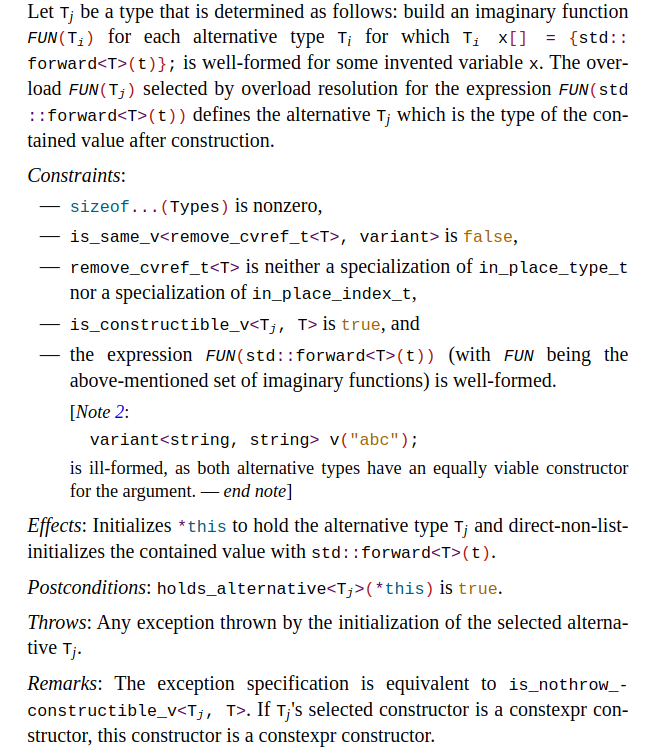
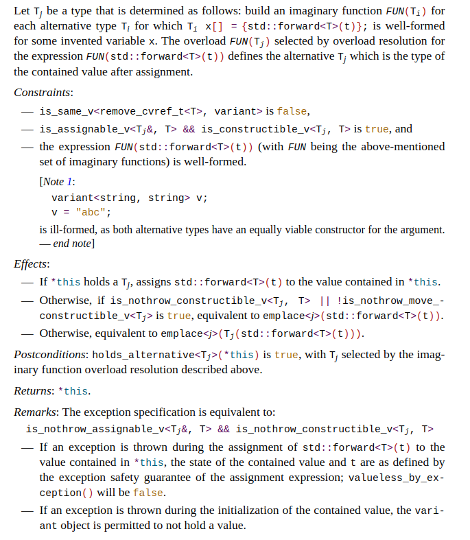
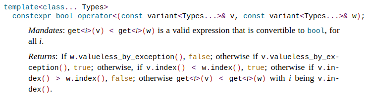
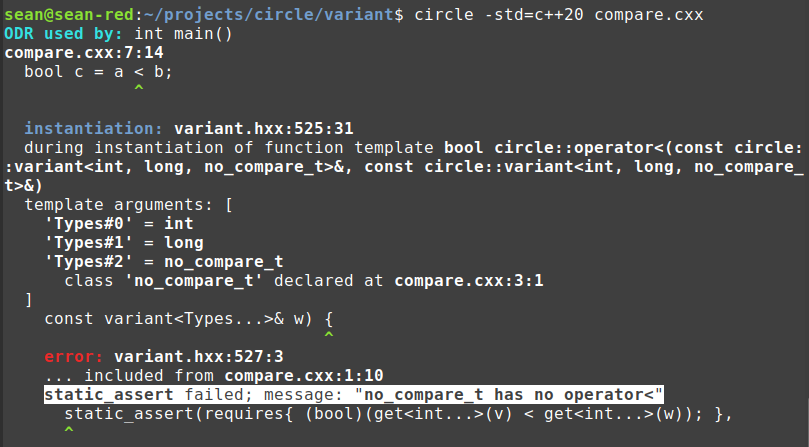

# Circle variant 

Browse implementation [**variant.hxx**](variant.hxx).

This is a Circle implementation of C++20's [`std::variant`](http://eel.is/c++draft/variant) class. The goal of this exercise isn't about providing a faster-compiling variant, although it it that. Like my [mdspan implementation](https://github.com/seanbaxter/mdspan#mdspan-circle), working through variant is an opportunity to extend the language so that writing such advanced code no longer poses a challenge.

The libstdc++ variant is [very scary](https://github.com/gcc-mirror/gcc/blob/master/libstdc%2B%2B-v3/include/std/variant). If the veteran C++ programmers who implemented this had so much trouble, what hope is there for the rest of us? Standard Library code should be the cleanest, most idiomatic C++ code, and something for users to model in their own programming.

This new variant is a simple transliteration from standardese. It's model Circle code. It's clean because it leverages a bunch of Circle-specific features:

* [Data member pack declarations](https://github.com/seanbaxter/mdspan#data-member-pack-declarations)
* [Pack subscript operator](https://github.com/seanbaxter/circle/blob/master/universal/README.md#static-subscripts-and-slices) `...[I]`
* [Pack index operator](https://github.com/seanbaxter/circle/blob/master/universal/README.md#pack-indices) `int...` and integer pack generator `int...(N)`
* [Multi-conditional operator](https://github.com/seanbaxter/circle/blob/master/conditional/README.md#multi-conditional---) `...?:`
* [Constexpr conditiontal operator](https://github.com/seanbaxter/circle/blob/master/conditional/README.md#constexpr-conditional--) `??:`
* [Member type traits](https://github.com/seanbaxter/circle/blob/master/imperative/README.md#type-traits) `.template`, `.type_args` and `.string` 
* Pack `static_assert`

But all that wasn't enough for a clean variant. To address pain points discovered during this effort, I implemented two more major features:

1. [`__preferred_copy_init`](#converting-constructor) and [`__preferred_assignment`](#converting-assignment) provide the intelligence for the converting constructor and converting assignment operator. They perform overload resolution given an expression and a collection of types, and indicate the type that has the best viable construction or assignment. If there is no viable operation or multiple best-viable operations, each builtin returns -1.
2. [`__visit`](#visit) and `__visit_r` are multi-dimensional, single-expression visitor operators. They make implementing `std::visit` a one-line affair.

## Contents

* [Member pack unions, constructor and destructor](
#member-pack-unions-constructor-and-destructor)
  * [Conditionally trivial destructor](#conditionally-trivial-destructor)
  * [Multi-conditional reset](#multi-condititional-reset)
* [Copy constructor](#copy-constructor)
* [Converting constructor](#converting-constructor)
* [`in_place_type_t` constructor](#in_place_type_t-constructor)
* [Converting assignment](#converting-assignment)
* [Comparison and relational operators](#comparison-and-relational-operators)
* [Visit](#visit)

## Member pack unions, constructor and destructor.

The Circle [mdspan implementation](https://github.com/seanbaxter/mdspan#mdspan-circle) introduced [data member pack declarations](https://github.com/seanbaxter/mdspan#data-member-pack-declarations). In that application, non-static data members of a class are declared variadically. In this exercise, _variant members_ and their subobject initializers are declared variadically.

[**variant.hxx**](variant.hxx)
```cpp
template<class... Types>
class variant {
  static constexpr bool trivially_destructible = 
    (... && std::is_trivially_destructible_v<Types>);

  union {
    Types ...m;
  };

  uint8_t _index = variant_npos;

public:
  constexpr variant() 
  noexcept(std::is_nothrow_default_constructible_v<Types...[0]>) 
  requires(std::is_default_constructible_v<Types...[0]>) : 
    m...[0](), _index(0) { }

  constexpr ~variant() requires(trivially_destructible) = default;
  constexpr ~variant() requires(!trivially_destructible) { reset(); }

  constexpr void reset() noexcept {
    if(_index != variant_npos) {
      _index == int... ...? m.~Types() : __builtin_unreachable();
      _index = variant_npos;        // set to valueless by exception.
    }
  }
};
```

Use the `...member-name` _declarator_ syntax inside a _union-specifier_ to declare a pack of variant members. We no longer have to use inheritance to implement `std::variant`--it's all one self-contained class.

Since we have an unnamed union with potentially non-trivially constructible members, we should specify a subobject initializer for the first variant member in the variant class's default constructor. Circle features a pack subscript operator `...[I]`, which is used to specify:
* The _noexcept-specifier_ for construction of the first variant member,
* The _requires-clause_ constraint that deactivates the constructor if the first variant member isn't default constructible, and
* Subobject access to the first variant member in the unnamed union.

### Conditionally trivial destructor.

C++20 permits conditionally trivial destructors, in which multiple destructors are declared, marked by different _requires-clauses_. To create a trivial destructor, one of which may be defined `= default`. During class completion (when the parser hits the closing brace of its definition, or when it's instantiated as a template specialization), the destructor constraints are evaluated and exactly one destructor candidate is chosen.

```cpp
  constexpr ~variant() requires(trivially_destructible) = default;
  constexpr ~variant() requires(!trivially_destructible) { reset(); }
```

If all variant members have trivial destructors, we default the destructor's definition. This suppresses code generation for the destructor.

### Multi-conditional reset.

If any variant member has a non-trivial destructor, like an `std::string` that should deallocate dynamic memory, the user-defined destructor is defined, which delegates to the `reset` member function.

```cpp
  constexpr void reset() noexcept {
    if(_index != variant_npos) {
      _index == int... ...? m.~Types() : __builtin_unreachable();
      _index = variant_npos;        // set to valueless by exception.
    }
  }
```

`reset` is where the choice of a member pack union starts paying off. We want to switch over all valid indices (that is, all indices except `variant_npos`, which indicates the _valueless by exception_ state) and call the destructor of the corresponding variant member. Using the [multi-conditional operator](https://github.com/seanbaxter/circle/blob/master/conditional/README.md#multi-conditional---) `...?:`, this is performed with a single expression:
```cpp
      _index == int... ...? m.~Types() : __builtin_unreachable();
```

`_index` is the scalar index of the currently-set variant member. `int...` is a pack expression yielding the index of expansion when during substitution. Therefore, `_index == int...` is a pack of comparison expressions. In a variant with four alternatives, it'll expand out like this:
```
(_index == 0, _index == 1, _index == 2, _index == 3)
```

Of course, only one of these can be true. Each of these comparisons serves as the left-hand side of a conditional operator. We want to effect an operation like this:
```cpp
_index == 0 ? m...[0].~Types...[0]() :
_index == 1 ? m...[1].~Types...[1]() :
_index == 2 ? m...[2].~Types...[2]() :
_index == 3 ? m...[3].~Types...[3]() :
              __builtin_unreachable();
```

The multi-conditional operator `...?:` will expand out the left, middle and right-hand operands to generate precisely that.

```cpp
      _index == int... ...? m.~Types() : __builtin_unreachable();
```

* The left-hand operand is the predicate, which yields true when we're substituting on the index corresponding to the active variant member. 
* The center operand calls the _pseudo-destructor_ on the member pack declaration `m`. The type of the _pseudo-destructor_ is the `variant` template parameter `Types`. During pack expansion, the i'th variant member and i'th `Types` element are substituted in concert, effecting member destruction.
* The right-hand operand is `__builtin_unreachable()`. This is compiler lingo for noting that a branch of execution is unreachable. It allows the optimizer to employ _strength reduction_ passes to improve code quality. We're basically telling the compiler that we've accounted for all code paths, even the unreachable ones.

## Copy constructor.

```cpp
  // Copy ctors.
  constexpr variant(const variant& w)
  requires(trivially_copy_constructible) = default;

  constexpr variant(const variant& w)
  noexcept(nothrow_copy_constructible) 
  requires(copy_constructible && !trivially_copy_constructible) {
    if(!w.valueless_by_exception()) {
      int... == w._index ...? 
        (void)new(&m) Types(w. ...m) : 
        __builtin_unreachable();
      _index = w._index;
    }
  }
```

If all variant members are trivially copy constructible, a _requires_clause_ selects the default definition, so that the emitted copy constructor is a simple `memcpy`. Otherwise, the user-defined copy constructor is selected.

The multi-conditional operator `...?:` does all the work, as it will do over and over in this variant implementation. The predicate for the conditional is a comparison of the current pack index with the active variant member of the rhs. When that predicate is true, we need _placement-new_ to invoke the copy constructor of the variant member that's going to become active. The syntax is `new(pointer) Type(arguments)`. But we have to do this as a pack, with a bunch of separate pack subexpressions:
* The pointer to the active member, `&m`, is a pack. For each element of the pack expansion instantiated, this will yield the address the corresponding variant member in the union.
* The type of the active member, is a pack, `Types`. 
* The initializer expression of the active member is a pack, `w. ...m`. `w` is a parameter of a _dependent type_, `variant`. Although this is also the type of _current instantiation_, C++ rules require the compiler to defer name lookup until instantiation; only then will subobjects of dependent base classes be known. The `...` token that precedes the _member-id_ indicates that, upon name lookup, the member will be a pack declaration. We can't currently write `w....m`, because greedy lexing rules would tokenize that as `w... .m`, which is nonsense. If you forget to put the `...` disambiguating token before the member name, the compiler reminds you when you instantiate the template.

```cpp
  constexpr variant(variant&& w)
  noexcept(nothrow_move_constructible)
  requires(move_constructible && !trivially_move_constructible) {
    if(!w.valueless_by_exception()) {
      int... == w._index ...? 
        (void)new(&m) Types(std::move(w. ...m)) : 
        __builtin_unreachable();
      _index = w._index;
    }
  }
```

The move constructor is defined exactly the same way, except we use `std::move` in the _placement-new_ initializer.

## Converting constructor.

[](http://eel.is/c++draft/variant#ctor-14)

The Standard challenges us with a wall of text for the converting constructor. But the Circle implementation of this function is _very simple_.

```cpp
  template<typename T, int j = __preferred_copy_init(T, Types...)>
  requires(
    -1 != j &&
    T.remove_cvref != variant && 
    T.template != std::in_place_type_t &&
    T.template != std::in_place_index_t && 
    std::is_constructible_v<Types...[j], T>
  )
  constexpr variant(T&& arg) 
    noexcept(std::is_nothrow_constructible_v<Types...[j], T>) :
    m...[j](std::forward<T>(arg)), _index(j) { }
```

The converting constructor takes an argument and performs overload resolution to determine the best viable variant alternative to initialize with it. This is what the long first paragraph in the Standard describes. However, with ISO C++, this pattern is annoying to implement and very slow to compile. Circle has a new feature `__preferred_copy_init` which finds the best viable type to initialize as a builtin:

`__preferred_copy_init`_(argument-type, candidate-types)_
* _argument-type_ - The type of the argument we want on the rhs of the initialization. 
* _candidate-types_ - A list of candidate types. For our variant, these are all the variant alternative types `Types`. 

The return value is the index of the type with the best viable initialization. If there is no viable initialization, or there are more than one best viable initializations, the return value is -1.

The first constraint in the _requires-clause_ checks that `__preferred_copy_init` returns a successful index. The remaining constraints are copied straight out of the standard. 

Circle's [type trait syntax](https://github.com/seanbaxter/circle/blob/master/imperative/README.md#type-traits) lets us imperatively access information about types, without resorting to obscure argument deduction tricks. We're supposed to reject arguments that are specializations of the templates `in_place_type_t` or `in_place_index_t`. Writing `T.template != std::in_place_type_t` does precisely that, without needing a generic _is-specialization_ library feature. This works even when the argument isn't a class specialization at all: in isolation, `T.template` will cause a substitution failure when `T` is, say, `int`. But `T.template != std::in_place_type_t` is a special comparison expression, which serves as an _is-specialization_ operator when its operands name templates.

## `in_place_type_t` constructor.

[](http://eel.is/c++draft/variant#ctor-20)

```cpp
template<class... Types>
class variant {
  template<typename T>
  static constexpr bool is_single_usage = 1 == (... + (T == Types));

  template<typename T>
  static constexpr size_t find_index = T == Types ...?? int... : -1;

public:
  template<class T, class... Args, size_t j = find_index<T> >
  requires(is_single_usage<T> && std::is_constructible_v<T, Args...>) 
  explicit constexpr variant(std::in_place_type_t<T>, Args&&... args)
  noexcept(std::is_nothrow_constructible_v<T, Args...>):
    m...[j](std::forward<Args>(args)), _index(j) { }
};
```

The `in_place_type_t` constructor receives the variant alternative to initialize as a template parameter. The variant implementation has to map this to the index of the variant member, so that it can be selected with `...[I]` during subobject construction.

The variable template `find_index` performs a linear search, and yields the index of the first type in `Types` that matches the argument type `T`. The [constexpr multi-conditional](https://github.com/seanbaxter/circle/tree/master/conditional#constexpr-multi-conditional---) `...??` chains conditional expressions, but short-circuits _during substitution_. That is, as soon as the predicate is satisfied, pack expansion stops, and the result term is substituted. 

The `is_single_usage` variable template uses a C++ fold expresion to count the number of occurrences of the argument type among the variant alternatives. If it occurs exactly once, and the variant member is constructible given the function arguments, the constraint passes, and the active subobject is initialized.

## Converting assignment.

[](http://eel.is/c++draft/variant#assign-11)

```cpp
  template<class T, size_t j = __preferred_assignment(T&&, Types...)>
  requires(T.remove_cvref != variant && -1 != j &&
    std::is_constructible_v<Types...[j], T>)
  constexpr variant& operator=(T&& t) 
  noexcept(std::is_nothrow_assignable_v<Types...[j], T> &&
    std::is_nothrow_constructible_v<Types...[j], T>) {
 
    if(_index == j) {
      // If *this holds Tj, assigns std::forward<T>(t) to the value contained
      // in *this.
      m...[j] = std::forward<T>(t);
 
    } else if constexpr(std::is_nothrow_constructible_v<Types...[j], T> ||
      !std::is_nothrow_move_constructible_v<Types...[j]>) {
 
      // Otherwise, if is_nothrow_constructible_v<Tj, T> || 
      // !is_nothrow_move_constructible_v<Tj> is true, equivalent to
      // emplace<j>(Tj(std::forward<T>(t))).
      reset();
      new(&m...[j]) Types...[j](std::forward<T>(t));
      _index = j;
 
    } else {
      // Otherwise, equivalent to emplace<j>(Tj(std::forward<T>(t))).
      Types...[j] temp(std::forward<T>(t));
      reset();
      new(&m...[j]) Types...[j](std::move(temp));
      _index = j;
    }
 
    return *this;
  }
```

The converting assignment is similar to the [converting constructor](#converting-constructor). Circle includes a builtin `__preferred_assignment`, which efficiently performs overload resolution to find the type with the best viable assignment from the provided rhs. 

## Comparison and relational operators.

[](http://eel.is/c++draft/variant#relops-5)

```cpp
template<class... Types>
constexpr bool operator<(const variant<Types...>& v, 
  const variant<Types...>& w) {

  static_assert(requires{ (bool)(get<int...>(v) < get<int...>(w)); }, 
    Types.string + " has no operator<")...;

  // Returns:
  //  If w.valueless_by_exception(), false;
  //  otherwise if v.valueless_by_exception(), true;
  //  otherwise if v.index() < w.index(), true;
  //  otherwise if v.index() > w.index(), false;
  //  otherwise get<i>(v) < get<i>(w) with i being v.index().
  return w.valueless_by_exception() ? false :
    v.valueless_by_exception() ? true :
    v.index() < w.index() ? true :
    v.index() > w.index() ? false :
    int...(sizeof...(Types)) == v.index() ...? 
      v.template get<int...>() < w.template get<int...>() :
      __builtin_unreachable();
}
```

The comparison, relational and spaceship operators are translated directly from the Standard. A pack `static_assert` tests the mandate that all variant alternatives support comparison. It provides type-specific information when the mandate is not satisfied.

[**compare.cxx**](https://godbolt.org/z/a6KoWYqTb)
```cpp
#include "variant.hxx"
#include <string>

struct no_compare_t { };

int main() {
  circle::variant<int, long, std::string, no_compare_t> a, b;
  bool c = a < b;
}
```


The `static_assert` states explicitly that "no_compare_t has no operator<". How is this level of specificity achieved?

```cpp
  static_assert(requires{ (bool)(get<int...>(v) < get<int...>(w)); }, 
    Types.string + " has no operator<")...;
```

Circle's `static_assert` permits pack expressions in the first operand. If the first operand has a pack, a pack may also be expressed in the message operand. `Types.string` is a pack expression, which uses reflection and yields the string literal expression for each variant alternative type name. In Circle, `+` is a string literal concatenation operator which creates a new literal, so `Types.string + " has no operator<"` performs string literal fusion, defining a type-specific error message.

The _requires-expression_ in the predicate operand is also a pack expression. The index for the `get` function is the pack index operator `int...`. No pack size has to be specified here--the Circle compiler can infer the size from the sized pack in the message operand. 

The trailing expand operator `...` substitutes the predicate for each pack element, and on the first false value, substitutes the corresponding message operand and logs the error.

## Visit

By far the most troublesome function in the C++ variant is the [std::visit](http://eel.is/c++draft/variant.visit) function. This function is tasked with multi-dimensional control flow, invoking a callable with the active variant members extracted from a variadic number of variant arguments. Michael Park [documented](https://mpark.github.io/programming/2019/01/22/variant-visitation-v2/) the struggles of implementing even a one-dimensional visitor with ISO C++.

The Circle builtins `__visit` and `__visit_r` (the latter adds an explicit return type, see [visit<R>: Explicit Return Type for `visit`](http://www.open-std.org/jtc1/sc22/wg21/docs/papers/2018/p0655r1.pdf)) generate n-dimensional control flow to map runtime variables to N constants. The user supplies an expression which is substituted for each combination of constants.

[**enum.cxx**](enum.cxx) [Compiler explorer](https://godbolt.org/z/n9f4er9ss)

```cpp
#include <utility>
#include <iostream>

enum shapes_t {
  circle, square, rhombus = 20, trapezoid, triangle, ellipse
};

template<int I, int J, shapes_t z>
void f() {
  std::cout<< I<< " "<< J<< " "<< z.string<< "\n";
}

int main() {

  // Invoke with an element from a interval.
  constexpr int XDim = 10;
  int x = 3;

  // Invoke with an element from a collection.
  using YSequence = std::index_sequence<1, 3, 5, 7, 9>;
  int y = 7;

  // Invoke with an element from an enumeration.
  shapes_t z = rhombus;

  __visit<XDim, YSequence, shapes_t>(
    f<indices...>(),
    x, y, z
  );
}
```
```
$ circle enum.cxx && ./enum
3 7 rhombus
```

`__visit` is pretty generic. It supports three kinds of parameterizations:
1. Specify a constant for the right-hand side of an interval. Passing an integral N generates control flow for all integral values between 0 and N-1. This is all we need for a variant visit, where the dimensions are provided by `variant_size_v`.
2. Specify a collection of integral/enum types in an `std::integer_sequence` container. These constants don't have to be ordered.
3. Specify an enumeration type. Reflection causes each enumerator in the type to be visited.

The builtin takes N template arguments, one for each dimension, and N + 1 function arguments. The first function argument is the dependent expression that's substituted for each combination of constant values. The `indices` pack declaration is visible only in this context. The subsequent N function arguments are integral or enum values bounded by their corresponding template arguments.

Note that the visitor expression is not put into a lambda. There is no closure. In the code above, the expression is substituted 10 * 5 * 6 = 300 times, all in the scope of the `main` function. Making n-dimensional visitation a builtin allows the compiler to most efficiently implement this intricate control flow.

```cpp
template <class Visitor, class... Variants>
constexpr decltype(auto) visit(Visitor&& vis, Variants&&... vars) {
  if((... || vars.valueless_by_exception()))
    throw bad_variant_access("variant visit has valueless index");

  return __visit<variant_size_v<Variants.remove_reference>...>(
    vis(std::forward<Variants>(vars).template get<indices>()...),
    vars.index()...
  );  
}
```

The variant `std::visit` function now has a trivial implementation. We return the result of a call to `__visit`, and that's all. The n-dimensional collection of variant sizes is expressed with `variant_size_v<Variants.remove_reference>...`. The corresponding collection of runtime index values is expressed with `vars.index()...`. The result expression extracts each combination of indices by calling the `get` member function on each forwarded variant (to maintain its value category), passing the implicitly-declared `indices` pack as the `get` template argument, and expanding this pack in the callable's function argument list.
